# 01 — Architecture de la plateforme GHMT

> **Statut** : proposition v1 pour validation.
> **Conforme à** : [00-decisions.md](./00-decisions.md). Les choix figés de ce document ne sont pas remis en cause. Ce document les détaille et les met en œuvre.
> **Documents liés** : 02-modele-donnees.md (tables, politiques RLS détaillées), 03-api.md (conventions REST), 04-securite-rbac-audit.md (auth, RBAC, audit, sauvegardes), 05-saas-notifications.md (plans, quotas, notifications), 06-roadmap-mvp.md (phasage).

## Sommaire

1. [Architecture générale du système](#1-architecture-générale-du-système)
2. [Architecture multi-tenant](#2-architecture-multi-tenant)
3. [Architecture modulaire de l'API](#3-architecture-modulaire-de-lapi)
4. [Architecture Web](#4-architecture-web-nextjs)
5. [Architecture Desktop](#5-architecture-desktop-tauri-2)
6. [Architecture Mobile](#6-architecture-mobile-expo)
7. [Gestion des fichiers et documents](#7-gestion-des-fichiers-et-documents)
8. [Observabilité et journalisation technique](#8-observabilité-et-journalisation-technique)
9. [Architecture de déploiement](#9-architecture-de-déploiement)
10. [Recommandations technologiques et ADR](#10-recommandations-technologiques-et-adr)
11. [Risques architecturaux et mitigations](#11-risques-architecturaux-et-mitigations)

---

## 1. Architecture générale du système

### 1.1 Principes directeurs

| Principe | Traduction concrète |
|---|---|
| **Isolation par défaut** | Chaque requête SQL métier s'exécute dans une transaction portant `app.tenant_id`. Sans contexte tenant, PostgreSQL ne renvoie aucune ligne (fail-closed). |
| **Monolithe modulaire** | Un seul déployable `apps/api`, découpé en modules NestJS avec des frontières vérifiées par l'outillage. On pourra extraire un module plus tard, mais rien ne l'impose aujourd'hui. |
| **Sobriété réseau** | Payloads compacts, pagination par curseur, compression Brotli, budgets JS stricts, priorité à Android d'entrée de gamme. |
| **Résilience à la coupure** | Desktop *local-first* pour accueil, caisse et pharmacie. Mobile avec cache lisible hors-ligne. Envois (SMS, push, e-mail) toujours asynchrones et rejoués. |
| **Portabilité d'hébergement** | Aucun service managé propriétaire indispensable : PostgreSQL, Redis et un stockage compatible S3 suffisent. Cela permet d'héberger chez un hyperscaler, un cloud européen ou un datacenter africain local. |
| **Traçabilité** | Logs techniques (Pino/OTel) séparés de l'audit fonctionnel (table d'audit append-only, voir doc 04). |

### 1.2 Diagramme C4 — niveau 1 (contexte)

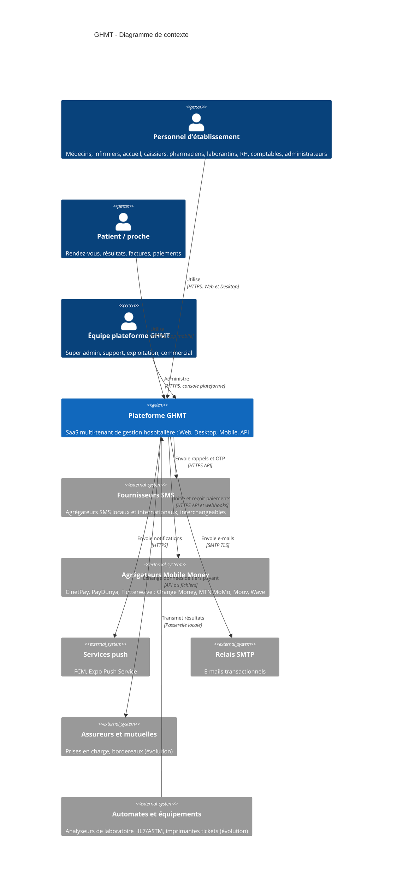

### 1.3 Diagramme C4 — niveau 2 (conteneurs)

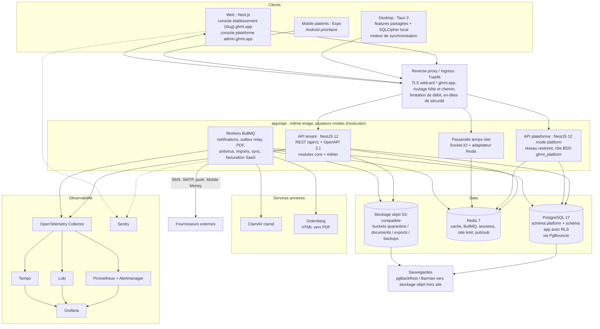

### 1.4 Responsabilités des conteneurs

| Conteneur | Rôle | Technologie | Scalabilité |
|---|---|---|---|
| **Web** | Console établissement (multi-tenant par sous-domaine) et console plateforme | Next.js App Router, Tailwind, shadcn/ui, TanStack Query | Sans état, horizontale |
| **Desktop** | Poste d'accueil, caisse et pharmacie avec mode hors-ligne | Tauri 2 (Rust + WebView), SQLCipher | Installé sur le poste |
| **Mobile patients** | Compte patient global, rendez-vous, résultats, paiements | Expo / React Native | Stores, mises à jour OTA via EAS Update |
| **API tenant** | Toute la logique métier et l'auth du personnel et des patients | NestJS 12, Prisma, Zod | Sans état, horizontale (HPA) |
| **API plateforme** | Gestion des tenants, plans, facturation SaaS, break-glass, supervision | Même code, `API_MODE=platform`, rôle BDD distinct | 2 réplicas, réseau restreint (VPN ou liste d'IP) |
| **Temps réel** | Notifications in-app, rafraîchissement des files d'attente | `@nestjs/websockets` + Socket.IO + `@socket.io/redis-adapter` | Horizontale via adaptateur Redis |
| **Workers** | Tâches asynchrones et planifiées | BullMQ (`@nestjs/bullmq`), `API_MODE=worker` | Horizontale par file d'attente |
| **PostgreSQL 17** | Source de vérité | PG 17 + PgBouncer | Vertical, puis réplicas en lecture, puis cellules |
| **Redis 7** | Cache, files, verrous, rate limit, pub/sub WS | Redis 7 (AOF activé pour BullMQ) | Sentinel, puis Cluster si nécessaire |
| **Stockage objet** | Documents, imagerie légère, exports, sauvegardes | S3-compatible (MinIO en dev) | Natif |
| **ClamAV / Gotenberg** | Antivirus des fichiers déposés, génération PDF | Conteneurs dédiés, appelés par les workers | Horizontale |

### 1.5 Fonctions transverses (vue d'ensemble)

| Fonction | Où | Résumé (détail dans la section ou le document indiqué) |
|---|---|---|
| **Authentification** | Module `identity` | Argon2id, JWT d'accès de 15 min, refresh token opaque rotatif, TOTP, sessions révocables (doc 04) |
| **Notifications** | Module `notifications` + workers | Gabarits multilingues, canaux SMTP, SMS, push, in-app, préférences, rejeu (doc 05) |
| **Fichiers/documents** | Module `files` | S3 avec préfixe tenant, URLs signées, antivirus, chiffrement (§7) |
| **Journalisation technique** | Transverse | Pino JSON, OTel, Loki, Tempo, Sentry (§8) |
| **Audit fonctionnel** | Module `audit` | Événements append-only partitionnés, chaînage de hachage (doc 04) |
| **Sauvegarde** | Infra | PITR PostgreSQL, versionnage et réplication S3, tests de restauration (§9.7, doc 04) |
| **Administration SaaS** | API plateforme + console plateforme | Tenants, plans, abonnements, quotas, break-glass, supervision (§2.8, doc 05) |

### 1.6 Cycle de vie d'une requête

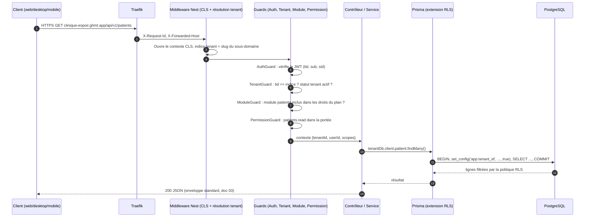

---

## 2. Architecture multi-tenant

### 2.1 Modèle retenu (rappel)

- **Base partagée** et **schéma partagé**. Chaque table métier porte `tenant_id uuid NOT NULL`.
- **Row-Level Security** activée **et forcée** sur toutes les tables portant `tenant_id`.
- Le contexte est posé **par transaction** avec `set_config('app.tenant_id', $1, true)`, équivalent paramétrable de `SET LOCAL` (`SET LOCAL` n'accepte pas de paramètre lié).
- Le rôle applicatif **n'a pas BYPASSRLS** et **ne possède pas** les tables.

Le tenant est l'**établissement**, ou le **groupe** quand le groupe souscrit en tant que tel. Dans ce second cas, les établissements du groupe sont des `sites` à l'intérieur du tenant et la segmentation interne passe par les portées RBAC (doc 04).

### 2.2 Séparation des données plateforme et tenant

Deux schémas PostgreSQL, gérés dans un seul schéma Prisma avec la fonctionnalité `multiSchema` :

| Schéma | Contenu | RLS | Accès |
|---|---|---|---|
| `platform` | `tenants`, `tenant_domains`, `groups`, `plans`, `plan_modules`, `subscriptions`, `saas_invoices`, `platform_users`, `access_grants` (break-glass), `identities` (identité globale du personnel), `patient_accounts`, `patient_links`, `payment_routing`, `feature_overrides` | Non (sauf exceptions) | `ghmt_platform` complet. `ghmt_app` : `GRANT SELECT` sur colonnes choisies uniquement (ex. `tenants.id, slug, status, region`) |
| `app` | Toutes les tables métier : `patients`, `appointments`, `encounters`, `lab_orders`, `stock_movements`, `invoices`, `memberships`, `roles`, `audit_events`, `files`, `outbox_events`… | **Oui, ENABLE + FORCE** | `ghmt_app` (DML uniquement), `ghmt_migrator` (DDL) |

> **Identité globale et appartenance au tenant** : un praticien peut exercer dans plusieurs établissements indépendants, ce qui est fréquent. L'identité de connexion (`platform.identities` : e-mail/téléphone, hash Argon2id, secret TOTP chiffré) est globale. Les **appartenances** (`app.memberships`, sous RLS) et les rôles sont propres au tenant. Une session est toujours rattachée à un seul tenant. Changer de tenant passe par un échange de jeton (`POST /api/v1/auth/switch-tenant`). Détail dans le doc 04.

### 2.3 Rôles PostgreSQL

```sql
-- Rôles « groupes » sans login
CREATE ROLE ghmt_owner NOLOGIN;                          -- propriétaire des objets
CREATE ROLE ghmt_migrator LOGIN BYPASSRLS IN ROLE ghmt_owner;  -- CI/CD uniquement : prisma migrate deploy, backfills
CREATE ROLE ghmt_app      LOGIN NOBYPASSRLS NOSUPERUSER NOCREATEDB NOCREATEROLE;  -- API tenant + workers
CREATE ROLE ghmt_platform LOGIN NOBYPASSRLS;              -- API plateforme
CREATE ROLE ghmt_relay    LOGIN NOBYPASSRLS;              -- relais outbox (politique dédiée)
CREATE ROLE ghmt_readonly LOGIN NOBYPASSRLS;              -- reporting / BI (avec contexte tenant)
-- ghmt_maintenance (BYPASSRLS) : jamais utilisé par l'application ; identifiants
-- délivrés à la demande par le coffre-fort (Vault/OpenBao), session auditée.

GRANT USAGE ON SCHEMA app TO ghmt_app, ghmt_relay, ghmt_readonly;
GRANT SELECT, INSERT, UPDATE, DELETE ON ALL TABLES IN SCHEMA app TO ghmt_app;
ALTER DEFAULT PRIVILEGES FOR ROLE ghmt_owner IN SCHEMA app
  GRANT SELECT, INSERT, UPDATE, DELETE ON TABLES TO ghmt_app;
REVOKE UPDATE, DELETE ON app.audit_events FROM ghmt_app;  -- audit append-only
```

| Rôle | BYPASSRLS | Utilisé par | Règle |
|---|---|---|---|
| `ghmt_migrator` | Oui | Job de migration CI/CD | Jamais présent dans les pods applicatifs |
| `ghmt_app` | **Non** | API tenant, workers | Toute requête métier passe par le contexte tenant |
| `ghmt_platform` | Non | API plateforme | Schéma `platform` complet. Aucun accès direct aux tables `app`, hormis des fonctions `SECURITY DEFINER` d'agrégats (compteurs de quotas) qui ne renvoient aucune donnée de santé |
| `ghmt_relay` | Non | Relais outbox | Politique RLS `TO ghmt_relay USING (true)` limitée à `outbox_events` |
| `ghmt_maintenance` | Oui | Ops, cas exceptionnels | Identifiants temporaires, double validation, audit |

**Règle d'or : aucun processus applicatif ne détient BYPASSRLS.** Un traitement transverse (ex. rappels de rendez-vous de la veille) itère sur `platform.tenants` et ouvre un contexte tenant par itération.

### 2.4 Politiques RLS (gabarit)

```sql
ALTER TABLE app.patients ENABLE ROW LEVEL SECURITY;
ALTER TABLE app.patients FORCE ROW LEVEL SECURITY;

CREATE POLICY tenant_isolation ON app.patients
  AS PERMISSIVE FOR ALL TO ghmt_app, ghmt_readonly
  USING      (tenant_id = NULLIF(current_setting('app.tenant_id', true), '')::uuid)
  WITH CHECK (tenant_id = NULLIF(current_setting('app.tenant_id', true), '')::uuid);
```

- `current_setting(..., true)` renvoie `NULL` si la variable est absente, donc **aucune ligne** n'est visible et toute écriture est refusée (fail-closed). `NULLIF` évite l'erreur de conversion d'une chaîne vide.
- Toutes les politiques sont générées par une **migration SQL gabarit** (fonction `app.enable_tenant_rls(regclass)`). Un **test CI** échoue si une table de `app` possède `tenant_id` sans politique, ou n'a pas `relforcerowsecurity = true` :

```sql
SELECT c.relname FROM pg_class c
JOIN pg_namespace n ON n.oid = c.relnamespace AND n.nspname = 'app'
JOIN pg_attribute a ON a.attrelid = c.oid AND a.attname = 'tenant_id'
WHERE c.relkind IN ('r','p') AND (NOT c.relrowsecurity OR NOT c.relforcerowsecurity);
-- doit renvoyer 0 ligne
```

- **Intégrité inter-tenant des clés étrangères** : chaque table expose `UNIQUE (tenant_id, id)` et les FK sont composites (`(tenant_id, patient_id) REFERENCES app.patients(tenant_id, id)`). Une ligne ne peut donc pas référencer un objet d'un autre tenant, même par erreur applicative (doc 02).
- **Index** : tous les index métier commencent par `tenant_id`.

### 2.5 Résolution du tenant

| Source | Usage | Fiabilité |
|---|---|---|
| **Claim JWT `tid`** | Toute requête authentifiée | **Faisant autorité** |
| **Sous-domaine `{slug}.ghmt.app`** (ou domaine personnalisé via `platform.tenant_domains`) | Pages de connexion (habillage), endpoint de login, requêtes web même origine | Indice. Doit être cohérent avec `tid` |
| **En-tête `X-GHMT-Tenant`** (slug ou UUID) | Desktop, mobile patients (choix parmi les établissements liés), intégrations | Indice. Doit être cohérent avec `tid` |
| **Référence externe** | Webhooks Mobile Money / SMS (pas de JWT) | Recherche dans `platform.payment_routing(reference → tenant_id)` + vérification de signature du fournisseur |
| **Données du job** | Workers BullMQ | `job.data.tenantId` obligatoire (schéma Zod) |

**Règles** :
1. Requête authentifiée : `tenantId = jwt.tid`. Si un indice (hôte ou en-tête) est présent et diffère : **403 `TENANT_MISMATCH`** + événement de sécurité.
2. Requête anonyme (login, mot de passe oublié, habillage) : le tenant vient du sous-domaine ou de l'en-tête. Résolution `slug → tenant` en cache Redis (`tenant:slug:{slug}`, TTL 5 min, invalidé par l'événement `tenancy.tenant.updated`).
3. Tenant `suspended` : lecture seule pour les rôles admin, 423 pour le reste. Tenant `terminated` : 410.
4. Endpoints plateforme : aucun tenant, rôle BDD `ghmt_platform`, servis uniquement par l'hôte `admin.ghmt.app`.

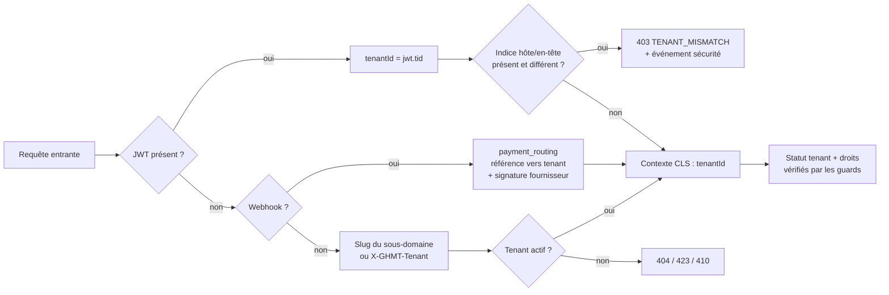

### 2.6 Propagation du contexte : AsyncLocalStorage (`nestjs-cls`)

On utilise `nestjs-cls`, qui encapsule `AsyncLocalStorage` de Node.js. Le contexte suit la requête à travers les `await` sans être passé en paramètre.

```ts
// apps/api/src/core/context/ghmt-store.ts
import type { ClsStore } from 'nestjs-cls';
import type { Prisma } from '../prisma/generated/client';

export interface GhmtStore extends ClsStore {
  requestId: string;
  tenantId?: string;          // UUID du tenant (absent pour les endpoints plateforme)
  userId?: string;            // identité authentifiée
  actorId?: string;           // super admin en break-glass (RFC 8693 « act »)
  accessGrantId?: string;     // autorisation break-glass en cours
  tx?: Prisma.TransactionClient; // transaction tenant courante (si ouverte)
}
```

```ts
// apps/api/src/app.module.ts (extrait)
ClsModule.forRoot({
  global: true,
  middleware: {
    mount: true,
    generateId: true,
    idGenerator: (req) => (req.headers['x-request-id'] as string) ?? uuidv7(),
    setup: (cls, req) => cls.set('tenantHint', resolveTenantHint(req)), // hôte ou en-tête, non fiable
  },
}),
```

```ts
// apps/api/src/core/tenancy/tenant.guard.ts
@Injectable()
export class TenantGuard implements CanActivate {
  constructor(
    private readonly cls: ClsService<GhmtStore>,
    private readonly tenants: TenantDirectory, // cache Redis + platform.tenants
  ) {}

  async canActivate(ctx: ExecutionContext): Promise<boolean> {
    if (isPlatformRoute(ctx) || isPublicRoute(ctx)) return true;
    const { user } = ctx.switchToHttp().getRequest<AuthenticatedRequest>();
    const hint = this.cls.get('tenantHint');
    if (hint && !(await this.tenants.matches(hint, user.tid))) {
      throw new ForbiddenException({ code: 'TENANT_MISMATCH' });
    }
    const tenant = await this.tenants.getActive(user.tid); // lève 423/410 selon le statut
    this.cls.set('tenantId', tenant.id);
    this.cls.set('userId', user.sub);
    if (user.act) {
      this.cls.set('actorId', user.act.sub);
      this.cls.set('accessGrantId', user.act.grant);
    }
    return true;
  }
}
```

Ordre des guards globaux (`APP_GUARD`) : `ThrottlerGuard` → `AuthGuard` → `TenantGuard` → `SubscriptionStatusGuard` → `ModuleEntitlementGuard` → `PermissionGuard`.

**Workers** : chaque processeur BullMQ s'exécute dans `cls.run()` avec le tenant du job :

```ts
// apps/api/src/core/queue/tenant-processor.ts
export abstract class TenantAwareProcessor<T extends { tenantId: string }> extends WorkerHost {
  constructor(protected readonly cls: ClsService<GhmtStore>) { super(); }

  async process(job: Job<T>): Promise<unknown> {
    const data = this.schema.parse(job.data); // Zod : tenantId obligatoire
    return this.cls.run(async () => {
      this.cls.set('requestId', job.id ?? uuidv7());
      this.cls.set('tenantId', data.tenantId);
      return this.handle(data, job);
    });
  }
  protected abstract readonly schema: z.ZodType<T>;
  protected abstract handle(data: T, job: Job<T>): Promise<unknown>;
}
```

### 2.7 Extension Prisma : transaction + `SET LOCAL`

Deux clients construits sur le **même pool** :

- `base` : client brut. Il sert **uniquement** à ouvrir des transactions interactives.
- `tenant` : client étendu. **Chaque opération isolée** est enveloppée dans une transaction séquentielle `[set_config, requête]`.

Une transaction Prisma ne peut pas être imbriquée dans une autre. Le service `TenantDb` route donc vers la transaction en cours (stockée dans le CLS) lorsqu'elle existe.

```ts
// apps/api/src/core/prisma/tenant-rls.extension.ts
import { Prisma } from './generated/client';

export class MissingTenantContextError extends Error {
  constructor() { super('Aucun contexte tenant : requête refusée (fail-closed)'); }
}

export const tenantRlsExtension = (ctx: () => { tenantId?: string; userId?: string }) =>
  Prisma.defineExtension((client) =>
    client.$extends({
      name: 'tenant-rls',
      query: {
        $allModels: {
          async $allOperations({ args, query }) {
            const { tenantId, userId } = ctx();
            if (!tenantId) throw new MissingTenantContextError();
            const [, result] = await client.$transaction([
              client.$executeRaw`SELECT set_config('app.tenant_id', ${tenantId}, true),
                                        set_config('app.user_id', ${userId ?? ''}, true)`,
              query(args),
            ]);
            return result;
          },
        },
      },
    }),
  );
```

```ts
// apps/api/src/core/prisma/prisma.service.ts
import { PrismaPg } from '@prisma/adapter-pg';
import { PrismaClient } from './generated/client';

@Injectable()
export class PrismaService implements OnModuleDestroy {
  readonly base: PrismaClient;
  readonly tenant: ReturnType<PrismaService['buildTenantClient']>;

  constructor(config: AppConfig, private readonly cls: ClsService<GhmtStore>) {
    const adapter = new PrismaPg({ connectionString: config.databaseUrl, max: config.dbPoolSize });
    this.base = new PrismaClient({ adapter });
    this.tenant = this.buildTenantClient();
  }

  private buildTenantClient() {
    return this.base.$extends(
      tenantRlsExtension(() => ({ tenantId: this.cls.get('tenantId'), userId: this.cls.get('userId') })),
    );
  }

  async onModuleDestroy() { await this.base.$disconnect(); }
}
```

```ts
// apps/api/src/core/prisma/tenant-db.service.ts
@Injectable()
export class TenantDb {
  constructor(private readonly prisma: PrismaService, private readonly cls: ClsService<GhmtStore>) {}

  /** Client à utiliser dans les repositories. */
  get client() {
    return this.cls.get('tx') ?? this.prisma.tenant;
  }

  /** Unité de travail multi-requêtes (écritures + outbox), réentrante. */
  async transaction<T>(fn: (tx: Prisma.TransactionClient) => Promise<T>,
                       opts: { isolationLevel?: Prisma.TransactionIsolationLevel } = {}): Promise<T> {
    const current = this.cls.get('tx');
    if (current) return fn(current);

    const tenantId = this.cls.get('tenantId');
    if (!tenantId) throw new MissingTenantContextError();
    const userId = this.cls.get('userId') ?? '';

    return this.prisma.base.$transaction(async (tx) => {
      await tx.$executeRaw`SELECT set_config('app.tenant_id', ${tenantId}, true),
                                  set_config('app.user_id', ${userId}, true)`;
      return this.cls.runWith({ ...this.cls.get(), tx }, () => fn(tx)); // nouveau store, pas de mutation
    }, { timeout: 10_000, maxWait: 2_000, ...opts });
  }
}
```

**Points d'attention** :

| Sujet | Décision |
|---|---|
| **Pooler** | PgBouncer en mode `transaction`. Compatible car `set_config(..., true)` meurt avec la transaction : aucune fuite de contexte entre requêtes partageant une connexion. PgBouncer ≥ 1.21 (`max_prepared_statements` > 0) pour les requêtes préparées. |
| **Coût** | Chaque opération isolée coûte 4 allers-retours (BEGIN, set_config, requête, COMMIT) sur le même réseau local, soit environ 1 ms de surcoût. Pour les cas d'usage chauds, regrouper dans `tenantDb.transaction()`. |
| **Requêtes brutes** | `$queryRaw` passe aussi par `$allOperations`. `$queryRawUnsafe` est interdit par règle ESLint. |
| **Variable `app.user_id`** | Exploitée par les triggers de colonnes `created_by` / `updated_by` et par l'audit bas niveau. |
| **Tests** | Suite d'intégration Testcontainers (PG 17 réel). Un test par table : en tant que tenant A, impossible de lire, modifier ou insérer pour B. Sans contexte : 0 ligne. |

### 2.8 Accès délégué « break-glass » du super administrateur

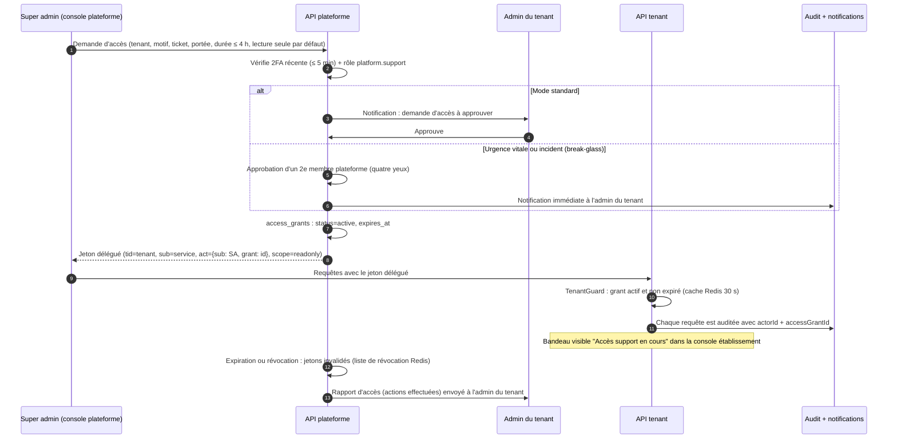

- Le jeton délégué passe par le **même chemin** que les autres requêtes : rôle `ghmt_app`, RLS, permissions. **Aucun contournement BDD.**
- La portée par défaut est `readonly`. L'écriture exige une portée explicite et une double approbation.
- Les données de santé (DME) sont **exclues par défaut** de la portée support. Elles ne s'ouvrent que via la portée `clinical` (urgence documentée).

### 2.9 Trajectoire vers une base dédiée (offre Enterprise)

Objectif : un client Enterprise peut obtenir une **base PostgreSQL dédiée**, voire un cluster dans son pays, **sans fork de code**.

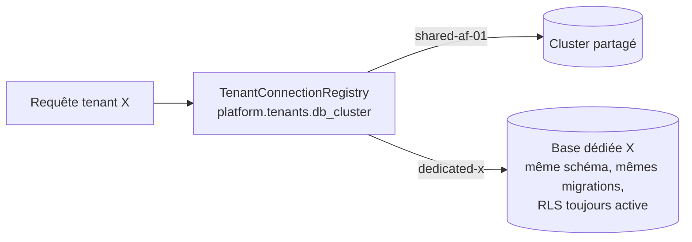

1. **Routage** : `platform.tenants.db_cluster` désigne une entrée du registre de connexions. `PrismaService` maintient un `Map<clusterId, PrismaClient>` (LRU, nombre limité de pools) et `TenantDb` sélectionne le client selon le tenant du CLS.
2. **Schéma identique** : le pipeline de migration applique `prisma migrate deploy` sur **tous** les clusters déclarés. La RLS reste active en base dédiée (défense en profondeur).
3. **Bascule d'un tenant existant** : réplication logique PostgreSQL avec **filtres de lignes de publication** (PG ≥ 15) :
   ```sql
   CREATE PUBLICATION tenant_x_pub FOR TABLE app.patients WHERE (tenant_id = '…'), app.appointments WHERE (tenant_id = '…') /* … */;
   ```
   Abonnement depuis la base dédiée, rattrapage, puis gel des écritures (mode maintenance du tenant, quelques minutes). On bascule `db_cluster`, on vide les caches et on purge les lignes de la base partagée après une période de rétention.
4. **Fichiers** : le préfixe `t/{tenantId}/` (§7) permet une copie ciblée vers un bucket dédié.
5. **Facturation** : option tarifaire « dedicated » (doc 05).

### 2.10 Partitionnement et sharding futurs

| Palier | Technique | Déclencheur indicatif |
|---|---|---|
| 1 | **Partitionnement par plage temporelle** (mensuel) des tables à forte croissance : `audit_events`, `outbox_events`, `notification_deliveries`, `stock_movements`, `sync_mutations`. Rétention par `DETACH`/archivage. Outil : `pg_partman`. | Table > 50 M lignes ou purge coûteuse |
| 2 | **Réplicas en lecture** pour les rapports et la BI (le rôle `ghmt_readonly` pose aussi le contexte tenant) | CPU primaire > 60 % soutenu |
| 3 | **Cellules** : plusieurs clusters PG indépendants (ex. `cell-af-west-1`, `cell-af-central-1`). Le tenant est épinglé à une cellule via `platform.tenants.cell`, avec le même mécanisme que la base dédiée (§2.9). C'est aussi la réponse à la **localisation des données** (§9.5). | Taille de cluster > 2 To, exigences pays |
| 4 (option) | **Citus** (extension PostgreSQL) en distribuant par `tenant_id`. Le modèle « tenant_id partout + FK composites » est exactement celui qu'attend Citus. | Uniquement si une cellule unique ne suffit plus |

**Contraintes à respecter dès maintenant** pour garder ces options ouvertes : `tenant_id` sur toute table métier, index et contraintes uniques préfixés par `tenant_id`, FK composites, identifiants **UUIDv7** générés par l'application (pas de séquences globales exposées), aucune jointure SQL entre tables `platform` et `app` dans le code métier.

---

## 3. Architecture modulaire de l'API

### 3.1 Organisation du code

```
apps/api/src/
  main.ts                 # bootstrap ; API_MODE = tenant | platform | worker
  app.module.ts           # compose les modules selon API_MODE
  core/                   # noyau technique (pas de logique métier)
    config/ context/ prisma/ queue/ outbox/ http/ (filtres, intercepteurs, enveloppe)
    observability/ security/ i18n/ money/ time/
  modules/
    identity/ tenancy/ rbac/ audit/ notifications/ files/ billing-saas/      # modules cœur
    patients/ appointments/ medical-records/ laboratory/ pharmacy/
    inventory/ hr/ billing/ accounting/ insurance/ sync/                     # modules métier
  platform/               # contrôleurs de l'API plateforme (API_MODE=platform)
prisma/
  schema/                 # schéma Prisma multi-fichiers : un fichier par module
    _base.prisma  identity.prisma  patients.prisma  pharmacy.prisma …
  migrations/
```

Structure interne d'un module (exemple `pharmacy`) :

```
modules/pharmacy/
  index.ts                    # API publique : PharmacyModule, PharmacyFacade, types d'événements
  pharmacy.module.ts
  api/                        # contrôleurs, DTO (dérivés des schémas Zod de packages/shared)
  application/                # services de cas d'usage, handlers d'événements
  domain/                     # règles métier pures (testables sans Nest ni BDD)
  infrastructure/             # repositories Prisma, adaptateurs
  pharmacy.events.ts          # événements publiés (schémas Zod versionnés)
```

> `billing` (facturation patient, caisse, encaissements Mobile Money) est un module métier distinct de `billing-saas` (abonnements des tenants). `sync` est le module technique qui expose le protocole de synchronisation du Desktop (§5).

### 3.2 Modules et dépendances autorisées

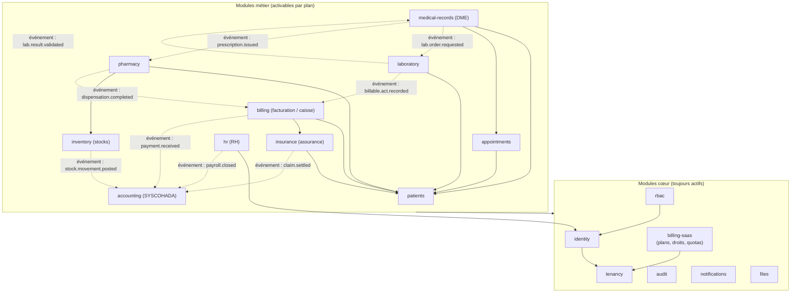

**Légende** : flèche pleine = appel synchrone autorisé via la **façade publique** (`index.ts`) du module cible. Pointillé = communication **uniquement par événement de domaine**.

**Règles** :

1. Les modules cœur ne dépendent **jamais** d'un module métier.
2. Un module métier peut appeler la **façade** d'un autre module métier seulement si l'arête figure dans le graphe. Il ne lit **jamais** ses tables ni ses repositories.
3. Le graphe est **acyclique**. Un besoin « retour » passe par un événement.
4. `accounting` ne fait que consommer des événements. Aucun module ne l'appelle de façon synchrone, ce qui permet de désactiver la comptabilité sans rien casser.
5. Ces règles sont vérifiées en CI par **dependency-cruiser** :

```js
// apps/api/.dependency-cruiser.cjs (extrait)
module.exports = {
  forbidden: [
    { name: 'core-ne-depend-pas-du-metier', severity: 'error',
      from: { path: '^src/modules/(identity|tenancy|rbac|audit|notifications|files|billing-saas)/' },
      to:   { path: '^src/modules/(patients|appointments|medical-records|laboratory|pharmacy|inventory|hr|billing|accounting|insurance)/' } },
    { name: 'acces-via-index-uniquement', severity: 'error',
      from: { path: '^src/modules/([^/]+)/' },
      to:   { path: '^src/modules/([^/]+)/(?!index\\.ts$)', pathNot: '^src/modules/$1/' } },
    { name: 'pas-de-cycle', severity: 'error', from: {}, to: { circular: true } },
  ],
};
```

6. **Propriété des tables** : chaque fichier `prisma/schema/<module>.prisma` déclare les modèles du module. Une règle ESLint maison (`ghmt/model-ownership`, alimentée par une carte générée depuis le schéma) interdit `tx.<modele>` hors du dossier du module propriétaire.

### 3.3 Feature flags par module : droits du plan

**Catalogue** (source unique, partagée front/back) :

```ts
// packages/shared/src/modules/catalog.ts
export const MODULES = {
  patients:        { core: false, requires: [] },
  appointments:    { core: false, requires: ['patients'] },
  medicalRecords:  { core: false, requires: ['patients'] },
  laboratory:      { core: false, requires: ['patients'] },
  pharmacy:        { core: false, requires: ['patients', 'inventory'] },
  inventory:       { core: false, requires: [] },
  hr:              { core: false, requires: [] },
  billing:         { core: false, requires: ['patients'] },
  insurance:       { core: false, requires: ['billing'] },
  accounting:      { core: false, requires: [] },
} as const satisfies Record<string, { core: boolean; requires: readonly string[] }>;
export type ModuleKey = keyof typeof MODULES;
```

**Calcul des droits** (`billing-saas`) : `modules(plan) ∪ add-ons souscrits ∪ overrides plateforme (essai, geste commercial) − modules suspendus`, puis fermeture transitive sur `requires`. Les quotas (utilisateurs, sites, SMS/mois, Go de stockage) suivent la même logique (doc 05). Le résultat est mis en cache dans Redis (`ent:{tenantId}`, TTL 10 min) et invalidé par l'événement `billing-saas.entitlements.changed`.

```ts
// apps/api/src/modules/billing-saas/entitlements/requires-module.decorator.ts
export const REQUIRES_MODULE = 'ghmt:requires-module';
export const RequiresModule = (...modules: ModuleKey[]) => SetMetadata(REQUIRES_MODULE, modules);

@Injectable()
export class ModuleEntitlementGuard implements CanActivate {
  constructor(
    private readonly reflector: Reflector,
    private readonly entitlements: EntitlementsService,
    private readonly cls: ClsService<GhmtStore>,
  ) {}

  async canActivate(ctx: ExecutionContext): Promise<boolean> {
    const required = this.reflector.getAllAndOverride<ModuleKey[]>(REQUIRES_MODULE, [ctx.getHandler(), ctx.getClass()]);
    if (!required?.length) return true;
    const tenantId = this.cls.get('tenantId');
    if (!tenantId) return false;
    const { modules } = await this.entitlements.forTenant(tenantId);
    const missing = required.filter((m) => !modules.includes(m));
    if (missing.length > 0) {
      throw new ForbiddenException({ code: 'MODULE_NOT_ENABLED', details: { missing } });
    }
    return true;
  }
}

// Usage
@RequiresModule('pharmacy')
@Controller({ path: 'pharmacy/dispensations', version: '1' })
export class DispensationsController { /* … */ }
```

**Application des droits sur toutes les surfaces** :

| Surface | Mécanisme |
|---|---|
| API HTTP | `@RequiresModule()` au niveau du contrôleur |
| Handlers d'événements / jobs | `@RequiresModule()` sur le handler. Si le module est désactivé, l'événement est acquitté et ignoré (journalisé en debug) |
| WebSocket | Vérification à l'abonnement aux salles |
| Web / Desktop | `GET /api/v1/me/context` renvoie `modules`, `permissions`, `quotas`. Menus et routes filtrés par `<ModuleGate module="pharmacy">`. **Le front ne fait qu'afficher : la sécurité est côté API.** |
| Désactivation | Les données sont **conservées** (lecture seule ou export) pendant la durée contractuelle, jamais supprimées automatiquement |

### 3.4 Ajouter un nouveau module (procédure)

1. Ajouter la clé et ses `requires` dans `packages/shared/src/modules/catalog.ts`, puis ses permissions dans `packages/shared/src/permissions/<module>.ts` (doc 04).
2. Créer `prisma/schema/<module>.prisma` : `tenant_id`, `UNIQUE(tenant_id, id)`, FK composites. Générer la migration et y appeler `app.enable_tenant_rls()` pour chaque table (le test CI RLS bloque sinon).
3. Générer la structure `modules/<module>/` (générateur `pnpm gen:module <nom>` basé sur un schematic Nest ou plop).
4. Déclarer les arêtes autorisées dans `.dependency-cruiser.cjs` et dans le diagramme §3.2.
5. Définir les événements publiés et consommés (schémas Zod versionnés dans `packages/shared/src/events/<module>.ts`).
6. Exposer les contrôleurs avec `@RequiresModule('<module>')` et `@RequirePermission(...)`.
7. Front : créer `packages/features/<module>`, les messages i18n `fr`/`en` et l'entrée de navigation conditionnée par `ModuleGate`.
8. Rattacher le module à un ou plusieurs plans (console plateforme, doc 05).
9. Tests : unitaires du domaine, intégration avec PG réel (dont isolation RLS), e2e Playwright du parcours principal. Couverture ≥ 80 %.

### 3.5 Communication inter-modules : événements de domaine et outbox

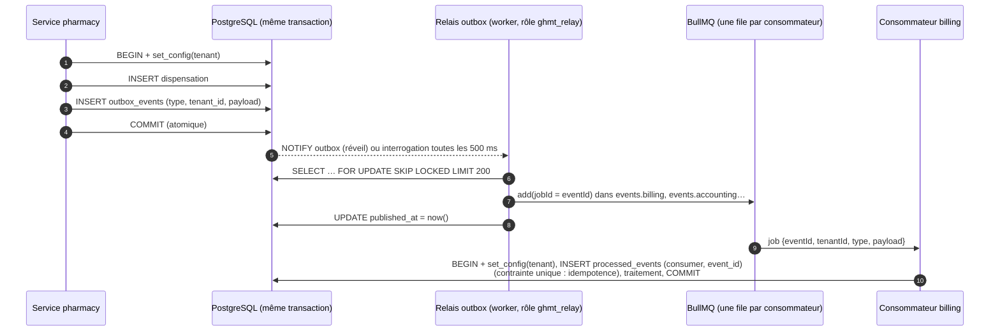

```ts
// Publication dans la transaction métier
await this.db.transaction(async (tx) => {
  const dispensation = await tx.dispensation.create({ data });
  await this.outbox.publish(tx, PharmacyEvents.dispensationCompleted({
    dispensationId: dispensation.id, patientId: data.patientId, lines: data.lines,
  }));
  return dispensation;
});
```

- **Nommage** : `<module>.<agrégat>.<fait-au-passé>.v<n>` (ex. `pharmacy.dispensation.completed.v1`). Charge utile validée par Zod au moment de publier **et** de consommer.
- **Garanties** : livraison *au moins une fois*. L'idempotence est assurée par `processed_events`. L'ordre est garanti **par agrégat** grâce à un `groupId` par agrégat (BullMQ Pro) ou, en version libre, à une vérification de `aggregate_version` côté consommateur.
- **Politique RLS de l'outbox** : `INSERT` pour `ghmt_app` avec `WITH CHECK (tenant_id = contexte)`, `SELECT/UPDATE` pour `ghmt_relay` sans filtre tenant, sur cette table uniquement.
- **Consommateurs** : une file BullMQ par module consommateur (`events.billing`, `events.accounting`, `events.notifications`…). Réessais exponentiels (5 tentatives), puis file d'erreurs consultable et rejouable depuis la console plateforme.
- **Appels synchrones** (façades) réservés aux **lectures** nécessaires à une décision immédiate (ex. `billing` lit le tarif conventionné via `InsuranceFacade`).

---

## 4. Architecture Web (Next.js)

### 4.1 Deux consoles, une application

| | Console établissement | Console plateforme |
|---|---|---|
| Hôte | `{slug}.ghmt.app` (+ domaines personnalisés) | `admin.ghmt.app` |
| Public | Personnel du tenant | Équipe GHMT |
| API | Même origine : `{slug}.ghmt.app/api/v1/*` routé par Traefik vers l'API tenant | `admin.ghmt.app/api/platform/v1/*` vers l'API plateforme |
| Exposition | Internet | Liste d'IP / VPN (WireGuard) + 2FA obligatoire |
| Rendu | Shell en RSC, écrans métier en composants client (partagés avec Desktop) | RSC + composants client |

Le `proxy.ts` de Next.js (ex-`middleware.ts`, renommé dans Next.js 16) réécrit selon l'hôte :
- `admin.ghmt.app/*` → `/platform/*`
- `{slug}.ghmt.app/*` → `/tenant/{slug}/*`
- Un accès direct à `/platform` ou `/tenant` depuis un autre hôte renvoie **404**.

### 4.2 Structure des routes

```
apps/web/src/app/
  layout.tsx                       # html, polices locales, providers globaux
  platform/
    (auth)/login/  (auth)/2fa/
    (console)/layout.tsx           # shell plateforme
      dashboard/  tenants/  tenants/[tenantId]/{overview,subscription,modules,domains,usage,access}/
      plans/  invoices/  payments/  access-grants/  queues/  announcements/  settings/
  tenant/[slug]/
    (auth)/login/  (auth)/2fa/  (auth)/forgot-password/  (auth)/select-site/
    (app)/layout.tsx               # shell : navigation filtrée par droits du plan + permissions
      dashboard/
      patients/  patients/[patientId]/{summary,encounters,appointments,invoices,documents}/
      appointments/  queue/                       # agenda, file d'attente
      encounters/[encounterId]/                   # consultation (DME)
      laboratory/{orders,results,catalog}/
      pharmacy/{dispensations,counter-sales,catalog}/
      inventory/{items,movements,stocktakes,suppliers,purchase-orders}/
      billing/{cash-desk,invoices,payments,tariffs}/
      insurance/{payers,agreements,claims}/
      hr/{staff,schedules,leaves}/
      accounting/{journals,ledger,reports,fiscal-years}/
      settings/{facility,sites,departments,users,roles,subscription,notifications,integrations}/
```

Les fichiers `page.tsx` sont **minces** : ils importent l'écran depuis `packages/features/<module>`. Le même écran est ainsi monté par le Desktop (§5).

### 4.3 Organisation des paquets front

```
packages/ui          design system : composants shadcn/ui, jetons, composants métier génériques
packages/features    écrans et hooks par module (patients, pharmacy…) ; ne dépend pas de next/*
packages/api-client  client typé (openapi-fetch + types générés par openapi-typescript)
packages/i18n        catalogues ICU fr/en par module + utilitaires de formatage
packages/shared      schémas Zod, permissions, catalogue de modules, événements
```

`packages/features` n'importe **jamais** `next/navigation` ni `next/link`. Il reçoit un `NavigationAdapter` (`push`, `replace`, `Link`, `useParams`) injecté par l'hôte (Next.js côté web, routeur du shell Desktop). C'est la clé de la réutilisation dans Tauri (ADR-005).

### 4.4 Gestion d'état

| Type d'état | Outil | Règles |
|---|---|---|
| État serveur | **TanStack Query v5** | Clés préfixées par `tenantId` (`['t', tenantId, 'patients', filters]`) pour empêcher tout partage de cache lors d'un changement de tenant. Cache vidé à la déconnexion et au changement de tenant. `staleTime` adapté (référentiels : 10 min ; file d'attente : 0 + invalidation WebSocket). |
| État d'URL (filtres, pagination, onglets) | **nuqs** | Partageable et compatible avec le bouton retour |
| Formulaires | **react-hook-form** + `@hookform/resolvers/zod` | Mêmes schémas Zod que l'API (`packages/shared`) |
| État UI local et global léger | **Zustand** (stores petits, immuables) | Site actif, session de caisse ouverte, préférences d'affichage. Pas de données serveur dans Zustand. |
| Temps réel | `socket.io-client` | Les événements serveur **invalident** des clés TanStack Query plutôt que de pousser des données |

**Jetons (web)** : le jeton d'accès est **en mémoire** uniquement. Le refresh token est dans un cookie `HttpOnly; Secure; SameSite=Strict; Path=/api/v1/auth`, posé par l'API sur la même origine (`{slug}.ghmt.app`). Le cookie est donc limité au tenant. Protection CSRF : en-tête obligatoire `X-GHMT-CSRF` (double soumission) + vérification d'`Origin` sur `/auth/refresh`.

### 4.5 Internationalisation

- **next-intl** sans préfixe de langue dans l'URL. La langue vient du profil utilisateur, puis du cookie, puis de `Accept-Language`, puis de la langue par défaut du tenant (`fr`).
- Messages au **format ICU** dans `packages/i18n/messages/{fr,en}/{module}.json`, partagés avec le mobile (i18next + `i18next-icu`). Les clés manquantes en `en` font échouer la CI.
- Formatage via `Intl` : devise du tenant (`XOF`/`XAF` sans décimales, `CDF`, `USD`), fuseau du site (`Africa/Dakar`, `Africa/Abidjan`, `Africa/Douala`, `Africa/Kinshasa`, `Africa/Lubumbashi`…). Toutes les dates sont stockées en `timestamptz` UTC.
- L'API renvoie des **codes d'erreur** stables (`MODULE_NOT_ENABLED`, `STOCK_INSUFFICIENT`), traduits côté client. Le texte serveur ne sert que de repli.

### 4.6 Design system

- **shadcn/ui** (primitives Radix) + **Tailwind CSS v4**. Jetons sous forme de variables CSS (`--primary`, `--radius`, densité).
- **Habillage par tenant** : logo, couleur primaire et en-têtes de documents, chargés via `/api/v1/public/branding` et appliqués en variables CSS. La palette reste contrainte pour garantir un contraste WCAG AA.
- **Composants métier** dans `packages/ui` : `PatientBanner` (identité + alertes allergies), `MoneyInput` (devise du tenant), `PhoneInput` (indicatifs +221, +225, +237, +243…), `DataTable` (TanStack Table, pagination serveur), `QueueBoard`, `PrintLayout` (A4 + ticket 80 mm).
- Accessibilité **WCAG 2.1 AA**, navigation clavier complète (saisie rapide à l'accueil et à la caisse), mode compact.
- Documentation et tests visuels : **Storybook**.
- **Sobriété** : budget de JS initial ≤ 200 Ko gzip par route, polices auto-hébergées (`next/font/local`), icônes `lucide-react` importées une à une, graphiques (`recharts`) chargés en différé, images AVIF/WebP. Mesure CI : Lighthouse CI sur profil « Slow 4G ».

---

## 5. Architecture Desktop (Tauri 2)

> Phase 3 (voir 00-decisions et doc 06). Le cœur web doit toutefois respecter **dès la phase 1** les contraintes qui permettent la réutilisation (§4.3).

### 5.1 Vue d'ensemble

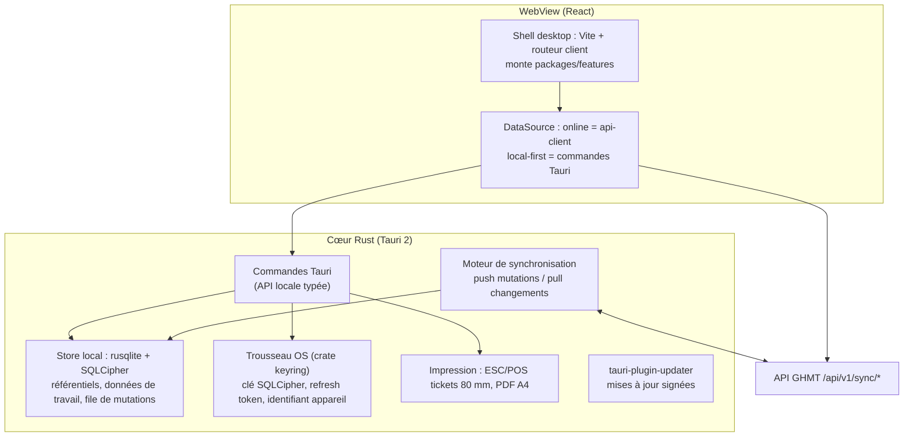

### 5.2 Réutilisation du front

Next.js App Router ne peut être embarqué dans Tauri **qu'en export statique** (`output: 'export'` : pas de `proxy.ts`, pas de Server Actions, segments dynamiques à pré-générer). Ces contraintes ne sont pas compatibles avec la console web. On retient donc :

- **Code partagé** : `packages/ui`, `packages/features`, `packages/api-client`, `packages/i18n`, `packages/shared`, soit environ 90 % du code d'interface.
- **Shell desktop** : `apps/desktop` = Tauri 2 + **Vite** + routeur client (TanStack Router), qui fournit un `NavigationAdapter`.
- **Couche `DataSource`** injectée par contexte React : pour les modules hors-ligne, les hooks de `packages/features` appellent l'interface `DataSource`. Elle est implémentée par l'API (web) ou par `invoke()` vers Rust (desktop). Les écrans ne savent pas où vivent les données.

### 5.3 Modules et périmètre hors-ligne

| Module | Hors-ligne | Détail |
|---|---|---|
| **Accueil** | Oui (lecture + écriture) | Recherche patient (référentiel local du site), création/mise à jour de fiche, enregistrement d'arrivée, file d'attente locale, rendez-vous du jour (fenêtre J-1 à J+7) |
| **Caisse** | Oui (lecture + écriture) | Ouverture/clôture de session, encaissement (espèces, Mobile Money avec saisie de référence à confirmer), reçus, factures d'actes tarifés (tarifs et conventions en cache) |
| **Pharmacie** | Oui (lecture + écriture) | Ventes au comptoir, dispensation d'ordonnances déjà synchronisées, mouvements de stock (deltas), alertes de péremption |
| DME, laboratoire, RH, comptabilité, administration | Non (en ligne) | Indisponibles hors-ligne, avec un message explicite. Lecture seule possible du dernier résumé patient mis en cache (optionnel, paramétrable par le tenant) |

### 5.4 Stockage local chiffré

- **SQLite + SQLCipher** via `rusqlite` (feature `bundled-sqlcipher-vendored-openssl`), avec des migrations embarquées (`rusqlite_migration`).
- Clé de 256 bits générée à l'enrôlement et stockée dans le **trousseau OS** (Windows Credential Manager / DPAPI, macOS Keychain, Secret Service sous Linux) via la crate `keyring`. Elle n'est jamais visible du JavaScript.
- **Enrôlement de l'appareil** : un admin du site génère un code à usage unique. L'appareil reçoit un `deviceId` et un jeton d'appareil, révocables depuis la console. À la révocation, au prochain contact, l'application efface la base locale et la clé.
- **Session hors-ligne** : il faut une connexion en ligne réussie sur l'appareil depuis moins de **72 h** (paramétrable). Déverrouillage par **PIN hors-ligne** dont le hash Argon2id est stocké localement. Les permissions sont mises en cache et signées par le serveur (JWS vérifiée localement).
- **Minimisation** : seules les données du **site** de l'appareil et des modules hors-ligne sont stockées. Purge glissante (ex. factures soldées de plus de 30 jours).

### 5.5 Protocole de synchronisation

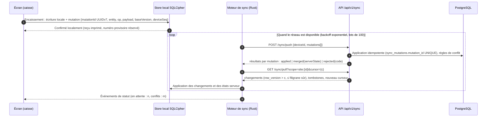

- **Versionnage serveur** : les tables synchronisables portent `row_version bigint`, mis à jour par trigger depuis une séquence. Comme des transactions longues peuvent valider des versions dans le désordre, le serveur ne renvoie que les lignes sous un **filigrane sûr**, calculé à partir de `pg_snapshot_xmin(pg_current_snapshot())` associé au `xid8` d'écriture. Aucune ligne n'est ainsi manquée.
- **Identifiants générés par le client** (UUIDv7) : pas de remappage d'identifiants après synchronisation.
- **Numérotation des pièces** : la séquence chronologique légale est garantie par des **plages de numéros pré-allouées par appareil** (ex. `CA-{site}-{appareil}-000123`, plage de 500 réapprovisionnée en ligne). À défaut de plage, le numéro reste **provisoire** puis est remplacé par un numéro définitif à la synchronisation. Le schéma de numérotation doit être validé avec un expert-comptable SYSCOHADA.

### 5.6 Résolution des conflits (par type de données)

| Donnée | Stratégie | Justification |
|---|---|---|
| Encaissements, reçus, ventes comptoir, dispensations | **Ajout seul, jamais en conflit** | Ce sont des faits. Une correction se fait par écriture inverse (avoir, annulation) |
| Mouvements de stock | **Deltas**, jamais de quantité absolue | Deux postes qui vendent le même article s'additionnent. Un stock négatif après fusion génère une **alerte de rapprochement**, pas un rejet |
| Fiche patient (démographie) | **Fusion champ par champ** sur `baseVersion`. Champ modifié des deux côtés : la valeur serveur l'emporte et la valeur locale est placée en **file de revue** | Évite d'écraser silencieusement une donnée d'identité |
| Doublons patients créés hors-ligne | Détection après synchronisation (nom phonétique, date de naissance, téléphone) puis **file de fusion** manuelle | La fusion d'identités est trop risquée pour être automatique |
| Référentiels (tarifs, produits, utilisateurs, conventions) | **Le serveur gagne**, lecture seule localement | Pilotés par l'administration |
| Session de caisse | Clôture locale autorisée, **validation définitive en ligne** (rapprochement des montants) | Contrôle interne |
| Rejets (permission retirée, tenant suspendu, module désactivé) | Mutation `rejected` visible dans le centre de synchronisation avec action corrective | Rien n'est perdu en silence |

---

## 6. Architecture Mobile (Expo)

> Phase 2. Application patients uniquement. L'application professionnelle viendra plus tard (§6.6).

### 6.1 Compte patient global lié à plusieurs établissements

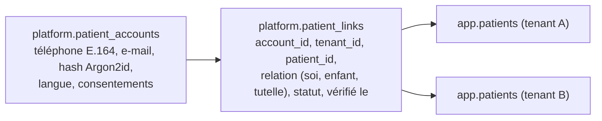

- **Création du compte** : numéro de téléphone + OTP SMS (5 tentatives, expiration 5 min, protection contre le pompage SMS), puis mot de passe ou PIN à 6 chiffres + biométrie (`expo-local-authentication`).
- **Liaison à un établissement** (consentement explicite) : (a) code de liaison remis à l'accueil (QR imprimé sur le reçu ou la carte patient), ou (b) correspondance téléphone + date de naissance + OTP, validée selon la politique du tenant. Le tenant peut exiger la méthode (a).
- **Proches** : un compte peut gérer des dossiers liés (enfants, personnes sous tutelle) avec une relation déclarée et vérifiée par l'établissement.
- **Jetons** : jeton de compte global (scope `patient-account` : profil, liste des liaisons). L'accès aux données d'un établissement passe par un **échange de jeton** `POST /api/v1/patient/sessions` `{tenantId, patientId}`, qui renvoie un JWT `{tid, sub: accountId, pid: patientId, role: 'patient'}`. Côté API, le chemin RLS est standard, complété par une **politique patient** sur les tables exposées (`patient_id = current_setting('app.patient_id')`) et par des contrôleurs dédiés `/api/v1/patient/*`.

### 6.2 Écrans

| Domaine | Écrans |
|---|---|
| Accès | Bienvenue (langue), inscription OTP, connexion, PIN/biométrie, récupération |
| Établissements | Liste des établissements liés, ajout par QR/code, sélection du profil (soi, enfant) |
| Rendez-vous | À venir / passés, prise de rendez-vous (créneaux publiés), annulation/report, rappel |
| Santé | Résultats de laboratoire validés et publiés, ordonnances, comptes rendus partagés (documents PDF) |
| Paiements | Factures, paiement Mobile Money (redirection agrégateur / USSD push), reçus |
| Notifications | Centre de notifications, préférences (push, SMS) |
| Profil | Données personnelles, proches, consentements (révocation de liaison), suppression du compte |

### 6.3 Stack mobile

- **Expo** (dernier SDK stable), **expo-router**, TypeScript, builds **EAS Build**, mises à jour JS via **EAS Update** (canaux `staging` et `production`, déploiement progressif).
- Données : **TanStack Query** + `@tanstack/query-async-storage-persister` sur **react-native-mmkv** (rapide, chiffrable). Jetons dans **expo-secure-store** (Android Keystore).
- i18n : `i18next` + `react-i18next` + `i18next-icu` (catalogues partagés `packages/i18n`), `expo-localization`.
- Formulaires : react-hook-form + Zod (`packages/shared`).
- Erreurs : `@sentry/react-native` (scrubbing des données de santé, §8).

### 6.4 Notifications push

- `expo-notifications`. Jetons enregistrés via `POST /api/v1/patient/devices` (jeton Expo + plateforme), stockés par compte.
- Envoi depuis les workers via `expo-server-sdk` (ou FCM direct via `firebase-admin` pour les besoins avancés), avec lecture des reçus pour purger les jetons invalides.
- **Contenu minimal** : aucune donnée médicale dans la notification (« Un nouveau document est disponible »). Le détail s'affiche après déverrouillage dans l'app.
- **Repli SMS** si l'utilisateur n'a pas de jeton push actif ou si le push n'est pas acquitté dans le délai prévu pour les messages critiques (rappel de rendez-vous J-1). Configurable par tenant (coût SMS, doc 05).

### 6.5 Hors-ligne léger

- Lecture hors-ligne du **dernier état connu** : rendez-vous, liste des documents, reçus. Les PDF consultés sont mis en cache chiffré, avec une durée limitée.
- Écritures (prise ou annulation de rendez-vous) : **en ligne uniquement**. Une file locale simple existe pour l'annulation, avec confirmation ultérieure affichée.
- Optimisation réseau : réponses paginées et compactes, images redimensionnées côté serveur, APK cible inférieur à 30 Mo, compatibilité Android 8+ et 2 Go de RAM.

### 6.6 Application professionnelle (phase ultérieure)

Même socle Expo et `packages/shared`/`api-client`, authentification personnel (2FA), cas d'usage ciblés : agenda du praticien, validation de résultats, notifications de file d'attente, consultation du dossier en lecture. Pas de hors-ligne en écriture au départ.

---

## 7. Gestion des fichiers et documents

### 7.1 Organisation du stockage

| Bucket | Contenu | Politique |
|---|---|---|
| `ghmt-{env}-quarantine` | Dépôts bruts avant analyse | Cycle de vie : suppression à 24 h, aucun accès en lecture côté client |
| `ghmt-{env}-documents` | Documents validés (DME, résultats, pièces d'identité, justificatifs RH) | Versionnage activé, chiffrement côté serveur, réplication hors site |
| `ghmt-{env}-generated` | PDF générés (factures, reçus, comptes rendus, états SYSCOHADA) | Régénérables, rétention selon le type |
| `ghmt-{env}-exports` | Exports de données (portabilité, sortie de tenant) | Expiration à 7 jours |
| `ghmt-{env}-backups` | Sauvegardes PostgreSQL (autre site / autre fournisseur) | Object Lock (WORM) |

**Clé d'objet** : `t/{tenantId}/{module}/{yyyy}/{mm}/{fileId}`. `fileId` est un UUIDv7. **Aucun nom de fichier ni donnée patient dans la clé.** Le nom d'origine, le type MIME, la taille, la somme SHA-256, le statut et les références métier sont stockés dans `app.files` (sous RLS).

### 7.2 Flux de dépôt et de téléchargement

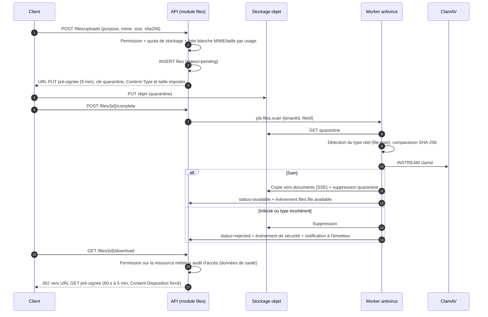

- Bibliothèques : `@aws-sdk/client-s3`, `@aws-sdk/s3-request-presigner`, `file-type`, client clamd `clamscan`.
- **Quotas** : la taille est comptabilisée par tenant (`tenant_usage.storage_bytes`) et vérifiée au dépôt (doc 05).
- **Images** : vignettes générées par worker (`sharp`), version allégée servie en priorité sur mobile.
- **PDF générés** : gabarits HTML (React rendu côté serveur) convertis par **Gotenberg** dans un worker. Les PDF officiels portent un QR de vérification (identifiant + empreinte) pour lutter contre les faux documents.

### 7.3 Chiffrement

| Niveau | Mesure |
|---|---|
| Transit | TLS 1.2+ partout, y compris entre l'API et le stockage objet |
| Repos (stockage) | SSE au niveau du fournisseur ou du serveur S3 (SSE-S3 / SSE-KMS) + chiffrement des disques |
| Repos (applicatif, documents sensibles) | **Chiffrement d'enveloppe** : une clé de données (DEK) par tenant, chiffrée par une clé maîtresse dans un **KMS** (Vault/OpenBao Transit ou KMS du fournisseur). Fichiers chiffrés en AES-256-GCM par le worker avant dépôt dans `documents` (l'antivirus analyse avant chiffrement). La rotation de la clé maîtresse ne demande que de rechiffrer les DEK. |
| Effacement cryptographique | La destruction de la DEK d'un tenant à la fin de son contrat rend illisibles les copies résiduelles, y compris dans les sauvegardes |

Le choix du chiffrement applicatif (vs SSE seule) est **activé pour les catégories sensibles** (DME, résultats, pièces d'identité) et optionnel pour le reste, pour limiter le coût CPU.

> **Note fournisseur S3** : MinIO est retenu pour le développement (00-decisions). En production, l'édition communautaire de MinIO a fortement évolué en 2025 (licence AGPL, fonctionnalités et distribution réduites). Il faut vérifier la situation au moment du déploiement et garder une alternative S3-compatible (stockage objet du fournisseur cloud, Ceph RGW, SeaweedFS, Garage). Le code ne dépend que de l'API S3.

---

## 8. Observabilité et journalisation technique

### 8.1 Signaux et outils

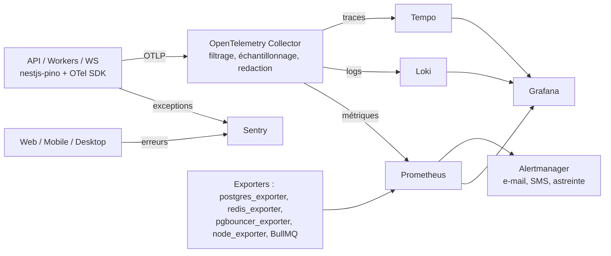

| Signal | Mise en œuvre |
|---|---|
| **Logs** | `nestjs-pino` (JSON). Champs obligatoires : `ts, level, msg, requestId, traceId, spanId, tenantId, userId, module, route, durationMs`. Redaction Pino (`redact`) des chemins sensibles : `req.headers.authorization`, `*.password`, `*.otp`, `*.token`, corps des requêtes métier. **Aucune donnée de santé ni donnée personnelle en clair dans les logs** : les corps de requête ne sont jamais journalisés en production. |
| **Traces** | `@opentelemetry/sdk-node` + `@opentelemetry/auto-instrumentations-node` (http, pg, ioredis, nestjs-core), `@prisma/instrumentation`, propagation W3C `traceparent` du web vers l'API puis vers les jobs BullMQ (contexte dans les données du job). Échantillonnage : 10 % par défaut, 100 % des erreurs (échantillonnage en queue dans le Collector). |
| **Métriques** | `prom-client` via `@willsoto/nestjs-prometheus` : latence HTTP (histogrammes par route), taux d'erreur, pool Prisma/PgBouncer, profondeur et âge des files BullMQ, retard de l'outbox, délivrabilité SMS/push par fournisseur, mutations de sync en attente par appareil. |
| **Erreurs** | `@sentry/nestjs`, `@sentry/nextjs`, `@sentry/react-native`. Côté Desktop : plugin Sentry pour Tauri (Rust + JS). `beforeSend` supprime corps, cookies et paramètres. Hébergement : Sentry auto-hébergé, ou SaaS en région UE avec scrubbing strict, selon les contraintes de localisation (§9.5). |

**Cardinalité** : `tenantId` figure dans les logs et les traces, **pas** comme label Prometheus généraliste (explosion de cardinalité). Les métriques par tenant (usage, quotas) sont calculées par des jobs et stockées en base (doc 05), puis exposées en agrégats top-N.

### 8.2 SLO et alertes initiales

| SLO | Cible MVP | Alerte |
|---|---|---|
| Disponibilité API (hors maintenance planifiée) | 99,5 % mensuel | Taux de consommation du budget d'erreur > 2× sur 1 h |
| Latence p95 `GET` | < 300 ms côté serveur | p95 > 500 ms pendant 10 min |
| Latence p95 `POST` métier | < 500 ms | p95 > 800 ms pendant 10 min |
| Retard outbox | < 5 s | > 60 s |
| Âge du plus vieux job `notifications.sms` | < 2 min | > 10 min |
| Réplication / archivage WAL | Retard < 60 s | > 5 min ou échec d'archivage |
| Certificats TLS | > 14 jours | < 14 jours |

### 8.3 Distinction logs techniques / audit fonctionnel

| | Logs techniques | Audit fonctionnel (doc 04) |
|---|---|---|
| But | Diagnostiquer et exploiter | Prouver qui a fait quoi, sur quelle donnée et quand |
| Stockage | Loki (rétention 30 jours, 90 jours pour la sécurité) | PostgreSQL `app.audit_events` partitionnée, append-only, chaînage SHA-256, archivage froid ≥ 5 ans (durée selon droit national) |
| Contenu | Pas de données personnelles | Identifiants des ressources, actions, avant/après minimisés |
| Accès | Équipe ops | Admin du tenant (ses données) + DPO, export |

---

## 9. Architecture de déploiement

### 9.1 Environnements

| Environnement | Rôle | Données | Infra |
|---|---|---|---|
| `local` | Développement | Jeux synthétiques (seed `@faker-js/faker`, locale `fr`) | Docker Compose |
| `ci` | Tests d'intégration et e2e éphémères | Synthétiques | Testcontainers / services GitHub Actions |
| `staging` | Recette, démo interne, tests de charge | **Synthétiques uniquement : jamais de copie de production** | Identique à la prod en plus petit |
| `sandbox` (option) | Formation des clients, intégrateurs | Fictives, tenant de démo réinitialisé chaque nuit | Cellule de production isolée ou staging |
| `production` | Clients | Réelles | Une ou plusieurs **cellules** régionales |

### 9.2 MVP : Docker Compose

Deux à trois VM (4 à 8 vCPU) chez un même fournisseur, réseau privé. Compose découpé par rôle (`infra/compose/*.yml`).

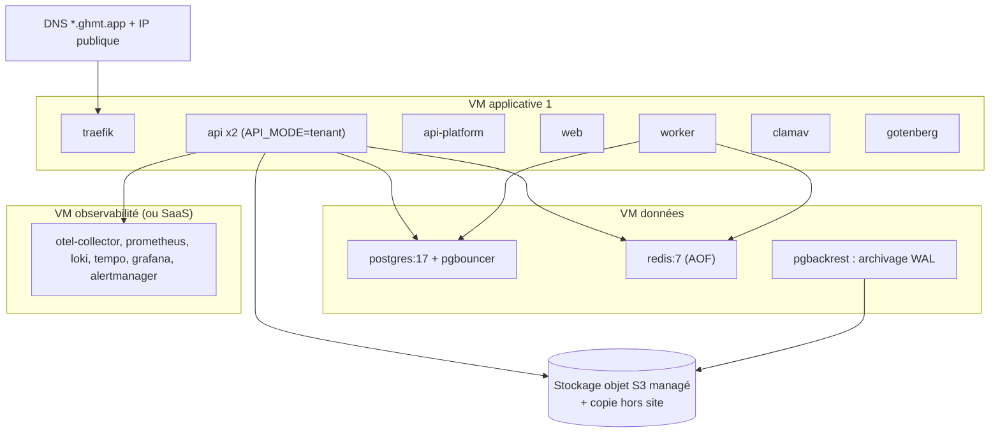

- **Image unique** `ghcr.io/<org>/ghmt-api:{sha}` pour `api`, `api-platform` et `worker` (commande différente). Image `ghmt-web` séparée.
- TLS wildcard `*.ghmt.app` via Traefik + Let's Encrypt **DNS-01**.
- Migrations : service Compose `migrate` (rôle `ghmt_migrator`) exécuté avant le redémarrage de l'API.
- Limite assumée : PostgreSQL non hautement disponible au MVP. RPO ≤ 5 min (archivage WAL, `archive_timeout=60s`), RTO ≤ 4 h, procédure de restauration testée mensuellement.

### 9.3 Cible : Kubernetes

| Composant | Choix | Commentaire |
|---|---|---|
| Distribution | Kubernetes managé si disponible dans la région, sinon **k3s/RKE2** sur IaaS local | Portabilité entre hébergeurs |
| Ingress | **Traefik** (ou Envoy Gateway via Gateway API) | ingress-nginx est en fin de maintenance : à éviter pour un nouveau projet |
| Certificats | **cert-manager** (DNS-01, wildcard) | |
| PostgreSQL | Opérateur **CloudNativePG** : 1 primaire + 2 réplicas (dont 1 synchrone), PgBouncer intégré (`Pooler`), sauvegardes Barman vers S3, PITR | RPO ≈ 0 (synchrone), RTO < 5 min (bascule automatique) |
| Redis | Redis 7 + **Sentinel** (3 nœuds), AOF `everysec` | Charts maintenus par la communauté. Éviter les images et charts Bitnami, dont la distribution gratuite a été restreinte en 2025 |
| Déploiement | **Helm** (chart maison `infra/k8s/charts/ghmt`) + **Argo CD** (GitOps) | Promotion staging vers prod par PR sur le dépôt d'environnement |
| Secrets | **External Secrets Operator** + Vault/OpenBao (ou KMS du fournisseur). SOPS (age) pour les valeurs non sensibles chiffrées dans Git | Aucun secret dans les images ni dans Git en clair |
| Montée en charge | HPA sur CPU + latence (API), **KEDA** sur la profondeur des files BullMQ (workers) | |
| Politiques | NetworkPolicies (seuls API/workers parlent à PG), Pod Security « restricted », images signées (cosign) vérifiées par Kyverno | |

### 9.4 CI/CD (GitHub Actions)

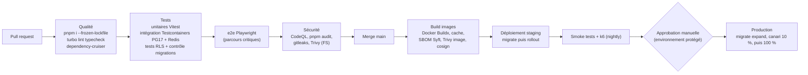

- **Turborepo** avec cache distant : seuls les paquets affectés sont rebuildés et testés.
- **Contrôle des migrations** : `prisma migrate diff` (schéma vs migrations) + **squawk** (lint SQL des verrous dangereux) + test RLS (§2.4).
- **Migrations sans interruption** : discipline *expand / contract* (ajout de colonne nullable, backfill par lots via job, contrainte `NOT VALID` puis `VALIDATE`, index `CONCURRENTLY`). La suppression d'une colonne n'intervient qu'à la release N+1.
- **Desktop** : `tauri-apps/tauri-action` (Windows prioritaire, signature de code, manifeste de l'updater signé). **Mobile** : EAS Build + EAS Submit, EAS Update pour les correctifs JS.
- **Retour arrière** : images immuables taguées par SHA. Argo CD rollback. Les migrations étant toujours rétrocompatibles avec N-1, l'application peut revenir à N-1 sans retour arrière du schéma.

### 9.5 Hébergement et localisation des données

| Option | Avantages | Inconvénients |
|---|---|---|
| **Cloud européen** (ex. OVHcloud, Scaleway, AWS eu-west-3 Paris) | Maturité, services managés (K8s, PG, S3), coûts maîtrisés, latence correcte depuis l'Afrique de l'Ouest (souvent 80-150 ms) | **Transfert hors du pays** : selon la loi nationale, autorisation préalable de l'autorité (ex. CDP au Sénégal, ARTCI en Côte d'Ivoire) et garanties contractuelles. Risque d'exigence de localisation pour les données de santé ou les marchés publics |
| **Hyperscaler en Afrique** (AWS af-south-1, Azure South Africa North, Google africa-south1) | Données sur le continent, services managés complets | Afrique du Sud, hors zone francophone : ce n'est pas une localisation nationale. La latence depuis Dakar ou Abidjan peut être **supérieure** à celle de l'Europe (routes via l'Europe) |
| **Datacenter local ou régional** (opérateurs télécoms, datacenters neutres en Côte d'Ivoire, au Sénégal, en RDC, au Cameroun ; datacenters nationaux) | Conformité de localisation, proximité, argument commercial fort (secteur public) | Moins de services managés (souvent IaaS + colocation) : il faut opérer K8s, PG et S3 soi-même. Maturité et redondance variables, à auditer (Tier, énergie, PRA) |

**Recommandation** :
1. **Architecture en cellules dès le départ** (§2.10) : chaque cellule est une pile complète (K8s, PG, Redis, S3) dans une juridiction. Le tenant y est épinglé (`platform.tenants.cell`). Le **plan de contrôle global** (annuaire tenants, plans, facturation SaaS) ne contient **aucune donnée de santé**.
2. **MVP** : une cellule unique, dont l'implantation dépend du **pays pilote** et de l'**avis juridique**. Par défaut, une cellule en Europe (déploiement rapide) avec autorisation de transfert obtenue, **ou** une cellule chez un hébergeur local si le pilote est public ou si la loi l'impose.
3. **Croissance** : ouverture de cellules nationales ou régionales (ex. Afrique de l'Ouest UEMOA, Afrique centrale CEMAC) à la demande, avec le même Helm et le même Argo CD.
4. CDN (avec points de présence africains) **réservé aux ressources statiques** du web. Le trafic API contenant des données de santé ne passe pas par un CDN tiers terminant TLS.
5. **Sauvegardes hors site dans la même juridiction** que la cellule, sauf autorisation contraire.

> Les obligations varient selon les pays (CDP Sénégal, ARTCI Côte d'Ivoire, loi camerounaise de 2024, Convention de Malabo, réglementations sanitaires nationales). **Elles doivent être validées pays par pays par un juriste avant tout déploiement.** L'architecture en cellules permet de s'y conformer sans refonte.

### 9.6 Haute disponibilité

| Couche | MVP (Compose) | Cible (K8s) |
|---|---|---|
| Entrée | 1 Traefik, DNS à TTL court | 2+ réplicas Traefik derrière un LB, multi-zones si disponible |
| API / workers | 2 conteneurs API, 1 worker | ≥ 3 pods API (anti-affinité), workers par file avec KEDA, PodDisruptionBudgets |
| PostgreSQL | 1 instance + archivage WAL + restauration testée | CloudNativePG 3 instances, réplication synchrone, bascule automatique |
| Redis | 1 instance AOF | Sentinel 3 nœuds |
| S3 | Service managé du fournisseur | Idem ou cluster distribué (≥ 4 nœuds en effacement de codage) + réplication hors site |
| Desktop | Continuité locale (mode hors-ligne) | Idem : c'est la HA de dernier recours des sites |

Cibles : **99,5 %** au MVP, **99,9 %** en cible. PRA inter-sites : restauration de la cellule dans un second datacenter à partir des sauvegardes S3 hors site (RTO 8 h, RPO 5 min), exercice semestriel.

### 9.7 Sauvegarde et restauration (aperçu, détail doc 04)

- PostgreSQL : sauvegardes complètes hebdomadaires, différentielles quotidiennes, **archivage WAL continu** (pgBackRest au MVP, Barman/CNPG en K8s), PITR sur 30 jours, copies chiffrées hors site avec Object Lock.
- **Restauration d'un seul tenant** : en base partagée, on ne peut pas restaurer un tenant « en place ». Procédure outillée : restauration PITR dans une instance temporaire, puis export filtré `tenant_id` (script `infra/scripts/tenant-extract`), puis réimport contrôlé ou mise à disposition. **À tester trimestriellement.**
- Objets S3 : versionnage + réplication. Redis : non sauvegardé comme source de vérité (AOF uniquement pour la continuité de BullMQ).
- Test automatique **mensuel** de restauration complète en staging isolé, avec vérification de sommes de contrôle.

### 9.8 Dimensionnement indicatif

> Ordres de grandeur à confirmer par des tests de charge **k6** sur des scénarios réalistes (accueil, caisse, consultation).

| Palier | Tenants | Utilisateurs simultanés | API | Workers | PostgreSQL | Redis | Stockage objet |
|---|---|---|---|---|---|---|---|
| **Pilote / MVP** | ≤ 20 | ≤ 300 | 2 × (1 vCPU, 1 Go) | 1 × (1 vCPU, 1 Go) | 4 vCPU, 16 Go, 200 Go NVMe | 1 Go | 0,5 To |
| **Croissance** | ≤ 200 | ≤ 3 000 | 3-6 pods × (2 vCPU, 2 Go) | 2-6 pods | Primaire 8 vCPU / 32 Go + 2 réplicas, 1 To | Sentinel 3 × 2 Go | 5 To |
| **Échelle** | ≤ 1 000 par cellule | ≤ 15 000 | HPA 6-20 pods | KEDA 4-30 pods | 16-32 vCPU / 64-128 Go, partitionnement, réplicas de lecture | Sentinel 3 × 4-8 Go (ou Cluster) | 20+ To |

Repères : PgBouncer avec 50 à 100 connexions serveur par cellule suffit pour des milliers de clients. Le pool Prisma vaut 10 à 20 connexions par pod API.

---

## 10. Recommandations technologiques et ADR

### 10.1 Bibliothèques par couche

**Monorepo et outillage**

| Besoin | Choix | Justification |
|---|---|---|
| Workspaces / orchestration | pnpm workspaces + Turborepo (figé) | Cache, graphes de tâches |
| Lint / format | ESLint (flat config, `typescript-eslint`) + Prettier, partagés dans `packages/config` | Standard |
| Frontières de modules | `dependency-cruiser` | Règles déclaratives, rapport graphique |
| Tests | **Vitest** (+ `unplugin-swc` pour les décorateurs NestJS), **Testcontainers** (`@testcontainers/postgresql`), **Playwright**, **k6** | Rapide, un seul runner front et back, vraie base pour la RLS |
| Hooks Git | `lefthook` + `commitlint` (conventional commits) | Léger, multi-plateforme |

**API (NestJS 12)**

| Besoin | Choix | Justification |
|---|---|---|
| Contexte de requête | `nestjs-cls` | AsyncLocalStorage idiomatique Nest, compatible guards et intercepteurs |
| ORM | Prisma ORM (version courante, client TypeScript avec `@prisma/adapter-pg`), schéma multi-fichiers, `multiSchema` | Figé. Le driver adapter `pg` est compatible PgBouncer et l'instrumentation OTel |
| Validation / OpenAPI | `zod` v4 + `nestjs-zod` (DTO et génération OpenAPI 3.1 depuis les schémas de `packages/shared`) + `@nestjs/swagger` | Une seule source de vérité des contrats |
| Configuration | `@nestjs/config` + validation Zod de l'environnement au démarrage | Échec immédiat si un secret manque |
| Auth | `argon2` (node-argon2, Argon2id), `jose` (JWT, EdDSA/ES256, rotation des clés via JWKS), `otplib` (TOTP) | Figé (auth maison). `jose` est sûr et sans dépendance |
| Limitation de débit | `@nestjs/throttler` + `@nest-lab/throttler-storage-redis` | Limites par IP, utilisateur et tenant |
| Sécurité HTTP | `helmet`, CORS en liste blanche (`*.ghmt.app` + domaines personnalisés) | |
| Files / planification | `bullmq` + `@nestjs/bullmq` (job schedulers pour les tâches périodiques) | Figé |
| Temps réel | `@nestjs/websockets`, `@nestjs/platform-socket.io`, `@socket.io/redis-adapter` | Multi-instances |
| Stockage objet | `@aws-sdk/client-s3`, `@aws-sdk/s3-request-presigner` | Compatible avec tout S3 |
| Fichiers | `file-type`, `clamscan`, `sharp` | Détection du type réel, antivirus, vignettes |
| PDF | Gotenberg (conteneur) + gabarits React SSR | Rendu fidèle (tableaux comptables, en-têtes), hors du processus API |
| E-mail | `nodemailer` + `react-email` | Gabarits typés et testables |
| SMS | Interface `SmsProvider` maison + adaptateurs par fournisseur (HTTP via `undici`) | Fournisseurs interchangeables et basculement automatique (figé) |
| Push | `expo-server-sdk`, `firebase-admin` | |
| Paiements Mobile Money | Interface `PaymentProvider` maison + adaptateurs CinetPay / PayDunya / Flutterwave (HTTP, vérification des signatures de webhooks) | Pas de SDK officiel homogène, adaptateurs fins plus faciles à tester |
| Montants | `Prisma.Decimal` (decimal.js), colonnes `numeric(18,2)` + code devise ISO 4217 ; arrondi selon les décimales de la devise | Exactitude comptable (SYSCOHADA) |
| Dates | `date-fns` v4 + `@date-fns/tz` | Fuseaux africains, léger |
| Identifiants | UUIDv7 (`uuid` v11+, `@default(uuid(7))` Prisma) | Triables, indexation efficace, générables hors-ligne |
| Logs / traces / métriques | `nestjs-pino`, `pino`, `@opentelemetry/sdk-node`, `@opentelemetry/auto-instrumentations-node`, `@prisma/instrumentation`, `@willsoto/nestjs-prometheus`, `@sentry/nestjs` | Figé (Pino, OTel, Prometheus, Sentry) |
| Santé du service | `@nestjs/terminus` | Sondes liveness et readiness K8s |

**Web**

| Besoin | Choix |
|---|---|
| Framework | Next.js (App Router, version 16 recommandée), React 19 |
| UI | Tailwind CSS v4, shadcn/ui (Radix), `lucide-react`, `sonner` (toasts), `cmdk` (palette de commandes : recherche patient rapide) |
| Données | `@tanstack/react-query` v5, `openapi-fetch` + `openapi-typescript` (types générés depuis l'OpenAPI de l'API) |
| Tableaux / formulaires | `@tanstack/react-table`, `react-hook-form`, `@hookform/resolvers` |
| État | `zustand`, `nuqs` |
| i18n | `next-intl` |
| Graphiques | `recharts` (chargement différé) |
| Agenda | `@fullcalendar/react` (vues ressource/jour) ou composant maison sur `date-fns` selon la licence retenue |
| Erreurs | `@sentry/nextjs` |
| Documentation UI | Storybook |

**Desktop** : `tauri` 2, `@tauri-apps/api`, `tauri-plugin-updater`, `tauri-plugin-log`, `tauri-plugin-single-instance`, crates `rusqlite` (SQLCipher), `rusqlite_migration`, `keyring`, `reqwest`, `serde`, `tokio`, `escpos` (tickets), Vite + `@tanstack/react-router`.

**Mobile** : Expo SDK (stable courant), `expo-router`, `expo-notifications`, `expo-secure-store`, `expo-local-authentication`, `expo-localization`, `react-native-mmkv`, `@tanstack/react-query` + persister, `i18next`, `react-i18next`, `i18next-icu`, `@sentry/react-native`.

**Infra** : Docker (images `node:22-alpine` ou distroless, multi-étapes), Traefik, PgBouncer, pgBackRest, CloudNativePG, cert-manager, Argo CD, Helm, External Secrets Operator, Vault/OpenBao, KEDA, Kyverno, cosign, Syft, Trivy, Grafana/Prometheus/Loki/Tempo/Alertmanager, OpenTelemetry Collector.

### 10.2 ADR résumés

| ADR | Décision | Alternatives écartées | Conséquences |
|---|---|---|---|
| **ADR-001** Monolithe modulaire NestJS (figé) | Un déployable, modules à frontières vérifiées par dependency-cruiser, mode d'exécution par variable (`tenant`, `platform`, `worker`) | Microservices dès le départ | Simplicité d'exploitation adaptée à une petite équipe et à des infrastructures africaines. Extraction possible plus tard grâce aux événements outbox |
| **ADR-002** Base partagée + `tenant_id` + RLS forcée (figé) | Rôle applicatif sans BYPASSRLS ni propriété des tables, `FORCE RLS`, FK composites, test CI de couverture RLS | Schéma par tenant, base par tenant | Coût par tenant minimal, migrations uniques. Restauration par tenant plus complexe (outil dédié §9.7) |
| **ADR-003** Contexte tenant par `nestjs-cls` + extension Prisma + `TenantDb.transaction()` | Opérations isolées auto-enveloppées. Unités de travail explicites réentrantes. `set_config(..., true)` | Middleware Prisma déprécié, `SET` de session (fuite via le pool), filtrage applicatif seul | Fail-closed, compatible PgBouncer transactionnel. Léger surcoût par requête isolée |
| **ADR-004** Événements de domaine via outbox transactionnelle + BullMQ | Une file par consommateur, idempotence `processed_events` | `EventEmitter` en mémoire (perte d'événements si crash), broker dédié (Kafka, RabbitMQ) | Atomicité métier + événement. Pas de nouveau middleware à opérer |
| **ADR-005** Front partagé en paquets, shell Desktop Vite | `packages/features` indépendant de Next, `NavigationAdapter` et `DataSource` injectés | Export statique Next dans Tauri (contraintes fortes), Tauri chargeant l'URL distante (pas de hors-ligne) | Environ 90 % de code UI réutilisé. Deux shells de routage à maintenir |
| **ADR-006** SQLite + SQLCipher géré en Rust, clé dans le trousseau OS | Données locales chiffrées, inaccessibles au JS | IndexedDB (non chiffré, quotas), SQLite non chiffré | Sécurité des postes partagés ou volés. Dépendance à OpenSSL embarqué |
| **ADR-007** Synchronisation par mutations idempotentes + changements versionnés, conflits par type de donnée | Faits en ajout seul, stocks en deltas, fusion champ par champ pour les patients, plages de numéros par appareil | CRDT génériques, dernier écrivain gagnant partout | Règles explicites et auditables, adaptées aux contraintes comptables |
| **ADR-008** Déploiement en cellules, plan de contrôle sans données de santé | Tenant épinglé à une cellule. Même Helm et Argo CD partout | Cluster mondial unique | Réponse aux exigences de localisation. Opérations multipliées par le nombre de cellules |
| **ADR-009** UUIDv7 générés par l'application | `@default(uuid(7))`, génération côté client pour les données hors-ligne | Séquences `bigserial`, UUIDv4 | Pas de conflit d'identifiants hors-ligne, index B-tree efficaces, prêt pour le sharding |
| **ADR-010** Droits par module calculés par `billing-saas`, appliqués par `@RequiresModule` | Cache Redis invalidé par événement, appliqué sur HTTP, jobs, événements et WS | Feature flags génériques (Unleash…) pour le commercial | Une seule source de vérité contractuelle. Un outil de feature flags technique pourra s'ajouter plus tard pour les déploiements progressifs |
| **ADR-011** Fichiers : clé `t/{tenantId}/…`, quarantaine + ClamAV, URLs signées courtes, chiffrement d'enveloppe par tenant pour les catégories sensibles | | Proxy de téléchargement via l'API (charge réseau), bucket par tenant (limites de quotas de buckets) | Isolation, révocabilité, effacement cryptographique |
| **ADR-012** Kubernetes : Traefik, CloudNativePG, Argo CD | | ingress-nginx (fin de maintenance), Postgres hors opérateur, charts Bitnami | Outils maintenus et portables sur IaaS local |
| **ADR-013** API plateforme isolée (mode `platform`, rôle BDD `ghmt_platform`, réseau restreint) | | Endpoints admin dans l'API tenant | Surface d'attaque réduite. Les données de santé ne sont accessibles qu'en break-glass |

---

## 11. Risques architecturaux et mitigations

| # | Risque | Gravité | Mitigation |
|---|---|---|---|
| R1 | **Fuite inter-tenant** (requête sans contexte, `$queryRawUnsafe`, rôle mal configuré, nouvelle table sans politique) | Critique | RLS **forcée** + fail-closed, rôle applicatif sans BYPASSRLS ni propriété des tables, test CI de couverture RLS, tests d'isolation par table, FK composites, règle ESLint interdisant les requêtes brutes non sûres, revue sécurité obligatoire des migrations |
| R2 | **Fuite de contexte** entre requêtes via le pool | Critique | `set_config(..., true)` limité à la transaction (jamais de `SET` de session). CLS par requête et par job. Test de charge concurrentiel multi-tenant vérifiant l'absence de mélange |
| R3 | **Performance de la RLS** sur grands volumes | Élevée | Politiques simples (égalité sur `tenant_id`, sans sous-requête ni fonction non `LEAKPROOF`), index préfixés `tenant_id`, `EXPLAIN` en revue, partitionnement temporel des tables volumineuses |
| R4 | **Voisin bruyant** (un gros tenant monopolise la BDD ou les files) | Élevée | Rate limiting par tenant, quotas, files BullMQ avec concurrence par tenant (groupes), `statement_timeout` (5 s API, plus long pour les rapports sur réplica), migration vers une base dédiée ou une autre cellule |
| R5 | **Complexité de la synchronisation hors-ligne** (conflits, doublons, numérotation légale) | Élevée | Périmètre limité à 3 modules, faits en ajout seul, deltas de stock, plages de numéros, file de revue, centre de synchronisation visible, phase 3 seulement après stabilisation du modèle de données |
| R6 | **Exigences de localisation des données** différentes selon les pays | Élevée | Cellules par juridiction, plan de contrôle sans données de santé, avis juridique par pays, contrats de sous-traitance, registre des traitements |
| R7 | **Connectivité instable et bande passante faible** | Élevée | Desktop local-first, budgets de JS, compression, pagination par curseur, retries idempotents (`Idempotency-Key` sur les POST critiques, doc 03), repli SMS |
| R8 | **Point unique de défaillance au MVP** (PG et Redis uniques) | Moyenne | PITR testé, RPO 5 min, procédure de restauration chronométrée, Desktop comme continuité locale, passage à CNPG dès le palier Croissance |
| R9 | **Restauration d'un seul tenant** difficile en base partagée | Moyenne | Outil d'extraction par tenant depuis une restauration PITR, exercices trimestriels, export de portabilité régulier proposé aux clients |
| R10 | **Abus du break-glass** par un membre interne | Élevée | Double approbation, durée limitée, lecture seule par défaut, DME exclu par défaut, bandeau visible, rapport envoyé au tenant, alerte sécurité sur usage anormal |
| R11 | **Couplage entre modules** qui dégénère en « big ball of mud » | Moyenne | dependency-cruiser bloquant, propriété des modèles Prisma, façades, événements versionnés, revue d'architecture à chaque nouveau module |
| R12 | **Migrations bloquantes** sur des tables partagées volumineuses | Élevée | Expand/contract, squawk, index `CONCURRENTLY`, backfills par lots en job, `lock_timeout` court dans les migrations |
| R13 | **Dépendances d'écosystème** (évolutions de licence ou de distribution : MinIO, Bitnami, ingress-nginx ; changements majeurs de Prisma ou Next) | Moyenne | Abstraction S3, outils standard, Renovate avec mises à jour groupées et testées, veille trimestrielle, pas de fonctionnalité expérimentale en production |
| R14 | **Fraude et coûts SMS** (pompage OTP, envois massifs) | Moyenne | Limites par numéro, IP et tenant, CAPTCHA adaptatif sur l'inscription patient, liste de préfixes autorisés par pays, quotas SMS par plan, alertes de dépassement |
| R15 | **Fuite de données de santé dans les outils tiers** (logs, Sentry, push) | Élevée | Redaction Pino, `beforeSend` Sentry, contenu de push minimal, hébergement de l'observabilité dans la juridiction ou auto-hébergé |
| R16 | **Compromission d'un poste Desktop** | Élevée | SQLCipher + trousseau OS, minimisation par site, session hors-ligne limitée à 72 h, révocation à distance avec effacement, PIN, journalisation des actions locales synchronisée dans l'audit |
| R17 | **Webhooks de paiement falsifiés ou rejoués** | Élevée | Vérification de signature, liste d'IP si fournie, idempotence par référence, confirmation par appel de statut côté agrégateur avant de créditer |
| R18 | **Compétences d'exploitation** (K8s, PG HA) dans une petite équipe | Moyenne | Compose au MVP, opérateurs (CNPG) plutôt qu'outillage maison, runbooks dans `infra/runbooks/`, services managés quand la juridiction le permet |
