# 02 — Modèle de données PostgreSQL (GHMT)

> Conforme à `00-decisions.md` : PostgreSQL 17, Prisma, base partagée + `tenant_id` + Row-Level Security (RLS), Afrique francophone, SYSCOHADA révisé, Mobile Money, multi-devise (XOF, XAF, CDF, USD).
> Ce document est une **conception** : les DDL sont des cibles de migration (SQL brut + Prisma), pas encore exécutés.

---

## Sommaire

1. Principes de modélisation
2. Schémas logiques (`platform` / `tenant`)
3. Tables par domaine (diagrammes ER + colonnes)
4. Politiques RLS
5. Indexation, partitionnement, volumétrie, rétention
6. Numérotation séquentielle par tenant
7. Extrait Prisma pour le MVP

---

## 1. Principes de modélisation

### 1.1 Identifiants

- **PK = UUID v7** (triable par le temps, bonne localité B-tree, pas de fuite de volumétrie séquentielle). PostgreSQL 17 n'a pas de `uuidv7()` natif (arrive en PG 18). Deux options, compatibles :
  - génération applicative (Prisma `@default(uuid(7))`) : option retenue pour le MVP ;
  - fonction SQL de repli pour les insertions hors application (seeds, scripts) :

```sql
CREATE OR REPLACE FUNCTION platform.uuid_v7() RETURNS uuid
LANGUAGE sql VOLATILE AS $$
  SELECT encode(
    set_bit(set_bit(
      overlay(uuid_send(gen_random_uuid())
              placing substring(int8send((extract(epoch FROM clock_timestamp())*1000)::bigint) FROM 3)
              FROM 1 FOR 6),
      52, 1), 53, 1), 'hex')::uuid;
$$;
```

- Les **identifiants métier lisibles** (IPP, n° de facture, n° d'ordonnance…) sont distincts de la PK, uniques **par tenant** et générés par le mécanisme du §6.

### 1.2 Isolation multi-tenant

- `tenant_id uuid NOT NULL` sur **toute** table du schéma `tenant`, sans exception (y compris tables de jointure, lignes de détail, journaux).
- Chaque table du schéma `tenant` porte `UNIQUE (tenant_id, id)`. Toute clé étrangère est **composite** `(tenant_id, x_id) → x(tenant_id, id)` : la base **interdit structurellement** de référencer une ligne d'un autre tenant, même en cas de bug applicatif ou de RLS mal configurée.
- Tous les index secondaires commencent par `tenant_id` (voir §5).
- Règle FK : `ON DELETE NO ACTION/RESTRICT` pour les FK composites (un `SET NULL` annulerait aussi `tenant_id`, interdit). Le « nettoyage » passe par le soft delete.

### 1.3 Colonnes communes

Toute table `tenant` (sauf mention contraire) porte :

| Colonne | Type | Remarque |
|---|---|---|
| `id` | `uuid` PK | UUID v7 |
| `tenant_id` | `uuid NOT NULL` | FK `platform.tenants(id)` |
| `created_at` | `timestamptz NOT NULL DEFAULT now()` | toujours UTC |
| `updated_at` | `timestamptz NOT NULL DEFAULT now()` | trigger `set_updated_at` |
| `created_by` | `uuid` | `users.id` (NULL si système/patient) |
| `updated_by` | `uuid` | idem |
| `deleted_at` | `timestamptz` | **seulement** si pertinent (voir ci-dessous) |
| `deleted_by` | `uuid` | idem |
| `row_version` | `integer NOT NULL DEFAULT 1` | verrouillage optimiste (synchro desktop hors-ligne) |

Mentionnées ci-après comme **[C]** (communes sans soft delete) ou **[CS]** (communes + soft delete).

- **Soft delete** (`deleted_at`) : référentiels et entités administratives (patients, utilisateurs, produits, tarifs, praticiens…). Les index d'unicité deviennent **partiels** `WHERE deleted_at IS NULL`.
- **Pas de soft delete, immuables/append-only** : `audit_logs`, `stock_movements`, `journal_entries` validées, `payments`, résultats de laboratoire validés (corrections par nouvelle version/annulation).
- Les timestamps sont `timestamptz`. Les dates de naissance, périodes comptables et jours de planning sont `date`.

### 1.4 Montants et devises

- Tout montant : `numeric(18,2)`, accompagné de `currency char(3)` (ISO 4217), jamais de `float`/`money`.
- Quantités de stock : `numeric(18,3)`. Taux de change et taux de TVA : `numeric(18,8)` / `numeric(7,4)`.
- Chaque tenant a une `base_currency` (devise comptable). Les documents en devise étrangère stockent `exchange_rate` et les montants convertis (`*_base`) **figés à la date du document**.
- Contraintes `CHECK (currency ~ '^[A-Z]{3}$')`, `CHECK (amount >= 0)` là où applicable.
- XOF/XAF/CDF n'ont pas de sous-unité en pratique : l'arrondi (0 décimale) est géré par la couche applicative selon `platform.currencies.minor_unit`.

### 1.5 Enums

- **Enums PostgreSQL natifs** (Prisma `enum`) pour les ensembles **stables** (statuts, types de mouvement). Ajout de valeur = `ALTER TYPE ... ADD VALUE` (migration non bloquante).
- **Tables de référence ou `text` + `CHECK`** pour les nomenclatures évolutives (CIM-10, actes, unités, motifs de rejet).
- Enums clés :

```sql
CREATE TYPE platform.establishment_type AS ENUM (
  'hospital_n1','hospital_n2','hospital_n3','medicalized_center','health_center',
  'clinic','private_practice','laboratory','pharmacy','diagnostic_center',
  'specialized_center','other');
CREATE TYPE platform.tenant_status AS ENUM ('pending','active','suspended','terminated');
CREATE TYPE platform.subscription_status AS ENUM ('trialing','active','past_due','suspended','canceled','expired');
CREATE TYPE tenant.scope_type AS ENUM ('group','tenant','site','department');
CREATE TYPE tenant.sex AS ENUM ('male','female','other','unknown');
CREATE TYPE tenant.appointment_status AS ENUM ('requested','scheduled','confirmed','checked_in','in_progress','completed','cancelled','no_show');
CREATE TYPE tenant.encounter_type AS ENUM ('outpatient','inpatient','emergency','teleconsultation','home_visit');
CREATE TYPE tenant.invoice_status AS ENUM ('draft','issued','partially_paid','paid','void','written_off');
CREATE TYPE tenant.payment_method AS ENUM ('cash','mobile_money','bank_transfer','card','cheque','insurance','credit_note');
CREATE TYPE tenant.mobile_money_provider AS ENUM ('orange_money','mtn_momo','moov_money','wave','airtel_money','mpesa','other');
CREATE TYPE tenant.stock_movement_type AS ENUM ('receipt','dispensation','sale','transfer_out','transfer_in','adjustment_plus','adjustment_minus','return_supplier','return_patient','expiry_writeoff','inventory_correction');
CREATE TYPE tenant.claim_status AS ENUM ('draft','submitted','accepted','partially_accepted','rejected','paid','closed');
CREATE TYPE tenant.notification_channel AS ENUM ('sms','email','push','in_app','whatsapp');
```

### 1.6 Chiffrement applicatif des champs sensibles

Les données de santé et d'identité sont sensibles (lois nationales + Convention de Malabo). En plus du chiffrement disque et TLS, les champs les plus sensibles sont chiffrés **par l'application** (NestJS) avant écriture.

| Élément | Convention |
|---|---|
| Colonne chiffrée | `<champ>_enc bytea` : format `version(1o) ‖ nonce(12o) ‖ ciphertext ‖ tag` (AES-256-GCM) |
| Clés | DEK **par tenant**, enveloppée par une KEK (KMS/Vault). Colonne `key_version smallint` par ligne pour la rotation |
| Recherche | `<champ>_bidx bytea` = `HMAC-SHA256(clé_index_tenant, normalisation(valeur))` tronqué à 16 o ; **index aveugle** (égalité uniquement), clé distincte de la clé de chiffrement |
| Normalisation | téléphone en E.164, e-mail en minuscules, n° pièce sans séparateurs, majuscules |
| Données chiffrées | n° pièce d'identité, téléphone, e-mail, adresse précise, personne de confiance, notes cliniques libres (infirmières, observations), secrets MFA, numéros de comptes bancaires/Mobile Money |
| En clair (voulu) | nom/prénom/date de naissance (recherche partielle, homonymes, tri), codes CIM-10/actes, montants : protégés par RLS + chiffrement disque. Recherche par nom via `pg_trgm` sur colonne normalisée `search_name` |
| Interdits | `LIKE`/tri sur colonne chiffrée ; l'index aveugle ne supporte pas la recherche partielle (saisie du numéro complet exigée) |

Rotation : job de re-chiffrement progressif (par `key_version`), sans interruption de service.

---

## 2. Schémas logiques

| Schéma | RLS | Contenu | Rôles autorisés |
|---|---|---|---|
| `platform` | **Non** (accès contrôlé par GRANT et fonctions `SECURITY DEFINER`) | tenants, groupes, plans, abonnements, licences, modules, factures SaaS, super admins, paramètres globaux, catalogue de permissions, comptes patients globaux, devises | `ghmt_platform` (CRUD), `ghmt_app` (lecture limitée + fonctions) |
| `tenant` | **Oui, FORCE** | toutes les données d'un établissement | `ghmt_app` (DML), `ghmt_migrator` (DDL/propriétaire) |

Un troisième schéma technique `ops` (extensions, fonctions utilitaires, `pg_partman`) n'est pas exposé à l'application.

Les tables `platform` référencées par le schéma `tenant` (ex. `tenants`, `permissions`) sont liées par FK simples (`tenant_id → platform.tenants(id)`).

---

## 3. Tables principales par domaine

Notation : **PK**, **FK**, **UK** = unique. Les FK intra-tenant sont toujours composites `(tenant_id, x_id)` même si les diagrammes les écrivent `x_id` pour la lisibilité.

### 3.1 Plateforme & SaaS (schéma `platform`)

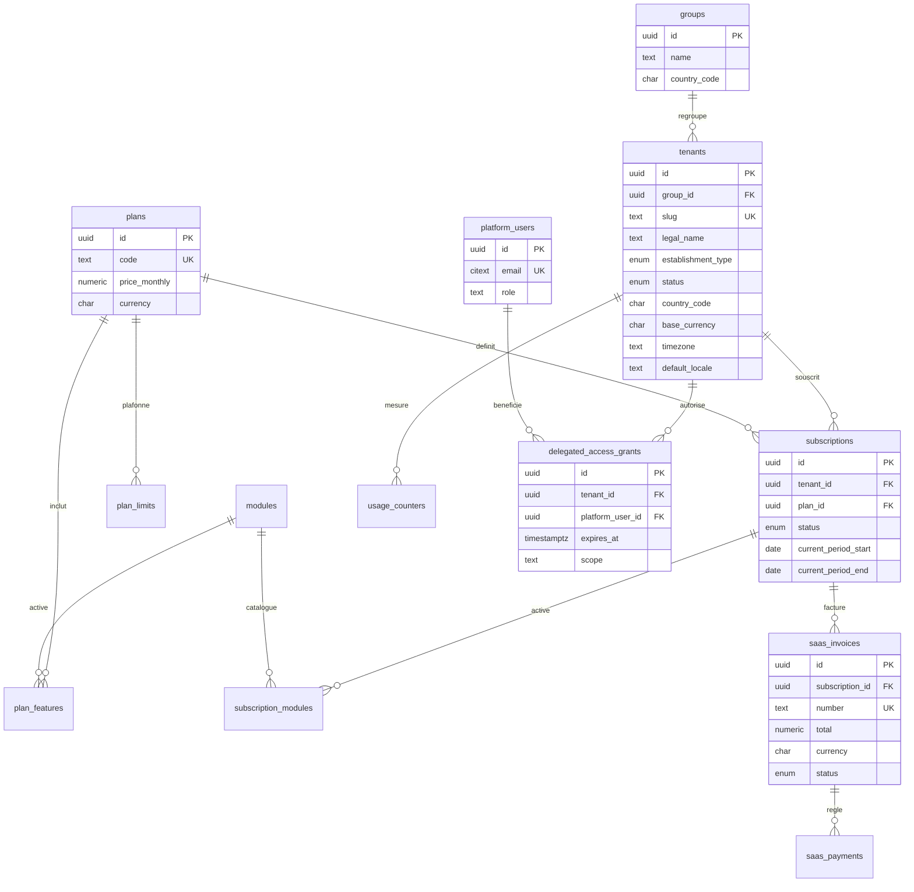

| Table | Colonnes clés et contraintes |
|---|---|
| `platform_users` | `id`, `email citext UK`, `password_hash` (Argon2id), `full_name`, `role` (`super_admin`/`support`/`billing`/`ops`), `mfa_secret_enc bytea` (MFA **obligatoire**), `status`, `last_login_at`, `created_at`, `updated_at`, `deleted_at`. Authentification séparée de celle des utilisateurs tenant. |
| `groups` | `id`, `name`, `country_code char(2)`, `billing_tenant_id` (tenant payeur optionnel), `created_at`, `deleted_at`. |
| `tenants` | `id`, `group_id FK NULL`, `slug text UK` (sous-domaine), `legal_name`, `trade_name`, `establishment_type`, `status`, `country_code char(2)`, `base_currency char(3)`, `enabled_currencies char(3)[]`, `timezone`, `default_locale`, `tax_id` (NIF/RCCM), `accounting_framework` (défaut `syscohada`), `data_residency`, `is_group_tenant bool` (groupe souscrivant comme tenant), `provisioned_at`, `suspended_at`, `deleted_at`. Index `(group_id)`, `(status)`. |
| `plans` | `id`, `code UK`, `name`, `price_monthly/price_yearly numeric(18,2)`, `currency`, `trial_days`, `is_public`, `sort_order`, `deleted_at`. Tarifs multi-devise : `plan_prices(plan_id, currency, period, amount)` (UK `(plan_id,currency,period)`). |
| `modules` | catalogue : `code UK` (`patients`, `appointments`, `emr`, `lab`, `pharmacy`, `billing`, `insurance`, `hr`, `accounting`, `notifications`…), `name`, `is_core`. |
| `plan_features` | `(plan_id, feature_key) PK`, `module_code FK`, `enabled bool`, `config jsonb`. |
| `plan_limits` | `(plan_id, limit_key) PK`, `value bigint NULL` (NULL = illimité), `period` (`none`/`month`), `overage_policy` (`block`/`bill`/`warn`). Clés : `max_users`, `max_sites`, `max_patients`, `max_storage_mb`, `sms_per_month`, `api_calls_per_day`. |
| `subscriptions` | `id`, `tenant_id FK`, `plan_id FK`, `status`, `billing_period`, `currency`, `current_period_start/end date`, `trial_ends_at`, `cancel_at`, `license_key_hash`, `license_expires_at`, `seats_override`. `EXCLUDE USING gist (tenant_id WITH =, daterange(starts_on, ends_on) WITH &&) WHERE (status IN ('trialing','active','past_due'))` : un seul abonnement actif par tenant. |
| `subscription_modules` | `(subscription_id, module_code) PK`, `enabled_at`, `disabled_at`, `unit_price`, `currency` (add-ons facturables). |
| `saas_invoices` | `id`, `subscription_id`, `tenant_id`, `number UK` (séquence plateforme), `issued_at`, `due_at`, `subtotal/tax_total/total numeric(18,2)`, `currency`, `status`, `lines jsonb` (ou `saas_invoice_lines`), `pdf_object_key`. |
| `saas_payments` | `id`, `saas_invoice_id`, `tenant_id`, `amount numeric(18,2)`, `currency`, `method` (`mobile_money`/`bank_transfer`/`card`/`cash`), `provider` (`cinetpay`/`paydunya`/`flutterwave`), `provider_reference` (UK avec `provider`), `status`, `paid_at`, `raw_payload jsonb`. Idempotence par `UNIQUE (provider, provider_reference)`. |
| `usage_counters` | `(tenant_id, counter_key, period_start) PK`, `value bigint`, `updated_at`. Incrémenté via `platform.increment_usage()` (§4.6). Compare aux `plan_limits`. |
| `delegated_access_grants` | `id`, `tenant_id`, `platform_user_id`, `reason text NOT NULL`, `ticket_ref`, `access_level` (`read_only`/`read_write`), `granted_by` (approbateur ≠ bénéficiaire, contrainte `CHECK`), `starts_at`, `expires_at` (`CHECK expires_at <= starts_at + interval '24 hours'` par défaut paramétrable), `revoked_at`, `approved_by_tenant_user_id` (validation optionnelle côté client). |
| `platform_settings` | `key PK`, `value jsonb`, `updated_by`. |
| `currencies` | `code char(3) PK`, `name`, `minor_unit smallint`, `symbol`. |
| `platform_audit_logs` | audit des actions plateforme (même structure que §3.4, sans partition tenant). |
| `role_templates`, `role_template_permissions` | modèles de rôles système copiés dans chaque tenant au provisioning. |

### 3.2 Organisation (`tenant`)

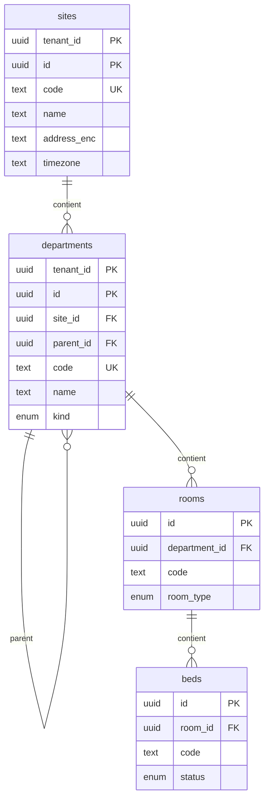

| Table | Colonnes clés |
|---|---|
| `sites` | [CS] `code`, `name`, `address_line`, `city`, `country_code`, `phone_enc`, `is_main bool`, `timezone`, `latitude/longitude numeric(9,6)`. `UK (tenant_id, code) WHERE deleted_at IS NULL`. |
| `departments` | [CS] `site_id`, `parent_id` (hiérarchie service/unité), `code`, `name`, `kind` (`clinical`/`medico_technical`/`administrative`/`logistics`), `cost_center_code`. |
| `rooms` | [CS] `department_id`, `code`, `name`, `room_type` (`consultation`/`ward`/`operating`/`icu`/`lab`/`imaging`/`other`), `floor`. |
| `beds` | [CS] `room_id`, `code`, `status` (`available`/`occupied`/`cleaning`/`out_of_service`), `current_admission_id` (FK nullable). `UK (tenant_id, room_id, code)`. |

### 3.3 Identité & RBAC (`tenant` + catalogue global)

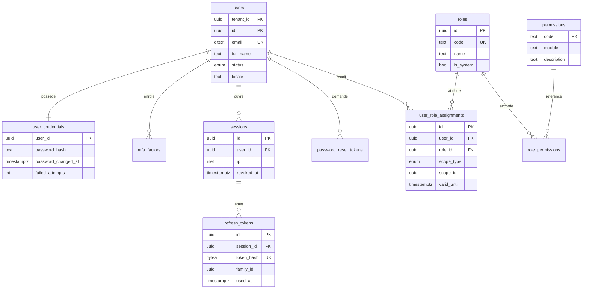

| Table | Colonnes clés et contraintes |
|---|---|
| `users` | [CS] `email citext`, `email_verified_at`, `phone_enc`/`phone_bidx`, `full_name`, `status` (`invited`/`active`/`locked`/`disabled`), `locale`, `practitioner_id` (lien optionnel), `last_login_at`. `UK (tenant_id, email) WHERE deleted_at IS NULL`. L'e-mail est **unique par tenant** (un même humain peut avoir un compte dans deux établissements). |
| `user_credentials` | [C] `user_id UK`, `password_hash` (Argon2id, paramètres encodés), `password_changed_at`, `failed_attempts`, `locked_until`, `must_change_password`. Table séparée pour restreindre les GRANT/colonnes et éviter la fuite via `SELECT *`. |
| `mfa_factors` | [C] `user_id`, `type` (`totp`/`sms`/`recovery_codes`), `secret_enc bytea`, `confirmed_at`, `last_used_at`, `label`. |
| `sessions` | [C] `user_id`, `device_label`, `user_agent`, `ip inet`, `mfa_verified_at`, `expires_at`, `revoked_at`, `revoked_reason`, `last_seen_at`, `delegated_grant_id` (si session break-glass). |
| `refresh_tokens` | [C] `session_id`, `token_hash bytea UK` (SHA-256 du jeton opaque, jamais le jeton), `family_id uuid` (détection de rejeu : réutilisation d'un jeton déjà `used_at` ⇒ révocation de la famille), `issued_at`, `expires_at`, `used_at`, `replaced_by_id`. |
| `password_reset_tokens` | [C] `user_id`, `token_hash bytea UK`, `expires_at` (≤ 30 min), `consumed_at`, `requested_ip`. |
| `roles` | [CS] `code`, `name`, `description`, `is_system bool`, `template_code` (origine). `UK (tenant_id, code) WHERE deleted_at IS NULL`. |
| `permissions` (`platform`) | catalogue global : `code PK` (`patient.read`, `invoice.create`, `lab.result.validate`…), `module_code FK`, `description`, `is_sensitive bool`. Synchronisé depuis `packages/shared` à chaque déploiement. |
| `role_permissions` | `(tenant_id, role_id, permission_code) PK`, `permission_code → platform.permissions(code)`, `effect` (`allow` uniquement en MVP ; `deny` réservé). |
| `user_role_assignments` | [C] `user_id`, `role_id`, `scope_type` (`group`/`tenant`/`site`/`department`), `scope_id uuid NULL`, `valid_from`, `valid_until`, `revoked_at`. `CHECK ((scope_type='tenant' AND scope_id IS NULL) OR (scope_type<>'tenant' AND scope_id IS NOT NULL))`. Intégrité de `scope_id` (polymorphe) : trigger de validation selon `scope_type` (`site`→`sites`, `department`→`departments`, `group`→`platform.groups` et groupe = celui du tenant). `UK (tenant_id, user_id, role_id, scope_type, scope_id)` avec `NULLS NOT DISTINCT` (PG 15+). |

Remarque portée « groupe » : une assignation de portée `group` est stockée dans le tenant où l'utilisateur est rattaché et ne donne **pas** d'accès SQL direct aux autres tenants du groupe (RLS strict). Le reporting groupe passe par le changement de contexte explicite tenant par tenant (autorisé par l'application) ou par des agrégats pré-calculés dans `platform`.

### 3.4 Audit (`tenant`, partitionné)

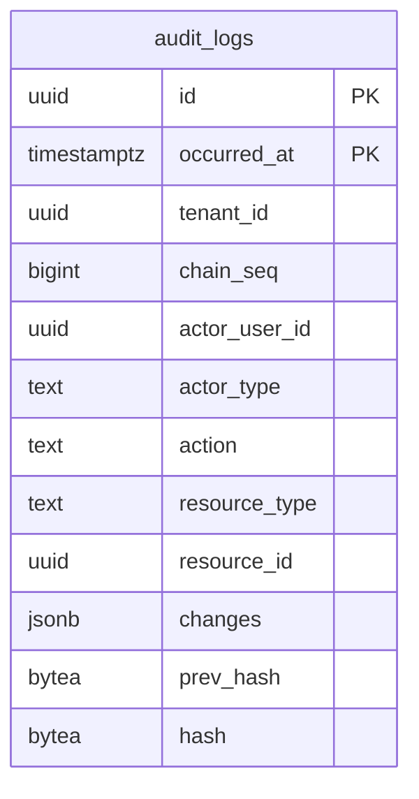

```sql
CREATE TABLE tenant.audit_logs (
  id              uuid        NOT NULL,
  tenant_id       uuid        NOT NULL,
  occurred_at     timestamptz NOT NULL DEFAULT now(),
  chain_seq       bigint      NOT NULL,           -- séquence par tenant, sans trou
  actor_type      text        NOT NULL CHECK (actor_type IN ('user','platform_user','patient','system')),
  actor_user_id   uuid,
  delegated_grant_id uuid,                        -- accès break-glass
  session_id      uuid,
  ip              inet,
  user_agent      text,
  action          text        NOT NULL,           -- 'patient.read', 'invoice.void', 'auth.login.failed'
  resource_type   text,
  resource_id     uuid,
  patient_id      uuid,                           -- accès aux dossiers (traçabilité légale)
  outcome         text        NOT NULL DEFAULT 'success',
  changes         jsonb,                          -- diff {champ: [avant, après]} SANS valeurs chiffrées en clair
  request_id      text,
  prev_hash       bytea       NOT NULL,
  hash            bytea       NOT NULL,           -- SHA-256(prev_hash ‖ canonical(row))
  PRIMARY KEY (id, occurred_at),
  UNIQUE (tenant_id, chain_seq, occurred_at)
) PARTITION BY RANGE (occurred_at);
```

- **Append-only** : `REVOKE UPDATE, DELETE, TRUNCATE ON tenant.audit_logs FROM ghmt_app` + trigger de secours `BEFORE UPDATE OR DELETE` qui lève une exception.
- **Chaîne de hachage par tenant** : `hash = sha256(prev_hash || tenant_id || chain_seq || occurred_at || actor || action || resource || changes)`. L'insertion se fait via une fonction `tenant.append_audit_log(...)` qui incrémente `chain_seq` dans `sequence_counters` (verrou de ligne, §6) puis lit le dernier hash : sérialisation **par tenant uniquement**. Pour les actions très fréquentes (lectures de dossier), l'écriture est bufferisée (outbox → worker unique par tenant) afin de ne pas allonger les transactions métier.
- **Vérification** : job nocturne recalculant la chaîne par fenêtre ; **ancrage** quotidien du dernier hash (`audit_anchors(tenant_id, day, chain_seq, hash)`) dans un stockage objet WORM / signé hors base.
- **Partitions mensuelles** (`audit_logs_2026_10`…) créées d'avance par `pg_partman` (ou job maison) : 3 mois futurs.
- Index : `(tenant_id, occurred_at DESC)`, `(tenant_id, resource_type, resource_id, occurred_at DESC)`, `(tenant_id, actor_user_id, occurred_at DESC)`, `(tenant_id, patient_id, occurred_at DESC) WHERE patient_id IS NOT NULL`.

### 3.5 Patients

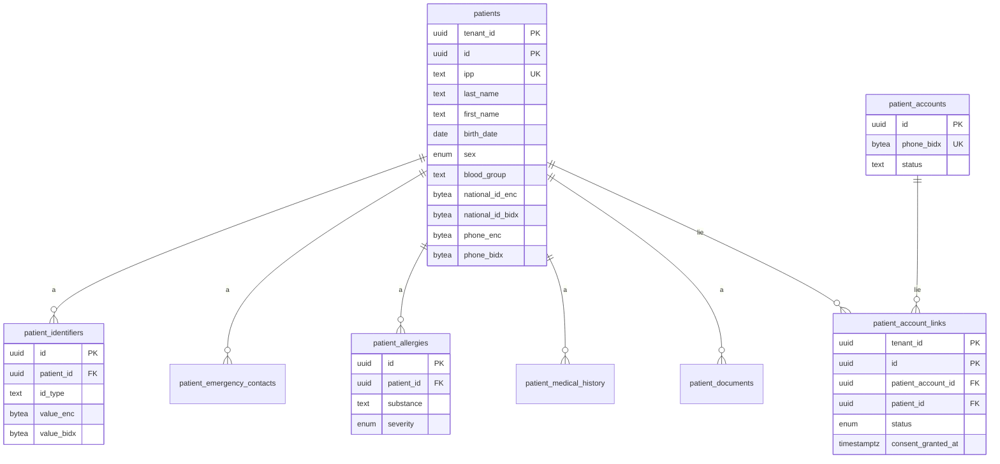

| Table | Colonnes clés et contraintes |
|---|---|
| `patients` | [CS] `ipp text NOT NULL` (identifiant patient permanent du tenant, §6), `medical_record_number` (n° de dossier, optionnel, par site), `last_name`, `first_name`, `maiden_name`, `search_name` (normalisé sans accents, trigram), `birth_date date`, `birth_date_estimated bool` (fréquent en contexte africain), `sex`, `blood_group` (`A+…O-`, `unknown`), `nationality`, `marital_status`, `profession`, `national_id_enc/bidx`, `phone_enc/phone_bidx`, `email_enc/email_bidx`, `address_enc`, `city`, `preferred_language`, `photo_object_key`, `primary_site_id`, `deceased_at`, `merged_into_patient_id` (fusion de doublons), `key_version`. `UK (tenant_id, ipp)` (non partiel : l'IPP n'est jamais réattribué), `UK (tenant_id, medical_record_number) WHERE NOT NULL`. Index `(tenant_id, birth_date)`, GIN trigram `(tenant_id, search_name)` via `btree_gin`, `(tenant_id, phone_bidx)`, `(tenant_id, national_id_bidx)`. |
| `patient_identifiers` | [CS] identifiants externes : `id_type` (`cni`/`passport`/`insurance_number`/`birth_certificate`/`legacy_mrn`/`other`), `value_enc`, `value_bidx`, `issuer`, `valid_until`. `UK (tenant_id, id_type, value_bidx) WHERE deleted_at IS NULL`. |
| `patient_emergency_contacts` | [CS] `patient_id`, `full_name`, `relationship`, `phone_enc`, `is_legal_guardian bool`, `priority smallint`. |
| `patient_allergies` | [CS] `patient_id`, `substance`, `substance_code` (ATC/RxNorm optionnel), `category` (`drug`/`food`/`environment`/`other`), `reaction`, `severity` (`mild`/`moderate`/`severe`/`life_threatening`), `status` (`active`/`inactive`/`entered_in_error`), `recorded_by`. |
| `patient_medical_history` | [CS] antécédents : `patient_id`, `kind` (`medical`/`surgical`/`family`/`obstetric`/`social`/`vaccination`), `description_enc`, `icd10_code`, `onset_date`, `status`. |
| `patient_documents` | [CS] `patient_id`, `encounter_id` (nullable), `doc_type`, `title`, `object_key` (S3), `mime_type`, `size_bytes`, `sha256 bytea`, `is_confidential bool`, `uploaded_by`. Stockage objet : le préfixe commence par `tenant_id/`. |
| `patient_accounts` (**`platform`**) | compte patient **global** (app mobile) : `id`, `phone_enc/phone_bidx UK`, `email_enc/email_bidx`, `password_hash` ou OTP, `status`, `preferred_language`, `last_login_at`. Aucun `tenant_id` : c'est un sujet de droit transverse. Ne contient **aucune donnée clinique**. |
| `patient_account_links` (`tenant`) | [C] `patient_account_id → platform.patient_accounts(id)`, `patient_id`, `status` (`pending`/`active`/`revoked`), `verification_method` (`otp_sms`/`in_person`/`code_at_desk`), `consent_granted_at`, `consent_scopes text[]` (`appointments`,`invoices`,`lab_results`,`prescriptions`), `consent_version`, `revoked_at`. `UK (tenant_id, patient_account_id, patient_id)`, `UK (tenant_id, patient_id) WHERE status='active'` (un seul compte actif par fiche). |

Le consentement est **par tenant et par périmètre** : un compte patient lié à 3 établissements possède 3 liens indépendants, révocables séparément. Chaque lecture via le lien est auditée (`actor_type='patient'`).

### 3.6 Rendez-vous

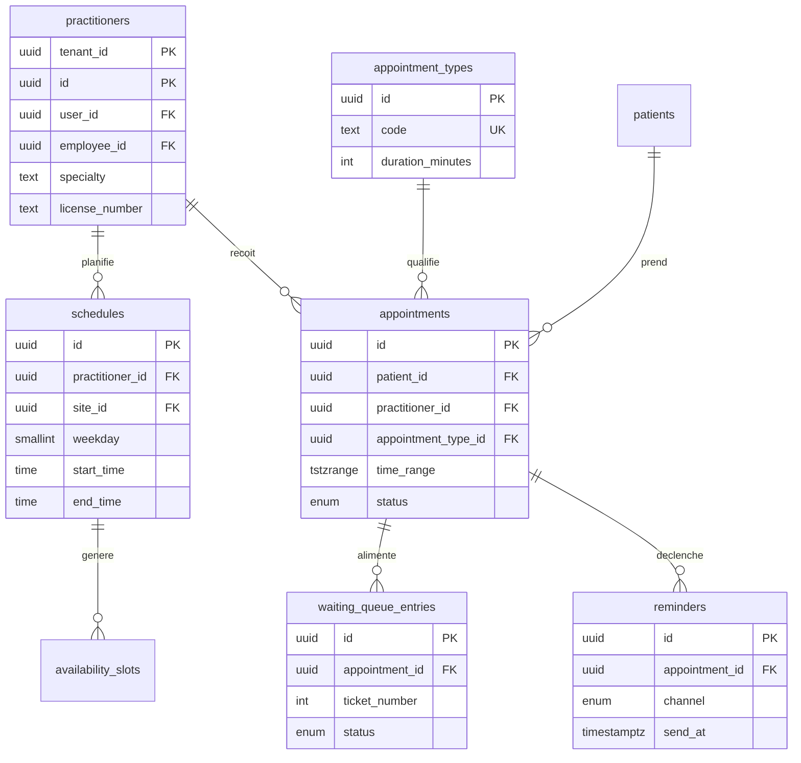

| Table | Colonnes clés et contraintes |
|---|---|
| `practitioners` | [CS] `user_id` (nullable), `employee_id` (nullable), `full_name`, `specialty`, `department_id`, `primary_site_id`, `license_number` (n° ordre), `default_consult_minutes`, `is_bookable bool`. |
| `schedules` | [CS] modèle hebdomadaire : `practitioner_id`, `site_id`, `room_id`, `weekday smallint CHECK 1..7`, `start_time/end_time time`, `slot_minutes`, `valid_from/valid_to date`. |
| `availability_exceptions` | [C] absences/jours fériés/ouvertures exceptionnelles : `practitioner_id`, `date_range daterange`, `kind` (`absence`/`extra_opening`), `reason`. |
| `availability_slots` | créneaux matérialisés (optionnel, généré sur 60 jours) : `practitioner_id`, `time_range tstzrange`, `capacity`, `booked_count`. |
| `appointment_types` | [CS] `code`, `name`, `duration_minutes`, `default_price_item_id`, `requires_prepayment bool`, `online_bookable bool`. |
| `appointments` | [CS] `patient_id`, `practitioner_id`, `appointment_type_id`, `site_id`, `department_id`, `room_id`, `time_range tstzrange NOT NULL`, `status`, `source` (`front_desk`/`phone`/`patient_app`/`web`), `reason text`, `cancel_reason`, `checked_in_at`, `encounter_id` (nullable), `is_walk_in bool`. **Anti double-réservation** : `EXCLUDE USING gist (tenant_id WITH =, practitioner_id WITH =, time_range WITH &&) WHERE (status NOT IN ('cancelled','no_show') AND deleted_at IS NULL)` (extension `btree_gist`). Index `(tenant_id, patient_id, lower(time_range) DESC)`, `(tenant_id, practitioner_id, time_range)` (GiST). |
| `waiting_queue_entries` | [C] file d'attente du jour : `site_id`, `department_id`, `appointment_id` (nullable pour sans-rendez-vous), `patient_id`, `ticket_number int` (compteur par jour/service, §6), `priority smallint` (urgence), `status` (`waiting`/`called`/`in_service`/`done`/`left`), `arrived_at`, `called_at`. |
| `reminders` | [C] `appointment_id`, `channel`, `send_at`, `status` (`scheduled`/`sent`/`failed`/`cancelled`), `notification_id`. Planifiés à la création du RDV (ex. J-1 SMS). `UK (tenant_id, appointment_id, channel, send_at)`. |

### 3.7 Médical / DME

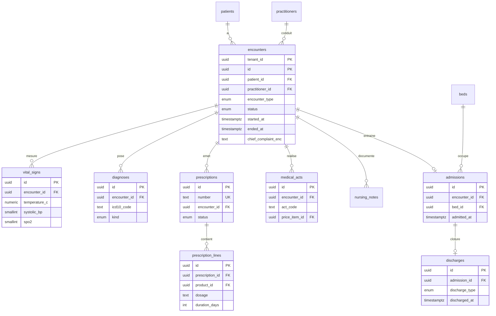

| Table | Colonnes clés et contraintes |
|---|---|
| `encounters` | [CS] `patient_id`, `practitioner_id`, `site_id`, `department_id`, `appointment_id`, `encounter_type`, `status` (`planned`/`in_progress`/`finished`/`cancelled`), `started_at`, `ended_at`, `chief_complaint_enc`, `clinical_notes_enc` (observations, HDM, examen), `plan_enc`, `key_version`, `signed_at`, `signed_by` (verrouillage après signature : amendements = nouvelles lignes `encounter_amendments`). Index `(tenant_id, patient_id, started_at DESC)`. |
| `vital_signs` | [C] `encounter_id`, `patient_id` (dénormalisé pour courbes), `measured_at`, `temperature_c numeric(4,1)`, `systolic_bp/diastolic_bp smallint`, `heart_rate`, `respiratory_rate`, `spo2`, `weight_kg numeric(5,2)`, `height_cm numeric(5,1)`, `bmi` (colonne générée), `glycemia_mmol numeric(5,2)`, `pain_score smallint CHECK 0..10`, `recorded_by`. `CHECK` de plages physiologiques larges (anti-saisie aberrante). |
| `diagnoses` | [CS] `encounter_id`, `patient_id`, `icd10_code text` (réf. `platform.icd10_codes` ou table de référence globale), `label`, `kind` (`principal`/`secondary`/`differential`/`complication`), `certainty` (`suspected`/`confirmed`), `onset_date`. |
| `prescriptions` | [CS] `number` (séquence, §6), `encounter_id`, `patient_id`, `prescriber_id`, `status` (`draft`/`signed`/`partially_dispensed`/`dispensed`/`cancelled`/`expired`), `signed_at`, `valid_until date`, `notes_enc`. `UK (tenant_id, number)`. |
| `prescription_lines` | [C] `prescription_id`, `product_id` (nullable si libellé libre) ou `dci text`, `dosage`, `route`, `frequency`, `duration_days`, `quantity numeric(18,3)`, `instructions`, `substitution_allowed bool`. |
| `medical_acts` | [CS] `encounter_id`, `patient_id`, `act_code` (nomenclature locale/CCAM adaptée), `label`, `performed_by`, `performed_at`, `quantity`, `price_item_id` (→ tarification, déclenche une ligne de facture), `report_enc`. |
| `nursing_notes` | [C] `encounter_id`, `patient_id`, `author_id`, `noted_at`, `category` (`observation`/`care`/`medication_admin`/`handover`), `note_enc bytea`. Append-only fonctionnel (correction par addendum). |
| `admissions` | [CS] `encounter_id`, `patient_id`, `admitted_at`, `admitting_department_id`, `bed_id`, `admission_mode` (`emergency`/`scheduled`/`transfer`), `expected_discharge_at`, `status` (`active`/`transferred`/`discharged`). `UNIQUE (tenant_id, bed_id) WHERE status='active'` (un lit = un patient). |
| `bed_assignments` | [C] historique des changements de lit : `admission_id`, `bed_id`, `from_at`, `to_at`. EXCLUDE sur `tstzrange` par lit. |
| `discharges` | [C] `admission_id UK`, `discharged_at`, `discharge_type` (`recovered`/`improved`/`transferred`/`against_advice`/`deceased`), `summary_enc`, `follow_up_instructions_enc`, `document_id`. |

### 3.8 Laboratoire

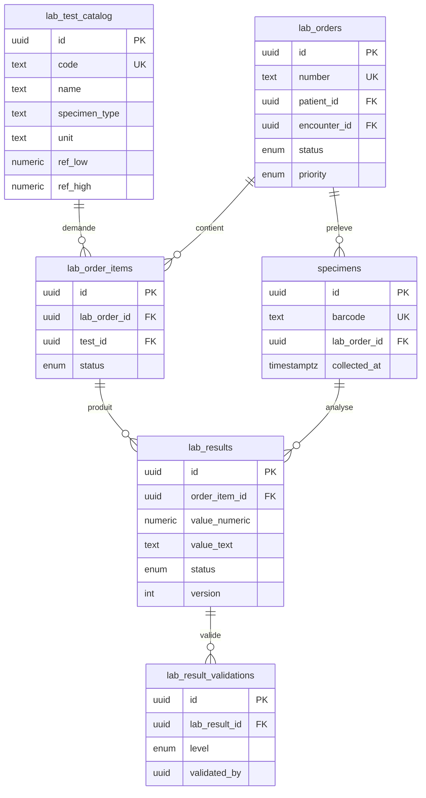

| Table | Colonnes clés |
|---|---|
| `lab_test_catalog` | [CS] `code`, `name`, `category`, `specimen_type`, `method`, `unit`, `result_type` (`numeric`/`text`/`coded`), `turnaround_hours`, `price_item_id`, `parent_test_id` (panels/bilans), `is_active`. |
| `lab_reference_ranges` | [C] `test_id`, `sex`, `age_min_days/age_max_days`, `low/high numeric`, `critical_low/critical_high`. |
| `lab_orders` | [CS] `number` (§6), `patient_id`, `encounter_id`, `ordering_practitioner_id`, `ordered_at`, `priority` (`routine`/`urgent`/`stat`), `status` (`ordered`/`collected`/`in_progress`/`completed`/`cancelled`), `clinical_info_enc`, `external_lab_id` (sous-traitance). |
| `lab_order_items` | [C] `lab_order_id`, `test_id`, `status`, `invoice_line_id` (lien facturation). |
| `specimens` | [C] `lab_order_id`, `barcode text` (`UK (tenant_id, barcode)`), `specimen_type`, `collected_at`, `collected_by`, `received_at`, `condition` (`ok`/`hemolyzed`/`insufficient`/`rejected`), `storage_location`. |
| `lab_results` | [C] `order_item_id`, `specimen_id`, `value_numeric numeric(18,6)`, `value_text`, `unit`, `flag` (`normal`/`low`/`high`/`critical`), `status` (`preliminary`/`final`/`corrected`/`cancelled`), `version int`, `supersedes_result_id` (correction = nouvelle ligne), `analyzer_id`, `resulted_at`. `UK (tenant_id, order_item_id, version)`. Les résultats **finaux ne sont pas modifiables**. |
| `lab_result_validations` | [C] `lab_result_id`, `level` (`technical`/`biological`), `validated_by`, `validated_at`, `comment`. Un résultat n'est publié (visible médecin/patient) qu'après validation biologique ; `CHECK` : validateur biologiste ≠ saisisseur selon paramètre tenant. |

### 3.9 Pharmacie & stocks

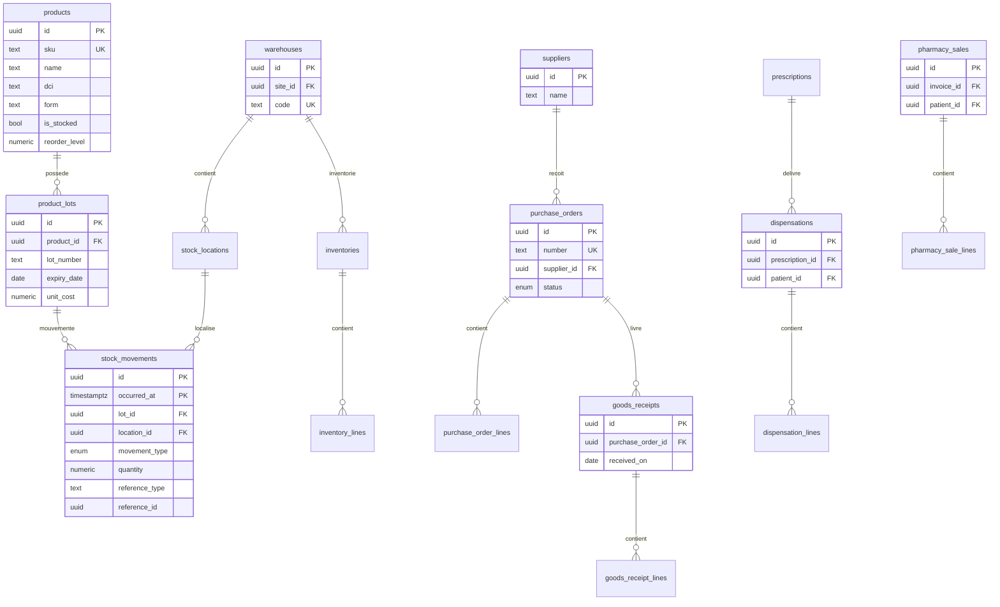

| Table | Colonnes clés et contraintes |
|---|---|
| `products` | [CS] `sku`, `barcode`, `name`, `dci` (dénomination commune), `atc_code`, `form`, `strength`, `unit` (`box`/`tablet`/`ml`…), `category` (`drug`/`consumable`/`reagent`/`device`), `is_essential_list bool`, `is_controlled bool` (stupéfiants), `is_stocked bool`, `requires_prescription bool`, `reorder_level/max_level numeric(18,3)`, `tax_rate numeric(7,4)`, `default_price_item_id`. `UK (tenant_id, sku) WHERE deleted_at IS NULL`. |
| `product_lots` | [CS] `product_id`, `lot_number`, `manufacture_date`, `expiry_date date NOT NULL`, `supplier_id`, `unit_cost numeric(18,4)`, `currency`, `status` (`available`/`quarantine`/`expired`/`recalled`). `UK (tenant_id, product_id, lot_number, expiry_date)`. Index `(tenant_id, expiry_date) WHERE status='available'` (alertes péremption, FEFO). |
| `warehouses` | [CS] `site_id`, `code`, `name`, `kind` (`central_pharmacy`/`ward_stock`/`lab_store`/`dispensary`), `department_id`. |
| `stock_locations` | [CS] `warehouse_id`, `code`, `description`, `is_default`. |
| `stock_movements` | [C sans `updated_*`, `deleted_*`] **journal immuable**, partitionné par mois sur `occurred_at`. PK `(id, occurred_at)`. `lot_id`, `product_id` (dénormalisé), `location_id`, `movement_type`, `quantity numeric(18,3) NOT NULL CHECK (quantity <> 0)` (signé : + entrée, − sortie), `unit_cost`, `currency`, `reference_type` + `reference_id` (réception, dispensation, vente, inventaire, transfert), `transfer_group_id` (appariement entrée/sortie), `reason`, `reversal_of_id` (correction = contre-passation). Trigger `BEFORE UPDATE OR DELETE` ⇒ exception ; `REVOKE UPDATE, DELETE`. |
| `stock_balances` | [C] solde courant (lot × emplacement) : `(tenant_id, lot_id, location_id) PK`, `quantity numeric(18,3) CHECK (quantity >= 0)`, `updated_at`. Mis à jour **dans la même transaction** que l'insertion du mouvement (`UPDATE ... SET quantity = quantity + $delta`, verrou de ligne → pas de stock négatif concurrent). Reconstructible depuis le journal (job de réconciliation). |
| `suppliers` | [CS] `name`, `tax_id`, `contact_enc`, `payment_terms_days`, `currency`, `account_id` (compte fournisseur 401). |
| `purchase_orders` / `purchase_order_lines` | `number`, `supplier_id`, `warehouse_id`, `status` (`draft`/`sent`/`partially_received`/`received`/`cancelled`), `expected_on`, `currency`, `total numeric(18,2)` ; lignes : `product_id`, `quantity_ordered`, `unit_price`, `tax_rate`. |
| `goods_receipts` / `goods_receipt_lines` | `number`, `purchase_order_id` (nullable), `supplier_id`, `received_on`, `delivery_note_ref`, `status` (`draft`/`posted`) ; lignes : `product_id`, `lot_number`, `expiry_date`, `quantity`, `unit_cost`. La validation (`posted`) crée lots + `stock_movements (receipt)` + écriture comptable (§3.11) via l'outbox. |
| `inventories` / `inventory_lines` | `number`, `warehouse_id`, `status` (`open`/`counting`/`closed`), `counted_at` ; lignes : `lot_id`, `location_id`, `expected_qty`, `counted_qty`, `variance` (générée). La clôture génère des mouvements `inventory_correction`. |
| `dispensations` / `dispensation_lines` | `number`, `prescription_id` (nullable : délivrance directe), `patient_id`, `dispensed_by`, `dispensed_at`, `warehouse_id`, `invoice_id` ; lignes : `prescription_line_id`, `product_id`, `lot_id`, `quantity`, `substituted bool`. Un `stock_movement (dispensation)` par ligne. |
| `pharmacy_sales` / `pharmacy_sale_lines` | vente comptoir (patient anonyme possible) : `number`, `patient_id NULL`, `cashier_id`, `cash_session_id`, `invoice_id`, `total`, `currency` ; lignes : `product_id`, `lot_id`, `quantity`, `unit_price`, `discount`. |

### 3.10 Facturation & assurance

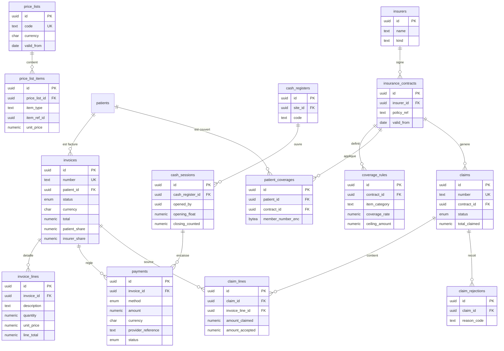

| Table | Colonnes clés et contraintes |
|---|---|
| `price_lists` | [CS] `code`, `name`, `currency`, `valid_from/valid_to`, `audience` (`standard`/`insured:<insurer>`/`staff`), `is_default`. |
| `price_list_items` | [CS] `price_list_id`, `item_type` (`act`/`consultation`/`lab_test`/`product`/`bed_day`/`other`), `item_ref_id`, `code`, `label`, `unit_price numeric(18,2)`, `tax_rate`. `UK (tenant_id, price_list_id, item_type, item_ref_id)`. |
| `invoices` | [CS] `number` (attribué à l'émission, §6, **sans trou**), `status`, `patient_id` (NULL pour vente anonyme), `encounter_id`, `site_id`, `currency`, `exchange_rate numeric(18,8)`, `subtotal`, `discount_total`, `tax_total`, `total`, `patient_share`, `insurer_share`, `amount_paid`, `balance` (colonne générée `total - amount_paid`), `total_base` (devise de base), `issued_at`, `due_at`, `voided_at`, `void_reason`. `CHECK (total = subtotal - discount_total + tax_total)`, `CHECK (patient_share + insurer_share = total)`. Brouillon modifiable ; après émission : **immuable** (correction par avoir `credit_note`, type `kind`). `UK (tenant_id, number) WHERE number IS NOT NULL`. |
| `invoice_lines` | [C] `invoice_id`, `line_no`, `item_type`, `item_ref_id`, `description`, `quantity numeric(18,3)`, `unit_price`, `discount`, `tax_rate`, `line_total`, `insurer_amount`, `patient_amount`, `revenue_account_id` (comptabilité), `performed_by`. |
| `payments` | [C, immuable] `number`, `invoice_id`, `patient_id`, `method` (enum), `amount numeric(18,2) CHECK > 0`, `currency`, `exchange_rate`, `amount_base`, `status` (`pending`/`succeeded`/`failed`/`refunded`), `paid_at`, `cash_session_id` (espèces), `received_by`, **Mobile Money** : `mm_provider`, `mm_msisdn_enc/mm_msisdn_bidx`, `aggregator` (`cinetpay`/`paydunya`/`flutterwave`), `provider_reference`, `provider_status`, `raw_payload jsonb`, `refund_of_payment_id`. `UK (tenant_id, aggregator, provider_reference)` (idempotence des webhooks). Un remboursement = nouvelle ligne négative via `refund_of_payment_id`. |
| `cash_registers` | [CS] `site_id`, `code`, `name`, `currency`, `account_id`. |
| `cash_sessions` | [C] `cash_register_id`, `opened_by`, `opened_at`, `opening_float`, `closed_by`, `closed_at`, `expected_total` (calculé), `closing_counted`, `variance`, `status`. `UNIQUE (tenant_id, cash_register_id) WHERE closed_at IS NULL` (une session ouverte par caisse). |
| `insurers` | [CS] `name`, `kind` (`private`/`mutuelle`/`public_scheme`/`employer`/`ngo`), `country_code`, `payer_code`, `contact_enc`, `payment_terms_days`, `account_id`. |
| `insurance_contracts` | [CS] `insurer_id`, `policy_ref`, `name`, `valid_from/valid_to`, `currency`, `price_list_id`, `requires_prior_authorization bool`, `global_ceiling`. |
| `coverage_rules` | [CS] `contract_id`, `item_category`, `coverage_rate numeric(5,2) CHECK 0..100`, `ceiling_amount`, `ceiling_period`, `copay_amount`, `waiting_days`, `exclusion bool`. |
| `patient_coverages` | [CS] `patient_id`, `contract_id`, `member_number_enc/bidx`, `holder_relationship`, `valid_from/valid_to`, `is_primary`. |
| `claims` | [CS] `number`, `contract_id`, `insurer_id`, `period_start/period_end`, `status`, `currency`, `total_claimed`, `total_accepted`, `submitted_at`, `paid_at`, `payment_reference`. |
| `claim_lines` | [C] `claim_id`, `invoice_id`, `invoice_line_id`, `patient_id`, `amount_claimed`, `amount_accepted`, `status`. `UK (tenant_id, invoice_line_id)` (une ligne n'est facturée qu'une fois à un assureur actif). |
| `claim_rejections` | [C] `claim_id`, `claim_line_id` (nullable), `reason_code`, `reason_text`, `rejected_amount`, `received_at`, `resolution` (`resubmitted`/`written_off`/`appealed`). |

### 3.11 Ressources humaines

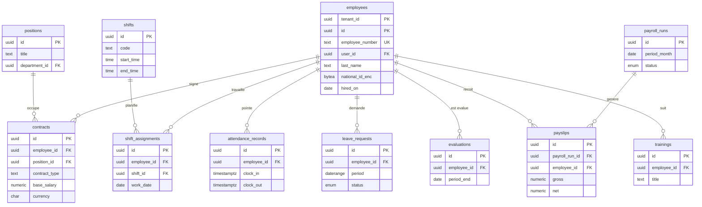

| Table | Colonnes clés |
|---|---|
| `employees` | [CS] `employee_number` (§6), `user_id` (nullable), `last_name`, `first_name`, `birth_date`, `sex`, `national_id_enc/bidx`, `phone_enc`, `address_enc`, `bank_account_enc`, `mobile_money_msisdn_enc` (paie mobile), `social_security_number_enc` (CNPS/IPRES/CNSS), `hired_on`, `terminated_on`, `status`, `primary_site_id`, `department_id`, `professional_license_no`. |
| `positions` | [CS] `title`, `department_id`, `grade`, `category` (`medical`/`nursing`/`technical`/`admin`/`support`). |
| `contracts` | [CS] `employee_id`, `position_id`, `contract_type` (`cdi`/`cdd`/`vacataire`/`stage`/`consultant`), `start_date/end_date`, `base_salary numeric(18,2)`, `currency`, `pay_frequency`, `working_hours_week`, `document_id`. `EXCLUDE` : pas de chevauchement de contrats actifs principaux par employé. |
| `shifts` | [CS] modèles de gardes : `code`, `name`, `start_time/end_time time`, `crosses_midnight bool`, `kind` (`day`/`night`/`on_call`). |
| `shift_assignments` | [C] planning : `employee_id`, `shift_id`, `department_id`, `work_date date`, `status` (`planned`/`swapped`/`absent`/`done`). `UK (tenant_id, employee_id, work_date, shift_id)`. |
| `attendance_records` | [C] `employee_id`, `clock_in/clock_out timestamptz`, `source` (`manual`/`badge`/`mobile`), `site_id`, `late_minutes`, `overtime_minutes`. |
| `leave_requests` | [CS] `employee_id`, `leave_type` (`annual`/`sick`/`maternity`/`unpaid`/`other`), `period daterange`, `days numeric(5,1)`, `status` (`pending`/`approved`/`rejected`/`cancelled`), `approved_by`. |
| `payroll_runs` | [C] `period_month date` (1er du mois), `site_id` (nullable), `status` (`draft`/`calculated`/`approved`/`paid`/`closed`), `currency`, `approved_by`, `journal_entry_id` (écriture de paie). `UK (tenant_id, period_month, site_id)` (NULLS NOT DISTINCT). |
| `payslips` | [C, immuable après approbation] `payroll_run_id`, `employee_id`, `gross numeric(18,2)`, `deductions`, `employer_charges`, `net numeric(18,2)`, `currency`, `lines jsonb` (ou `payslip_lines`), `pdf_object_key`, `paid_at`, `payment_method`. `UK (tenant_id, payroll_run_id, employee_id)`. Les barèmes sociaux/fiscaux par pays sont des **règles paramétrables** (table `payroll_rule_sets`), non codées en dur. |
| `evaluations` | [CS] `employee_id`, `evaluator_id`, `period_start/end`, `score`, `comments_enc`, `status`. |
| `trainings` | [CS] `employee_id`, `title`, `provider`, `started_on/ended_on`, `hours`, `certificate_document_id`, `expires_on` (habilitations). |

### 3.12 Comptabilité SYSCOHADA

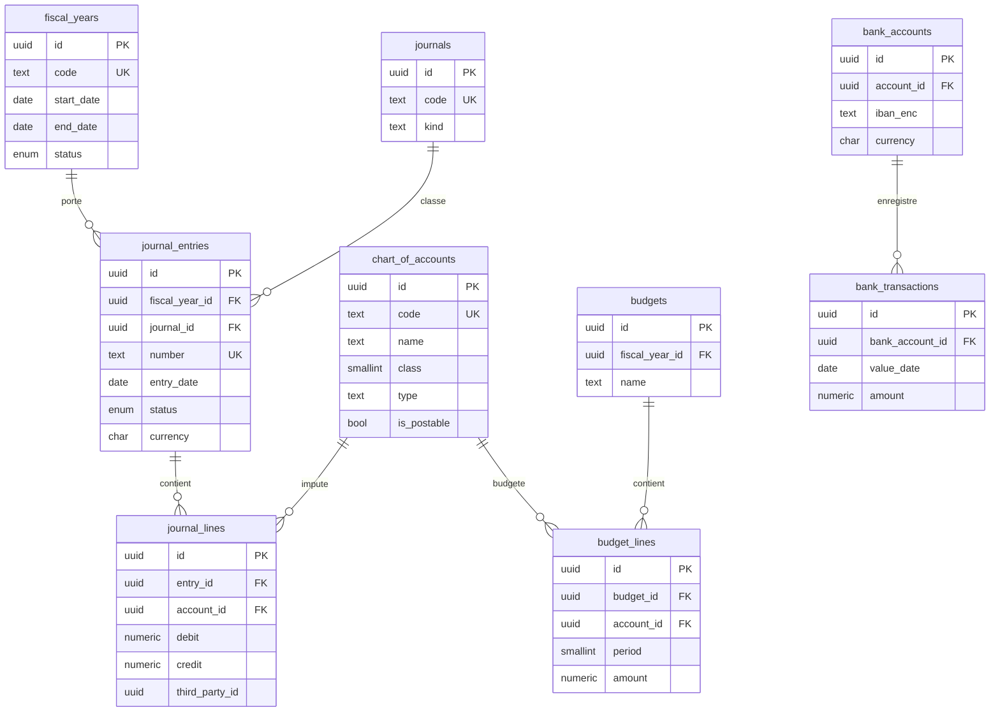

| Table | Colonnes clés et contraintes |
|---|---|
| `chart_of_accounts` | [CS] plan comptable SYSCOHADA révisé : `code text` (classes 1 à 9, ex. `411`, `521`, `701`), `name`, `class smallint CHECK 1..9`, `parent_id`, `type` (`asset`/`liability`/`equity`/`income`/`expense`/`off_balance`), `is_postable bool` (comptes de détail), `is_third_party bool` (collectifs 401/411), `requires_analytic bool`. `UK (tenant_id, code)`. Plan de référence fourni par `platform` à l'initialisation puis personnalisable (sous-comptes). |
| `fiscal_years` | [C] `code`, `start_date`, `end_date`, `status` (`open`/`closing`/`closed`), `closed_at`, `closed_by`. `EXCLUDE USING gist (tenant_id WITH =, daterange(start_date,end_date,'[]') WITH &&)`. Une écriture dans un exercice `closed` est refusée par trigger. |
| `journals` | [CS] `code` (`VE` ventes, `AC` achats, `BQ` banque, `CA` caisse, `OD` opérations diverses, `PA` paie, `AN` à-nouveaux), `name`, `kind`, `default_account_id`. |
| `journal_entries` | [C] `number` (par journal et exercice, §6), `fiscal_year_id`, `journal_id`, `entry_date`, `period smallint`, `description`, `currency`, `exchange_rate`, `status` (`draft`/`posted`/`reversed`), `source_type` + `source_id` (facture, paiement, paie, réception…), `reversal_of_id`, `posted_at`, `posted_by`. **Écriture `posted` immuable**, corrigée par contre-passation. `UK (tenant_id, journal_id, fiscal_year_id, number)`. |
| `journal_lines` | [C] `entry_id`, `line_no`, `account_id`, `debit numeric(18,2) NOT NULL DEFAULT 0`, `credit numeric(18,2) NOT NULL DEFAULT 0`, `currency`, `debit_base/credit_base` (devise de base), `third_party_type` + `third_party_id` (patient/assureur/fournisseur/employé), `analytic_department_id`, `analytic_site_id`, `label`, `reconciled_at`, `reconciliation_ref`. |
| `budgets` / `budget_lines` | `fiscal_year_id`, `name`, `version`, `status` ; lignes : `account_id`, `department_id`, `period smallint 1..12`, `amount numeric(18,2)`. |
| `bank_accounts` | [CS] `name`, `bank_name`, `iban_enc/account_number_enc`, `currency`, `account_id` (compte 52x), `kind` (`bank`/`mobile_money_wallet`/`petty_cash`). |
| `bank_transactions` | [C] relevé importé pour rapprochement : `bank_account_id`, `value_date`, `amount`, `label`, `external_ref`, `matched_line_id`. |

**Contraintes de partie double** (SQL exact) :

```sql
-- 1) Une ligne = soit débit, soit crédit, jamais négatif
ALTER TABLE tenant.journal_lines
  ADD CONSTRAINT journal_line_one_side CHECK (
    debit >= 0 AND credit >= 0 AND (debit = 0 OR credit = 0) AND (debit + credit) > 0);

-- 2) Équilibre débit = crédit par écriture, vérifié en fin de transaction
CREATE OR REPLACE FUNCTION tenant.check_entry_balanced() RETURNS trigger
LANGUAGE plpgsql AS $$
DECLARE v_entry uuid; v_tenant uuid; v_diff numeric; v_status text; v_cnt int;
BEGIN
  v_entry  := COALESCE(NEW.entry_id, OLD.entry_id);
  v_tenant := COALESCE(NEW.tenant_id, OLD.tenant_id);
  SELECT status::text INTO v_status FROM tenant.journal_entries
   WHERE tenant_id = v_tenant AND id = v_entry;
  IF v_status IS NULL THEN RETURN NULL; END IF;       -- entrée supprimée (brouillon)
  SELECT COALESCE(SUM(debit_base) - SUM(credit_base), 0), COUNT(*) INTO v_diff, v_cnt
    FROM tenant.journal_lines WHERE tenant_id = v_tenant AND entry_id = v_entry;
  IF v_status = 'posted' AND (v_diff <> 0 OR v_cnt < 2) THEN
    RAISE EXCEPTION 'Écriture % déséquilibrée (écart %) ou incomplète', v_entry, v_diff
      USING ERRCODE = '23514';
  END IF;
  RETURN NULL;
END $$;

CREATE CONSTRAINT TRIGGER trg_journal_lines_balanced
  AFTER INSERT OR UPDATE OR DELETE ON tenant.journal_lines
  DEFERRABLE INITIALLY DEFERRED
  FOR EACH ROW EXECUTE FUNCTION tenant.check_entry_balanced();

-- 3) Passage en 'posted' : même contrôle déclenché depuis journal_entries
CREATE CONSTRAINT TRIGGER trg_journal_entries_posted_balanced
  AFTER UPDATE OF status ON tenant.journal_entries
  DEFERRABLE INITIALLY DEFERRED
  FOR EACH ROW WHEN (NEW.status = 'posted')
  EXECUTE FUNCTION tenant.check_entry_balanced_from_entry();  -- variante lisant NEW.id
```

Des triggers `BEFORE UPDATE/DELETE` interdisent toute modification des lignes d'une écriture `posted` et des écritures d'un exercice `closed`.

### 3.13 Notifications

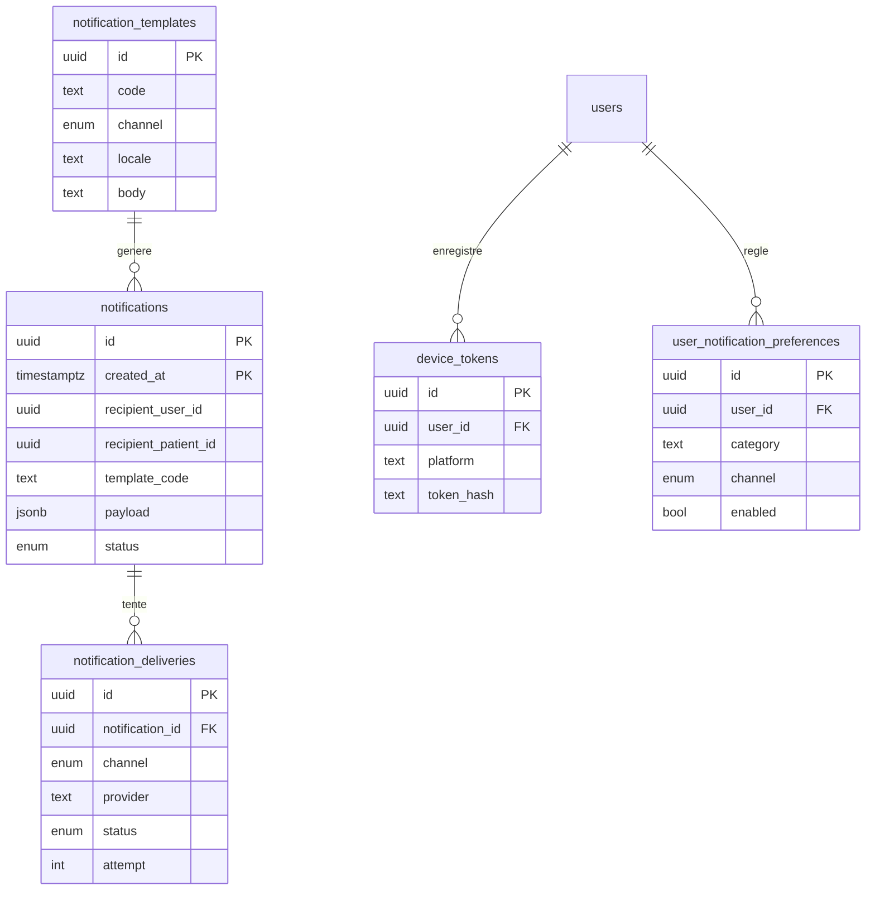

| Table | Colonnes clés |
|---|---|
| `notification_templates` | [CS] `code`, `channel`, `locale`, `subject`, `body` (Handlebars/ICU), `variables jsonb`, `is_system bool`. `UK (tenant_id, code, channel, locale) WHERE deleted_at IS NULL`. Modèles système par défaut copiés au provisioning, surchargeables. |
| `notifications` | [C] **partitionné par mois** (`created_at`). `recipient_user_id` ou `recipient_patient_id` ou `recipient_address_enc/bidx` (SMS direct), `template_code`, `category` (`appointment_reminder`/`result_ready`/`invoice`/`security`/`system`), `payload jsonb`, `channels_requested`, `status`, `read_at` (in-app), `scheduled_for`, `dedupe_key` (`UK (tenant_id, dedupe_key, created_at)`). Le **payload n'embarque aucune donnée médicale** (« Résultat disponible », pas le résultat). |
| `notification_deliveries` | [C] `notification_id`, `channel`, `provider` (`orange_sms`/`infobip`/`twilio`/`smtp`/`fcm`/`expo`), `provider_message_id`, `status` (`queued`/`sent`/`delivered`/`failed`), `attempt`, `error_code`, `cost numeric(18,4)`, `currency`, `sent_at`, `delivered_at`. Sert au comptage SMS (quotas) et à la refacturation. |
| `device_tokens` | [C] `user_id` ou `patient_account_id`, `platform` (`android`/`ios`/`web`), `token_enc` + `token_hash UK`, `last_seen_at`, `revoked_at`. |
| `user_notification_preferences` | [C] `(tenant_id, user_id, category, channel) UK`, `enabled`, `quiet_hours int4range`. |

### 3.14 Outbox

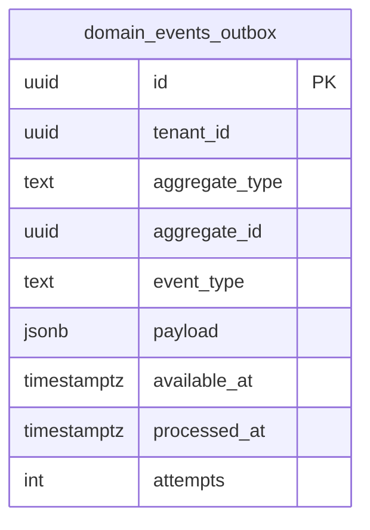

| Colonne | Détail |
|---|---|
| `id uuid` (v7), `tenant_id` | l'identifiant v7 donne l'ordre de traitement approximatif |
| `aggregate_type`, `aggregate_id`, `event_type` | ex. `invoice` / `InvoiceIssued` |
| `payload jsonb` | **sans donnée sensible en clair** (identifiants + métadonnées) |
| `available_at`, `processed_at`, `attempts`, `last_error`, `locked_by`, `locked_until` | reprise sur erreur, backoff |
| `trace_id` | corrélation OpenTelemetry |

Écrit **dans la même transaction** que la modification métier (garantie « au moins une fois »). Le relais (worker BullMQ) lit avec `SELECT ... WHERE processed_at IS NULL AND available_at <= now() ORDER BY id FOR UPDATE SKIP LOCKED LIMIT 100` (sous contexte tenant, ou un poll par tenant actif). Index partiel : `(tenant_id, available_at) WHERE processed_at IS NULL`. Les consommateurs sont **idempotents** (clé = `id` de l'événement). Purge des événements traités > 7 jours.

---

## 4. Politiques RLS

### 4.1 Rôles PostgreSQL

```sql
-- Aucun rôle applicatif n'est superuser ni BYPASSRLS
CREATE ROLE ghmt_migrator LOGIN NOSUPERUSER NOBYPASSRLS NOCREATEROLE PASSWORD '...';  -- propriétaire des objets, DDL
CREATE ROLE ghmt_app      LOGIN NOSUPERUSER NOBYPASSRLS NOCREATEROLE PASSWORD '...';  -- API NestJS, DML sur tenant
CREATE ROLE ghmt_platform LOGIN NOSUPERUSER NOBYPASSRLS NOCREATEROLE PASSWORD '...';  -- console plateforme, schéma platform

REVOKE ALL ON SCHEMA public FROM PUBLIC;
REVOKE ALL ON DATABASE ghmt FROM PUBLIC;

ALTER SCHEMA platform OWNER TO ghmt_migrator;
ALTER SCHEMA tenant   OWNER TO ghmt_migrator;

GRANT USAGE ON SCHEMA tenant   TO ghmt_app;
GRANT USAGE ON SCHEMA platform TO ghmt_app, ghmt_platform;

-- ghmt_app : DML sur tenant (pas de TRUNCATE, pas de DDL)
GRANT SELECT, INSERT, UPDATE, DELETE ON ALL TABLES IN SCHEMA tenant TO ghmt_app;
GRANT USAGE ON ALL SEQUENCES IN SCHEMA tenant TO ghmt_app;
ALTER DEFAULT PRIVILEGES FOR ROLE ghmt_migrator IN SCHEMA tenant
  GRANT SELECT, INSERT, UPDATE, DELETE ON TABLES TO ghmt_app;

-- Tables append-only : on retire les droits destructifs
REVOKE UPDATE, DELETE ON tenant.audit_logs, tenant.stock_movements FROM ghmt_app;

-- ghmt_app : lecture seule de quelques tables de référence de platform
GRANT SELECT ON platform.permissions, platform.modules, platform.currencies,
                platform.plans, platform.plan_features, platform.plan_limits TO ghmt_app;
-- (jamais d'accès direct à platform.tenants, subscriptions, saas_*, platform_users)

-- ghmt_platform : CRUD sur platform, AUCUN accès à tenant
GRANT SELECT, INSERT, UPDATE, DELETE ON ALL TABLES IN SCHEMA platform TO ghmt_platform;
REVOKE ALL ON ALL TABLES IN SCHEMA tenant FROM ghmt_platform;
```

| Rôle | Usage | Contraintes |
|---|---|---|
| `ghmt_migrator` | Migrations Prisma/SQL, création de partitions, propriétaire des tables | Utilisé **uniquement** par la CI/CD et l'opérateur ; jamais par l'API en fonctionnement. Soumis à RLS grâce à `FORCE` (voir pièges) |
| `ghmt_app` | Connexions de l'API et des workers (via pgBouncer en mode transaction) | `NOBYPASSRLS`, pas propriétaire, DML seulement |
| `ghmt_platform` | Console super-admin | Pas d'accès aux tables `tenant` ; l'accès aux données d'un tenant passe par une session `ghmt_app` en mode délégué (§4.4) |

### 4.2 Fonction de contexte et politique type

Le contexte est posé **par transaction** (`SET LOCAL` via `set_config(..., true)`) : compatible pgBouncer en mode transaction, aucune fuite de contexte entre requêtes.

```sql
CREATE OR REPLACE FUNCTION tenant.current_tenant_id() RETURNS uuid
LANGUAGE sql STABLE PARALLEL SAFE AS $$
  SELECT NULLIF(current_setting('app.tenant_id', true), '')::uuid
$$;
-- Si app.tenant_id est absent : NULL => comparaison NULL => aucune ligne visible, aucune écriture (fail closed).
```

Politique exacte, appliquée à **chaque** table du schéma `tenant` (exemple `patients`) :

```sql
ALTER TABLE tenant.patients ENABLE ROW LEVEL SECURITY;
ALTER TABLE tenant.patients FORCE  ROW LEVEL SECURITY;

CREATE POLICY tenant_isolation ON tenant.patients
  AS PERMISSIVE FOR ALL TO ghmt_app
  USING      (tenant_id = (SELECT tenant.current_tenant_id()))
  WITH CHECK (tenant_id = (SELECT tenant.current_tenant_id()));
```

Forme littérale équivalente conforme à la décision d'architecture :
`USING (tenant_id = current_setting('app.tenant_id')::uuid)`. La variante ci-dessus ajoute `missing_ok = true` (pas d'erreur si la variable n'est pas définie, résultat vide) et l'encapsulation `(SELECT ...)` qui force une évaluation **unique** (InitPlan) au lieu d'un appel par ligne.

Application en masse + garde-fou :

```sql
DO $$
DECLARE r record;
BEGIN
  FOR r IN
    SELECT c.relname
    FROM pg_class c JOIN pg_namespace n ON n.oid = c.relnamespace
    WHERE n.nspname = 'tenant' AND c.relkind IN ('r','p') AND NOT c.relispartition
  LOOP
    EXECUTE format('ALTER TABLE tenant.%I ENABLE ROW LEVEL SECURITY', r.relname);
    EXECUTE format('ALTER TABLE tenant.%I FORCE ROW LEVEL SECURITY', r.relname);
    EXECUTE format('DROP POLICY IF EXISTS tenant_isolation ON tenant.%I', r.relname);
    EXECUTE format($p$CREATE POLICY tenant_isolation ON tenant.%I AS PERMISSIVE FOR ALL TO ghmt_app
      USING (tenant_id = (SELECT tenant.current_tenant_id()))
      WITH CHECK (tenant_id = (SELECT tenant.current_tenant_id()))$p$, r.relname);
  END LOOP;
END $$;
```

**Test CI obligatoire** (échec du build si violation) :

```sql
-- Toute table de tenant sans RLS FORCE ou sans colonne tenant_id
SELECT c.relname FROM pg_class c JOIN pg_namespace n ON n.oid=c.relnamespace
WHERE n.nspname='tenant' AND c.relkind IN ('r','p') AND NOT c.relispartition
  AND (NOT c.relrowsecurity OR NOT c.relforcerowsecurity
       OR NOT EXISTS (SELECT 1 FROM pg_attribute a WHERE a.attrelid=c.oid AND a.attname='tenant_id' AND NOT a.attisdropped));
-- doit retourner 0 ligne
```

Plus des tests d'intégration : sous `ghmt_app` avec tenant A, `SELECT`/`UPDATE`/`DELETE`/`INSERT` ciblant des lignes du tenant B retournent 0 ligne ou échouent sur `WITH CHECK`.

### 4.3 Pose du contexte côté application (Prisma)

```ts
// Extension Prisma : toute requête métier s'exécute dans une transaction dédiée
export function withTenant<T>(prisma: PrismaClient, ctx: TenantCtx, fn: (tx: Prisma.TransactionClient) => Promise<T>) {
  return prisma.$transaction(async (tx) => {
    await tx.$executeRaw`SELECT set_config('app.tenant_id', ${ctx.tenantId}, true)`;
    await tx.$executeRaw`SELECT set_config('app.user_id', ${ctx.userId ?? ''}, true)`;
    await tx.$executeRaw`SELECT set_config('app.access_mode', ${ctx.accessMode ?? 'normal'}, true)`;
    return fn(tx);
  }, { timeout: 10_000 });
}
```

`tenantId` provient **exclusivement** du JWT/session vérifié (jamais d'un paramètre de requête). Les triggers d'audit lisent `app.user_id` pour `created_by/updated_by` si non fournis.

### 4.4 Accès délégué (break-glass) du super administrateur

Principe : le super admin n'a **aucun accès SQL** direct aux tables `tenant`. Il obtient une session applicative limitée dans le temps.

1. Le super admin (MFA récent obligatoire) demande un accès : `platform.delegated_access_grants` (motif obligatoire, ticket, durée ≤ 24 h, niveau `read_only`/`read_write`, approbation par un second super admin ; en option, approbation de l'administrateur du tenant).
2. L'API émet un JWT spécial `{ sub: platform_user, tenant_id, grant_id, mode: 'delegated_ro' }` de courte durée (≤ durée du grant, pas de refresh).
3. À chaque requête, l'API **revérifie** le grant (non révoqué, non expiré) via `platform.verify_grant(grant_id)` puis pose `app.tenant_id`, `app.access_mode`, `app.grant_id`.
4. Toute opération est auditée dans `tenant.audit_logs` (`actor_type='platform_user'`, `delegated_grant_id`) : le tenant voit ces accès dans son journal.
5. En mode lecture seule, une politique **RESTRICTIVE** bloque toute écriture au niveau SQL (défense en profondeur) :

```sql
-- Posée sur chaque table tenant (dans la même boucle DO que tenant_isolation)
CREATE POLICY deny_write_when_delegated_ro ON tenant.patients
  AS RESTRICTIVE FOR INSERT TO ghmt_app
  WITH CHECK (COALESCE(current_setting('app.access_mode', true), 'normal') <> 'delegated_ro');
CREATE POLICY deny_update_when_delegated_ro ON tenant.patients
  AS RESTRICTIVE FOR UPDATE TO ghmt_app
  USING (COALESCE(current_setting('app.access_mode', true), 'normal') <> 'delegated_ro');
CREATE POLICY deny_delete_when_delegated_ro ON tenant.patients
  AS RESTRICTIVE FOR DELETE TO ghmt_app
  USING (COALESCE(current_setting('app.access_mode', true), 'normal') <> 'delegated_ro');
```

6. Les données les plus sensibles (notes cliniques `*_enc`) restent illisibles sans la DEK du tenant : le service de chiffrement refuse de déchiffrer pour un `accessMode` délégué sauf grant de niveau `clinical` explicite.

### 4.5 Accès patient (compte global mobile)

- L'app mobile s'authentifie contre `platform.patient_accounts` (aucun tenant à ce stade).
- La liste des établissements liés est obtenue par une fonction `SECURITY DEFINER` restreinte :

```sql
CREATE OR REPLACE FUNCTION platform.list_patient_links(p_account uuid)
RETURNS TABLE (tenant_id uuid, patient_id uuid, tenant_name text, consent_scopes text[])
LANGUAGE sql STABLE SECURITY DEFINER SET search_path = pg_catalog, tenant, platform AS $$
  SELECT l.tenant_id, l.patient_id, t.trade_name, l.consent_scopes
  FROM tenant.patient_account_links l JOIN platform.tenants t ON t.id = l.tenant_id
  WHERE l.patient_account_id = p_account AND l.status = 'active' AND l.revoked_at IS NULL;
$$;
```

 (Cette fonction appartient à un rôle dédié `ghmt_linkreader`, `NOLOGIN`, avec `BYPASSRLS` strictement limité à cette fonction et une seule table ; revue de sécurité obligatoire. Alternative sans BYPASSRLS : politique supplémentaire sur `patient_account_links` : `USING (patient_account_id = NULLIF(current_setting('app.patient_account_id', true),'')::uuid)`.)
- Pour lire ses données dans un tenant, l'API pose `app.tenant_id` du lien choisi et filtre **applicativement et par politique** sur `patient_id` : politiques additionnelles `PERMISSIVE` sur `appointments`, `invoices`, `lab_results`, `prescriptions` :

```sql
CREATE POLICY patient_self_access ON tenant.appointments AS PERMISSIVE FOR SELECT TO ghmt_app
USING (
  tenant_id = (SELECT tenant.current_tenant_id())
  AND patient_id IN (
    SELECT l.patient_id FROM tenant.patient_account_links l
    WHERE l.tenant_id = (SELECT tenant.current_tenant_id())
      AND l.patient_account_id = NULLIF(current_setting('app.patient_account_id', true),'')::uuid
      AND l.status = 'active' AND 'appointments' = ANY (l.consent_scopes))
  AND current_setting('app.actor_type', true) = 'patient');
```

Lorsque `app.actor_type = 'patient'`, les politiques de personnel ne s'appliquent pas : la politique `tenant_isolation` générale est donc restreinte par `AND COALESCE(current_setting('app.actor_type', true),'staff') <> 'patient'` sur les tables exposées au patient. Les tables non exposées au patient (comptabilité, RH, stocks…) conservent la seule règle tenant, mais l'API patient n'a aucune route vers elles ; **et** le rôle de connexion patient peut être un rôle distinct `ghmt_patient_app` avec GRANT SELECT limités sur les seules tables concernées (recommandé en phase 2).

### 4.6 Tables sans `tenant_id` et fonctions `SECURITY DEFINER`

- Le schéma `platform` n'a pas de RLS : l'isolation repose sur les **GRANT** (ghmt_app ne voit que des référentiels). Un défaut de GRANT = fuite : test CI qui liste les privilèges de `ghmt_app` sur `platform`.
- Seules exceptions d'écriture depuis `ghmt_app` : fonctions `SECURITY DEFINER` étroites, avec `SET search_path` figé, `REVOKE EXECUTE FROM PUBLIC`, contrôle explicite du tenant courant :

```sql
CREATE OR REPLACE FUNCTION platform.increment_usage(p_key text, p_delta bigint)
RETURNS void LANGUAGE plpgsql SECURITY DEFINER SET search_path = pg_catalog, platform AS $$
DECLARE v_tenant uuid := NULLIF(current_setting('app.tenant_id', true), '')::uuid;
BEGIN
  IF v_tenant IS NULL THEN RAISE EXCEPTION 'tenant context required'; END IF;
  INSERT INTO platform.usage_counters (tenant_id, counter_key, period_start, value)
  VALUES (v_tenant, p_key, date_trunc('month', now())::date, p_delta)
  ON CONFLICT (tenant_id, counter_key, period_start)
  DO UPDATE SET value = platform.usage_counters.value + EXCLUDED.value, updated_at = now();
END $$;
REVOKE ALL ON FUNCTION platform.increment_usage(text, bigint) FROM PUBLIC;
GRANT EXECUTE ON FUNCTION platform.increment_usage(text, bigint) TO ghmt_app;

-- Résolution du tenant par slug (avant authentification, donc avant tout contexte)
CREATE OR REPLACE FUNCTION platform.resolve_tenant(p_slug text)
RETURNS TABLE (id uuid, status platform.tenant_status, base_currency char(3), timezone text)
LANGUAGE sql STABLE SECURITY DEFINER SET search_path = pg_catalog, platform AS $$
  SELECT id, status, base_currency, timezone FROM platform.tenants WHERE slug = p_slug AND deleted_at IS NULL;
$$;
```

### 4.7 Pièges et parades

| Piège | Conséquence | Parade |
|---|---|---|
| **Propriétaire de la table** : par défaut il **contourne** la RLS | Un job ou une migration exécutée comme `ghmt_migrator` voit toutes les données | `FORCE ROW LEVEL SECURITY` sur chaque table ; l'API n'utilise jamais le rôle propriétaire ; les migrations de données multi-tenant posent le contexte tenant par tenant |
| **`BYPASSRLS` / superuser** ignorent RLS même avec FORCE | Fuite totale | Aucun rôle applicatif avec ces attributs ; audit périodique `SELECT rolname FROM pg_roles WHERE rolbypassrls OR rolsuper` |
| **`app.tenant_id` absent** | `current_setting` sans `missing_ok` lève une erreur, ou renvoie `''` → cast invalide | Fonction `current_tenant_id()` avec `missing_ok` + `NULLIF` : *fail closed* (0 ligne) |
| **Contexte persistant avec pooling** | Un `SET` (sans `LOCAL`) fuit vers la requête suivante d'un autre tenant | Uniquement `set_config(..., true)` dans une transaction explicite ; pgBouncer en mode `transaction` ; `DISCARD ALL` sur retour de connexion |
| **Prisma hors transaction** | Requête exécutée sur une autre connexion que le `set_config` | Tout accès métier passe par `withTenant` (interdiction lint de `prisma.<model>` direct) |
| **Tables sans `tenant_id`** (jointures, enfants) | Pas de politique possible, ou jointure fuyante | `tenant_id` obligatoire partout + FK composites ; test CI du §4.2 |
| **`SECURITY DEFINER`** : s'exécute avec les droits du propriétaire | Contournement RLS/élévation de privilège | `SET search_path` figé, schéma qualifié, pas de SQL dynamique non échappé, `REVOKE ... FROM PUBLIC`, contrôle du tenant dans la fonction, revue obligatoire, liste blanche dans la CI |
| **Vues** : s'exécutent avec les droits du propriétaire (RLS du propriétaire) | Fuite via une vue | `CREATE VIEW ... WITH (security_invoker = true)` (PG 15+) systématique |
| **Contraintes d'unicité/FK et canal auxiliaire** | Une violation de contrainte révèle l'existence d'une ligne d'un autre tenant | Unicités toujours préfixées `tenant_id` ; FK composites |
| **Fonctions non `LEAKPROOF`** dans les prédicats utilisateurs | Le planificateur évalue le prédicat utilisateur avant la politique, pouvant révéler des valeurs via erreurs | Ne pas créer de fonctions custom non nécessaires dans les filtres ; garder la politique simple (égalité) |
| **Performances** : `current_setting()` évalué par ligne | Seq scan lent | `(SELECT tenant.current_tenant_id())` (InitPlan), fonction `STABLE`, **index commençant par `tenant_id`** |
| **Tables partitionnées** | Interroger directement une partition applique ses propres politiques (absentes) | Politiques sur le parent **et** chaque partition (créées par le job de partitionnement) ; `REVOKE` des droits directs sur les partitions pour `ghmt_app` ; test CI |
| **`COPY`/`pg_dump`** ignorent/subissent RLS selon le rôle | Sauvegarde incomplète ou trop large | Sauvegardes physiques (pgBackRest/WAL) ; exports par tenant via `ghmt_app` + contexte |
| **Rôle `ghmt_platform`** | Fait sauter l'isolation si on lui donne accès à `tenant` | Aucun GRANT ; pas de BYPASSRLS ; tests de privilèges en CI |
| **Triggers `SECURITY DEFINER` d'audit** | Écrivent hors contexte | Fonction d'audit en `SECURITY INVOKER`, soumise aux mêmes politiques |

---

## 5. Indexation, partitionnement, volumétrie, rétention

### 5.1 Stratégie d'indexation

1. **Préfixe `tenant_id` systématique** : `(tenant_id, …)`. Les index sur `id` seul sont inutiles hors PK ; PK composite possible `(tenant_id, id)` en variante (voir note Prisma §7).
2. **Index sur toutes les FK** (côté enfant) : `(tenant_id, parent_id)`. Vérification automatique en CI via `pg_constraint` ↔ `pg_index`.
3. **Index partiels** pour le soft delete et les statuts actifs :
   `CREATE UNIQUE INDEX uq_patients_ipp ON tenant.patients (tenant_id, ipp);`
   `CREATE INDEX ix_users_active ON tenant.users (tenant_id, email) WHERE deleted_at IS NULL;`
4. **Ordre des colonnes** : égalités d'abord, puis plage/tri : `(tenant_id, practitioner_id, lower(time_range))`.
5. **Recherche patient** : trigram `GIN (tenant_id, search_name gin_trgm_ops)` (extension `btree_gin`) ; index aveugles `(tenant_id, phone_bidx)` pour téléphone/pièce d'identité.
6. **GiST/`EXCLUDE`** pour rendez-vous, lits, exercices, contrats (§3).
7. **BRIN** sur `occurred_at` / `created_at` des très grosses tables append-only (audit, mouvements) en complément du B-tree `(tenant_id, occurred_at)`.
8. **Index couvrants** `INCLUDE` pour les listes fréquentes : `ix_appointments_day (tenant_id, practitioner_id, lower(time_range)) INCLUDE (status, patient_id)`.
9. **JSONB** : uniquement `payload`/`raw_payload`/`changes`, jamais pour les champs filtrés ; GIN `jsonb_path_ops` à la demande.
10. **Hygiène** : `pg_stat_user_indexes` revu trimestriellement (index jamais utilisés supprimés), `autovacuum` agressif sur `outbox`, `sessions`, `refresh_tokens`, `stock_balances` (fort taux d'UPDATE), `fillfactor = 80` sur celles-ci.
11. **Statistiques** : `ALTER TABLE ... ALTER COLUMN tenant_id SET STATISTICS 500` + statistiques étendues `(tenant_id, status)` sur les grosses tables (distribution fortement asymétrique entre tenants).

### 5.2 Partitionnement

| Table | Clé | Granularité | Pourquoi | Gestion |
|---|---|---|---|---|
| `audit_logs` | `occurred_at` | mensuelle | volume élevé, rétention longue, purge/archivage par détachement | `pg_partman`, 3 mois d'avance, `DETACH PARTITION CONCURRENTLY` puis export Parquet/S3 (avec ancrage de hash) |
| `stock_movements` | `occurred_at` | mensuelle | journal immuable, croissance continue | idem ; soldes dans `stock_balances` donc pas de scan historique |
| `notifications` | `created_at` | mensuelle (hebdomadaire si > 200 M lignes) | forte volumétrie, faible durée de rétention | suppression par `DROP` de partition (instantané) |

- Les clés primaires incluent la clé de partition : `(id, occurred_at)`. Les FK **vers** ces tables sont proscrites (références logiques `resource_id`) ; les FK **depuis** elles vers des tables non partitionnées restent possibles.
- Pas de partitionnement par tenant en MVP (trop de partitions) ; **plan B** pour les gros tenants : *hash sous-partitionnement* ou migration vers base dédiée (option Enterprise de `00-decisions.md`).
- Prisma ne gère pas le partitionnement : DDL en migration SQL manuelle ; les modèles Prisma sont déclarés comme des tables ordinaires (PK composite).
- Candidats ultérieurs : `lab_results`, `vital_signs`, `journal_lines` (partitionnement par exercice/année) si > 500 M lignes.

### 5.3 Volumétrie estimée

Hypothèses (horizon 3 ans) : 1 000 tenants, dont 80 % petits (centre de santé/cabinet : 20 utilisateurs, 50 consultations/jour), 15 % moyens (clinique : 100 utilisateurs, 300 consultations/jour), 5 % grands (hôpital N2/N3 : 500 utilisateurs, 1 500 consultations/jour).

| Table | Lignes / an (global) | Taille moyenne ligne | Volume / an | Remarque |
|---|---|---|---|---|
| `patients` | ~ 3 M nouveaux | 1,2 Ko | ~ 4 Go | cumulatif ; ~ 10 M à 3 ans |
| `appointments` | ~ 25 M | 0,4 Ko | ~ 10 Go | |
| `encounters` | ~ 30 M | 2 Ko | ~ 60 Go | texte chiffré |
| `vital_signs` | ~ 40 M | 0,25 Ko | ~ 10 Go | |
| `prescription_lines` | ~ 80 M | 0,3 Ko | ~ 25 Go | |
| `lab_results` | ~ 150 M | 0,3 Ko | ~ 45 Go | partitionnement envisagé |
| `invoices` + `invoice_lines` | 30 M + 90 M | 0,4 Ko | ~ 50 Go | |
| `payments` | ~ 35 M | 0,6 Ko | ~ 20 Go | |
| `stock_movements` | ~ 120 M | 0,2 Ko | ~ 25 Go | partitionné |
| `journal_lines` | ~ 250 M | 0,2 Ko | ~ 50 Go | |
| `audit_logs` | ~ 1,2 Md | 0,5 Ko | ~ 600 Go | **principal poste** ; lectures de dossier journalisées → sampling configurable des lectures non sensibles |
| `notifications` + `deliveries` | ~ 200 M + 250 M | 0,35 Ko | ~ 150 Go | rétention 12 mois |
| `domain_events_outbox` | ~ 400 M | 0,6 Ko | transitoire | purge 7 j |
| `sessions`/`refresh_tokens` | ~ 200 M | 0,2 Ko | transitoire | purge 30 j |

Ordre de grandeur : **~ 1 To/an** de données chaudes brutes (hors index, ~ ×1,6 avec index), dont plus de la moitié en audit. Premier palier : un PostgreSQL 17 unique (32 vCPU, 256 Go RAM, NVMe) avec réplica de lecture suffit jusqu'à ~ 300-500 tenants moyens ; au-delà : réplicas de lecture pour reporting, archivage froid et bases dédiées pour les gros tenants.

### 5.4 Rétention

| Donnée | Rétention en ligne | Archivage / suppression | Base |
|---|---|---|---|
| Dossier médical (encounters, diagnostics, prescriptions, résultats) | durée de vie du patient, min. 20 ans après dernier contact (à confirmer par pays) | archivage froid chiffré ; anonymisation à l'expiration | réglementation sanitaire nationale |
| Pièces comptables (`journal_*`, factures, paiements) | 10 ans | conservation obligatoire OHADA | Acte uniforme comptable |
| `audit_logs` | 13 mois en base (chaud) | 10 ans en archive froide WORM, chaîne vérifiable ; accès aux dossiers conservés ≥ 5 ans | traçabilité données de santé |
| `stock_movements` | 3 ans en base | 10 ans archive | traçabilité pharmaceutique |
| `notifications`, `deliveries` | 12 mois | `DROP PARTITION` | minimisation |
| `sessions`, `refresh_tokens`, `password_reset_tokens` | expirés + 30 j | purge quotidienne | |
| `domain_events_outbox` | traités + 7 j | purge | |
| `delegated_access_grants` | indéfinie | partie de l'audit plateforme | |
| Données d'un tenant résilié | 90 jours en lecture seule (export), puis suppression | crypto-shredding : destruction de la DEK du tenant + purge ; sauvegardes expirent selon leur cycle | RGPD-like / lois locales |
| Compte patient supprimé | liens révoqués immédiatement ; compte purgé sous 30 j | les dossiers cliniques restent chez chaque établissement | droit d'effacement vs obligation de conservation |

Droit d'accès/portabilité : export JSON/PDF par patient et par tenant ; droit à l'effacement traité par **anonymisation** des données non soumises à conservation légale.

---

## 6. Numérotation séquentielle par tenant

Besoin : IPP, n° de facture, d'ordonnance, d'écriture comptable, de ticket d'attente, etc. **Sans collision** entre transactions concurrentes, et **sans trou** pour les pièces fiscales (factures, écritures). Les `SEQUENCE` PostgreSQL ne conviennent pas (une par tenant et par type, trous en cas de rollback, DDL dynamique).

### 6.1 Table de compteurs

```sql
CREATE TABLE tenant.sequence_counters (
  tenant_id   uuid        NOT NULL REFERENCES platform.tenants(id),
  scope_key   text        NOT NULL,           -- 'ipp', 'invoice', 'prescription', 'lab_order', 'journal:VE', 'queue:{department}'
  period_key  text        NOT NULL DEFAULT '',-- '' (perpétuel), '2026' (annuel), '2026-10', '2026-10-04' (jour)
  last_value  bigint      NOT NULL DEFAULT 0 CHECK (last_value >= 0),
  updated_at  timestamptz NOT NULL DEFAULT now(),
  PRIMARY KEY (tenant_id, scope_key, period_key)
);
-- RLS standard (§4.2) appliquée.

CREATE TABLE tenant.sequence_formats (
  tenant_id   uuid NOT NULL,
  scope_key   text NOT NULL,
  period_mode text NOT NULL CHECK (period_mode IN ('none','year','month','day')),
  format      text NOT NULL,                  -- ex. 'FAC-{YYYY}-{SEQ:6}', '{SITE}-{YY}-{SEQ:7}'
  gapless     bool NOT NULL DEFAULT false,
  PRIMARY KEY (tenant_id, scope_key)
);
```

### 6.2 Fonction d'attribution

```sql
CREATE OR REPLACE FUNCTION tenant.next_sequence(p_scope text, p_period text DEFAULT '')
RETURNS bigint LANGUAGE plpgsql AS $$
DECLARE
  v_tenant uuid := (SELECT tenant.current_tenant_id());
  v_value  bigint;
BEGIN
  IF v_tenant IS NULL THEN RAISE EXCEPTION 'tenant context required'; END IF;
  INSERT INTO tenant.sequence_counters AS c (tenant_id, scope_key, period_key, last_value)
  VALUES (v_tenant, p_scope, p_period, 1)
  ON CONFLICT (tenant_id, scope_key, period_key)
  DO UPDATE SET last_value = c.last_value + 1, updated_at = now()
  RETURNING last_value INTO v_value;
  RETURN v_value;
END $$;
```

- `INSERT ... ON CONFLICT DO UPDATE ... RETURNING` est **atomique** : la ligne du compteur est verrouillée jusqu'au `COMMIT`/`ROLLBACK` de la transaction appelante. Deux transactions concurrentes pour le même `(tenant, scope, période)` sont **sérialisées** ; un rollback annule aussi l'incrément ⇒ **pas de trou** ni de doublon. Tenants et portées différents ne se bloquent pas entre eux.
- La contention est donc limitée à un tenant × une portée : acceptable (quelques dizaines de factures par minute au pic). Règles pour la limiter :
  1. **appeler `next_sequence` le plus tard possible** dans la transaction (juste avant `COMMIT`, ex. à l'émission de la facture, pas à la création du brouillon) ;
  2. transactions courtes, aucun appel externe tant que le verrou est tenu ;
  3. brouillons identifiés par UUID, sans numéro ;
  4. pour des numéros non fiscaux à très fort débit (tickets d'attente, IPP en import massif) : **allocation par blocs** (`next_sequence_block(scope, n)` réserve n valeurs en une fois, trous tolérés) ;
  5. numéros fiscaux : jamais de bloc, `gapless = true`.
- Le numéro formaté est stocké dans la table métier et protégé par `UNIQUE (tenant_id, number)` (ceinture et bretelles). Annulation d'une facture émise : statut `void` + avoir ; le numéro n'est jamais réutilisé.
- Exemple d'usage (émission de facture) :

```sql
UPDATE tenant.invoices
   SET number = tenant.format_number('invoice', to_char(now(),'YYYY'),
                                     tenant.next_sequence('invoice', to_char(now(),'YYYY'))),
       status = 'issued', issued_at = now()
 WHERE tenant_id = (SELECT tenant.current_tenant_id()) AND id = $1 AND status = 'draft';
```

- IPP : `{SITE}-{YY}-{SEQ:7}` avec clé de contrôle optionnelle (Luhn mod-N) pour détecter les erreurs de saisie ; portée `ipp` perpétuelle pour garder l'unicité à vie.
- Numérotation comptable : une portée par `(journal, exercice)` : `journal:VE` / période `2026`, remise à zéro annuelle.
- Mode hors-ligne (desktop) : le poste reçoit une **plage réservée** (`sequence_leases`: tenant, scope, device, de, à) pour numéroter localement sans collision ; les pièces fiscales sont numérotées uniquement à la synchronisation (numéro provisoire local).

---

## 7. Extrait de schéma Prisma pour le MVP

Notes de mise en œuvre :

- `previewFeatures = ["multiSchema"]` pour `platform`/`tenant`.
- Les politiques RLS, `EXCLUDE`, partitions, triggers, index partiels, colonnes générées et fonctions sont **hors Prisma** : migrations SQL (`prisma migrate dev --create-only` puis édition).
- FK composites `(tenantId, xId)` déclarées dans Prisma pour les relations obligatoires. **Pour les relations optionnelles** (ex. `departmentId` nullable avec `tenantId` obligatoire), Prisma exige que tous les champs de la relation soient optionnels : on garde alors la colonne scalaire dans Prisma et la **FK composite est créée en SQL** (`MATCH SIMPLE` : ignorée si `x_id` est NULL).
- `uuid(7)` : généré côté client Prisma (le moteur le fait ; valeur modifiable par l'appli pour les imports).
- Les enums Prisma sont mappés sur les types PG natifs.

```prisma
generator client {
  provider        = "prisma-client-js"
  previewFeatures = ["multiSchema"]
}

datasource db {
  provider = "postgresql"
  url      = env("DATABASE_URL")          // ghmt_app
  schemas  = ["platform", "tenant"]
}

// ───────────── Enums ─────────────
enum EstablishmentType {
  hospital_n1
  hospital_n2
  hospital_n3
  medicalized_center
  health_center
  clinic
  private_practice
  laboratory
  pharmacy
  diagnostic_center
  specialized_center
  other
  @@map("establishment_type")
  @@schema("platform")
}

enum TenantStatus {
  pending
  active
  suspended
  terminated
  @@map("tenant_status")
  @@schema("platform")
}

enum ScopeType {
  group
  tenant
  site
  department
  @@map("scope_type")
  @@schema("tenant")
}

enum UserStatus {
  invited
  active
  locked
  disabled
  @@map("user_status")
  @@schema("tenant")
}

enum Sex {
  male
  female
  other
  unknown
  @@map("sex")
  @@schema("tenant")
}

enum AppointmentStatus {
  requested
  scheduled
  confirmed
  checked_in
  in_progress
  completed
  cancelled
  no_show
  @@map("appointment_status")
  @@schema("tenant")
}

// ───────────── Schéma platform ─────────────
model Tenant {
  id                String            @id @default(uuid(7)) @db.Uuid
  groupId           String?           @map("group_id") @db.Uuid
  slug              String            @unique
  legalName         String            @map("legal_name")
  tradeName         String?           @map("trade_name")
  establishmentType EstablishmentType @map("establishment_type")
  status            TenantStatus      @default(pending)
  countryCode       String            @map("country_code") @db.Char(2)
  baseCurrency      String            @map("base_currency") @db.Char(3)
  timezone          String            @default("Africa/Dakar")
  defaultLocale     String            @default("fr") @map("default_locale")
  createdAt         DateTime          @default(now()) @map("created_at") @db.Timestamptz(6)
  updatedAt         DateTime          @updatedAt @map("updated_at") @db.Timestamptz(6)
  deletedAt         DateTime?         @map("deleted_at") @db.Timestamptz(6)

  sites       Site[]
  users       User[]
  patients    Patient[]

  @@index([groupId])
  @@index([status])
  @@map("tenants")
  @@schema("platform")
}

model Permission {
  code        String  @id
  moduleCode  String  @map("module_code")
  description String?
  isSensitive Boolean @default(false) @map("is_sensitive")

  rolePermissions RolePermission[]

  @@map("permissions")
  @@schema("platform")
}

// ───────────── Schéma tenant : organisation ─────────────
model Site {
  id        String    @default(uuid(7)) @db.Uuid
  tenantId  String    @map("tenant_id") @db.Uuid
  code      String
  name      String
  city      String?
  countryCode String? @map("country_code") @db.Char(2)
  isMain    Boolean   @default(false) @map("is_main")
  timezone  String?
  createdAt DateTime  @default(now()) @map("created_at") @db.Timestamptz(6)
  updatedAt DateTime  @updatedAt @map("updated_at") @db.Timestamptz(6)
  createdBy String?   @map("created_by") @db.Uuid
  updatedBy String?   @map("updated_by") @db.Uuid
  deletedAt DateTime? @map("deleted_at") @db.Timestamptz(6)
  rowVersion Int      @default(1) @map("row_version")

  tenant      Tenant       @relation(fields: [tenantId], references: [id])
  departments Department[]

  @@id([tenantId, id])
  @@unique([tenantId, code])                // devient partiel (WHERE deleted_at IS NULL) via migration SQL
  @@map("sites")
  @@schema("tenant")
}

model Department {
  id         String    @default(uuid(7)) @db.Uuid
  tenantId   String    @map("tenant_id") @db.Uuid
  siteId     String    @map("site_id") @db.Uuid
  parentId   String?   @map("parent_id") @db.Uuid   // FK composite parent créée en SQL (optionnelle)
  code       String
  name       String
  kind       String    @default("clinical")
  createdAt  DateTime  @default(now()) @map("created_at") @db.Timestamptz(6)
  updatedAt  DateTime  @updatedAt @map("updated_at") @db.Timestamptz(6)
  createdBy  String?   @map("created_by") @db.Uuid
  updatedBy  String?   @map("updated_by") @db.Uuid
  deletedAt  DateTime? @map("deleted_at") @db.Timestamptz(6)
  rowVersion Int       @default(1) @map("row_version")

  site          Site         @relation(fields: [tenantId, siteId], references: [tenantId, id])
  practitioners Practitioner[]

  @@id([tenantId, id])
  @@unique([tenantId, siteId, code])
  @@index([tenantId, siteId])
  @@map("departments")
  @@schema("tenant")
}

// ───────────── Identité & RBAC ─────────────
model User {
  id            String     @default(uuid(7)) @db.Uuid
  tenantId      String     @map("tenant_id") @db.Uuid
  email         String     @db.Citext
  emailVerifiedAt DateTime? @map("email_verified_at") @db.Timestamptz(6)
  fullName      String     @map("full_name")
  status        UserStatus @default(invited)
  locale        String     @default("fr")
  phoneEnc      Bytes?     @map("phone_enc")
  phoneBidx     Bytes?     @map("phone_bidx")
  lastLoginAt   DateTime?  @map("last_login_at") @db.Timestamptz(6)
  createdAt     DateTime   @default(now()) @map("created_at") @db.Timestamptz(6)
  updatedAt     DateTime   @updatedAt @map("updated_at") @db.Timestamptz(6)
  createdBy     String?    @map("created_by") @db.Uuid
  updatedBy     String?    @map("updated_by") @db.Uuid
  deletedAt     DateTime?  @map("deleted_at") @db.Timestamptz(6)
  rowVersion    Int        @default(1) @map("row_version")

  tenant       Tenant                @relation(fields: [tenantId], references: [id])
  credential   UserCredential?
  sessions     Session[]
  assignments  UserRoleAssignment[]
  practitioner Practitioner?

  @@id([tenantId, id])
  @@unique([tenantId, email])               // partiel (deleted_at IS NULL) via migration SQL
  @@index([tenantId, phoneBidx])
  @@map("users")
  @@schema("tenant")
}

model UserCredential {
  tenantId          String    @map("tenant_id") @db.Uuid
  userId            String    @map("user_id") @db.Uuid
  passwordHash      String    @map("password_hash")
  passwordChangedAt DateTime  @default(now()) @map("password_changed_at") @db.Timestamptz(6)
  failedAttempts    Int       @default(0) @map("failed_attempts")
  lockedUntil       DateTime? @map("locked_until") @db.Timestamptz(6)
  mustChangePassword Boolean  @default(false) @map("must_change_password")

  user User @relation(fields: [tenantId, userId], references: [tenantId, id], onDelete: Cascade)

  @@id([tenantId, userId])
  @@map("user_credentials")
  @@schema("tenant")
}

model Role {
  id           String    @default(uuid(7)) @db.Uuid
  tenantId     String    @map("tenant_id") @db.Uuid
  code         String
  name         String
  description  String?
  isSystem     Boolean   @default(false) @map("is_system")
  templateCode String?   @map("template_code")
  createdAt    DateTime  @default(now()) @map("created_at") @db.Timestamptz(6)
  updatedAt    DateTime  @updatedAt @map("updated_at") @db.Timestamptz(6)
  createdBy    String?   @map("created_by") @db.Uuid
  updatedBy    String?   @map("updated_by") @db.Uuid
  deletedAt    DateTime? @map("deleted_at") @db.Timestamptz(6)

  permissions RolePermission[]
  assignments UserRoleAssignment[]

  @@id([tenantId, id])
  @@unique([tenantId, code])
  @@map("roles")
  @@schema("tenant")
}

model RolePermission {
  tenantId       String @map("tenant_id") @db.Uuid
  roleId         String @map("role_id") @db.Uuid
  permissionCode String @map("permission_code")

  role       Role       @relation(fields: [tenantId, roleId], references: [tenantId, id], onDelete: Cascade)
  permission Permission @relation(fields: [permissionCode], references: [code])

  @@id([tenantId, roleId, permissionCode])
  @@index([tenantId, permissionCode])
  @@map("role_permissions")
  @@schema("tenant")
}

model UserRoleAssignment {
  id         String    @default(uuid(7)) @db.Uuid
  tenantId   String    @map("tenant_id") @db.Uuid
  userId     String    @map("user_id") @db.Uuid
  roleId     String    @map("role_id") @db.Uuid
  scopeType  ScopeType @map("scope_type")
  scopeId    String?   @map("scope_id") @db.Uuid     // NULL si scope_type = tenant ; intégrité par trigger
  validFrom  DateTime  @default(now()) @map("valid_from") @db.Timestamptz(6)
  validUntil DateTime? @map("valid_until") @db.Timestamptz(6)
  revokedAt  DateTime? @map("revoked_at") @db.Timestamptz(6)
  createdAt  DateTime  @default(now()) @map("created_at") @db.Timestamptz(6)
  createdBy  String?   @map("created_by") @db.Uuid

  user User @relation(fields: [tenantId, userId], references: [tenantId, id])
  role Role @relation(fields: [tenantId, roleId], references: [tenantId, id])

  @@id([tenantId, id])
  @@index([tenantId, userId])
  @@index([tenantId, roleId])
  @@index([tenantId, scopeType, scopeId])
  @@map("user_role_assignments")
  @@schema("tenant")
}

model Session {
  id            String    @default(uuid(7)) @db.Uuid
  tenantId      String    @map("tenant_id") @db.Uuid
  userId        String    @map("user_id") @db.Uuid
  deviceLabel   String?   @map("device_label")
  userAgent     String?   @map("user_agent")
  ip            String?   @db.Inet
  mfaVerifiedAt DateTime? @map("mfa_verified_at") @db.Timestamptz(6)
  expiresAt     DateTime  @map("expires_at") @db.Timestamptz(6)
  revokedAt     DateTime? @map("revoked_at") @db.Timestamptz(6)
  lastSeenAt    DateTime  @default(now()) @map("last_seen_at") @db.Timestamptz(6)
  createdAt     DateTime  @default(now()) @map("created_at") @db.Timestamptz(6)

  user          User           @relation(fields: [tenantId, userId], references: [tenantId, id])
  refreshTokens RefreshToken[]

  @@id([tenantId, id])
  @@index([tenantId, userId])
  @@index([tenantId, expiresAt])
  @@map("sessions")
  @@schema("tenant")
}

model RefreshToken {
  id         String    @default(uuid(7)) @db.Uuid
  tenantId   String    @map("tenant_id") @db.Uuid
  sessionId  String    @map("session_id") @db.Uuid
  tokenHash  Bytes     @map("token_hash")
  familyId   String    @map("family_id") @db.Uuid
  issuedAt   DateTime  @default(now()) @map("issued_at") @db.Timestamptz(6)
  expiresAt  DateTime  @map("expires_at") @db.Timestamptz(6)
  usedAt     DateTime? @map("used_at") @db.Timestamptz(6)

  session Session @relation(fields: [tenantId, sessionId], references: [tenantId, id], onDelete: Cascade)

  @@id([tenantId, id])
  @@unique([tenantId, tokenHash])
  @@index([tenantId, sessionId])
  @@index([tenantId, familyId])
  @@map("refresh_tokens")
  @@schema("tenant")
}

// ───────────── Audit (partitionné par SQL ; PK composite incluant la clé de partition) ─────────────
model AuditLog {
  id               String   @default(uuid(7)) @db.Uuid
  tenantId         String   @map("tenant_id") @db.Uuid
  occurredAt       DateTime @default(now()) @map("occurred_at") @db.Timestamptz(6)
  chainSeq         BigInt   @map("chain_seq")
  actorType        String   @map("actor_type")
  actorUserId      String?  @map("actor_user_id") @db.Uuid
  delegatedGrantId String?  @map("delegated_grant_id") @db.Uuid
  sessionId        String?  @map("session_id") @db.Uuid
  ip               String?  @db.Inet
  action           String
  resourceType     String?  @map("resource_type")
  resourceId       String?  @map("resource_id") @db.Uuid
  patientId        String?  @map("patient_id") @db.Uuid
  outcome          String   @default("success")
  changes          Json?
  requestId        String?  @map("request_id")
  prevHash         Bytes    @map("prev_hash")
  hash             Bytes

  @@id([id, occurredAt])
  @@unique([tenantId, chainSeq, occurredAt])
  @@index([tenantId, occurredAt(sort: Desc)])
  @@index([tenantId, resourceType, resourceId, occurredAt(sort: Desc)])
  @@index([tenantId, actorUserId, occurredAt(sort: Desc)])
  @@map("audit_logs")
  @@schema("tenant")
  // PARTITION BY RANGE (occurred_at), REVOKE UPDATE/DELETE et trigger append-only : migration SQL
}

// ───────────── Patients ─────────────
model Patient {
  id            String    @default(uuid(7)) @db.Uuid
  tenantId      String    @map("tenant_id") @db.Uuid
  ipp           String
  medicalRecordNumber String? @map("medical_record_number")
  lastName      String    @map("last_name")
  firstName     String    @map("first_name")
  searchName    String    @map("search_name")
  birthDate     DateTime? @map("birth_date") @db.Date
  birthDateEstimated Boolean @default(false) @map("birth_date_estimated")
  sex           Sex       @default(unknown)
  bloodGroup    String?   @map("blood_group")
  nationalIdEnc  Bytes?   @map("national_id_enc")
  nationalIdBidx Bytes?   @map("national_id_bidx")
  phoneEnc      Bytes?    @map("phone_enc")
  phoneBidx     Bytes?    @map("phone_bidx")
  emailEnc      Bytes?    @map("email_enc")
  emailBidx     Bytes?    @map("email_bidx")
  addressEnc    Bytes?    @map("address_enc")
  city          String?
  primarySiteId String?   @map("primary_site_id") @db.Uuid   // FK composite créée en SQL
  keyVersion    Int       @default(1) @map("key_version") @db.SmallInt
  deceasedAt    DateTime? @map("deceased_at") @db.Timestamptz(6)
  mergedIntoPatientId String? @map("merged_into_patient_id") @db.Uuid
  createdAt     DateTime  @default(now()) @map("created_at") @db.Timestamptz(6)
  updatedAt     DateTime  @updatedAt @map("updated_at") @db.Timestamptz(6)
  createdBy     String?   @map("created_by") @db.Uuid
  updatedBy     String?   @map("updated_by") @db.Uuid
  deletedAt     DateTime? @map("deleted_at") @db.Timestamptz(6)
  rowVersion    Int       @default(1) @map("row_version")

  tenant       Tenant        @relation(fields: [tenantId], references: [id])
  appointments Appointment[]

  @@id([tenantId, id])
  @@unique([tenantId, ipp])
  @@index([tenantId, birthDate])
  @@index([tenantId, phoneBidx])
  @@index([tenantId, nationalIdBidx])
  // GIN trigram sur (tenant_id, search_name) : migration SQL
  @@map("patients")
  @@schema("tenant")
}

// ───────────── Rendez-vous ─────────────
model Practitioner {
  id           String    @default(uuid(7)) @db.Uuid
  tenantId     String    @map("tenant_id") @db.Uuid
  userId       String?   @map("user_id") @db.Uuid          // FK composite (optionnelle) en SQL
  fullName     String    @map("full_name")
  specialty    String?
  departmentId String?   @map("department_id") @db.Uuid    // FK composite (optionnelle) en SQL
  primarySiteId String?  @map("primary_site_id") @db.Uuid
  licenseNumber String?  @map("license_number")
  defaultConsultMinutes Int @default(20) @map("default_consult_minutes")
  isBookable   Boolean   @default(true) @map("is_bookable")
  createdAt    DateTime  @default(now()) @map("created_at") @db.Timestamptz(6)
  updatedAt    DateTime  @updatedAt @map("updated_at") @db.Timestamptz(6)
  createdBy    String?   @map("created_by") @db.Uuid
  updatedBy    String?   @map("updated_by") @db.Uuid
  deletedAt    DateTime? @map("deleted_at") @db.Timestamptz(6)
  rowVersion   Int       @default(1) @map("row_version")

  user         User?        @relation(fields: [tenantId, userId], references: [tenantId, id])
  department   Department?  @relation(fields: [tenantId, departmentId], references: [tenantId, id])
  appointments Appointment[]

  @@id([tenantId, id])
  @@unique([tenantId, userId])
  @@index([tenantId, departmentId])
  @@map("practitioners")
  @@schema("tenant")
}

model Appointment {
  id            String            @default(uuid(7)) @db.Uuid
  tenantId      String            @map("tenant_id") @db.Uuid
  patientId     String            @map("patient_id") @db.Uuid
  practitionerId String           @map("practitioner_id") @db.Uuid
  siteId        String            @map("site_id") @db.Uuid
  startsAt      DateTime          @map("starts_at") @db.Timestamptz(6)
  endsAt        DateTime          @map("ends_at") @db.Timestamptz(6)
  // time_range tstzrange = colonne générée (starts_at, ends_at) créée en SQL pour la contrainte EXCLUDE
  status        AppointmentStatus @default(scheduled)
  source        String            @default("front_desk")
  reason        String?
  cancelReason  String?           @map("cancel_reason")
  checkedInAt   DateTime?         @map("checked_in_at") @db.Timestamptz(6)
  createdAt     DateTime          @default(now()) @map("created_at") @db.Timestamptz(6)
  updatedAt     DateTime          @updatedAt @map("updated_at") @db.Timestamptz(6)
  createdBy     String?           @map("created_by") @db.Uuid
  updatedBy     String?           @map("updated_by") @db.Uuid
  deletedAt     DateTime?         @map("deleted_at") @db.Timestamptz(6)
  rowVersion    Int               @default(1) @map("row_version")

  patient      Patient      @relation(fields: [tenantId, patientId], references: [tenantId, id])
  practitioner Practitioner @relation(fields: [tenantId, practitionerId], references: [tenantId, id])
  site         Site         @relation(fields: [tenantId, siteId], references: [tenantId, id])

  @@id([tenantId, id])
  @@index([tenantId, patientId, startsAt(sort: Desc)])
  @@index([tenantId, practitionerId, startsAt])
  @@index([tenantId, siteId, startsAt])
  @@map("appointments")
  @@schema("tenant")
  // EXCLUDE USING gist (tenant_id WITH =, practitioner_id WITH =, time_range WITH &&)
  //   WHERE (status NOT IN ('cancelled','no_show') AND deleted_at IS NULL) : migration SQL
}
```

Modèles `Site` : ajouter `appointments Appointment[]` côté relation inverse ; `User` : `practitioner Practitioner?` (déjà indiqué). Les tables `sequence_counters`, `sequence_formats` s'ajoutent au MVP avec les modèles ci-dessus (numérotation IPP, §6).

### 7.1 Ordre de livraison des migrations (MVP)

1. Extensions (`pgcrypto`, `citext`, `pg_trgm`, `btree_gist`, `btree_gin`, `pg_partman`), schémas, rôles, `uuid_v7`, `current_tenant_id`.
2. Schéma `platform` (tenants, plans, permissions, abonnements minimaux).
3. Schéma `tenant` MVP : sites, départements, users/credentials/sessions/tokens, roles/permissions/assignments, sequence_counters, audit_logs (partitionné), patients, practitioners, appointments.
4. Boucle `DO` RLS (§4.2) + politiques restrictives délégué + test CI de conformité.
5. Triggers : `set_updated_at`, `row_version`, audit append-only, validation de `scope_id`.
6. Seeds : catalogue de permissions (depuis `packages/shared`), modèles de rôles, devises.
7. Domaines suivants (DME, labo, pharmacie, facturation, RH, comptabilité, notifications) ajoutés par vagues, chacun avec ses tables, index FK et RLS générés par le même script.

---

*Fin du document 02. Les endpoints (03-api.md), le détail RBAC/audit (04-securite-rbac-audit.md) et les quotas/notifications (05-saas-notifications.md) s'appuient sur ce modèle.*
