# 04 — Sécurité, RBAC et audit

> Document de conception. Il se conforme à `00-decisions.md` (NestJS 12, Prisma, PostgreSQL 17 avec RLS en base partagée, auth maison Argon2id + JWT 15 min + refresh rotatif + TOTP, Afrique francophone).
> Statut : conception (aucun code existant). Les extraits de code sont indicatifs.
> Les références légales (section 10) doivent être validées par un conseil juridique local avant mise en production dans chaque pays.

## Sommaire

1. Authentification
2. Utilisateurs et rôles
3. Modèle de permissions RBAC/ABAC
4. Isolation stricte des tenants
5. Accès du Super Administrateur aux données d'un tenant
6. Chiffrement
7. Journal d'audit
8. Sauvegarde et restauration
9. Sécurité applicative
10. Conformité
11. Plan de réponse aux incidents

## Principes directeurs

| Principe | Application dans GHMT |
|---|---|
| Défense en profondeur | Chaque frontière (tenant, permission, module) est contrôlée à plusieurs niveaux indépendants. |
| Moindre privilège | Rôles minimaux par défaut, accès plateforme aux données tenant uniquement par grant temporaire. |
| Refus par défaut | Toute route sans permission déclarée est refusée (guard global). |
| Pas de données de santé dans les logs techniques | Les journaux applicatifs ne contiennent que des identifiants. Le contenu clinique n'existe que dans la base et l'audit chiffré. |
| Traçabilité | Toute lecture de dossier patient et toute action sensible sont auditées. |
| Échec sécurisé | Messages d'erreur génériques côté client, détails côté serveur. |

---

## 1. Système d'authentification

### 1.1 Vue d'ensemble

Trois populations s'authentifient, chacune avec un « realm » distinct dans le JWT (claim `realm`) :

| Realm | Population | Méthodes |
|---|---|---|
| `platform` | Super Admin, Support, Commercial/Facturation | Email + mot de passe + TOTP **obligatoire** (clé de sécurité WebAuthn envisageable en phase ultérieure) |
| `tenant` | Personnel des établissements | Email ou identifiant + mot de passe, TOTP obligatoire pour les rôles sensibles (configurable par tenant), OTP SMS en option |
| `patient` | Patients (application mobile Expo) | Téléphone + OTP SMS, PIN local ou biométrie de l'appareil |

Un compte `platform` ne peut jamais obtenir de jeton `tenant` par login : il passe par le mécanisme de grant (section 5).

### 1.2 Flux de connexion (web / desktop)

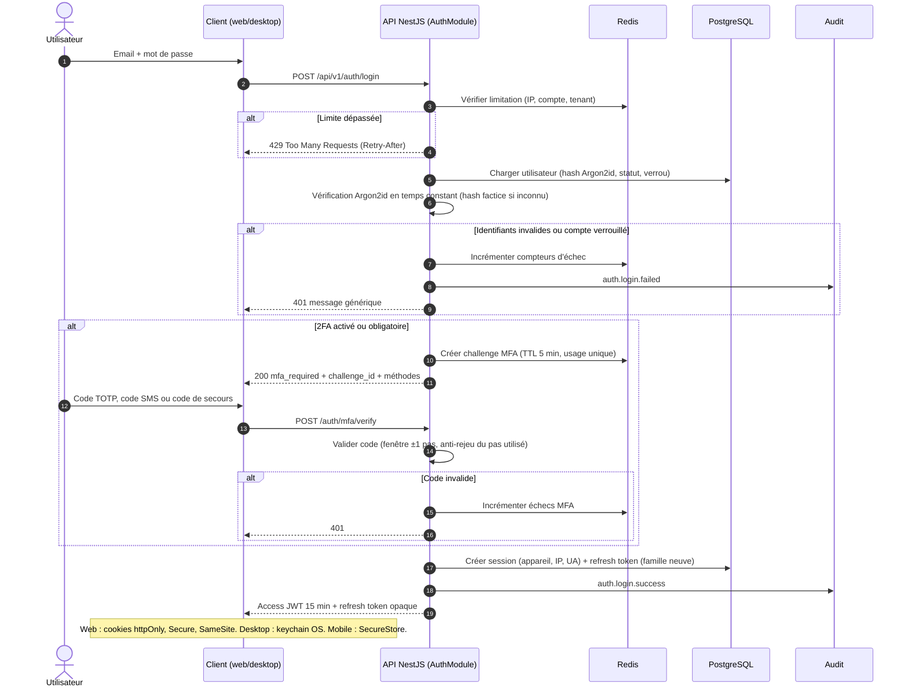

Règles du flux :

- Réponse identique pour « utilisateur inconnu » et « mot de passe faux » (anti-énumération), et temps de réponse équivalent (vérification Argon2id factice).
- Le tenant est déterminé par le sous-domaine (`hopital-x.ghmt.app`) ou par un code établissement saisi. Un même email peut exister dans plusieurs tenants (utilisateurs distincts). Un « sélecteur d'établissement » est proposé si l'identité est rattachée à plusieurs tenants.
- JWT d'accès signé en **EdDSA (Ed25519)** ou RS256 avec `kid` pour rotation des clés de signature. Pas de `alg: none`, algorithme figé côté vérification.

Claims du JWT d'accès :

```json
{
  "iss": "https://api.ghmt.app",
  "aud": "ghmt-api",
  "sub": "usr_01J...",
  "realm": "tenant",
  "tid": "ten_01J...",
  "sid": "ses_01J...",
  "scp": ["est_01J..."],
  "mfa": true,
  "amr": ["pwd", "totp"],
  "iat": 1760000000,
  "exp": 1760000900,
  "jti": "..."
}
```

Les permissions **ne sont pas** dans le JWT (taille, obsolescence) : elles sont résolues côté serveur via le cache Redis (section 3.7). Le claim `sid` permet la révocation immédiate : le guard vérifie dans Redis que la session n'est pas révoquée (clé `sess:revoked:{sid}`, TTL égal à la durée de vie résiduelle du JWT).

### 1.3 Mots de passe

Politique alignée sur **NIST SP 800-63B** :

| Règle | Valeur |
|---|---|
| Longueur minimale | 10 caractères (12 pour rôles plateforme et admin établissement) |
| Longueur maximale acceptée | 128 caractères minimum (pas de troncature) |
| Règles de composition (majuscule, symbole…) | **Aucune** imposée |
| Expiration périodique | **Aucune** (changement uniquement en cas de compromission suspectée) |
| Liste de refus | Top mots de passe courants, nom de l'établissement, email, nom/prénom de l'utilisateur, mots du domaine (« hopital », « ghmt »…) |
| HaveIBeenPwned (k-anonymity) | **Optionnel** (flag `HIBP_ENABLED`) |
| Collage dans le champ | Autorisé (gestionnaires de mots de passe) |
| Historique | Interdit de réutiliser les 5 derniers hashes |
| Évaluation de robustesse | zxcvbn côté client (indicatif) et vérification côté serveur |

Vérification HIBP : le serveur calcule SHA-1 du mot de passe, envoie uniquement les 5 premiers caractères hexadécimaux à `https://api.pwnedpasswords.com/range/{prefix}` avec l'en-tête `Add-Padding: true`, puis compare le suffixe localement. Le mot de passe et son hash complet ne quittent jamais le serveur. En cas d'indisponibilité du service, on **échoue ouvert** (le contrôle est consultatif) et on journalise l'événement. Option de désactivation pour les déploiements sans accès Internet sortant.

Hachage :

```ts
// packages/api/src/auth/password.service.ts (indicatif)
import { hash, verify, Algorithm } from '@node-rs/argon2';

const ARGON2_OPTS = {
  algorithm: Algorithm.Argon2id,
  memoryCost: 65536, // 64 MiB, à calibrer sur le matériel cible (~250 ms)
  timeCost: 3,
  parallelism: 1,
};

export const hashPassword = (pw: string) => hash(pw, ARGON2_OPTS);
export const verifyPassword = (h: string, pw: string) => verify(h, pw);
// Rehash transparent à la connexion si les paramètres ont évolué (needsRehash).
```

Un « pepper » applicatif (HMAC-SHA-256 du mot de passe avec une clé stockée dans le KMS/Vault, avant Argon2id) est recommandé : il protège contre une fuite de la seule base de données. Il impose de gérer sa rotation (champ `pepper_version` sur le hash).

### 1.4 Authentification multi-facteurs

**TOTP (RFC 6238)** : SHA-1, 6 chiffres, pas de 30 s, tolérance ±1 pas. Le secret est généré sur 160 bits, **chiffré au repos** (AES-256-GCM, section 6). Le dernier pas accepté est mémorisé pour empêcher le rejeu d'un même code.

**Enrôlement** : `POST /auth/mfa/totp/setup` renvoie l'URI `otpauth://` (QR code), puis `POST /auth/mfa/totp/activate` exige un premier code valide. À l'activation, 10 **codes de secours** sont générés.

**Codes de secours** : 10 codes à usage unique de 10 caractères (alphabet sans ambiguïté), affichés une seule fois, stockés sous forme de hash (Argon2id ou HMAC-SHA-256 avec pepper). Chaque utilisation est auditée et notifiée à l'utilisateur ; la régénération invalide l'ancien lot.

**OTP SMS (option)** : disponible par tenant, déconseillé pour les rôles privilégiés (risque d'échange de SIM), mais utile en contexte de faible équipement. Code de 6 chiffres, TTL 5 min, 3 essais maximum, 5 envois par heure et par numéro, hash du code stocké dans Redis, coût SMS plafonné par tenant (quota de l'abonnement).

**Obligations MFA par rôle** :

| Rôle | MFA |
|---|---|
| Super Admin, Support, Commercial | TOTP obligatoire (ou WebAuthn) |
| Admin établissement, Directeur, Comptable, Responsable RH, Pharmacien | Obligatoire par défaut (désactivable explicitement par le tenant avec avertissement et audit) |
| Autres rôles tenant | Optionnel, activable pour tous par politique tenant |
| Patient | OTP SMS à la connexion et à l'enrôlement d'un nouvel appareil |

**Appareils de confiance** : option « se souvenir de cet appareil 30 jours » (jeton opaque lié à la session, hash stocké). Désactivée pour le realm `platform`.

### 1.5 Refresh token rotatif et détection de réutilisation

Le refresh token est **opaque** (256 bits aléatoires, base64url), stocké en base uniquement sous forme de hash SHA-256. Chaque refresh produit un nouveau token et invalide le précédent. Les tokens d'une même connexion forment une **famille** ; la réutilisation d'un token déjà consommé indique un vol probable et révoque toute la famille.

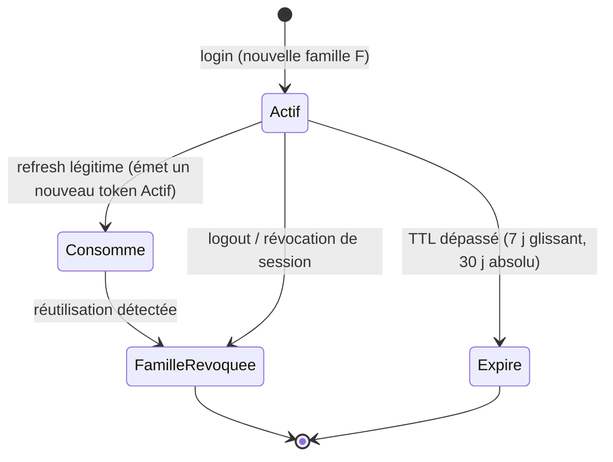

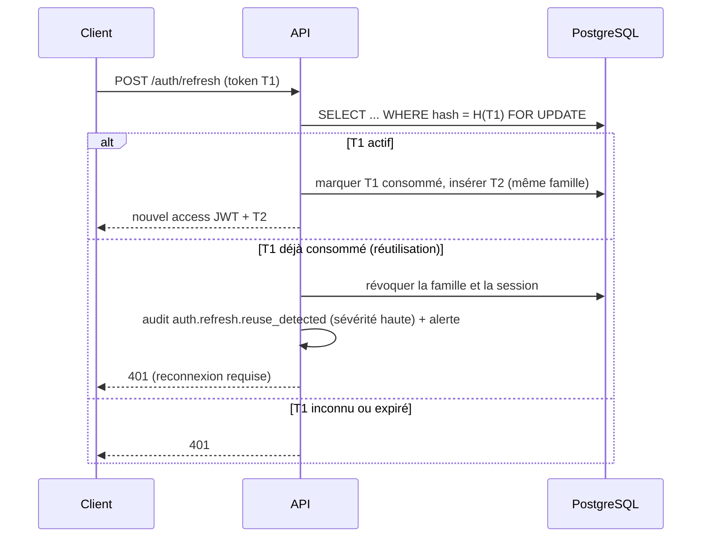

Détails :

- **Fenêtre de grâce** de 10 s pour les nouvelles tentatives réseau (connexion instable : le client n'a pas reçu la réponse). Dans cette fenêtre, la réutilisation de T1 renvoie T2 si T2 n'a pas été utilisé, sans déclencher la révocation. Cette tolérance est indispensable dans le contexte de connectivité dégradée visé.
- **Durées** : inactivité 7 jours (glissante), durée absolue 30 jours (web), 90 jours (mobile patient), 12 h d'inactivité pour les rôles à privilèges plateforme.
- Le refresh est lié au `sid` et à une empreinte souple de l'appareil (famille d'UA) ; un changement drastique déclenche une re-vérification MFA (pas un blocage).
- Cas Desktop hors ligne : le jeton d'accès expire, l'application continue en lecture sur le cache SQLite local chiffré après déverrouillage local (PIN ou mot de passe), les écritures sont mises en file et la synchronisation exige un refresh valide (voir doc 01).

### 1.6 Sessions révocables par appareil

Table `auth_sessions` : `id`, `user_id`, `tenant_id`, `family_id`, `device_label`, `device_id`, `ip`, `user_agent`, `geo_approx`, `created_at`, `last_seen_at`, `revoked_at`, `revoked_reason`.

| Fonction | Endpoint |
|---|---|
| Lister mes sessions | `GET /auth/sessions` |
| Révoquer une session | `DELETE /auth/sessions/{id}` |
| Révoquer toutes les autres | `POST /auth/sessions/revoke-others` |
| Révocation par un admin | `DELETE /iam/users/{id}/sessions` (permission `iam:session:delete`) |

La révocation écrit `sess:revoked:{sid}` dans Redis (effet immédiat sur les JWT en vol) et marque la famille de refresh comme révoquée. Révocation automatique de toutes les sessions lors de : changement de mot de passe, réinitialisation MFA, désactivation de l'utilisateur, retrait d'un rôle sensible. Notification (email/SMS) lors d'une connexion depuis un nouvel appareil.

### 1.7 Limitation et verrouillage

| Niveau | Règle | Réaction |
|---|---|---|
| IP | 20 tentatives de login / 15 min | 429 + délai |
| Compte (par identifiant) | 5 échecs consécutifs | Verrouillage progressif : 1 min, 5 min, 15 min, 1 h, plafonné (pas de verrouillage définitif, pour éviter le déni de service ciblé) |
| Tenant | Pic anormal d'échecs (ex. > 100 / 5 min) | Alerte sécurité, CAPTCHA (Turnstile/hCaptcha) activé |
| MFA | 5 essais par challenge | Challenge invalidé, retour au login |
| OTP SMS | 3 essais, 5 envois / h / numéro | Blocage temporaire |

Compteurs dans Redis (clés `rl:login:ip:{ip}`, `rl:login:acct:{tenant}:{hash(identifiant)}`). Le verrouillage compte n'indique pas à l'appelant si le compte existe. L'utilisateur légitime est notifié par email du verrouillage, avec lien de déblocage par réinitialisation.

### 1.8 Récupération de compte

- **Mot de passe oublié** : lien à usage unique, jeton de 256 bits, hash stocké, TTL 30 min, réponse identique que le compte existe ou non. À la validation : toutes les sessions sont révoquées. Pour les comptes avec MFA, un second facteur est exigé pour finaliser (sauf perte du second facteur, voir ci-dessous).
- **Perte du second facteur** : (1) code de secours ; (2) sinon réinitialisation par un administrateur de l'établissement (permission `iam:user:update`) après vérification d'identité hors bande ; l'action est auditée, notifiée à l'utilisateur et impose un nouvel enrôlement TOTP à la connexion suivante. Pour un admin établissement sans autre admin : procédure Support plateforme avec vérification documentée (pièce d'identité + contact du contrat) et grant audité.
- **Compte patient** : récupération par OTP sur le numéro enregistré ; changement de numéro avec vérification en personne à l'accueil de l'établissement ou double OTP (ancien et nouveau numéro).
- **Délai de carence** : après réinitialisation du MFA, les actions les plus sensibles (export, changement d'email) sont bloquées 24 h.

### 1.9 Invitation d'utilisateurs

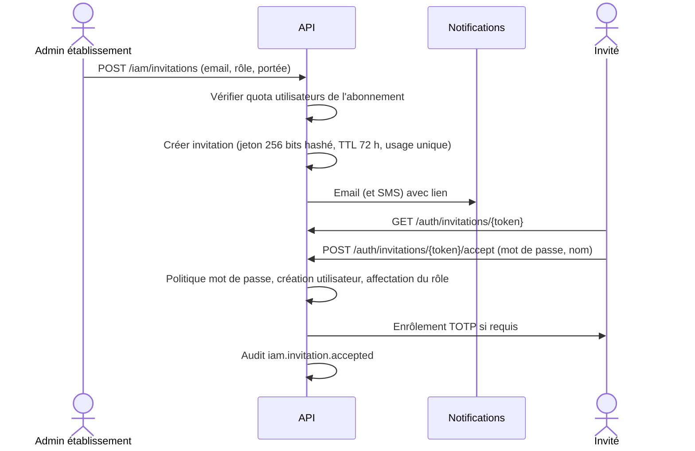

Contraintes : l'invitation est liée à l'email et au tenant, révocable avant acceptation, l'admin ne peut inviter que vers des rôles dont il détient lui-même l'ensemble des permissions (anti-escalade, voir 3.6), un invité n'a aucune permission tant que l'invitation n'est pas acceptée.

### 1.10 Comptes patients (mobile)

- Identité : `patient_account` distinct de `user`, rattaché à un ou plusieurs dossiers patients (lien créé par l'établissement ou par code d'activation remis à l'accueil, pour éviter qu'un tiers ne s'attribue un dossier).
- Connexion : numéro de téléphone (E.164) → OTP SMS (6 chiffres, TTL 5 min) → session. Vérifications de limitation identiques à 1.7.
- Appareil : PIN ou biométrie locale pour déverrouiller l'application ; les jetons sont stockés dans le SecureStore (Keychain iOS / Keystore Android).
- Portée stricte : le realm `patient` n'accède qu'aux ressources liées à ses propres dossiers (ABAC, section 3.5), jamais aux endpoints du personnel.
- Les comptes d'enfants ou de personnes à charge passent par un lien « tuteur » vérifié par l'établissement.
- Les données médicales sensibles affichées dans l'application suivent le consentement du patient (section 10).

### 1.11 SSO futur (OIDC)

Prévu en phase ultérieure pour les groupes hospitaliers (Entra ID, Google Workspace, Keycloak).

- Authorization Code + PKCE ; la configuration par tenant (`issuer`, `client_id`, secret chiffré, mappage de claims vers rôles) est stockée dans `tenant_sso_providers`.
- Le SSO **ne contourne pas** RBAC : le provisionnement JIT crée l'utilisateur avec un rôle par défaut minimal ou selon un mappage de groupes IdP explicite.
- L'émission de nos propres JWT/refresh reste inchangée (l'IdP n'est utilisé qu'à l'authentification) ; la révocation de session reste maîtrisée par GHMT.
- MFA : on honore le claim `amr` de l'IdP, ou on impose notre TOTP selon la politique tenant.
- Conception anticipée : `auth_identities(user_id, provider, subject)` permet de lier plusieurs méthodes à un utilisateur.

### 1.12 Stockage des tokens par client

| Client | Access token | Refresh token | Protection |
|---|---|---|---|
| Web (Next.js) | Cookie `__Host-ghmt_at` : `HttpOnly; Secure; SameSite=Lax; Path=/` | Cookie `__Host-ghmt_rt` : `HttpOnly; Secure; SameSite=Strict; Path=/api/v1/auth` | Jamais de jeton dans `localStorage`. CSRF : double-submit token + vérification `Origin` (section 9.4). |
| Desktop (Tauri 2) | Mémoire du processus | Keychain OS (Windows Credential Manager, macOS Keychain, Secret Service Linux) via plugin Rust | Cache SQLite local chiffré (SQLCipher), clé dérivée stockée dans le keychain. Déverrouillage local par PIN. |
| Mobile (Expo) | Mémoire | `expo-secure-store` (Keychain/Keystore) avec `requireAuthentication` si biométrie activée | Pas d'AsyncStorage pour les secrets. Certificate pinning envisagé. |

Si le front web et l'API sont sur des sous-domaines différents d'un même domaine enregistrable, le cookie est posé avec `Domain` explicite et l'API valide `Origin` strictement. La préférence va à un reverse proxy unique (même origine) pour utiliser le préfixe `__Host-`.

---

## 2. Utilisateurs et rôles

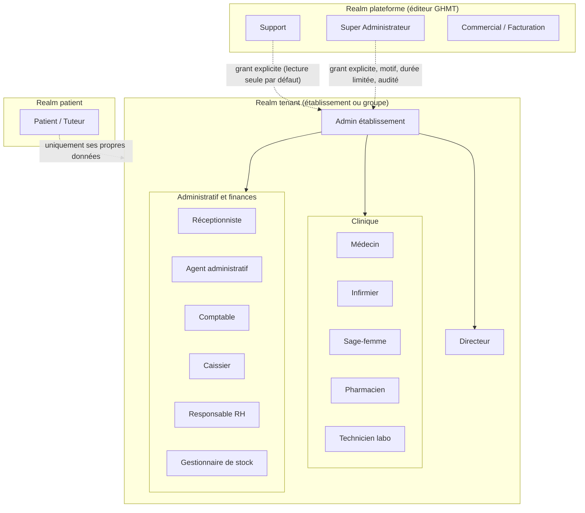

### 2.1 Rôles plateforme

| Rôle | Périmètre | Accès aux données tenant |
|---|---|---|
| Super Admin | Gestion des tenants, plans, configuration globale, comptes plateforme, supervision | **Aucun** par défaut. Accès uniquement via grant (section 5). |
| Support | Assistance, diagnostic, métadonnées techniques des tenants (statut, version, quotas, erreurs) | Aucun par défaut. Grant en lecture seule, sur ticket. |
| Commercial / Facturation | Abonnements, factures SaaS, paiements, relances | Uniquement données de facturation SaaS (jamais de données patients). |

### 2.2 Rôles tenant (modèles système)

Admin établissement, Directeur, Médecin, Infirmier, Sage-femme, Pharmacien, Technicien labo, Réceptionniste, Agent administratif, Comptable, Responsable RH, Gestionnaire de stock, Caissier. Ces modèles sont fournis à la création du tenant (section 3.3) et adaptables.

L'Admin établissement gère les utilisateurs, rôles et paramètres mais **ne reçoit pas** par défaut les permissions cliniques de lecture de dossier : un administrateur technique n'a pas besoin de lire les dossiers médicaux (séparation des tâches). Le Directeur dispose des tableaux de bord et rapports agrégés.

### 2.3 Patient

Realm distinct : accès à son dossier selon le consentement, ses rendez-vous, ses résultats publiés par l'établissement, ses factures, et gestion de ses consentements.

---

## 3. Modèle de permissions RBAC

### 3.1 Format

`module:ressource:action`

- **module** : identifiant du module métier (aligné sur les modules Nest et sur les modules d'abonnement).
- **ressource** : entité métier.
- **action** : `read`, `create`, `update`, `delete`, `validate`, `export`, `print`.
- Jokers autorisés **uniquement** dans les définitions de rôles système : `patients:*:read`. Jamais dans l'API de décoration (le code déclare toujours une permission précise).

Sémantique des actions :

| Action | Sens |
|---|---|
| `read` | Consulter (liste et détail). Toute lecture de dossier patient est auditée. |
| `create` | Créer un enregistrement. |
| `update` | Modifier (avec audit avant/après). |
| `delete` | Suppression logique (archivage). La suppression physique est une opération de conformité distincte, hors RBAC courant. |
| `validate` | Acte de validation engageant (valider un résultat de labo, une prescription, clôturer une facture, valider une paie). |
| `export` | Extraction hors du système (CSV, PDF en masse, API d'export). Toujours auditée, souvent sous quota. |
| `print` | Impression ou génération de document imprimable (ordonnance, bulletin, étiquette). Auditée. |

### 3.2 Catalogue de permissions par module

Le catalogue est la source unique dans `packages/shared/src/permissions/catalog.ts`, typé et exporté vers l'API et le front. Les actions notées entre parenthèses sont les actions applicables.

| Module | Ressources (actions applicables) |
|---|---|
| `platform` (realm plateforme) | `tenant` (read, create, update, delete), `plan` (read, create, update), `subscription` (read, update), `invoice` (read, create, export), `grant` (read, create, validate), `staff` (read, create, update, delete) |
| `iam` | `user` (read, create, update, delete, export), `role` (read, create, update, delete), `assignment` (read, create, delete), `session` (read, delete), `invitation` (read, create, delete), `policy` (read, update) |
| `org` | `group`, `establishment`, `site`, `service` (read, create, update, delete) |
| `patients` | `patient` (read, create, update, delete, export, print), `identity_doc` (read, create), `consent` (read, create, update), `merge` (validate) |
| `appointments` | `appointment` (read, create, update, delete, print), `agenda` (read, update) |
| `consultations` | `consultation` (read, create, update, validate, print), `diagnosis` (read, create, update), `prescription` (read, create, update, validate, print), `medical_record` (read, export, print) |
| `nursing` | `care_plan` (read, create, update, validate), `vitals` (read, create, update), `administration` (read, create, validate) |
| `maternity` | `pregnancy_file` (read, create, update, validate), `delivery` (read, create, update, validate), `newborn` (read, create, update) |
| `inpatient` | `admission` (read, create, update, validate), `bed` (read, update), `discharge` (create, validate, print) |
| `pharmacy` | `dispensation` (read, create, validate, print), `drug` (read, create, update, delete), `stock_movement` (read, create), `order` (read, create, validate) |
| `laboratory` | `order` (read, create), `sample` (read, create, update), `result` (read, create, update, validate, print, export) |
| `imaging` | `order` (read, create), `report` (read, create, update, validate, print), `image` (read, create) |
| `billing` | `invoice` (read, create, update, delete, validate, print, export), `price_list` (read, update), `insurance_claim` (read, create, validate, export) |
| `cashier` | `payment` (read, create, validate, print), `cash_session` (read, create, validate), `refund` (create, validate) |
| `accounting` | `entry` (read, create, update, validate, export), `period` (validate), `report` (read, export, print) |
| `hr` | `employee` (read, create, update, delete, export), `payroll` (read, create, validate, print, export), `leave` (read, create, validate), `schedule` (read, update) |
| `inventory` | `item` (read, create, update, delete), `movement` (read, create, validate), `purchase_order` (read, create, validate), `inventory_count` (create, validate) |
| `reports` | `dashboard` (read), `report` (read, export, print), `statistics` (read, export) |
| `settings` | `establishment` (read, update), `notification_template` (read, update), `integration` (read, update), `module` (read) |
| `audit` | `log` (read, export), `alert` (read, update), `access_report` (read, export) |
| `breakglass` | `access` (create) — déclenche l'accès d'urgence médical (3.5) |

Les permissions créées par un nouveau module sont enregistrées au démarrage (synchronisation idempotente du catalogue vers la table `permissions`).

### 3.3 Rôles système et rôles personnalisés

| Type | Propriété | Modifiable | Supprimable |
|---|---|---|---|
| **Rôle système** (modèle) | Fourni par GHMT, `is_system = true`, `tenant_id = NULL`, versionné | Non (lecture seule pour les tenants) | Non |
| **Rôle tenant cloné** | Créé par « Cloner » un modèle, `source_role_id`, `tenant_id` renseigné | Oui (dans la limite des permissions détenues par l'éditeur) | Oui, sauf s'il est affecté |
| **Rôle personnalisé** | Créé de zéro par le tenant | Oui | Oui, sauf s'il est affecté |

Les mises à jour d'un modèle système (nouvelle version du catalogue) ne modifient jamais silencieusement les rôles clonés : un indicateur « mise à jour disponible » avec comparaison (diff) est proposé à l'administrateur.

Modèle de données :

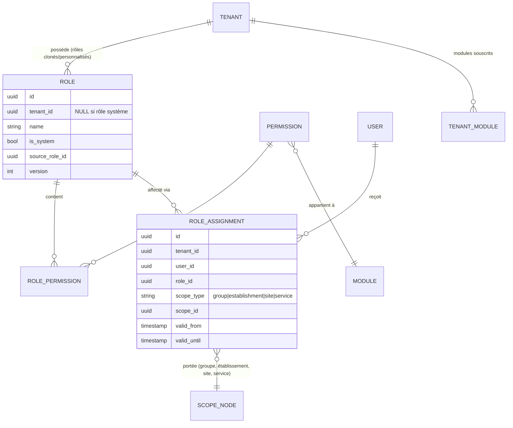

`valid_until` permet des affectations temporaires (remplacement, garde). Les tables sont soumises à la RLS (`tenant_id`), les rôles système (`tenant_id IS NULL`) étant lisibles par tous mais jamais modifiables par le rôle applicatif (politique RLS `USING (tenant_id = current_tenant OR tenant_id IS NULL)` pour SELECT, `WITH CHECK (tenant_id = current_tenant)` pour écriture).

### 3.4 Affectation avec portée et héritage hiérarchique

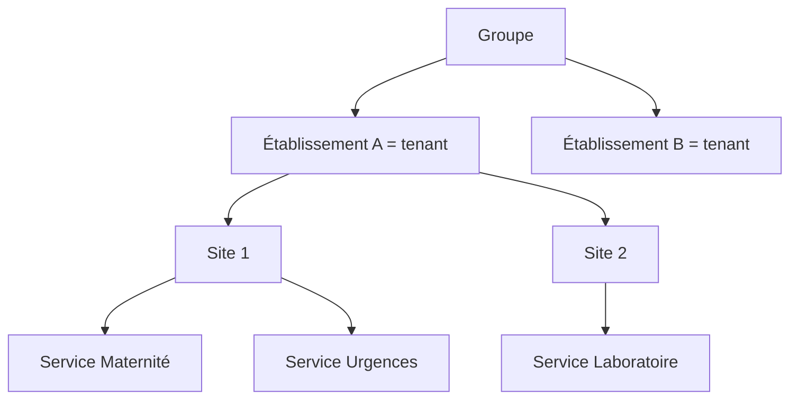

Règles :

1. Une affectation `(utilisateur, rôle, portée)` accorde les permissions du rôle sur le nœud de portée **et tous ses descendants**.
2. Une affectation au niveau `établissement` couvre ses sites et services ; au niveau `site`, ses services ; au niveau `service`, uniquement ce service.
3. L'héritage ne remonte jamais : une affectation au niveau service n'ouvre rien au niveau site.
4. Le niveau `groupe` n'est valide que si le tenant est un groupe (le tenant est alors le groupe, avec plusieurs établissements en tant que nœuds de l'arbre). Il est impossible d'affecter une portée groupe dans un tenant mono-établissement.
5. Les permissions de plusieurs affectations s'**additionnent** (union). Il n'existe pas de « deny » explicite dans le RBAC de base (simplicité, auditabilité). Les restrictions passent par l'ABAC (3.5) ou par le retrait de l'affectation.
6. Chaque ressource métier porte `site_id` et (si pertinent) `service_id` ; l'évaluation compare le nœud de la ressource avec les portées de l'utilisateur via une table de fermeture `scope_closure(ancestor_id, descendant_id)` (ou ltree PostgreSQL).

### 3.5 Règles ABAC complémentaires

Le RBAC répond à « ce rôle peut-il faire cela ? », l'ABAC à « sur cette instance précise ? ». Les règles sont des politiques déclaratives, évaluées après le RBAC (un échec ABAC refuse, un succès ABAC ne peut jamais accorder ce que le RBAC refuse).

| Règle | Condition | Option |
|---|---|---|
| Médecin limité à ses patients | `resource.patient` doit appartenir à la « liste de soins » du médecin (consultation existante, affectation, hospitalisation dans son service, équipe de soins) | Activable par tenant (`policy.restrict_doctor_to_own_patients`) |
| Portée de service | La ressource doit appartenir à un service dans la portée de l'affectation | Toujours actif |
| Données sensibles (VIH, santé mentale, IVG, violences) | Marquage `sensitivity = restricted` sur le dossier ou l'acte : lecture réservée aux membres de l'équipe de soins désignée | Activable ; consentement patient |
| Patient lié à ses propres données | `resource.patient_id ∈ patient_account.linked_patients` | Toujours actif (realm patient) |
| Séparation création/validation | Celui qui crée un acte ne peut pas le valider (ex. résultat labo, remboursement caisse, écriture comptable) | Par action, configurable |
| Horaires et lieux | Accès restreint aux plages de service ou aux adresses IP de l'établissement | Option (rôles administratifs) |
| Limite de montant | Caissier : remboursement ≤ seuil ; au-delà, validation par un autre rôle | Configurable |
| Limite d'export | Quota d'exports par jour et par utilisateur | Configurable |

**Bris de glace médical (« break-glass » clinique)** : en urgence vitale, un soignant habilité peut accéder à un dossier hors de son périmètre ABAC.

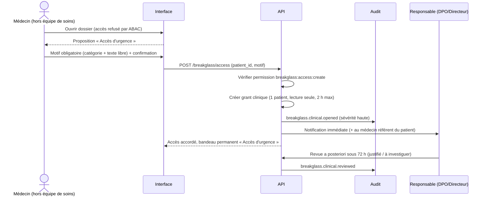

Garde-fous : lecture seule par défaut, limité à un patient, durée de 2 h, chaque consultation durant la période est auditée avec le tag `breakglass`, revue obligatoire, taux de bris de glace par utilisateur suivi (alerte en cas d'abus, section 7.7). Désactivable par tenant.

### 3.6 Anti-escalade de privilèges

- Un utilisateur ne peut attribuer ou composer un rôle qu'avec des permissions qu'il détient lui-même (sur une portée au moins égale).
- Le dernier Admin établissement ne peut ni être supprimé ni perdre son rôle (invariant vérifié en transaction).
- Les permissions `iam:role:*` et `iam:assignment:*` sont réservées par défaut à l'Admin établissement.
- Toute modification de rôle ou d'affectation est auditée (avant/après) et déclenche l'invalidation du cache (3.8).

> **Amendement du 2026-10-04 (décision produit, implémenté dans `apps/api/src/modules/iam/services/privilege.ts`)**
> L'anti-escalade stricte empêchait l'Admin établissement, volontairement dépourvu de droits cliniques, de nommer médecins, infirmiers ou réceptionnistes. Règle retenue :
> - un **rôle système** (modèle immuable) **sans permission `iam:` en écriture** est délégable **à autrui** par tout acteur détenant `iam:assignment:create` (ou `:delete` pour la révocation) sur la portée visée ;
> - l'**auto-affectation**, les **rôles personnalisés** et les rôles portant des droits d'administration (`tenant_admin`) restent soumis à l'anti-escalade stricte ;
> - toutes les affectations sont auditées. Les rôles système étant non modifiables (409 `system_role_immutable`), personne ne peut y injecter de permissions pour contourner la règle.

### 3.7 Matrice rôles × permissions par défaut

Légende des actions : **R** read, **C** create, **U** update, **D** delete, **V** validate, **E** export, **P** print. Un tiret signifie aucun droit. `own` signifie sous réserve de la règle ABAC « ses patients » si l'option est activée. Les valeurs ci-dessous sont les **valeurs par défaut des modèles système**, que chaque tenant peut cloner et ajuster.

**Rôles tenant (modules principaux)**

| Ressource | Admin étab. | Directeur | Médecin | Infirmier | Sage-femme | Pharmacien | Tech. labo | Récep. | Agent admin. | Comptable | RH | Stock | Caissier |
|---|---|---|---|---|---|---|---|---|---|---|---|---|---|
| `iam:user` | RCUDE | R | - | - | - | - | - | - | - | - | R | - | - |
| `iam:role` / `assignment` | RCUD | R | - | - | - | - | - | - | - | - | - | - | - |
| `org:*` | RCUD | R | R | R | R | R | R | R | R | R | R | R | R |
| `settings:*` | RU | R | - | - | - | - | - | - | - | - | - | - | - |
| `patients:patient` | R | R (agrégé) | RCU P | RU | RCU P | R | R (identité) | RCU P | RCU P | R | - | - | R |
| `patients:consent` | - | R | RC | RC | RC | R | - | RCU | RCU | - | - | - | - |
| `appointments:appointment` | - | R | RCU P | RCU | RCU | - | R | RCUD P | RCUD P | - | - | - | R |
| `consultations:consultation` | - | R (stat.) | RCUV P | R | R | R | R (indic.) | - | - | - | - | - | - |
| `consultations:prescription` | - | - | RCUV P | R | RCU | R P | R | - | - | - | - | - | - |
| `consultations:medical_record` | - | - | R P (E selon rôle) | R | R P | R (restreint) | - | - | - | - | - | - | - |
| `nursing:*` | - | R | R | RCUV | RCU | - | - | - | - | - | - | - | - |
| `maternity:*` | - | R | R | R | RCUV | - | - | - | - | - | - | - | - |
| `inpatient:admission` | - | R | RCU V | RU | RU | - | - | RC | RC | - | - | - | - |
| `pharmacy:dispensation` | - | R | R | R | - | RCV P | - | - | - | - | - | - | - |
| `pharmacy:drug` / `stock_movement` | - | R | R | R | R | RCUD | - | - | - | R | - | RC | - |
| `laboratory:order` | - | R | RC | RC | RC | - | R | - | - | - | - | - | - |
| `laboratory:result` | - | R | R | R | R | - | RCU P | - | - | - | - | - | - |
| `laboratory:result` validation | - | - | - | - | - | - | V (biologiste) | - | - | - | - | - | - |
| `imaging:*` | - | R | RC (order), R (report) | R | R | - | - | - | - | - | - | - | - |
| `billing:invoice` | - | R E | R | - | - | - | - | RC P | RCUP | RCUVPE | - | - | RC P |
| `billing:insurance_claim` | - | R | - | - | - | - | - | RC | RCU | RVE | - | - | - |
| `cashier:payment` | - | R | - | - | - | - | - | - | - | R | - | - | RCV P |
| `cashier:cash_session` / `refund` | - | R | - | - | - | - | - | - | - | RV | - | - | RC (refund: C, V par autre) |
| `accounting:*` | - | R E | - | - | - | - | - | - | - | RCUVPE | - | - | - |
| `hr:employee` | - | R | - | - | - | - | - | - | R | - | RCUDE | - | - |
| `hr:payroll` | - | R | - | - | - | - | - | - | - | R | RCV P E | - | - |
| `hr:leave` / `schedule` | - | R | R (own) | R (own) | R (own) | R (own) | R (own) | R (own) | R | - | RCUV | R (own) | R (own) |
| `inventory:*` | - | R | - | - | - | R | - | - | - | R | - | RCUDVE | - |
| `reports:*` | R | RE P | R (clin.) | - | R (clin.) | R (pharm.) | R (labo) | - | R (admin.) | RE P | R (RH) | R (stock) | R (caisse) |
| `audit:log` | R | R | - | - | - | - | - | - | - | - | - | - | - |
| `audit:log` export | - | E (sur permission) | - | - | - | - | - | - | - | - | - | - | - |
| `breakglass:access` | - | - | C | C | C | - | - | - | - | - | - | - | - |

Notes :

- Le Médecin n'a pas `export` sur le dossier médical par défaut ; l'export complet d'un dossier (droit d'accès du patient) passe par un workflow validé (section 10).
- `validate` sur les résultats de labo est donné au **biologiste** (rôle clonable « Biologiste » dérivé de Technicien labo) ; le technicien saisit, ne valide pas par défaut.
- Le Directeur reçoit des vues **agrégées**, pas la lecture nominative des dossiers.
- L'Admin établissement n'a pas de droit de lecture clinique (séparation des tâches).

**Rôles plateforme**

| Ressource | Super Admin | Support | Commercial/Facturation |
|---|---|---|---|
| `platform:tenant` | RCUD | R (métadonnées) | R |
| `platform:plan` | RCU | R | RCU |
| `platform:subscription` | RU | R | RU |
| `platform:invoice` | R E | R | RCE |
| `platform:staff` | RCUD | - | - |
| `platform:grant` | RCV (création sous double validation) | RC (lecture seule uniquement, sous validation) | - |
| Données tenant | via grant uniquement | via grant uniquement | Non (jamais) |

### 3.8 Algorithme d'évaluation

```text
FONCTION authorize(principal, permission, resource?, context) -> ALLOW | DENY(raison)

1. Contexte
   si principal.realm == 'tenant' et principal.tid != context.tenant_id : DENY('tenant_mismatch')
   si session révoquée (Redis sess:revoked:{sid}) : DENY('session_revoked')

2. Module souscrit (double contrôle)
   module = permission.split(':')[0]
   si module non actif dans l'abonnement du tenant (cache tenant:{tid}:modules) : DENY('module_not_subscribed')
   si abonnement suspendu : autoriser uniquement les permissions *:*:read et export des données propres, sinon DENY('subscription_suspended')

3. Permissions effectives (cache Redis, 3.9)
   effective = getEffectivePermissions(principal.user_id, tid)
      = union sur chaque affectation valide (valid_from <= now < valid_until) de
        { (perm, scope_node) | perm ∈ rôle.permissions }
   candidates = { e ∈ effective | e.perm matche permission (jokers autorisés dans les rôles) }
   si candidates vide : DENY('no_permission')

4. Portée
   si resource fournie :
      node = scopeNodeOf(resource)        // service > site > établissement > groupe
      si aucun e ∈ candidates tel que e.scope_node ∈ ancestors(node) ∪ {node} : DENY('out_of_scope')
   sinon (action de liste) :
      scopeFilter = ∪ descendants(e.scope_node) pour e ∈ candidates   // injecté dans la requête

5. ABAC (politiques de l'établissement actives pour cette permission)
   pour chaque politique p applicable :
      résultat = p.evaluate(principal, resource, context)
      si résultat == DENY : retourner DENY(p.id)
      // exception bris de glace : un grant clinique valide pour (principal, patient) neutralise
      // uniquement les politiques marquées `breakglass_overridable`
   // séparation des tâches : si action == 'validate' et resource.created_by == principal.user_id : DENY('sod')

6. Grant plateforme (principal.realm == 'platform' accédant à un tenant)
   exiger un grant actif (section 5) couvrant (permission, tenant, portée) ; sinon DENY('no_grant')

7. Audit
   si permission est sensible (lecture dossier patient, export, print, validate, delete) : émettre événement d'audit
   retourner ALLOW (avec scopeFilter pour les listes)
```

Implémentation NestJS :

```ts
// decorators/require-permission.decorator.ts
import { SetMetadata } from '@nestjs/common';
import type { PermissionKey } from '@ghmt/shared/permissions';

export const PERMISSION_KEY = 'ghmt:permission';
export const RequirePermission = (...perms: PermissionKey[]) =>
  SetMetadata(PERMISSION_KEY, perms); // PermissionKey est un type littéral issu du catalogue
export const Public = () => SetMetadata('ghmt:public', true);
```

```ts
// guards/permission.guard.ts
@Injectable()
export class PermissionGuard implements CanActivate {
  constructor(
    private reflector: Reflector,
    private authz: AuthorizationService,
    private tenantCtx: TenantContextService,
  ) {}

  async canActivate(ctx: ExecutionContext): Promise<boolean> {
    const handlers = [ctx.getHandler(), ctx.getClass()];
    if (this.reflector.getAllAndOverride<boolean>('ghmt:public', handlers)) return true;

    const required = this.reflector.getAllAndOverride<PermissionKey[]>(PERMISSION_KEY, handlers);
    // Refus par défaut : une route non publique sans permission déclarée est une erreur de conception
    if (!required?.length) throw new ForbiddenException();

    const req = ctx.switchToHttp().getRequest();
    const principal = req.principal; // posé par JwtAuthGuard (guard global précédent)
    const decision = await this.authz.check(principal, required, {
      tenantId: this.tenantCtx.tenantId,   // issu du JWT, jamais du corps de requête
      ip: req.ip,
      resourceLoader: () => req.resource,  // chargée par un interceptor pour les routes /:id
    });
    if (!decision.allowed) {
      // Réponse générique, raison détaillée uniquement en audit
      throw new ForbiddenException();
    }
    req.scopeFilter = decision.scopeFilter;
    return true;
  }
}

// Enregistrement global (ordre : Throttler, JwtAuthGuard, TenantGuard, PermissionGuard)
// { provide: APP_GUARD, useClass: PermissionGuard }
```

```ts
// Usage
@Controller('patients')
export class PatientsController {
  @Get(':id')
  @RequirePermission('patients:patient:read')
  @Audited({ action: 'patient.read', resource: 'patient' })
  find(@Param('id', ParseUUIDPipe) id: string) { /* ... */ }

  @Post(':id/export')
  @RequirePermission('patients:patient:export')
  export(@Param('id', ParseUUIDPipe) id: string) { /* ... */ }
}
```

Un test automatisé parcourt tous les contrôleurs et échoue si une route n'est ni `@Public()` ni décorée par `@RequirePermission` (garde-fou CI), et vérifie que chaque `PermissionKey` utilisée existe dans le catalogue.

### 3.9 Cache Redis des permissions effectives

| Clé | Contenu | TTL |
|---|---|---|
| `t:{tid}:perm:{uid}` | Liste compacte des `(permission, scope_node)` effectives + `perm_version` | 10 min |
| `t:{tid}:perm_ver:{uid}` | Compteur de version utilisateur | sans TTL |
| `t:{tid}:modules` | Modules actifs de l'abonnement + statut | 5 min |
| `t:{tid}:scope_tree` | Arbre organisationnel (fermeture) | 30 min |

Invalidation :

- Événements : modification d'un rôle, ajout ou retrait d'affectation, expiration d'une affectation, changement d'abonnement/module, déplacement d'un site ou service dans l'arbre, désactivation d'utilisateur.
- Mécanisme : le service IAM publie sur un canal Redis Pub/Sub `t:{tid}:perm:invalidate` ; il incrémente la version de l'utilisateur concerné (ou de tous les utilisateurs du rôle modifié, via la liste des affectations). Le garde compare la version en cache ; en cas de divergence, il recalcule.
- Dernier rempart : TTL court (10 min), et vérification de la révocation de session à chaque requête.
- Un échec Redis déclenche un **recalcul depuis PostgreSQL** (dégradation sans perte de sécurité), jamais une autorisation par défaut.

### 3.10 Double contrôle par module d'abonnement

Un module non souscrit est inaccessible à **deux niveaux** indépendants :

1. **Niveau route** : `ModuleEnabledGuard` (ou étape 2 de l'algorithme) refuse toute requête vers un module désactivé (réponse `403` avec code `MODULE_NOT_SUBSCRIBED`).
2. **Niveau permission** : les permissions d'un module non souscrit sont filtrées de l'ensemble effectif, même si un rôle les contient ; le front masque les menus correspondants à partir de `GET /me/capabilities`.

Un module désactivé conserve ses données (lecture et export possibles selon le plan pendant la période de grâce) ; les workers BullMQ et webhooks du module sont également stoppés. Le détail des plans figure dans `05-saas-notifications.md`.

---

## 4. Isolation stricte des tenants

Principe : **aucune fuite inter-tenant ne doit dépendre d'une seule barrière**.

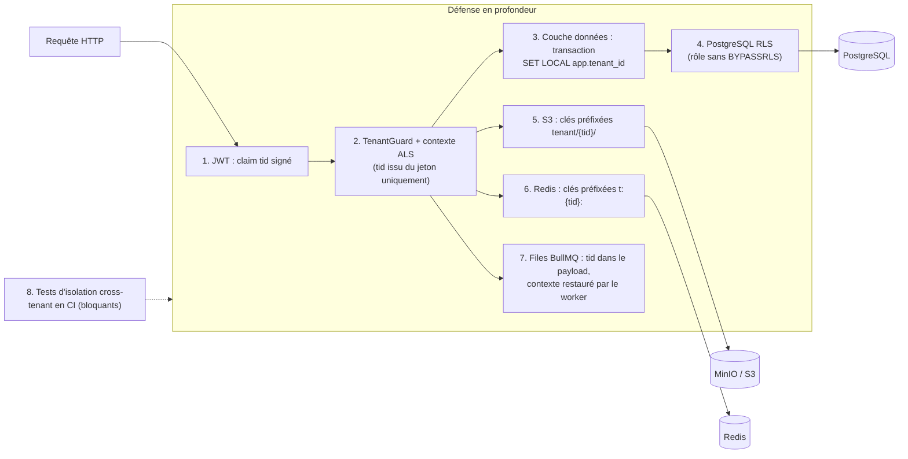

### 4.1 Couches de protection

1. **JWT** : le claim `tid` est signé ; aucune route tenant n'accepte `tenant_id` dans l'URL, le corps ou un en-tête comme source de vérité. Si un identifiant de tenant figure dans l'URL (console plateforme), il est comparé au claim et au grant.
2. **Contexte** : un `TenantGuard` extrait `tid`, vérifie que le tenant est actif, et alimente un `AsyncLocalStorage` (`TenantContext`). Tout accès hors contexte (sans `tid`) lève une exception, sauf code explicitement marqué `@SystemContext()` (jobs de plateforme, migrations).
3. **Couche d'accès aux données** : l'extension Prisma (`$extends`) ouvre une transaction par requête (ou par unité de travail) et exécute `SELECT set_config('app.tenant_id', $1, true)` (équivalent `SET LOCAL`) avant toute requête. Interdit : `prisma.$queryRawUnsafe` sans revue ; `$queryRaw` autorisé uniquement via des helpers qui passent par le même client contextualisé.
4. **Row-Level Security** : toutes les tables métier ont `tenant_id NOT NULL`, `ENABLE ROW LEVEL SECURITY` **et** `FORCE ROW LEVEL SECURITY` ; le rôle applicatif n'est ni propriétaire des tables, ni superuser, ni `BYPASSRLS`. Si `app.tenant_id` n'est pas défini, la politique ne renvoie aucune ligne.

```sql
ALTER TABLE patients ENABLE ROW LEVEL SECURITY;
ALTER TABLE patients FORCE ROW LEVEL SECURITY;

CREATE POLICY tenant_isolation ON patients
  USING      (tenant_id = NULLIF(current_setting('app.tenant_id', true), '')::uuid)
  WITH CHECK (tenant_id = NULLIF(current_setting('app.tenant_id', true), '')::uuid);

-- Rôles distincts : ghmt_app (RLS appliquée), ghmt_migrator (DDL), ghmt_platform_ro (vues plateforme sans données cliniques)
```

   Les clés primaires et contraintes d'unicité incluent `tenant_id` (ex. `UNIQUE (tenant_id, numero_dossier)`) et les clés étrangères sont **composites** `(tenant_id, id)` pour empêcher qu'une ligne d'un tenant référence celle d'un autre.
   Le pooler (PgBouncer) fonctionne en mode **transaction** : c'est précisément pourquoi on utilise `SET LOCAL`/`set_config(..., true)` et non `SET` de session.
5. **Fichiers** : clés `tenant/{tid}/{module}/{yyyy}/{uuid}`. Le serveur génère la clé (jamais fournie par le client), vérifie en base que le fichier appartient au tenant avant de signer une URL (TTL 60 à 300 s, `Content-Disposition` forcé). Les politiques IAM du compte de service S3 limitent aux buckets de l'application ; option : bucket ou chiffrement SSE-KMS par tenant pour les clients Enterprise.
6. **Redis** : toutes les clés passent par un `TenantCache` qui impose le préfixe `t:{tid}:` ; accès Redis brut interdit par règle ESLint (`no-restricted-imports`). Les files BullMQ transportent `tid` dans le payload, et le worker reconstitue le contexte (et la transaction RLS) avant tout traitement.
7. **Journaux et recherche** : `tid` présent dans chaque ligne de log, métriques et traces (Pino/OTel), sans données de santé. Si un moteur de recherche est ajouté (OpenSearch), index filtrés par tenant avec alias à filtre obligatoire.
8. **Tests automatisés d'isolation (obligatoires en CI, bloquants)** :
   - *Test de schéma* : chaque table du schéma public porte `tenant_id`, RLS activée et forcée, et une politique `tenant_isolation` (liste d'exceptions explicitement revue : tables de catalogue globales).
   - *Test fonctionnel cross-tenant* : deux tenants A et B sont créés avec des jeux de données ; pour **chaque endpoint** (généré depuis OpenAPI), un utilisateur du tenant A tente lecture, modification, suppression sur des identifiants de B ; la réponse attendue est `404` (pas `403`, pour ne pas révéler l'existence).
   - *Test RLS direct* : connexion avec le rôle `ghmt_app` sans `app.tenant_id` renvoie 0 ligne ; avec `app.tenant_id = A`, aucune ligne de B n'est visible ni insérable.
   - *Tests Redis et S3* : une clé ou un fichier de A n'est pas accessible avec le contexte de B.
   - *Fuzz d'identifiants* : IDs de B injectés dans les paramètres, filtres, tris, relations imbriquées et pièces jointes.
   - Le job CI échoue si un nouvel endpoint n'est pas couvert par la matrice de tests cross-tenant.

### 4.2 Particularités

- **Groupe** : le tenant est le groupe, et les établissements sont des nœuds de portée (section 3.4) ; l'isolation entre établissements d'un même groupe est de nature RBAC/ABAC, pas RLS.
- **Tenant Enterprise à base dédiée** : même code, chaîne de connexion par tenant résolue par le `TenantContext` ; la RLS reste active comme ceinture et bretelles.
- **Requêtes plateforme** (statistiques, facturation) : utilisent un rôle `ghmt_platform` doté de vues dédiées et agrégées, sans accès aux tables cliniques.

---

## 5. Accès du Super Administrateur aux données d'un tenant

Par défaut, **aucun compte plateforme ne peut lire de donnée de tenant**. Le support passe par un grant.

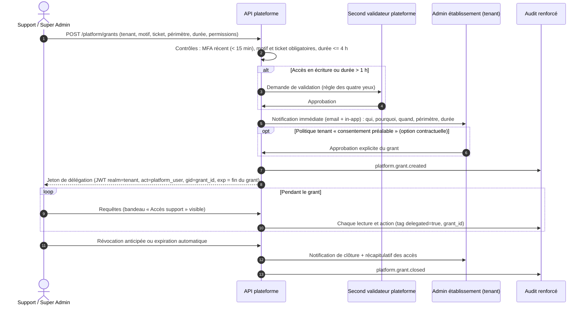

Règles :

| Élément | Règle |
|---|---|
| Motif | Obligatoire (catégorie + texte), référence de ticket de support obligatoire |
| Durée | Maximum 4 h (par défaut 1 h), non renouvelable automatiquement ; renouvellement = nouveau grant |
| Périmètre | Limité à un tenant, à des modules et à des permissions explicites ; lecture seule par défaut. Aucune permission `export` ni `breakglass` pour un grant. |
| Validation | Règle des quatre yeux pour l'écriture ou une durée longue ; le demandeur ne peut pas être son propre validateur |
| Notification | Admin établissement notifié à l'ouverture et à la clôture ; récapitulatif quotidien de tous les grants ; option contractuelle d'approbation préalable |
| Jeton | JWT distinct avec claim `act` (RFC 8693) identifiant l'opérateur plateforme, `gid` du grant, expiration égale à la fin du grant ; révocable immédiatement |
| Audit renforcé | Événement par requête (méthode, ressource, identifiants, résultat), tag `delegated`, **visible par l'établissement** dans son journal d'audit, conservé plus longtemps (7 ans), copie dans le stockage d'audit plateforme |
| Interdits | Pas de lecture directe en base de production par le personnel ; accès SQL réservé à un compte « bris de glace infrastructure » via bastion, enregistrement de session, approbation à deux personnes, et audité |
| Dissimulation | Les champs chiffrés au niveau applicatif ne sont déchiffrés pour un grant que si le périmètre l'inclut explicitement (la KEK du tenant n'est jamais exposée à l'opérateur) |
| Revue | Revue mensuelle des grants par la direction de la plateforme ; indicateurs reportés au DPO |

---

## 6. Chiffrement

### 6.1 En transit

- **TLS 1.3** de bout en bout (TLS 1.2 toléré uniquement en repli pour clients anciens, suites AEAD uniquement, à retirer à terme). Terminaison au reverse proxy (Caddy/Traefik/Nginx), certificats Let's Encrypt/ACME avec renouvellement automatique et surveillance d'expiration.
- **HSTS** : `Strict-Transport-Security: max-age=63072000; includeSubDomains; preload`. Redirection HTTP vers HTTPS.
- Chiffrement des liaisons internes : PostgreSQL (`sslmode=verify-full`), Redis (TLS), MinIO/S3 (TLS), inter-services (mTLS en Kubernetes via maillage de services ou certificats internes).
- Clients mobile et Desktop : épinglage de certificat envisagé (avec stratégie de rotation de clés d'épinglage pour ne pas bloquer les clients).
- SMTP en STARTTLS/TLS obligatoire, avec SPF, DKIM et DMARC pour les emails transactionnels.

### 6.2 Au repos

| Couche | Mesure |
|---|---|
| Disques serveurs (PostgreSQL, Redis persistant, MinIO) | Chiffrement de volume (LUKS ou chiffrement du fournisseur cloud, clés gérées via KMS) |
| Sauvegardes | Chiffrement côté client avant envoi hors site (pgBackRest `repo-cipher-type=aes-256-cbc` ou WAL-G avec clé libsodium/KMS), clés distinctes de celles de la production |
| Objets (S3/MinIO) | SSE-KMS ou SSE-S3 activé par défaut ; fichiers à très forte sensibilité chiffrés aussi au niveau applicatif |
| Postes Desktop | Cache SQLite chiffré (SQLCipher, clé dans le keychain), effacement à distance (révocation des clés de session) |
| Mobile | SecureStore pour les secrets ; pas de données de santé en cache non chiffré |

### 6.3 Chiffrement applicatif de champs sensibles

Choix des champs : ils doivent rester **peu nombreux** pour préserver la recherche, les index et les performances.

| Champ | Chiffrement applicatif | Recherche |
|---|---|---|
| Secrets TOTP, secrets d'intégration (API keys, SSO) | Oui (obligatoire) | Non |
| Numéro de pièce d'identité, numéro de sécurité sociale / d'assurance | Oui | Index aveugle HMAC (égalité) |
| Téléphone, email du patient | Oui (option tenant) | Index aveugle HMAC (égalité) |
| Notes cliniques libres, diagnostics psychiatriques, statut VIH, motifs sensibles | Oui | Pas de recherche en clair (recherche limitée aux métadonnées) |
| Coordonnées bancaires, mobile money du personnel | Oui | Non |
| Données de paie | Oui (option) | Non |

Schéma d'**enveloppe** (envelope encryption) :

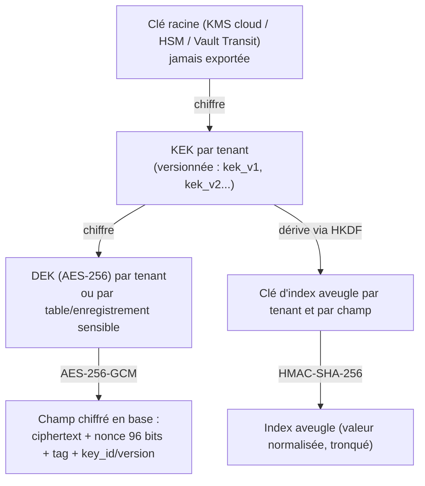

Format de stockage d'un champ : `v1:{kek_version}:{dek_id}:{nonce_b64}:{ciphertext_b64}:{tag_b64}`.

```ts
// crypto/field-crypto.service.ts (indicatif)
import { createCipheriv, createDecipheriv, randomBytes, createHmac } from 'node:crypto';

export class FieldCrypto {
  constructor(private keys: TenantKeyProvider) {} // DEK en cache mémoire, déchiffrée via KMS

  async encrypt(tenantId: string, field: string, plaintext: string): Promise<string> {
    const { dek, keyId } = await this.keys.currentDek(tenantId);
    const iv = randomBytes(12); // nonce unique 96 bits
    const c = createCipheriv('aes-256-gcm', dek, iv);
    // AAD lie le chiffré au tenant et au champ : un chiffré copié ailleurs ne se déchiffre pas
    c.setAAD(Buffer.from(`${tenantId}|${field}`));
    const ct = Buffer.concat([c.update(plaintext, 'utf8'), c.final()]);
    return ['v1', keyId, iv.toString('base64'), ct.toString('base64'), c.getAuthTag().toString('base64')].join(':');
  }

  async blindIndex(tenantId: string, field: string, value: string): Promise<string> {
    const key = await this.keys.blindIndexKey(tenantId, field); // dérivée HKDF, distincte de la DEK
    const normalized = value.normalize('NFKC').trim().toLowerCase();
    return createHmac('sha256', key).update(normalized).digest('base64url').slice(0, 32);
  }
}
```

Points de conception :

- **DEK** en cache mémoire (TTL court) après déchiffrement par le KMS : évite un appel KMS par champ.
- **AAD** (tenant + nom de champ) empêche le déplacement d'un chiffré entre tenants ou colonnes.
- **Index aveugles** : permettent la recherche d'égalité exacte (numéro de pièce, téléphone) sans déchiffrer. Pas de recherche partielle ; si indispensable, indexation de n-grammes HMAC en acceptant la fuite d'information (à éviter pour les champs critiques). Un index aveugle est par tenant et par champ (clé dérivée) afin d'empêcher les corrélations inter-tenants.
- **Prisma** : implémenté via une extension de requête qui chiffre à l'écriture et déchiffre à la lecture pour les champs annotés (commentaire `/// @encrypted` dans le schéma), avec tests de non-régression : aucune valeur en clair en base (test SQL).
- **KMS / Vault** : au MVP, HashiCorp Vault (Transit) ou OpenBao auto-hébergé ; pour un déploiement cloud, KMS du fournisseur. L'abstraction `KeyManagementPort` permet de passer de l'un à l'autre. Pour un environnement très contraint, une option de repli est une clé maître en variable d'environnement injectée par secret manager, avec avertissement et plan de migration (niveau de sécurité inférieur).
- **Pas de clé en base ni en dépôt** ; la clé racine ne quitte jamais le KMS.

### 6.4 Rotation des clés

| Clé | Fréquence | Procédure |
|---|---|---|
| Clé de signature JWT | 90 jours | Publication `kid` multiple (JWKS), ancienne clé conservée pour la vérification jusqu'à expiration des jetons (15 min + marge) |
| KEK par tenant | 12 mois et sur incident | Nouvelle version ; les DEK sont **rechiffrées** (re-wrap) sous la nouvelle KEK, sans retraiter les données |
| DEK | 24 mois ou sur incident | Nouvelle DEK pour les nouvelles écritures ; rechiffrement en tâche de fond (BullMQ, par lots, reprenable) des anciennes données, `key_id` dans chaque valeur permet la cohabitation |
| Pepper mots de passe | Sur incident | Versionné (`pepper_version`), rehash au login suivant |
| Clés de sauvegarde | 12 mois | Conservation des anciennes pour restaurer les anciennes sauvegardes |
| Certificats TLS | Automatique (60 j) | ACME |
| Secrets applicatifs (DB, Redis, S3, SMS) | 90 jours | Rotation via secret manager, déploiement sans interruption (double secret) |

**Crypto-effacement** : à la résiliation d'un tenant (après le délai légal de conservation et export des données), la destruction de sa KEK rend ses champs chiffrés et ses sauvegardes applicativement illisibles ; procédure tracée et irréversible.

---

## 7. Journal d'audit

### 7.1 Événements à tracer

| Catégorie | Événements |
|---|---|
| Authentification | Connexion réussie, échec, verrouillage, déverrouillage, déconnexion, MFA (activation, échec, usage d'un code de secours), refresh réutilisé, nouvel appareil, réinitialisation de mot de passe, révocation de session |
| Accès aux données de santé | **Lecture** d'un dossier patient (consultation, résultats, imagerie, prescription, document), recherche patient, accès via bris de glace |
| Modifications | Création, mise à jour, suppression logique avec **avant/après** (diff des champs, valeurs sensibles masquées ou chiffrées) |
| Sorties de données | Exports (CSV, PDF), impressions, téléchargements de documents, envois par email/SMS de données |
| Validation | Validation de résultat, prescription, facture, clôture de caisse, paie, écritures comptables |
| Administration | Création et modification d'utilisateurs, rôles, affectations, politiques, modules, paramètres, intégrations |
| Changements de permissions | Rôle créé/cloné/modifié, permission ajoutée ou retirée, affectation créée/terminée (avant/après) |
| Super Admin | Création/validation/clôture de grant, **chaque requête** sous grant, actions sur tenants, plans, accès infra exceptionnels |
| Sécurité | Violations d'autorisation (403 répétés), tentatives cross-tenant, rate limit atteint, upload refusé (antivirus), alertes déclenchées |
| Conformité | Consentements (recueil, retrait), demandes de droits des patients, exports d'accès patient, purges |

### 7.2 Format d'événement

```json
{
  "id": "evt_01J8Z...",
  "ts": "2026-10-04T09:12:45.123Z",
  "tenant_id": "ten_01J...",
  "actor": {
    "type": "user",
    "id": "usr_01J...",
    "realm": "tenant",
    "role_ids": ["rol_01J..."],
    "delegated_by": null
  },
  "action": "patient.read",
  "category": "phi_access",
  "severity": "info",
  "resource": { "type": "patient", "id": "pat_01J...", "scope": { "site_id": "sit_01J...", "service_id": "srv_01J..." } },
  "outcome": "success",
  "reason": null,
  "changes": null,
  "context": {
    "ip": "41.82.x.x",
    "user_agent_family": "Chrome 130 / Windows",
    "session_id": "ses_01J...",
    "request_id": "req_01J...",
    "client": "web",
    "breakglass": false,
    "grant_id": null
  },
  "prev_hash": "b7e1...",
  "hash": "9c3a...",
  "seq": 1048576
}
```

- `changes` pour les modifications : `{ "fields": { "statut": { "before": "actif", "after": "sorti" } } }` ; les champs sensibles sont remplacés par `"[redacted]"` ou par un condensé HMAC (indique « a changé » sans révéler la valeur).
- Aucune donnée de santé en clair dans l'événement : on référence l'identifiant ; les contenus restent en base métier.
- Les événements sont émis par un `AuditInterceptor` (décorateur `@Audited`) et par les services pour les cas non HTTP (jobs, sync).

### 7.3 Intégrité : append-only et chaîne de hachage

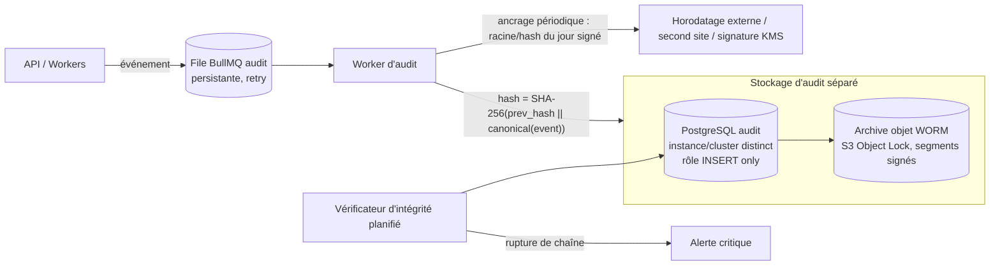

- **Append-only** : table `audit_events` partitionnée par mois ; le rôle applicatif d'audit n'a que `INSERT` (et `SELECT` pour la consultation) ; pas d'`UPDATE`/`DELETE` ; triggers de refus ; modification impossible sans compte DBA distinct et tracé.
- **Chaîne de hachage** : une chaîne **par tenant** (`prev_hash` = hash de l'événement précédent du tenant, ordre par `seq` attribué par le worker unique par tenant, ou verrou consultatif). La falsification ou la suppression d'un événement casse la chaîne.
- **Ancrage** : chaque jour, le hash de tête de chaque chaîne est signé (clé KMS dédiée) et exporté vers un stockage WORM distinct (Object Lock en mode conformité), idéalement sur un second fournisseur ou site. Un vérificateur recalcule la chaîne et alerte en cas d'écart.
- **Stockage séparé** : base d'audit dans un cluster distinct de la base métier, avec identifiants distincts et administrateurs différents (séparation des tâches). L'audit n'est donc pas altérable par une compromission de l'application métier.
- **Disponibilité** : si le stockage d'audit est indisponible, les événements restent dans la file persistante (Redis AOF + repli sur outbox PostgreSQL). Pour les opérations de la catégorie `phi_access`, `export` et `grant`, politique **fail-closed** : si l'événement ne peut pas être mis en file durablement, l'opération est refusée.

### 7.4 Rétention

| Catégorie | Rétention en ligne | Archive | Remarque |
|---|---|---|---|
| Accès aux dossiers, modifications cliniques | 2 ans | jusqu'à 10 ans | Aligner sur la durée de conservation légale des dossiers du pays et sur les exigences de l'établissement |
| Authentification | 1 an | 3 ans | |
| Administration, permissions, grants plateforme | 3 ans | 7 ans | |
| Logs techniques (sans PHI) | 30 à 90 jours | - | Dans l'observabilité |

La rétention est configurable par tenant dans les bornes légales minimales ; la purge se fait par suppression de partitions entières, avec journal de purge, sans casser la chaîne (ancrage du hash de la dernière partition supprimée).

### 7.5 Consultation et export

- **UI d'audit** de l'établissement (permission `audit:log:read`) : filtres par utilisateur, patient, action, période, résultat, gravité ; vue « qui a consulté le dossier de ce patient » (permission `audit:access_report:read`) ; vue des accès sous grant plateforme et bris de glace.
- **Export** (`audit:log:export`) : CSV/JSONL signé (hash du fichier), lui-même audité, limité en volume et en fréquence ; pour les autorités ou le DPO.
- Le patient peut demander la liste des accès à son dossier (droit d'information), fournie par l'établissement via cette vue.
- Les consultations d'audit sont elles-mêmes tracées (méta-audit).
- Les administrateurs ne peuvent pas modifier ni supprimer d'événements ; aucune API de modification n'existe.

### 7.6 Pseudonymisation dans l'audit

Les identifiants référencent des enregistrements dont le contenu est chiffré ou supprimable ; en cas d'exercice du droit à l'effacement, le contenu métier est effacé tandis que l'événement d'audit conserve l'identifiant technique (base légale : obligation légale et sécurité), sans nom ni donnée de santé.

### 7.7 Alertes

| Alerte | Seuil indicatif | Destinataire |
|---|---|---|
| Réutilisation de refresh token | 1 occurrence | Sécurité plateforme, utilisateur |
| Échecs de connexion en rafale (credential stuffing) | > 100 / 5 min par tenant ou > 20 / 5 min par IP | Sécurité plateforme |
| Connexion impossible (changement de pays en quelques minutes) | Heuristique géographique | Utilisateur, admin |
| Consultation massive de dossiers | > N dossiers distincts en 10 min par un utilisateur (N configurable) | Admin, DPO |
| Consultation d'un dossier d'un collègue, d'une personnalité (liste VIP) ou de sa propre famille | Règle | DPO |
| Bris de glace clinique | Chaque occurrence | Responsable désigné, DPO |
| Export volumineux ou hors horaires | Seuils | Admin, DPO |
| Grant plateforme créé | Chaque occurrence | Admin établissement |
| Tentative d'accès cross-tenant (RLS ou guard) | 1 occurrence | Sécurité plateforme (incident potentiel) |
| Modification de rôle à privilèges | Chaque occurrence | Admin, Directeur |
| Rupture de chaîne d'audit | 1 occurrence | Sécurité plateforme (critique) |

Acheminement : in-app, email, SMS, webhook (Slack/Teams) pour la plateforme ; seuils ajustables par tenant.

---

## 8. Stratégie de sauvegarde et restauration

### 8.1 Objectifs

| Donnée | RPO cible | RTO cible |
|---|---|---|
| PostgreSQL (métier) | ≤ 5 min (archivage WAL continu) | ≤ 4 h (restauration complète), ≤ 30 min (bascule vers réplica) |
| Fichiers MinIO/S3 | ≤ 15 min (réplication asynchrone) / 24 h (sauvegarde) | ≤ 8 h |
| Audit (WORM) | ≤ 5 min | ≤ 8 h |
| Redis | Non critique (cache et files reconstructibles) ; files BullMQ persistantes AOF `everysec` | ≤ 1 h |
| Un seul tenant (restauration ciblée) | ≤ dernier export logique quotidien ou PITR | ≤ 8 h |

Ces valeurs sont des cibles de départ, à valider avec les contraintes contractuelles (SLA par plan) et les moyens d'infrastructure.

### 8.2 Architecture

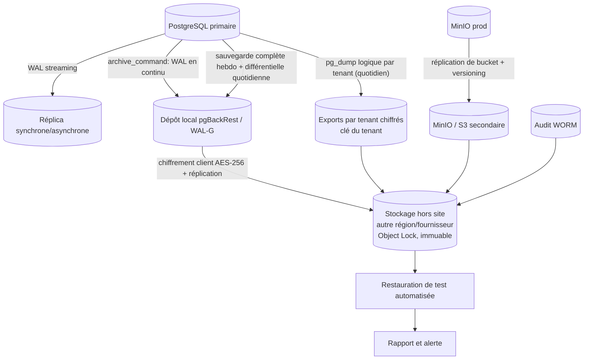

### 8.3 PostgreSQL : PITR

- **Outil** : pgBackRest (recommandé : sauvegardes incrémentales/différentielles, vérification, chiffrement, multi-dépôts) ou WAL-G (alternative légère, bien adaptée au stockage S3). Choix final dans `01-architecture.md`.
- **Plan** : sauvegarde complète hebdomadaire, différentielle quotidienne, archivage WAL continu (`archive_timeout` 60 s). Rétention : 4 complètes + WAL associés (≈ 30 jours de PITR), archivage mensuel conservé 12 mois (selon durées légales et contractuelles).
- **Chiffrement** côté client avec clé stockée dans le KMS (différente des clés de production), dépôt hors site en mode immuable (Object Lock), compte de stockage distinct des identifiants de production (un attaquant qui compromet la production ne peut pas supprimer les sauvegardes).
- **Haute disponibilité** : réplica en streaming (Patroni en Kubernetes) ; la réplication n'est **pas** une sauvegarde (elle propage les erreurs).
- **Vérification** : `pgbackrest verify` après chaque sauvegarde, checksums de pages activés (`data_checksums`), alerte si échec ou retard d'archivage WAL.

### 8.4 Tests de restauration

| Test | Fréquence | Contenu |
|---|---|---|
| Restauration automatique complète en environnement isolé | Hebdomadaire | Restauration du dernier backup + PITR, démarrage de PostgreSQL, vérifications d'intégrité (comptages, checksums, requêtes de santé), exécution d'un jeu de tests de fumée applicatifs |
| Restauration à un instant précis (PITR) | Mensuelle | Restauration à un `recovery_target_time` choisi |
| Exercice de reprise complète (DR) | Semestriel | Reconstruction de l'environnement dans une autre région avec mesure du RTO/RPO réels |
| Restauration d'un tenant | Trimestrielle | Procédure 8.5 de bout en bout |
| Restauration MinIO et audit | Trimestrielle | Échantillon de fichiers, vérification de la chaîne d'audit |

Résultats consignés (date, durée, anomalies), échecs traités comme incidents ; une sauvegarde non testée est considérée comme inexistante.

### 8.5 Restauration d'un seul tenant

La base partagée rend le PITR global inadapté pour la restauration d'un seul tenant (il écraserait les autres). Deux mécanismes :

1. **Export logique par tenant** (quotidien, par un job dédié) : extraction de toutes les lignes `WHERE tenant_id = X` table par table dans l'ordre des dépendances (`COPY ... TO` via vues filtrées ou outil dédié), plus les fichiers S3 sous `tenant/{tid}/`, empaquetés (archive + manifeste + checksums), **chiffrés avec une clé propre au tenant** (dérivée de la KEK), et envoyés au dépôt hors site. Utile aussi pour la portabilité, la migration vers une base dédiée et la résiliation.
2. **Restauration depuis PITR en instance temporaire** : restauration de la base complète à l'instant voulu dans une instance isolée, extraction des données du tenant, puis réimport sélectif.

Procédure de restauration ciblée :

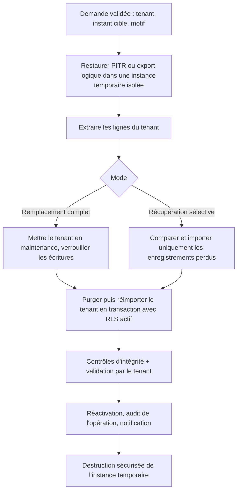

Garde-fous : validation à deux personnes côté plateforme, accord écrit du tenant, journalisation, instance temporaire chiffrée et détruite, aucun mélange de données entre tenants.

### 8.6 MinIO / S3

- **Versioning** activé, **Object Lock** (rétention) sur le bucket de sauvegarde, protection contre suppression accidentelle.
- Réplication de buckets vers un second site/fournisseur (`mc mirror` ou réplication native), chiffrement SSE.
- Sauvegarde quotidienne incrémentale par tenant (préfixe `tenant/{tid}/`) incluse dans l'export logique.
- Cycle de vie : conservation des versions précédentes 30 jours.

### 8.7 Sauvegarde locale Desktop

- Le Desktop (Tauri) conserve un cache SQLite **chiffré (SQLCipher)** avec file de synchronisation. Ce cache n'est pas la source de vérité : celle-ci est le serveur.
- Sauvegarde locale automatique : copie quotidienne et avant mise à jour du fichier chiffré, rotation de 7 copies, emplacement configurable (disque externe) ; la copie reste chiffrée avec une clé protégée par le keychain et récupérable par un secret de récupération (clé de récupération générée à l'installation, à conserver par l'administrateur de l'établissement).
- Les opérations en file (non synchronisées) sont incluses dans la sauvegarde ; l'application avertit si des données non synchronisées sont anciennes (> 24 h).
- Restauration : assistant avec contrôle d'intégrité, resynchronisation avec résolution de conflits (voir doc 01).
- Appareil perdu ou volé : révocation de session côté serveur, invalidation de la clé du cache (la clé locale ne se déverrouille plus sans jeton valide après un délai d'hors-ligne maximal configurable, par défaut 7 jours), effacement à la prochaine connexion.

---

## 9. Sécurité applicative

### 9.1 Couverture OWASP Top 10 (2021) et API Security Top 10 (2023)

| Risque | Mesures GHMT |
|---|---|
| A01 Contrôle d'accès défaillant / API1 BOLA / API5 BFLA | Refus par défaut, `@RequirePermission` partout, RLS, 404 sur ressource hors périmètre, tests cross-tenant et IDOR automatisés, UUID non séquentiels |
| A02 Défaillances cryptographiques | TLS 1.3, AES-256-GCM, Argon2id, KMS, rotation (section 6) |
| A03 Injection | Prisma (requêtes paramétrées), `$queryRaw` tagué uniquement, validation Zod, encodage de sortie, pas de `eval`, commandes externes via `execFile` avec liste blanche |
| A04 Conception non sécurisée | Ce document, modélisation des menaces (STRIDE) par module, revue de sécurité des PR sensibles |
| A05 Mauvaise configuration | Helmet, CORS strict, désactivation des endpoints de debug/Swagger en production (ou protégé), images Docker minimales non-root, durcissement PostgreSQL/Redis/MinIO, IaC revue |
| A06 Composants vulnérables | `pnpm audit`, Renovate, SBOM (CycloneDX), scan d'images (Trivy) |
| A07 Authentification défaillante / API2 | Section 1 |
| A08 Intégrité logicielle et des données | Lockfile figé, builds reproductibles, signature des images (cosign), provenance CI, signature des mises à jour Desktop (Tauri updater) |
| A09 Journalisation insuffisante | Section 7 |
| A10 SSRF | Voir 9.7 |
| API3 Propriétés exposées / mass assignment | DTO Zod en liste blanche (`.strict()`), schémas de réponse explicites, jamais d'entité Prisma retournée telle quelle |
| API4 Consommation de ressources | Rate limiting, pagination bornée, limites de taille de corps, timeouts, quotas de plan |
| API6 Flux métier sensibles | Limitation de l'envoi OTP/SMS, anti-fraude sur remboursements et exports |
| API8 Mauvaise configuration | Voir A05 |
| API9 Inventaire inadapté | OpenAPI 3.1 comme contrat unique, versionnement `/api/v1`, retrait documenté des anciennes versions |
| API10 Consommation non sécurisée d'API tierces | Validation des réponses des fournisseurs (Zod), timeouts, vérification de signature des webhooks (Mobile Money), listes blanches |

### 9.2 Validation des entrées (Zod)

- Schémas Zod partagés dans `packages/shared` (mêmes règles côté client et serveur) ; un `ZodValidationPipe` global valide corps, requête, paramètres et en-têtes.
- Schémas **stricts** (`.strict()` : champs inconnus rejetés), types bornés (longueurs maximales, énumérations, UUID, E.164 pour téléphone, dates ISO), normalisation (trim, NFC).
- Les réponses sont également typées et filtrées par schéma de sortie.

```ts
export const CreatePatientSchema = z.object({
  firstName: z.string().trim().min(1).max(100),
  lastName: z.string().trim().min(1).max(100),
  birthDate: z.coerce.date().max(new Date()),
  phone: z.string().regex(/^\+[1-9]\d{7,14}$/).optional(),
  sex: z.enum(['F', 'M', 'X']),
}).strict();
```

### 9.3 Rate limiting

| Niveau | Mécanisme | Exemple |
|---|---|---|
| Global par IP | `@nestjs/throttler` avec stockage Redis, plus limitation au reverse proxy | 300 req/min/IP |
| Par utilisateur authentifié | Clé `rl:u:{tid}:{uid}` | 120 req/min (profil configurable) |
| Par tenant | Clé `rl:t:{tid}` indexée sur le plan | Quota par plan, protège contre un tenant bruyant |
| Endpoints sensibles | Limites dédiées | login 10/15 min/IP, OTP SMS 5/h/numéro, reset mot de passe 5/h/compte, export 10/jour/utilisateur |
| Webhooks entrants | Limite et signature | Par fournisseur |

Réponse `429` avec `Retry-After`. Mode dégradé : si Redis est indisponible, limites locales en mémoire par instance (pas d'absence de limitation).

### 9.4 CSRF

- Cookies `SameSite` (Lax pour l'accès, Strict pour le refresh) et `__Host-`.
- **Double-submit cookie signé** : un token CSRF lié à la session, envoyé en en-tête `X-CSRF-Token` pour toutes les méthodes non sûres, vérifié par le serveur.
- Vérification stricte des en-têtes `Origin`/`Referer` contre une liste blanche.
- Les clients Bearer (Desktop, mobile) ne sont pas sujets au CSRF (pas de cookies automatiques) ; l'API refuse les méthodes non sûres sans l'un des deux mécanismes.
- CORS : liste blanche d'origines exacte (pas de `*` avec credentials), méthodes et en-têtes explicites.

### 9.5 CSP et en-têtes de sécurité

```ts
// main.ts (indicatif) — API
app.use(helmet({
  contentSecurityPolicy: { directives: { defaultSrc: ["'none'"], frameAncestors: ["'none'"] } },
  hsts: { maxAge: 63072000, includeSubDomains: true, preload: true },
  referrerPolicy: { policy: 'no-referrer' },
  crossOriginResourcePolicy: { policy: 'same-site' },
}));
app.disable('x-powered-by');
```

Application web (Next.js) : CSP avec **nonce** par requête (middleware), `script-src 'self' 'nonce-…' 'strict-dynamic'`, `object-src 'none'`, `base-uri 'none'`, `frame-ancestors 'none'`, `form-action 'self'`, `connect-src` limité à l'API et au service d'erreurs, `img-src 'self' data: blob:` plus domaine des URLs signées ; mode `Report-Only` en pré-production puis activation. En-têtes complémentaires : `X-Content-Type-Options: nosniff`, `Permissions-Policy` (caméra/micro désactivés sauf besoin), `Cross-Origin-Opener-Policy: same-origin`, `Cache-Control: no-store` sur les réponses contenant des données de santé. Pas de `dangerouslySetInnerHTML` sans assainissement (DOMPurify), règle ESLint dédiée.

### 9.6 Protection contre les IDOR

- Les identifiants sont des UUID v7/ULID (non devinables), mais la sécurité repose sur l'**autorisation**, pas sur l'opacité.
- Toute requête par identifiant passe par le chargement avec le contexte RLS + portée ; une ressource hors périmètre renvoie `404`.
- Les relations imbriquées (ex. `/patients/:id/consultations/:cid`) vérifient que `cid` appartient bien à `id`.
- Les listes appliquent le `scopeFilter` calculé par l'autorisation.
- Les URLs de fichiers sont signées, courtes, liées à la ressource, et émises uniquement après contrôle de permission.
- Tests IDOR automatisés (section 4.1 point 8) : horizontaux (même tenant, autre service/patient hors portée) et verticaux (rôle inférieur).

### 9.7 SSRF et appels sortants

Les appels sortants (webhooks, URL SSO, fournisseurs SMS) passent par un client HTTP unique : liste blanche de domaines pour les fournisseurs connus, blocage des adresses privées/loopback/link-local/métadonnées cloud (résolution DNS vérifiée et épinglée), pas de redirections non contrôlées, timeouts courts, taille de réponse limitée.

### 9.8 Upload de fichiers

| Contrôle | Règle |
|---|---|
| Types autorisés | Liste blanche par usage : PDF, JPEG, PNG, WebP, DICOM (module imagerie), CSV (imports), éventuellement DOCX |
| Détection du type | Par **contenu** (magic bytes via `file-type`), l'extension et le `Content-Type` fournis ne font pas foi |
| Taille | Limites par usage (ex. 10 Mo documents, 25 Mo images, DICOM selon plan), appliquées au proxy et à l'API (streaming) |
| Nom | Jamais utilisé comme chemin ; clé S3 générée (UUID), nom d'origine conservé en métadonnée assainie |
| Antivirus | **ClamAV** (service `clamd`) : fichier déposé en zone de quarantaine (bucket `quarantine`), scanné par un worker BullMQ, puis promu vers le bucket définitif ou supprimé ; statut `pending/clean/infected` ; fichier non `clean` jamais servi |
| Contenus actifs | Neutralisation PDF (pas de JavaScript : rejet ou conversion), suppression des métadonnées EXIF (GPS) des images, rejet des SVG ou assainissement strict |
| Livraison | URLs signées courtes ; `Content-Disposition: attachment` pour les types non affichables ; `Content-Type` fixé par le serveur ; domaine de fichiers distinct (cookie-less) pour éviter XSS même-origine |
| Quotas | Stockage par tenant selon le plan, vérifié avant acceptation |
| Chiffrement | SSE-KMS, chiffrement applicatif en option |

### 9.9 Gestion des secrets

- Aucun secret dans le dépôt (scan **gitleaks** en pre-commit et CI, `.env.example` sans valeurs réelles).
- Secrets injectés à l'exécution par Docker secrets / Kubernetes Secrets chiffrés (SOPS + age ou External Secrets) / Vault ; accès par rôle de service avec moindre privilège.
- Validation au démarrage (schéma Zod de l'environnement) : l'application refuse de démarrer si un secret requis est absent ou faible.
- Secrets distincts par environnement ; rotation planifiée (6.4) ; secrets d'intégration des tenants (SMS, SSO) chiffrés au niveau applicatif.
- Jamais de secret dans les logs, URLs, messages d'erreur ou bundles front (variables `NEXT_PUBLIC_*` revues).

### 9.10 Dépendances et chaîne d'approvisionnement

- `pnpm audit --audit-level=high` bloquant en CI ; **Renovate** (mises à jour groupées, revue hebdomadaire, correctifs de sécurité prioritaires) ; épinglage via lockfile, `pnpm install --frozen-lockfile`.
- Politique de nouvelles dépendances : vérification de la maintenance, des mainteneurs, des licences, et préférence pour les bibliothèques établies ; pas de scripts `postinstall` non revus (option `pnpm` d'allowlist).
- SBOM CycloneDX généré à chaque build ; scan des images Docker (Trivy/Grype) ; images de base minimales (distroless/alpine), utilisateur non root, système de fichiers en lecture seule.
- Délais de remédiation : critique 48 h, haute 7 jours, moyenne 30 jours.

### 9.11 SAST, DAST et tests de sécurité

| Activité | Outil | Fréquence |
|---|---|---|
| Linting sécurité | `eslint-plugin-security`, règles personnalisées (interdiction `$queryRawUnsafe`, Redis brut, `dangerouslySetInnerHTML`) | Chaque PR |
| SAST | CodeQL et/ou Semgrep (règles NestJS/TypeScript) | Chaque PR |
| Secrets | gitleaks | Pre-commit + PR |
| SCA | `pnpm audit`, Renovate, Trivy | Chaque PR + nocturne |
| DAST | OWASP ZAP (scan authentifié contre l'environnement de recette, à partir d'OpenAPI) | Nocturne/hebdomadaire |
| Tests d'isolation, d'autorisation et IDOR | Suite dédiée (section 4.1) | Chaque PR, bloquant |
| Fuzzing d'API | Schemathesis sur OpenAPI | Hebdomadaire |
| Test d'intrusion externe | Prestataire qualifié | Annuel et avant ouverture à des clients réels, puis après changement majeur |
| Programme de divulgation responsable | `security.txt`, adresse dédiée | Permanent |

### 9.12 Journalisation sans données de santé

- Logs Pino JSON structurés : `ts`, `level`, `request_id`, `tid`, `uid`, `route` (le **gabarit** `/patients/:id`, pas l'URL réelle avec identifiants dans la query), `status`, `duration_ms`.
- **Redaction** automatique (`pino` `redact`) : `authorization`, cookies, `password`, `token`, `otp`, `secret`, et tout champ marqué sensible ; jamais de corps de requête/réponse complets.
- Les noms, numéros, diagnostics et contenus cliniques n'apparaissent **jamais** dans logs, traces OTel, messages d'erreur ou Sentry (`beforeSend` filtre, `sendDefaultPii: false`, scrubbing des breadcrumbs).
- Requêtes SQL non journalisées avec leurs paramètres en production ; l'ORM en niveau `warn`/`error`.
- Tests CI : un test d'intégration injecte des valeurs « canari » dans les requêtes et vérifie qu'elles n'apparaissent dans aucune sortie de log.
- Accès aux logs restreint, rétention courte (30 à 90 jours).

---

## 10. Conformité

> Les textes évoluent rapidement. Le tableau ci-dessous est un cadre de travail à faire valider, pays par pays, par un juriste local et par le DPO avant chaque déploiement commercial.

### 10.1 Cadre juridique

| Pays / instrument | Texte de référence (à vérifier) | Autorité |
|---|---|---|
| Union africaine | **Convention de Malabo** (2014) sur la cybersécurité et la protection des données personnelles, entrée en vigueur en juin 2023 | - |
| Sénégal | Loi n° 2008-12 sur la protection des données à caractère personnel | CDP (Commission de protection des données personnelles) |
| Côte d'Ivoire | Loi n° 2013-450 relative à la protection des données à caractère personnel | ARTCI |
| Cameroun | Loi de 2024 relative à la protection des données personnelles (loi n° 2024/017) | Autorité de protection à confirmer selon l'état de mise en œuvre |
| Bénin | Code du numérique (loi n° 2017-20) | APDP |
| Togo | Loi n° 2019-014 relative à la protection des données personnelles | IPDP |
| Burkina Faso | Loi n° 001-2021/AN | CIL |
| Mali | Loi n° 2013-015 | APDP |
| Gabon | Loi n° 001/2011 | CNPDCP |
| RDC | Code du numérique (2023) et textes sectoriels | À confirmer |
| Cadre régional | Acte additionnel de la CEDEAO A/SA.1/01/10 (espace CEDEAO) ; textes CEMAC/UEMOA | - |
| Référentiel de bonne pratique | RGPD (par analogie), ISO/IEC 27001, 27701, 27799 (information de santé), HDS comme inspiration | - |

Constats communs : les données de santé sont des **données sensibles** soumises à un régime renforcé (consentement explicite ou base légale spécifique, finalité déterminée, déclaration ou autorisation préalable auprès de l'autorité, souvent restrictions sur les **transferts hors du pays ou de la zone**, obligations de confidentialité et de sécurité, droits des personnes).

### 10.2 Rôles

- **Responsable du traitement** : l'établissement de santé (tenant), pour les données de ses patients et de son personnel.
- **Sous-traitant** : l'éditeur de GHMT, lié à chaque tenant par un **contrat de traitement des données** (DPA) intégré aux CGU : instructions documentées, confidentialité, sécurité, sous-traitants ultérieurs listés, assistance pour l'exercice des droits, notification de violation, restitution/suppression en fin de contrat, audits.
- **Responsable du traitement pour ses propres données** (comptes de la plateforme, facturation, analytique d'usage) : l'éditeur.
- **DPO / délégué à la protection** : désigné par l'éditeur (pour la plateforme) ; GHMT fournit au tenant les outils pour que son propre DPO ou correspondant puisse agir (tableau de bord conformité, registre, journal d'accès, rapports).

### 10.3 Consentement et bases légales

- Module `patients:consent` : consentements horodatés, versionnés, par finalité (soins, partage avec un confrère, rappels SMS, recherche/statistiques anonymisées, application mobile patient), avec preuve (qui l'a recueilli, support, version du texte).
- Les soins relèvent de la base légale de la prise en charge médicale, sans consentement par traitement ; le consentement est requis pour les finalités accessoires (SMS marketing, recherche, partage hors équipe de soins, publication de résultats sur mobile selon le pays).
- Retrait du consentement aussi simple que son recueil ; effet immédiat sur les envois et les partages ; historique conservé.
- Mineurs et personnes protégées : consentement du représentant légal, lien de tutelle vérifié.
- Informations remises aux patients (transparence) : notice multilingue, affichée à l'accueil et dans l'application.

### 10.4 Droits des patients

| Droit | Mise en œuvre dans GHMT |
|---|---|
| Information | Notice de confidentialité, liste des accès au dossier sur demande |
| Accès | Export du dossier (workflow validé, `patients:patient:export`, PDF + format structuré), vérification d'identité, délai d'un mois indicatif |
| Rectification | Correction avec historique (l'ancienne valeur reste dans l'audit, pas de réécriture de l'historique clinique ; mention d'erratum) |
| Opposition | Pour les finalités non indispensables aux soins |
| Effacement / limitation | Soumis aux **obligations légales de conservation** du dossier médical (durée nationale, souvent 10 à 20 ans) ; à l'issue : anonymisation ou suppression ; avant : verrouillage (limitation) |
| Portabilité | Export structuré (JSON/FHIR à terme) |
| Décision automatisée | Aucune décision clinique automatisée sans validation humaine ; fonctions d'aide à la décision identifiées comme telles |
| Réclamation | Voie vers l'autorité nationale, mention dans la notice |

Un registre des demandes (`data_subject_requests`) suit chaque demande (statut, échéance, auteur, résultat) avec rappels d'échéance.

### 10.5 Registre des traitements, AIPD et gouvernance

- **Registre des traitements** : GHMT livre un registre **pré-rempli par module** (finalités, catégories de données, destinataires, durées, mesures de sécurité, transferts) que chaque établissement complète et exporte pour l'autorité. Il est généré à partir des modules activés.
- **Analyse d'impact (AIPD)** documentée pour la plateforme (traitement à grande échelle de données sensibles) ; mise à jour à chaque évolution majeure (dossier mobile, SSO, IA).
- **Minimisation et durées de conservation** : politique par catégorie, purge ou anonymisation automatisée, paramétrable dans les limites légales.
- **Gestion des sous-traitants ultérieurs** : liste publique (hébergeur, SMS, email, Mobile Money, monitoring), DPA avec chacun, évaluation de sécurité.
- **Formation et engagement de confidentialité** : acceptation d'une charte à la première connexion du personnel tenant, rappelée périodiquement (journalisée).

### 10.6 Hébergement et transferts

- **Localisation des données** : privilégier un hébergement dans le pays du client ou dans la région africaine quand la loi ou le client l'exige ; sinon, un hébergement dans un pays offrant un niveau de protection adéquat avec clauses contractuelles et autorisation de l'autorité si requise. Option **« région de données »** par tenant (choix à la création : instance régionale ou base dédiée Enterprise).
- Les **sauvegardes hors site** suivent la même règle de localisation que les données primaires.
- Les services tiers recevant des données personnelles (SMS, email, monitoring, Sentry) sont configurés pour **ne pas recevoir de données de santé** ; les SMS de rappel sont rédigés sans information médicale détaillée (« Rappel de rendez-vous à Clinique X le 12/10 à 9 h »).
- Plan de **réversibilité** : export complet des données du tenant (section 8.5) en format ouvert à la résiliation, puis crypto-effacement (6.4).
- Hébergeur : certifications recherchées (ISO 27001, SOC 2) et engagements de disponibilité contractuels.

### 10.7 Checklist de conformité

Étiquettes : [P] avant production, [C] en continu.

**Gouvernance**
- [ ] [P] DPO désigné pour la plateforme, contact publié
- [ ] [P] Registre des traitements de l'éditeur rédigé ; modèle de registre établissement livré
- [ ] [P] AIPD réalisée et validée
- [ ] [P] DPA type signé avec chaque tenant ; liste des sous-traitants ultérieurs publiée
- [ ] [P] Déclarations/autorisations préalables auprès des autorités de chaque pays cible effectuées (ou accompagnées pour le client)
- [ ] [P] Politique de conservation et de purge validée par pays
- [ ] [C] Revue annuelle du registre, de l'AIPD et des politiques

**Droits et consentement**
- [ ] [P] Notice d'information patient (français, langues locales prioritaires)
- [ ] [P] Module de consentement opérationnel et testé
- [ ] [P] Workflow de demandes de droits (accès, rectification, opposition) avec échéances
- [ ] [P] Export du dossier patient (accès/portabilité) testé
- [ ] [C] Suivi des délais de réponse

**Sécurité technique**
- [ ] [P] TLS 1.3, HSTS, certificats automatisés
- [ ] [P] Chiffrement au repos (disques, sauvegardes) et champs sensibles (AES-256-GCM, KEK par tenant)
- [ ] [P] RLS forcée sur toutes les tables, tests d'isolation en CI passants
- [ ] [P] MFA obligatoire pour les rôles plateforme et privilégiés
- [ ] [P] Journal d'audit append-only avec chaîne de hachage et stockage séparé
- [ ] [P] Aucun log avec donnée de santé (test canari passant)
- [ ] [P] Test d'intrusion externe réalisé, critiques et hauts corrigés
- [ ] [P] Sauvegardes chiffrées hors site et test de restauration réussi (RPO/RTO mesurés)
- [ ] [C] Revue trimestrielle des accès et des rôles ; revue mensuelle des grants plateforme
- [ ] [C] Suivi des vulnérabilités selon les délais 9.10
- [ ] [C] Exercice de crise annuel

**Incidents**
- [ ] [P] Plan de réponse aux incidents approuvé, contacts d'astreinte et modèles de notification prêts
- [ ] [P] Procédure de notification aux autorités et aux personnes (délais par pays, souvent 72 h indicatif)
- [ ] [C] Registre des incidents tenu, retours d'expérience

**Hébergement**
- [ ] [P] Localisation des données conforme par pays/client documentée
- [ ] [P] Clauses de transfert et autorisations si flux transfrontaliers
- [ ] [P] Plan de réversibilité et crypto-effacement testés

---

## 11. Plan de réponse aux incidents

### 11.1 Gouvernance

| Rôle | Responsabilité |
|---|---|
| Commandant d'incident (IC) | Coordonne, décide, tient la chronologie (astreinte rotative) |
| Responsable technique | Investigation, confinement, éradication, restauration |
| DPO | Qualification « violation de données personnelles », notifications réglementaires, lien avec les autorités |
| Responsable communication / relation client | Messages aux tenants, patients, médias |
| Juridique | Obligations contractuelles et légales |
| Représentant du tenant | Responsable du traitement : décision finale sur la notification aux patients (assistée par l'éditeur) |

### 11.2 Classification

| Niveau | Définition | Exemples | Délai de prise en charge |
|---|---|---|---|
| SEV1 | Compromission avérée de données de santé, fuite inter-tenant, compromission de clés ou d'un compte plateforme, rançongiciel | Rupture de chaîne d'audit, accès cross-tenant confirmé | Immédiat (15 min), astreinte 24/7 |
| SEV2 | Compromission probable ou comptes tenant compromis, indisponibilité majeure | Réutilisation de refresh en série, DDoS | 1 h |
| SEV3 | Incident contenu sans exposition de données | Vulnérabilité sans exploitation | 1 jour ouvré |
| SEV4 | Anomalie mineure | Tentatives de scan | Planifié |

### 11.3 Cycle de réponse

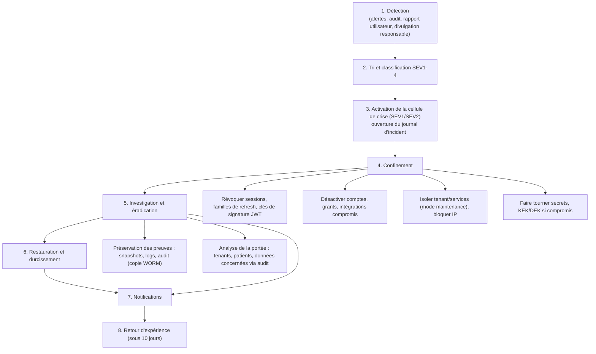

### 11.4 Actions de confinement prêtes à l'emploi (runbooks)

| Scénario | Actions immédiates |
|---|---|
| Compte utilisateur ou token volé | Révocation de session et famille de refresh, réinitialisation du mot de passe et MFA, revue des accès via audit, notification de l'utilisateur et de l'admin |
| Compte plateforme compromis | Désactivation, révocation de tous les grants actifs, rotation des secrets accessibles, revue de toutes les actions plateforme, notification des tenants touchés |
| Fuite ou accès cross-tenant | Mise en maintenance du module/endpoint, correctif, requête d'audit pour identifier les enregistrements exposés, notification des tenants concernés (SEV1) |
| Clé de signature JWT compromise | Rotation immédiate (`kid`), invalidation des sessions, ré-authentification globale |
| KEK/DEK compromise | Rotation, re-wrap, rechiffrement des champs, évaluation de l'exposition (accès aux données chiffrées nécessaire ?) |
| Rançongiciel / destruction de données | Isolement réseau, bascule vers l'environnement de reprise, restauration PITR depuis les sauvegardes immuables, vérification des sauvegardes avant réinjection |
| Fuite de secrets dans le dépôt | Rotation immédiate (secret supposé compromis), purge de l'historique, audit des usages |
| Vulnérabilité critique de dépendance | Correctif d'urgence, déploiement accéléré, WAF/règle temporaire |
| Abus de bris de glace ou accès illégitime par un employé du tenant | Information de l'admin et du DPO du tenant, gel du compte, extrait d'audit remis |

### 11.5 Notifications

- **Détermination** : le DPO évalue si l'incident est une violation de données personnelles et son risque pour les personnes.
- **Au responsable du traitement (tenant)** : dans les **24 h** suivant la prise de connaissance (engagement contractuel), avec nature, données et personnes concernées, conséquences probables, mesures prises.
- **À l'autorité nationale** : par le tenant (assisté par l'éditeur) dans le délai du pays concerné (fréquemment 72 h pour les textes inspirés du RGPD ; à vérifier pays par pays) ; l'éditeur prépare le dossier.
- **Aux patients** : si risque élevé, par le tenant avec modèles fournis (langage clair, canaux SMS/Email/affichage), sans détails techniques exploitables.
- Modèles préparés à l'avance en français (et langues locales) ; registre des violations tenu même sans notification.
- Communication externe unifiée, sans spéculation, via le responsable communication.

### 11.6 Après l'incident

- Rapport de **post-mortem** sans recherche de culpabilité sous 10 jours ouvrés : chronologie, cause racine, impact, efficacité de la détection et de la réponse, actions correctives avec responsables et échéances.
- Mise à jour des règles de détection, tests de non-régression (ex. nouveau test d'isolation), formation.
- Suivi des actions jusqu'à clôture ; présentation à la direction.
- Exercices : simulation de crise (table-top) semestrielle incluant le DPO et un scénario de fuite de données de santé ; exercice technique annuel (rançongiciel/restauration, compromission de clé).

### 11.7 Contacts et canaux

- Canal d'alerte sécurité interne (24/7, astreinte), adresse `security@` et `security.txt` pour la divulgation responsable (engagement de réponse sous 3 jours ouvrés, pas de poursuites pour bonne foi).
- Page de statut publique et canal de notification des tenants (email + SMS + in-app) maintenu hors de l'infrastructure principale.
- Annuaire des contacts DPO de chaque tenant maintenu à jour (champ obligatoire à l'onboarding).

---

## Annexe A. Décisions et points ouverts

| Sujet | Décision proposée | Point ouvert |
|---|---|---|
| Algorithme JWT | EdDSA (Ed25519) avec `kid` | Compatibilité des bibliothèques mobile |
| KMS | Vault Transit/OpenBao au MVP, KMS cloud ensuite | Choix d'hébergeur |
| Sauvegarde PostgreSQL | pgBackRest | Valider avec l'architecture (doc 01) |
| OTP SMS pour MFA du personnel | Option, déconseillé pour rôles privilégiés | Coût SMS par plan |
| Médecin limité à ses patients | Option par tenant, désactivée par défaut | Définition de « équipe de soins » avec les clients pilotes |
| Chiffrement applicatif de champs | Restreint à la liste 6.3 | Évaluer l'impact sur la recherche patient |
| Texte de loi par pays | Cadre 10.1 | Validation juridique locale |
| WebAuthn/passkeys | Phase ultérieure pour rôles plateforme et privilégiés | Support des appareils d'entrée de gamme |
| Durée de conservation des dossiers | Paramétrable par pays | Valeurs légales à confirmer |

## Annexe B. Récapitulatif des chiffres clés

| Paramètre | Valeur |
|---|---|
| Durée JWT d'accès | 15 min |
| Refresh token | Opaque, rotatif, 7 j d'inactivité, 30 j absolu (web) |
| Fenêtre de grâce de refresh | 10 s |
| Argon2id | m = 64 MiB, t = 3, p = 1 (à calibrer) |
| Mot de passe | ≥ 10 caractères (12 pour rôles privilégiés), pas de composition imposée, pas d'expiration |
| TOTP | 6 chiffres, 30 s, ±1 pas, 10 codes de secours |
| OTP SMS | 6 chiffres, TTL 5 min, 3 essais |
| Verrouillage compte | 5 échecs, délais progressifs plafonnés |
| Grant plateforme | ≤ 4 h (défaut 1 h), lecture seule par défaut, notification du tenant |
| Bris de glace clinique | 2 h, 1 patient, lecture seule, revue sous 72 h |
| Cache permissions | TTL 10 min + invalidation par événement |
| RPO / RTO PostgreSQL | ≤ 5 min / ≤ 4 h |
| Rotation JWT / KEK / DEK | 90 j / 12 mois / 24 mois |
| Rétention audit | 2 à 10 ans selon catégorie, grants plateforme 7 ans |
