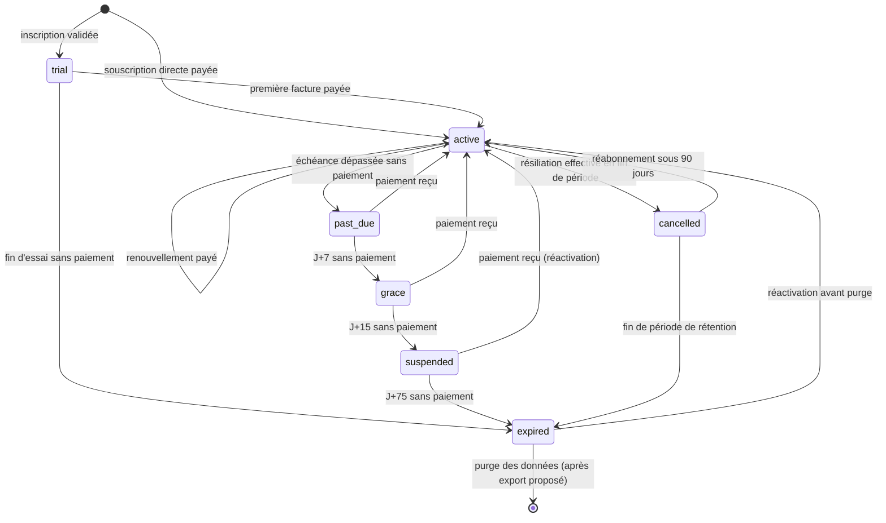
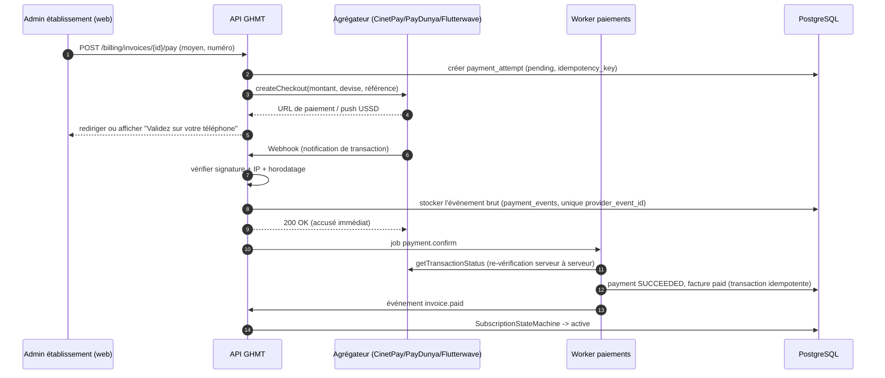
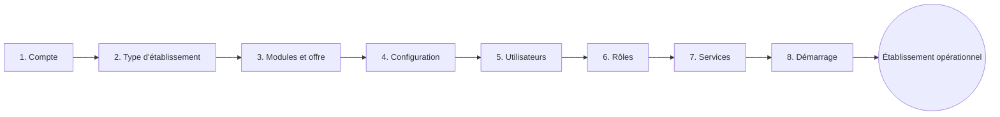
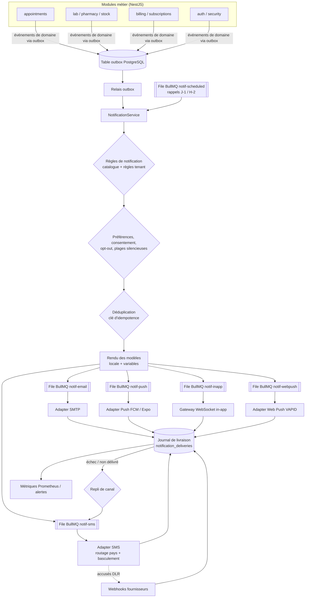
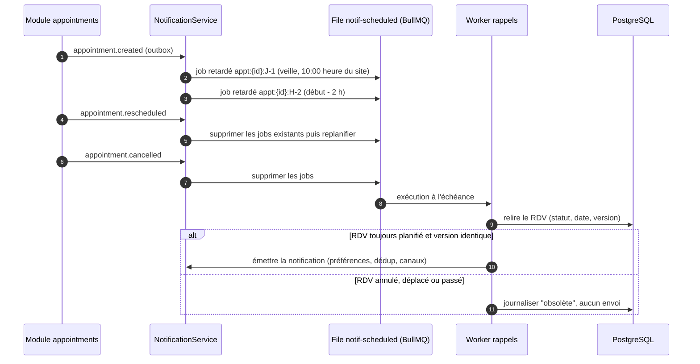

# 05 — Abonnements SaaS, facturation plateforme et notifications

> Conforme à `00-decisions.md`. Périmètre : modèle commercial SaaS de GHMT (plans, quotas, cycle de vie, facturation Mobile Money, licences Desktop, onboarding, tableaux de bord) et système de notifications multicanal.
> Les montants sont **indicatifs** (hypothèses de travail à valider par l'équipe commerciale et par une étude de prix pays par pays). Les taux de TVA et les obligations fiscales sont à confirmer avec un conseil fiscal local.

---

## Sommaire

- **Partie A — Système d'abonnement SaaS**
  - A1. Principes
  - A2. Plans (paliers)
  - A3. Offres par type d'établissement
  - A4. Modules en add-on
  - A5. Essai gratuit
  - A6. Cycle de vie d'un abonnement
  - A7. Application des quotas (entitlements)
  - A8. Renouvellement et changements de plan
  - A9. Facturation SaaS et paiements Mobile Money
  - A10. Licences Desktop hors-ligne
  - A11. Onboarding d'un nouvel établissement
  - A12. Tableaux de bord
  - A13. Modèle de données (résumé)
- **Partie B — Système de notifications**
  - B1. Principes
  - B2. Architecture
  - B3. Modèle de données
  - B4. Modèles multilingues et variables
  - B5. Préférences et opt-out
  - B6. Plages horaires silencieuses
  - B7. Retries, repli de canal et basculement fournisseur
  - B8. Déduplication
  - B9. Rappels de rendez-vous planifiés
  - B10. Catalogue des notifications
  - B11. Coût SMS et quotas par plan
  - B12. Fournisseurs SMS (Afrique francophone)
  - B13. Confidentialité
  - B14. Observabilité et tests

---

# Partie A — Système d'abonnement SaaS

## A1. Principes

| Principe | Description |
|---|---|
| Unité de facturation = tenant | L'abonnement est rattaché au **tenant** (établissement, ou groupe s'il souscrit en tant que groupe). Un groupe peut avoir un abonnement « parapluie » couvrant plusieurs établissements (Enterprise). |
| Offre = palier × profil | Un **palier** (Basic, Standard, Professional, Enterprise) fixe les limites et le niveau de service. Un **profil d'établissement** (cabinet, pharmacie, laboratoire, centre de santé, clinique, hôpital) fixe les modules par défaut. Le catalogue publie des **offres** combinant les deux. |
| Entitlements calculés | Les droits effectifs d'un tenant = plan + add-ons + dérogations négociées (overrides). Le code métier n'interroge **jamais** directement le plan : il interroge l'`EntitlementService`. |
| Ne jamais bloquer les soins | Aucune limite commerciale (quota, impayé) ne doit empêcher la **consultation du dossier d'un patient** ni l'**enregistrement d'un patient en urgence**. Les limites dures portent sur des actions administratives ou de confort. |
| Mobile Money d'abord | Le prélèvement automatique est rare dans la région : le modèle par défaut est **facture + lien de paiement** (Mobile Money, carte, virement, espèces auprès d'un revendeur). |
| Multi-devise | Prix publiés en XOF ; XAF à parité 1:1 (les deux francs CFA ont la même parité fixe avec l'euro) ; grilles spécifiques CDF et USD pour la RDC et les contrats internationaux. La devise de facturation est fixée par tenant à la souscription. |
| Sobriété | Prix mensuels accessibles ; remise de **2 mois offerts** sur l'annuel (≈ −17 %) pour sécuriser la trésorerie et réduire le churn. |

## A2. Plans (paliers)

| Caractéristique | **Basic** | **Standard** | **Professional** | **Enterprise** |
|---|---|---|---|---|
| Cible type | Cabinet, petite pharmacie, petit labo | Centre de santé, clinique de petite taille | Clinique, hôpital niveau 1-2 | Hôpital niveau 2-3, groupes, réseaux |
| Prix mensuel indicatif (HT) | **25 000 XOF** | **75 000 XOF** | **200 000 XOF** | **Sur devis** (à partir de 500 000 XOF) |
| Prix annuel indicatif (HT) | **250 000 XOF** | **750 000 XOF** | **2 000 000 XOF** | Sur devis (engagement 1 à 3 ans) |
| Utilisateurs nommés inclus | 5 | 25 | 100 | Illimité (usage raisonnable) |
| Patients actifs (*) | 2 000 | 15 000 | 75 000 | Illimité |
| Sites | 1 | 2 | 5 | Illimité |
| Modules inclus | Patients, praticiens, RDV, facturation/caisse simple | Basic + 1 module métier au choix (labo **ou** pharmacie **ou** stocks) + tableaux de bord | Standard + labo, pharmacie, stocks, assurance/tiers payant (dès disponibilité) | Tous les modules, y compris RH, comptabilité SYSCOHADA, BI avancée |
| Stockage documents | 5 Go | 50 Go | 250 Go | 1 To + extensible |
| RDV / mois | 500 | 3 000 | 15 000 | Illimité |
| SMS inclus / mois | 200 | 1 000 | 5 000 | 20 000 (ajustable) |
| Accès API | Non | Lecture seule (1 000 req/jour) | Lecture/écriture (20 000 req/jour) + webhooks sortants | Complet, quotas négociés, webhooks, sandbox dédiée |
| Postes Desktop hors-ligne | — | 1 | 5 | Illimité |
| Support | E-mail, réponse J+2 ouvrés | E-mail + chat, J+1 ouvré | Téléphone + WhatsApp Business, < 8 h ouvrées, interlocuteur nommé | 24/7 pour incidents critiques, gestionnaire de compte dédié |
| SLA de disponibilité | Meilleur effort (cible 99 %) | 99,5 % | 99,8 % | 99,9 % contractuel avec pénalités |
| Sauvegardes / restauration | Quotidienne, rétention 7 j | Quotidienne, 30 j | Quotidienne + PITR 7 j, rétention 90 j | PITR 30 j, rétention 1 an, restauration à la demande |
| Fonctionnalités avancées | 2FA, journal d'audit 90 j | + rôles personnalisés, export CSV, audit 1 an | + multi-sites avancé, rapports planifiés, audit 3 ans, personnalisation des modèles de documents, nom d'expéditeur SMS personnalisé | + SSO (SAML/OIDC), base dédiée optionnelle, hébergement pays, audit illimité, accès break-glass contractualisé, environnement de préproduction |
| Formation | Tutoriels vidéo | + 1 session en ligne | + 3 sessions, dont 1 sur site | Programme de déploiement sur mesure |

(*) **Patient actif** : patient ayant au moins un événement (RDV, facture, acte, mise à jour) sur les 12 derniers mois glissants. Les patients archivés ne comptent pas.

**Utilisateurs supplémentaires** : vendus par packs de 5 (voir A4). **Comptes « lecture seule »** (ex. auditeurs, stagiaires) : comptés pour 0,5.

## A3. Offres par type d'établissement

Les établissements mono-activité n'ont pas besoin de l'agenda complet ou de la gestion multi-services ; ils ont besoin du module correspondant à leur activité dès le palier Basic.

| Offre catalogue | Palier de base | Modules activés par défaut | Remplacements / spécificités | Prix mensuel indicatif |
|---|---|---|---|---|
| **Cabinet Solo** | Basic | Patients, RDV, facturation/caisse, dossier de consultation (dès V1.1) | 2 utilisateurs, 1 praticien, 150 SMS | 15 000 XOF |
| **Cabinet de groupe** | Basic | Idem + agenda multi-praticiens | 8 utilisateurs, 300 SMS | 30 000 XOF |
| **Pharmacie** | Basic | Pharmacie (dispensation/vente), stocks, caisse | RDV désactivé ; quota « RDV » remplacé par « lignes de vente / mois » (10 000) ; alertes péremption incluses | 30 000 XOF |
| **Laboratoire** | Basic | Laboratoire (demandes, résultats), patients, caisse | Quota RDV → « dossiers d'analyses / mois » (2 000) ; notification « résultat disponible » incluse | 40 000 XOF |
| **Centre de diagnostic / imagerie** | Standard | Patients, RDV, caisse, comptes rendus | Stockage 100 Go (documents lourds) | 90 000 XOF |
| **Centre de santé** | Standard | Patients, RDV, caisse, pharmacie, stocks | 2 modules métier au lieu d'1 | 75 000 XOF |
| **Clinique** | Professional | Tous modules cliniques et administratifs disponibles | — | 200 000 XOF |
| **Hôpital niveau 1** | Professional | Idem + multi-sites | 5 sites | 250 000 XOF |
| **Hôpital niveau 2-3 / CHU** | Enterprise | Tous modules | Base dédiée optionnelle, SLA 99,9 % | Sur devis |
| **Groupe / réseau** | Enterprise | Abonnement parapluie | Tarif par établissement dégressif, consolidation groupe | Sur devis |

Règles :
- Le profil choisi à l'étape 2 de l'onboarding (A11) pré-sélectionne l'offre ; l'utilisateur peut monter en palier.
- Une offre est une ligne de la table `plans` (`code`, `tier`, `facility_profile`, `currency`, `price_monthly`, `price_yearly`, `entitlements JSONB`, `version`). Les plans sont **versionnés** : un tenant conserve la version souscrite jusqu'à sa migration explicite (« grandfathering »).
- Tarifs ONG / structures publiques / zones rurales : remise configurable par coupon (`coupons`), validée par un administrateur plateforme.

## A4. Modules en add-on

| Add-on | Disponibilité | Paliers éligibles | Prix indicatif / mois | Remarques |
|---|---|---|---|---|
| Pack 5 utilisateurs | MVP | Tous | 7 500 XOF | Hard limit relevée immédiatement |
| Site supplémentaire | MVP | Standard+ | 20 000 XOF | |
| Pack SMS 1 000 | MVP | Tous | 25 000 XOF (crédit valable 12 mois) | Voir B11 |
| Pack SMS 5 000 | MVP | Tous | 110 000 XOF | |
| Stockage +50 Go | MVP | Tous | 10 000 XOF | |
| Module Laboratoire | V1.1 | Basic (si profil ≠ labo), Standard | 30 000 XOF | Inclus en Professional |
| Module Pharmacie + Stocks | V1.1 | Basic, Standard | 30 000 XOF | Inclus en Professional |
| Assurance / tiers payant | V2 | Standard+ | 40 000 XOF | |
| RH & paie | V2 | Professional+ | 50 000 XOF | Inclus en Enterprise |
| Comptabilité SYSCOHADA | V2 | Professional+ | 60 000 XOF | Inclus en Enterprise |
| Poste Desktop hors-ligne supplémentaire | V2 | Standard+ | 10 000 XOF / poste | Licence signée (A10) |
| Téléconsultation | V3 | Standard+ | 40 000 XOF + coût minutes | |
| BI avancée | V3 | Professional+ | 50 000 XOF | |
| Accès API étendu | V1.1 | Standard+ | 25 000 XOF | Multiplie le quota journalier par 5 |
| Base de données dédiée | Phase 4 | Enterprise | Sur devis | Option prévue dans `00-decisions.md` |

Un add-on est un `subscription_item` (quantité, prix unitaire figé, période) rattaché à l'abonnement ; son activation recalcule les entitlements et invalide le cache.

## A5. Essai gratuit

| Paramètre | Valeur |
|---|---|
| Durée | 30 jours (prolongeable une fois de 15 jours par un commercial) |
| Palier | Offre correspondant au profil, plafonnée au niveau **Standard** |
| Moyen de paiement requis | Aucun (le Mobile Money ne permet pas de « pré-autorisation » simple) |
| Limites spécifiques | 50 SMS au total, 1 site, 10 utilisateurs, 5 Go, pas d'accès API, pas de Desktop |
| Identification | Bandeau « Période d'essai — J-x » ; données réelles autorisées (l'établissement en est responsable de traitement dès l'essai) |
| Anti-abus | 1 essai par numéro de téléphone vérifié + identifiant légal (RCCM/NINEA/NIU…) ; vérification OTP SMS à l'inscription |
| Conversion | Paiement de la première facture → `active` sans rupture ; les données sont conservées |
| Non-conversion | `expired` à J+30 : lecture seule 30 jours + export complet proposé ; puis purge planifiée (voir A6) |
| Relances | J-7, J-3, J-1 (e-mail + in-app + SMS au propriétaire), J+1, J+15 |

## A6. Cycle de vie d'un abonnement

### Machine à états



### Règles par état

| État | Déclencheur d'entrée | Accès utilisateurs | Notifications sortantes | Durée / sortie |
|---|---|---|---|---|
| `trial` | Inscription | Complet dans les limites de l'essai | Toutes (quota essai) | 30 j |
| `active` | Paiement | Complet selon entitlements | Toutes | Jusqu'à `current_period_end` |
| `past_due` | Échéance dépassée (J0) | **Complet** ; bandeau d'avertissement pour les administrateurs | Toutes | J0 → J+7 |
| `grace` | J+7 | **Complet pour les soins** ; actions administratives non essentielles désactivées (ajout d'utilisateurs, add-ons, exports massifs, API en écriture) ; bandeau visible par tous | Toutes, sauf SMS non critiques au-delà du quota | J+7 → J+15 |
| `suspended` | J+15 | **Mode continuité des soins** : lecture seule sur dossiers patients, RDV et factures ; création de patient en urgence et encaissement autorisés ; l'administrateur peut payer et exporter | Seules les notifications de facturation et de sécurité | J+15 → J+75 |
| `cancelled` | Résiliation demandée → effective en fin de période payée | Lecture seule + export pendant 90 j | Facturation uniquement | 90 j |
| `expired` | Fin d'essai, fin de suspension, fin de rétention post-résiliation | Administrateur uniquement : export + paiement | Aucune (hors relances commerciales opt-in) | Purge à J+90 après entrée, précédée de 3 préavis (J-30, J-7, J-1) |

Points d'attention :
- **Conservation légale des dossiers médicaux** : l'obligation de conservation incombe à l'établissement. GHMT fournit avant toute purge un **export complet et lisible** (JSON + PDF par patient + CSV), journalisé dans l'audit. La purge est une suppression logique puis physique planifiée, tracée dans un registre plateforme (sans données de santé).
- Toutes les transitions sont exécutées par un unique `SubscriptionStateMachine` (pas de mise à jour directe du champ `status`), émettent un événement de domaine (`subscription.status_changed`) et sont auditées.
- Un job BullMQ `subscription-lifecycle` (cron horaire) évalue les échéances ; les transitions déclenchées par paiement sont immédiates (webhook).
- Les durées (7, 15, 75, 90 j) sont des paramètres plateforme, surchargeables par contrat Enterprise.

## A7. Application des quotas (entitlements)

### Types de droits

| Type | Exemple | Représentation |
|---|---|---|
| Fonctionnalité (booléen) | `module.lab`, `feature.custom_roles`, `feature.sso` | `true/false` |
| Limite de capacité | `limit.users`, `limit.sites`, `limit.storage_bytes`, `limit.active_patients` | entier ; `null` = illimité |
| Compteur mesuré par période | `meter.appointments_monthly`, `meter.sms_monthly`, `meter.api_daily` | entier + période de remise à zéro |
| Crédit prépayé | `credit.sms` | solde décrémenté (packs) |

### Résolution

```
entitlements(tenant) = merge(plan.entitlements[version], Σ addons, overrides actifs non expirés)
                       puis restrictions liées à l'état (grace, suspended)
```

- `EntitlementService.get(tenantId)` : résultat en cache Redis (`ent:{tenantId}`, TTL 5 min, invalidé sur tout changement d'abonnement).
- Côté API NestJS :
  - garde déclarative `@RequiresFeature('module.lab')` → `403 FEATURE_NOT_IN_PLAN` avec lien vers la page de mise à niveau ;
  - décorateur `@ConsumesQuota('meter.appointments_monthly')` → vérification + incrément atomique ;
  - contrôle de capacité dans les services concernés (création d'utilisateur, de site, upload).
- Côté web : l'endpoint `GET /api/v1/tenant/entitlements` alimente le masquage des menus ; **le contrôle d'autorité reste côté serveur**.

### Compteurs d'usage

- Incrément atomique Redis (`INCRBY usage:{tenant}:{metric}:{period}`) avec script Lua « vérifier puis incrémenter » pour les limites dures.
- Persistance : job toutes les 5 minutes vers `usage_counters (tenant_id, metric, period_start, value, updated_at)` ; reconstruction possible depuis la base en cas de perte Redis (recomptage SQL pour RDV, utilisateurs, stockage).
- Le stockage est mesuré à l'upload (taille de l'objet) et recalculé chaque nuit depuis l'inventaire S3.
- Les compteurs « patients actifs » sont recalculés chaque nuit (requête agrégée par tenant).

### Limites souples et dures

| Métrique | Seuils d'alerte | Type | Comportement au dépassement |
|---|---|---|---|
| Utilisateurs | 80 %, 100 % | **Dure** | Création/invitation refusée ; proposition d'un pack |
| Sites | 100 % | **Dure** | Création refusée |
| Patients actifs | 80 %, 100 % | **Souple** (tolérance 110 %) | Au-delà de 110 % : alerte + proposition de mise à niveau ; **la création de patient n'est jamais bloquée** ; facturation de dépassement au cycle suivant si persistant 2 mois |
| RDV / mois | 80 %, 100 % | **Souple** (tolérance 120 %) | Au-delà de 120 % : prise de RDV en ligne (portail/mobile) suspendue ; prise de RDV au guichet toujours autorisée |
| Stockage | 80 %, 100 % | Souple puis dure à 120 % | Upload de nouveaux documents non cliniques refusé à 120 % ; documents cliniques acceptés avec alerte |
| SMS | 80 %, 100 % | **Dure** sur quota inclus | Bascule sur crédit prépayé ; si solde nul : SMS non critiques suspendus, repli e-mail/in-app/push ; SMS de sécurité (OTP) toujours envoyés (coût absorbé, plafond anti-abus) |
| API | 100 % | **Dure** | `429 Too Many Requests` + en-têtes `RateLimit-*` |
| Postes Desktop | 100 % | **Dure** | Activation d'un nouveau poste refusée |

Toute alerte de quota déclenche une notification (catalogue B10 : `quota.threshold_reached`) aux administrateurs du tenant.

## A8. Renouvellement et changements de plan

| Cas | Règle |
|---|---|
| Renouvellement mensuel/annuel | Facture émise à **J-7** de `current_period_end` ; lien de paiement Mobile Money envoyé ; à paiement, nouvelle période = ancienne fin + durée (pas de décalage même si payé en retard). |
| Paiement récurrent automatique | Activé uniquement si l'agrégateur supporte la tokenisation (carte bancaire, certains wallets) et si le client y consent explicitement ; sinon facture + lien. |
| Montée en gamme (upgrade) | Immédiate ; facture de prorata = (nouveau prix − ancien prix) × jours restants / jours de la période. Entitlements relevés dès paiement (ou immédiatement pour les clients avec historique de paiement sain, paramétrable). |
| Descente en gamme (downgrade) | Effective en fin de période ; contrôle préalable de compatibilité (ex. nombre d'utilisateurs actifs ≤ nouvelle limite) avec liste des actions requises. |
| Passage mensuel → annuel | Immédiat avec avoir du reste de la période mensuelle. |
| Résiliation | Effective en fin de période payée ; pas de remboursement au prorata (sauf Enterprise contractuel) ; questionnaire de motif (alimente le KPI churn). |
| Révision tarifaire | Préavis de 60 jours ; les tenants restent sur la version de plan jusqu'au renouvellement suivant le préavis. |

## A9. Facturation SaaS et paiements Mobile Money

### Factures

- Émetteur : l'entité juridique GHMT du pays (ou entité régionale) — table `billing_entities` (raison sociale, identifiants fiscaux, devise, taux de TVA, mentions légales).
- Numérotation **séquentielle sans trou** par entité et par année : `GHMT-SN-2026-000123` (séquence PostgreSQL dédiée + verrou applicatif ; les factures émises sont **immuables**, corrections par avoir).
- TVA par pays (exemples à valider : Sénégal 18 %, Côte d'Ivoire 18 %, Cameroun 19,25 %, RDC 16 %) ; exonérations possibles pour certaines structures de santé selon la législation locale (champ `tax_exemption_reference`).
- Format : PDF généré par un worker (modèle bilingue FR/EN), stocké dans S3, URL signée ; envoi e-mail + notification in-app + SMS court avec lien de paiement.
- Statuts : `draft → open → paid | partially_paid | void | uncollectible`.

### Abstraction des fournisseurs de paiement

```ts
interface PaymentProvider {
  code: 'cinetpay' | 'paydunya' | 'flutterwave' | 'manual';
  createCheckout(input: CheckoutInput): Promise<CheckoutSession>; // URL ou push USSD
  getTransactionStatus(providerRef: string): Promise<ProviderStatus>;
  verifyWebhook(headers: Record<string, string>, rawBody: Buffer): WebhookVerification;
  listTransactions(range: DateRange): AsyncIterable<ProviderTransaction>; // rapprochement
}
```

| Agrégateur | Points forts (à confirmer contractuellement) | Usage recommandé |
|---|---|---|
| **CinetPay** | Large couverture UEMOA/CEMAC, Orange Money, MTN MoMo, Moov, Wave (selon pays), cartes | Fournisseur principal zone UEMOA/CEMAC |
| **PayDunya** | Bonne couverture Sénégal et Afrique de l'Ouest, Wave, Orange Money | Principal ou secondaire au Sénégal |
| **Flutterwave** | Cartes internationales, couverture multi-pays, USD | Cartes, clients internationaux, RDC (à valider) |
| **Manuel** | Virement, chèque, espèces chez un revendeur | Saisie par l'équipe finance avec justificatif |

Le routage (pays + devise + moyen) est configurable dans `payment_routes` ; un second fournisseur sert de repli si le premier est indisponible.

### Flux de paiement



### Sécurité des webhooks

- Vérification de signature HMAC / jeton propre à chaque agrégateur, comparaison en temps constant ; secrets en gestionnaire de secrets, jamais en code.
- **Le webhook n'est jamais cru seul** : statut systématiquement re-vérifié via l'API de l'agrégateur ; le montant et la devise reçus doivent correspondre exactement à la tentative.
- Idempotence : contrainte unique `(provider, provider_event_id)` et `(provider, provider_transaction_id)` ; traitement rejouable.
- Endpoint dédié hors tenant (`/api/v1/webhooks/payments/{provider}`), limité en débit, allowlist d'IP quand le fournisseur la publie, corps brut conservé 1 an.
- Polling de secours : les tentatives `pending` depuis plus de 10 minutes sont interrogées toutes les 10 minutes pendant 24 h (les webhooks Mobile Money peuvent être perdus).

### Rapprochement

- Job quotidien (02:00 UTC) : import des transactions de la veille de chaque agrégateur (`listTransactions`) et comparaison avec `payments`.
- Catégories d'écart : payé chez l'agrégateur mais inconnu chez nous ; payé chez nous mais absent chez l'agrégateur ; montant différent ; doublon (client ayant payé deux fois).
- Écarts → table `reconciliation_items` + alerte au rôle **Finance plateforme** ; résolution manuelle tracée (avoir, remboursement, affectation).
- Rapport mensuel par fournisseur : volume, commissions, délais de reversement.
- Paiements manuels : saisie + justificatif (S3) + **validation à quatre yeux** (saisisseur ≠ validateur).

### Relances

| Moment | Canal | Destinataires | Contenu |
|---|---|---|---|
| J-7 (émission) | E-mail + in-app + SMS | Propriétaire + rôle « Facturation » | Facture disponible, lien de paiement |
| J-3 | E-mail + in-app | Idem | Rappel |
| J0 | SMS + e-mail | Idem | Échéance aujourd'hui |
| J+3 (`past_due`) | SMS + e-mail + bandeau | Idem | Retard, risque de restriction |
| J+7 (`grace`) | SMS + e-mail + appel commercial (tâche CRM) | Idem + directeur | Restrictions administratives activées |
| J+12 | SMS + e-mail | Idem | Suspension dans 3 jours |
| J+15 (`suspended`) | SMS + e-mail | Idem | Mode continuité des soins |
| J+45, J+70 | E-mail + SMS | Propriétaire | Préavis d'expiration et export |

## A10. Licences Desktop hors-ligne

Le client Desktop (Tauri, phase 3) doit fonctionner sans connexion ; il vérifie localement une **licence signée** par la plateforme.

### Format

Jeton compact signé **Ed25519** (format type JWS, `alg: EdDSA`), clé privée en HSM/KMS côté plateforme, clé(s) publique(s) embarquée(s) dans le binaire (avec identifiant `kid` pour permettre la rotation).

```json
{
  "lic_id": "lic_01J…",
  "tenant_id": "ten_01H…",
  "device_id": "dev_01J…",
  "device_fingerprint": "sha256:…",
  "plan": "professional",
  "modules": ["patients", "appointments", "billing", "pharmacy"],
  "sites": ["site_…"],
  "issued_at": "2026-10-04T08:00:00Z",
  "expires_at": "2026-11-19T23:59:59Z",
  "max_offline_days": 7,
  "kid": "lic-2026-01"
}
```

### Règles

| Règle | Détail |
|---|---|
| Activation | Un administrateur active un poste depuis la console (quota `limit.desktop_devices`) ; le poste génère une paire de clés locale, l'empreinte matérielle est liée. |
| Expiration | `expires_at` = fin de la période payée + 15 jours (alignée sur `grace`). |
| Renouvellement | À chaque synchronisation réussie, une nouvelle licence est émise (expiration et modules à jour). |
| Hors-ligne prolongé | Au-delà de `max_offline_days` sans synchronisation : passage en **lecture seule** locale + création de patients/encaissements autorisés en file d'attente (continuité des soins). |
| Expiration atteinte | Lecture seule ; synchronisation et paiement toujours possibles. |
| Anti-manipulation d'horloge | Stockage chiffré de la dernière date observée (monotone) ; un recul d'horloge > 24 h est signalé et traité comme « non vérifiable » (lecture seule jusqu'à synchronisation). |
| Révocation | Liste de révocation téléchargée à chaque synchronisation ; perte/vol d'un poste → révocation + effacement des données locales au prochain contact. |
| Audit | Activation, renouvellement, révocation, anomalies d'horloge journalisés. |

## A11. Onboarding d'un nouvel établissement

### Parcours en 8 étapes



| # | Étape | Contenu | Validations | Résultat technique |
|---|---|---|---|---|
| 1 | **Compte** | Nom, prénom, e-mail, téléphone du propriétaire ; mot de passe ; acceptation CGU, DPA (accord de sous-traitance) et politique de confidentialité | OTP SMS + lien e-mail ; robustesse mot de passe ; anti-abus essai | Création `users` (propriétaire), `tenants` (statut `onboarding`), `subscriptions` (`trial`) ; enrôlement 2FA proposé (obligatoire pour le propriétaire avant étape 8) |
| 2 | **Type** | Profil : cabinet, pharmacie, laboratoire, centre de diagnostic, centre de santé, clinique, hôpital N1/N2/N3, groupe ; pays ; raison sociale ; identifiants légaux ; agrément sanitaire | Pays → devise, fuseau, langue, TVA proposés | Sélection du **modèle pré-configuré** |
| 3 | **Modules** | Offre proposée selon le profil ; ajustement des modules et add-ons ; choix mensuel/annuel ; démarrage en essai | Compatibilité modules/palier | Entitlements calculés |
| 4 | **Configuration** | Logo, coordonnées, devise, fuseau horaire, langue, format des numéros de dossier (IPP), numérotation des factures patient, moyens de paiement acceptés en caisse, nom d'expéditeur SMS, horaires d'ouverture | Formats, unicité préfixes | `tenant_settings`, site principal créé |
| 5 | **Utilisateurs** | Invitation par e-mail ou SMS (import CSV possible) ; praticiens avec spécialité | Quota utilisateurs ; e-mails/téléphones valides | Invitations à usage unique, expirant à 72 h |
| 6 | **Rôles** | Rôles proposés par le modèle (modifiables si `feature.custom_roles`) ; affectation rôle + **portée** (établissement, site, service) | Au moins 1 administrateur établissement en plus du propriétaire recommandé | `role_assignments` |
| 7 | **Services** | Services/unités proposés par le modèle (ex. Consultation générale, Pédiatrie, Maternité, Laboratoire, Pharmacie, Caisse) ; rattachement aux sites ; marquage « service sensible » (B13) | Au moins 1 service | `services`, rattachements praticiens |
| 8 | **Démarrage** | Check-list de mise en service, données de démonstration optionnelles (isolées et supprimables), tutoriel guidé, prise de RDV de formation | 2FA propriétaire active ; au moins 1 praticien et 1 tarif si facturation activée | Tenant `active` (opérationnel), événement `tenant.onboarded`, notification de bienvenue |

Caractéristiques :
- Assistant **reprenable** (état dans `onboarding_progress`, une ligne par étape avec `status` et `payload`) ; chaque étape est idempotente.
- Les étapes 5 à 7 peuvent être différées (« je le ferai plus tard ») sauf exigences minimales de l'étape 8.
- Onboarding **assisté** possible : un agent plateforme peut pré-remplir les étapes 2 à 7 via un accès délégué explicite accepté par le propriétaire (audité).
- Mesures : taux de complétion par étape, temps médian jusqu'au démarrage (objectif < 30 min pour un cabinet).

### Modèles pré-configurés

| Modèle | Modules | Services proposés | Rôles proposés | Paramètres spécifiques |
|---|---|---|---|---|
| **Cabinet** | Patients, RDV, caisse, consultation (V1.1) | Consultation | Propriétaire/Médecin, Secrétaire-caissier | Créneaux 20 min, rappels J-1 et H-2 activés |
| **Pharmacie** | Pharmacie, stocks, caisse | Officine, Réserve | Pharmacien titulaire, Vendeur, Gestionnaire de stock | Alertes péremption à 90/30 j, seuils de stock |
| **Laboratoire** | Laboratoire, patients, caisse | Prélèvement, Biochimie, Hématologie, Microbiologie | Biologiste, Technicien, Secrétaire, Caissier | Notification « résultat disponible » |
| **Centre de diagnostic** | Patients, RDV, caisse, comptes rendus | Radiologie, Échographie | Radiologue, Manipulateur, Secrétaire | Créneaux par équipement |
| **Centre de santé** | Patients, RDV, caisse, pharmacie, stocks | Consultation générale, SMI/Maternité, Vaccination, Pharmacie | Infirmier chef, Médecin, Sage-femme, Caissier, Gestionnaire pharmacie | Tarifs forfaitaires |
| **Clinique** | Tous modules disponibles | Urgences, Médecine, Chirurgie, Pédiatrie, Maternité, Labo, Pharmacie, Imagerie | Directeur, Médecin chef, Médecin, Infirmier, Caissier, Comptable, Admin | Multi-praticiens, tiers payant |
| **Hôpital N1-N3** | Tous modules | Arborescence complète par pôle | Ensemble complet + chefs de service | Multi-sites, portées par site/service |
| **Groupe** | Consolidation | — | Administrateur groupe, Contrôleur de gestion groupe | Portée « groupe » |

Les modèles sont des données versionnées (`facility_templates`, JSON validé par Zod dans `packages/shared`), modifiables par le Super Administrateur sans déploiement.

## A12. Tableaux de bord

### Dashboard Super Administrateur (plateforme)

Le Super Administrateur ne voit **que des agrégats** (comptages, montants SaaS), jamais de données nominatives patients. Les agrégats sont produits par un job nocturne (et horaire pour certains indicateurs) exécuté sous un rôle PostgreSQL dédié `ghmt_stats` ne pouvant lire que des **fonctions/vues d'agrégation** (`SECURITY DEFINER` revues), et stockés dans `platform_metrics_daily`.

| KPI | Définition | Fréquence | Alerte |
|---|---|---|---|
| Établissements (total) | Tenants hors `expired` purgés, par profil, pays, palier | Quotidienne | — |
| Établissements actifs | Tenants avec ≥ 1 connexion utilisateur sur 7 j glissants | Quotidienne | Baisse > 10 % semaine |
| Répartition par état | trial / active / past_due / grace / suspended / cancelled / expired | Temps réel | `suspended` en hausse |
| Utilisateurs | Comptes actifs, MAU/DAU, ratio 2FA activée | Quotidienne | 2FA < 60 % |
| Patients | Patients actifs (agrégé, sans identité) | Quotidienne | — |
| RDV | RDV créés / honorés / absences (taux de no-show) | Quotidienne | — |
| MRR | Σ revenus récurrents mensualisés (annuel / 12), hors taxes, converti en XOF au taux de référence | Quotidienne | Baisse mensuelle |
| ARR | MRR × 12 | Quotidienne | — |
| Nouveau MRR / expansion / contraction / churn MRR | Décomposition mensuelle | Mensuelle | — |
| Churn logos | Tenants perdus sur le mois / tenants actifs en début de mois | Mensuelle | > 3 % |
| Churn revenu net / NRR | (MRR début + expansion − contraction − churn) / MRR début | Mensuelle | NRR < 95 % |
| ARPA | MRR / tenants payants | Mensuelle | — |
| Conversion essai | Essais convertis / essais terminés | Hebdomadaire | < 20 % |
| Encours impayés | Montant `open` + `past_due`, âge des créances | Quotidienne | > seuil |
| Paiements | Taux de succès par agrégateur et moyen, délais, écarts de rapprochement | Quotidienne | Taux de succès < 85 % |
| SMS | Volume, coût, taux de délivrance par fournisseur/pays | Quotidienne | Délivrance < 90 % |
| Alertes | Quotas dépassés, tentatives de connexion suspectes, accès break-glass en cours | Temps réel | Toute ouverture break-glass |
| Incidents | Incidents ouverts, MTTR, disponibilité vs SLA par palier | Temps réel | SLA menacé |
| Technique | Latence p95 API, taux d'erreurs 5xx, files BullMQ en attente/échec | Temps réel (Grafana) | Seuils SLO |

### Dashboards établissement par niveau

La vue est déterminée par la **portée** des rôles de l'utilisateur ; les données sont filtrées par RLS (tenant) puis par portée (site/service).

| Niveau | Destinataires | Indicateurs principaux |
|---|---|---|
| **Groupe** | Administrateur/directeur groupe | Activité consolidée par établissement, chiffre d'affaires patient, encaissements, comparatifs, état des abonnements des établissements |
| **Établissement** | Directeur, administrateur | Patients vus, RDV (taux d'honoration, no-show), recettes par jour/mode de paiement, créances patients, activité par service, utilisateurs actifs, consommation des quotas (utilisateurs, SMS, stockage), état de l'abonnement et prochaine échéance |
| **Site** | Responsable de site | Mêmes indicateurs filtrés sur le site, files d'attente du jour |
| **Service** | Chef de service, major | Agenda du service, RDV du jour, patients en attente, taux d'occupation des créneaux par praticien |
| **Praticien** | Médecin, sage-femme… | Mes RDV du jour/semaine, patients à revoir, (V1.1) résultats reçus |
| **Caisse** | Caissier, comptable | Session de caisse en cours, encaissements par mode (espèces, Mobile Money), écarts de clôture, factures impayées |
| **Pharmacie / Labo** (V1.1) | Pharmacien, biologiste | Stocks faibles, péremptions proches, dossiers en attente, délais de rendu |

Le bloc « Abonnement » (palier, échéance, consommation de quotas, factures SaaS) n'est visible que des rôles disposant de la permission `subscription.read`.

## A13. Modèle de données (résumé)

| Table | Portée | Champs clés |
|---|---|---|
| `plans` | Plateforme | `code`, `version`, `tier`, `facility_profile`, `currency`, `price_monthly`, `price_yearly`, `entitlements JSONB`, `is_public` |
| `addons` | Plateforme | `code`, `entitlements_delta JSONB`, `price`, `eligible_tiers` |
| `subscriptions` | Tenant | `tenant_id`, `plan_id`, `status`, `billing_cycle`, `current_period_start/end`, `trial_ends_at`, `cancel_at_period_end`, `grace_ends_at`, `currency` |
| `subscription_items` | Tenant | `subscription_id`, `addon_id`, `quantity`, `unit_price` |
| `entitlement_overrides` | Tenant | `key`, `value`, `reason`, `expires_at`, `granted_by` |
| `usage_counters` | Tenant | `metric`, `period_start`, `value` |
| `saas_invoices`, `saas_invoice_lines` | Tenant (lecture) / plateforme (écriture) | `number`, `billing_entity_id`, `status`, `total_ht`, `tax`, `total_ttc`, `due_at` |
| `payment_attempts`, `payments`, `payment_events` | Tenant / plateforme | `provider`, `provider_ref`, `amount`, `currency`, `status`, `idempotency_key`, `raw_payload` |
| `reconciliation_items` | Plateforme | `provider`, `type_ecart`, `status`, `resolved_by` |
| `licenses`, `devices`, `license_revocations` | Tenant | `device_fingerprint`, `expires_at`, `revoked_at` |
| `onboarding_progress` | Tenant | `step`, `status`, `payload` |
| `facility_templates` | Plateforme | `profile`, `version`, `definition JSONB` |
| `platform_metrics_daily` | Plateforme | `date`, `metric`, `dimension`, `value` |

Les tables de portée « Tenant » portent `tenant_id` et une politique RLS ; les écritures de facturation SaaS sont réalisées par le module `billing-platform` via un contexte plateforme explicite et audité.

---

# Partie B — Système de notifications

## B1. Principes

1. **Découplage** : les modules métier publient des **événements de domaine** ; ils n'envoient jamais directement un SMS ou un e-mail.
2. **Un service, plusieurs canaux** : `NotificationService` décide *qui* reçoit *quoi* sur *quel canal*, puis délègue aux workers BullMQ (une file par canal).
3. **Fiabilité** : idempotence, retries exponentiels, repli de canal, basculement de fournisseur, journal de livraison complet.
4. **Sobriété et coût** : SMS réservé aux messages à forte valeur (rappels, sécurité, facturation) ; push et in-app privilégiés quand disponibles.
5. **Confidentialité par conception** : aucune donnée médicale dans les canaux non maîtrisés (SMS, push, objet d'e-mail).
6. **Respect du destinataire** : préférences, opt-out, plages silencieuses dans le fuseau du tenant.

## B2. Architecture



Détails :
- **Outbox transactionnelle** : l'événement est écrit dans la même transaction que la donnée métier (ex. création de RDV), garantissant qu'aucune notification n'est perdue ni envoyée pour une transaction annulée.
- Les jobs portent `tenant_id` ; chaque worker ré-établit le contexte tenant (`SET LOCAL app.tenant_id`) avant tout accès base.
- Files séparées par canal pour isoler les pannes et régler la concurrence (ex. SMS limité au débit contractuel du fournisseur, via le limiteur BullMQ).
- Priorités BullMQ : `critical` (OTP, sécurité) > `high` (rappels H-2, résultats) > `normal` > `low` (administratif, digest).

## B3. Modèle de données

| Table | Rôle | Champs clés |
|---|---|---|
| `notification_types` | Catalogue plateforme | `code`, `category` (security, clinical_reminder, transactional, administrative, marketing), `default_channels`, `opt_out_allowed`, `bypass_quiet_hours`, `priority` |
| `notification_templates` | Modèles | `type_code`, `channel`, `locale`, `version`, `subject`, `body`, `variables_schema`, `tenant_id` (null = modèle plateforme) |
| `notification_rules` | Paramétrage tenant | `tenant_id`, `type_code`, `enabled`, `channels`, `offsets` (ex. rappels), `audience` |
| `notification_preferences` | Préférences | `tenant_id`, `subject_type` (user/patient), `subject_id`, `type_code` ou `category`, `channel`, `enabled`, `updated_via` |
| `contact_consents` | Consentement patient | `patient_id`, `channel`, `purpose`, `granted_at`, `revoked_at`, `source` |
| `notifications` | Intention d'envoi | `tenant_id`, `type_code`, `recipient`, `event_id`, `dedup_key` (unique), `scheduled_at`, `status` |
| `notification_deliveries` | Journal par tentative/canal | `notification_id`, `channel`, `provider`, `provider_message_id`, `status` (queued, sent, delivered, failed, undeliverable, suppressed), `error_code`, `segments`, `cost`, `attempt`, timestamps |
| `inapp_messages` | Boîte de réception in-app | `user_id`, `title`, `body`, `link`, `read_at` |
| `push_devices` | Jetons push | `subject_id`, `platform`, `token`, `last_seen_at`, `invalidated_at` |
| `sms_credit_ledger` | Crédits SMS | `tenant_id`, `delta`, `reason`, `balance_after` |

## B4. Modèles multilingues et variables

- **Clé de modèle** : `(type_code, channel, locale, version)` ; un tenant peut surcharger un modèle plateforme (palier Professional+) ; la surcharge est validée (variables autorisées, longueur, règles de confidentialité).
- **Résolution de la langue** : préférence du destinataire → langue du tenant → `fr` ; chaîne de repli `fr-SN → fr → en`.
- **Variables** : syntaxe `{{etablissement.nom}}`, `{{rdv.date}}`, `{{rdv.heure}}`, `{{site.nom}}`, `{{patient.prenom}}`, `{{lien}}` ; moteur sans logique arbitraire (Handlebars en mode strict ou équivalent), **liste blanche** de variables par type de notification déclarée en Zod (`variables_schema`) ; variable manquante = échec du rendu (pas d'envoi avec un trou).
- **Formatage localisé** : dates et heures dans le fuseau du site (`Africa/Dakar`, `Africa/Abidjan`, `Africa/Douala`, `Africa/Kinshasa`, `Africa/Lubumbashi`…), montants avec devise du tenant (`Intl.NumberFormat`).
- **Contraintes SMS** :
  - l'alphabet GSM-7 couvre `é è à ù ì ò É Ç` mais **pas** `ê â î ô û ç ë ï` : un seul de ces caractères bascule le message en UCS-2 (70 caractères par segment au lieu de 160, coût multiplié) ;
  - option par tenant « translittération SMS » (ê→e, ç→c…) activée par défaut ;
  - longueur cible ≤ 160 caractères (1 segment) ; le rendu calcule le nombre de segments et refuse au-delà de 3 ;
  - liens raccourcis par un domaine GHMT (pas de raccourcisseur tiers), jetons à usage limité.
- **Prévisualisation** et envoi de test dans la console avant activation d'un modèle personnalisé.

Exemple (SMS, `fr`) :

```
{{etablissement.nom}} : rappel de votre RDV le {{rdv.date}} a {{rdv.heure}}, {{site.nom}}. Pour annuler : {{lien}}
```

## B5. Préférences et opt-out

| Catégorie | Exemples | Opt-out possible | Base |
|---|---|---|---|
| `security` | OTP, nouvelle connexion, réinitialisation mot de passe | **Non** | Sécurité du compte |
| `transactional` | Confirmation/annulation de RDV, reçu de paiement | Canal modifiable, pas de désactivation totale | Exécution du service |
| `clinical_reminder` | Rappels de RDV, résultat disponible | **Oui** (par canal) | Consentement recueilli à l'enregistrement du patient |
| `administrative` | Stock faible, quotas, facturation SaaS | Oui pour les canaux, sauf facturation au propriétaire | Intérêt légitime |
| `marketing` | Nouveautés produit (vers établissements uniquement) | **Opt-in explicite** | Consentement |

Hiérarchie d'application : catalogue plateforme → règles du tenant (activer/désactiver un type, choisir les canaux) → préférences de l'utilisateur ou du patient. La décision la plus restrictive l'emporte, sauf catégorie `security`.

Opt-out patient :
- mot-clé **STOP** en réponse SMS (si le fournisseur et le numéro court/long le permettent) → révocation du consentement `sms/clinical_reminder` pour ce tenant ;
- lien de désinscription dans les e-mails ;
- modification au guichet par le secrétariat (tracée : qui, quand, source) ;
- réglages dans l'application mobile patient (phase 2).

Un envoi supprimé par préférence est journalisé avec le statut `suppressed` et le motif (preuve de conformité).

## B6. Plages horaires silencieuses

- Par défaut : **21:00 – 07:00** dans le fuseau du **site** concerné (à défaut, du tenant) ; configurable par tenant ; par utilisateur pour les notifications professionnelles (ex. médecin de garde exempté).
- Comportement : les notifications non critiques tombant dans la plage sont **différées** à la fin de la plage (job retardé), avec dispersion aléatoire de quelques minutes pour lisser la charge.
- Exceptions (`bypass_quiet_hours = true`) : OTP et sécurité, notifications opérationnelles urgentes au personnel (ex. alerte critique labo en V1.1), rappels H-2 d'un RDV tôt le matin (envoyés à 07:00 au plus tôt, ou annulés si moins d'1 h avant le RDV).
- Vendredi/jours fériés : le calendrier des jours fériés par pays est pris en compte pour les relances administratives (pas pour les rappels de RDV).

## B7. Retries, repli de canal et basculement fournisseur

### Classification des erreurs

| Type | Exemples | Action |
|---|---|---|
| Transitoire | Timeout, 5xx fournisseur, limite de débit | Retry exponentiel |
| Permanente destinataire | Numéro invalide, jeton push expiré, e-mail rejeté (hard bounce) | Pas de retry ; marquer le contact (jeton invalidé, numéro à vérifier) ; repli de canal |
| Permanente configuration | Identifiant d'expéditeur refusé, crédit fournisseur épuisé | Pas de retry ; alerte plateforme ; basculement fournisseur |

### Politique de retry (BullMQ)

| Canal | Tentatives | Backoff | Délai max |
|---|---|---|---|
| SMS | 5 | exponentiel, 30 s de base | 2 h (rappel H-2 : 30 min) |
| E-mail | 6 | exponentiel, 1 min | 24 h |
| Push | 3 | exponentiel, 15 s | 15 min |
| In-app | Persisté en base, livré à la reconnexion WebSocket | — | 30 j |
| Web Push | 3 | exponentiel, 15 s | 1 h |

Après épuisement : job en **dead letter queue** (`notif-dlq`), statut `failed`, alerte si le taux d'échec dépasse le seuil.

### Repli de canal

Chaînes par défaut (configurables par type) :
- Patient : **push (app mobile) → SMS** ; e-mail en complément si disponible.
- Personnel : **in-app (+ Web Push) → e-mail** ; SMS uniquement pour la sécurité et les alertes urgentes.

Déclencheurs de repli : absence de jeton push valide ; échec permanent ; **non-accusé de livraison** dans le délai (push non ouvert/non délivré sous 10 min pour un rappel H-2, sous 2 h pour un J-1). Le repli réutilise la même `notification_id` (une seule notification logique, plusieurs livraisons) et ne s'exécute jamais si une livraison a déjà réussi sur un canal équivalent.

### Basculement fournisseur

- **Disjoncteur** (circuit breaker) par fournisseur et par pays : ouverture après N échecs transitoires consécutifs ou taux d'échec > 30 % sur 5 min ; bascule vers le fournisseur secondaire configuré ; demi-ouverture après 2 min.
- Le taux de délivrance (DLR) par fournisseur/pays/opérateur est suivi ; un routage peut être ajusté par un administrateur plateforme sans déploiement.

## B8. Déduplication

- **Clé d'idempotence** : `sha256(tenant_id | event_id | type_code | recipient_id | channel | variante)` où `variante` distingue par exemple `J-1` et `H-2`.
- Double barrière :
  1. Redis `SET dedup:{key} 1 NX EX 86400` avant mise en file ;
  2. contrainte unique `notifications.dedup_key` en base (résiste à la perte de Redis).
- `jobId` BullMQ déterministe (= `dedup_key`) : un même job ne peut être ajouté deux fois.
- Regroupement anti-rafale : pour les notifications administratives répétitives (stock faible sur 40 articles), agrégation en **digest** sur une fenêtre de 15 minutes.
- Événements en double depuis l'outbox (livraison « au moins une fois ») absorbés par la clé d'idempotence.

## B9. Rappels de rendez-vous planifiés



Règles :
- **J-1** : envoyé la veille à 10:00 (heure du site, paramétrable) ; non planifié si le RDV est pris moins de 24 h à l'avance (la confirmation suffit).
- **H-2** : envoyé 2 h avant ; non planifié si le RDV est pris moins de 3 h à l'avance ; soumis à la règle des plages silencieuses (B6).
- Les décalages sont configurables par tenant (`notification_rules.offsets`, ex. J-2 pour les examens nécessitant une préparation).
- **Vérification de fraîcheur** à l'exécution : le job porte la `version` du RDV ; tout écart → pas d'envoi.
- **Balayeur de rattrapage** (cron toutes les 15 min) : recherche les RDV des prochaines 26 h dont les rappels attendus n'existent ni en file ni en journal (perte Redis, incident) et les recrée — idempotent grâce à la clé de dédup.
- Rappels non envoyés si le patient a refusé les rappels ou n'a aucun contact valide (comptabilisé dans le tableau de bord pour inciter à collecter les numéros).
- Évolution V1.1 : réponse « 1 » pour confirmer / « 2 » pour annuler (selon capacité du fournisseur SMS en réception), mise à jour du statut du RDV.

## B10. Catalogue des notifications

Légende canaux : SMS, EM (e-mail), PU (push mobile), IA (in-app), WP (Web Push). Coût SMS : nombre indicatif de segments.

| Code | Événement | Destinataire | Canaux par défaut | Catégorie | Opt-out | Priorité | Segments SMS | Phase |
|---|---|---|---|---|---|---|---|---|
| `auth.otp` | Code OTP (inscription, récupération) | Utilisateur | SMS (EM en repli) | security | Non | critical | 1 | MVP |
| `auth.new_login` | Connexion depuis un nouvel appareil | Utilisateur | EM + IA | security | Non | high | — | MVP |
| `auth.password_reset` | Demande de réinitialisation | Utilisateur | EM (SMS si pas d'e-mail) | security | Non | critical | 1 | MVP |
| `auth.2fa_changed` | 2FA activée/désactivée | Utilisateur | EM + IA | security | Non | high | — | MVP |
| `user.invited` | Invitation à rejoindre l'établissement | Utilisateur invité | EM ou SMS | transactional | Non | normal | 1 | MVP |
| `appointment.confirmed` | RDV créé/confirmé | Patient | SMS (PU si app) | transactional | Canal | high | 1 | MVP |
| `appointment.reminder_d1` | Rappel J-1 | Patient | PU → SMS | clinical_reminder | Oui | high | 1 | MVP |
| `appointment.reminder_h2` | Rappel H-2 | Patient | PU → SMS | clinical_reminder | Oui | high | 1 | MVP |
| `appointment.rescheduled` | RDV déplacé | Patient | SMS (PU si app) | transactional | Canal | high | 1 | MVP |
| `appointment.cancelled` | RDV annulé par l'établissement | Patient | SMS (PU si app) | transactional | Canal | high | 1 | MVP |
| `appointment.cancelled_by_patient` | Annulation patient | Praticien / secrétariat | IA + WP | administrative | Oui | normal | — | V1.1 |
| `appointment.no_show_digest` | Synthèse des absences du jour | Secrétariat | IA | administrative | Oui | low | — | MVP |
| `billing.receipt` | Reçu de paiement patient | Patient | EM ; SMS si demandé | transactional | Canal | normal | 1 | MVP |
| `cash.session_discrepancy` | Écart à la clôture de caisse | Responsable caisse | IA + EM | administrative | Non | high | — | MVP |
| `lab.result_available` | Résultat disponible | Patient | PU → SMS | clinical_reminder | Oui | high | 1 | V1.1 |
| `lab.result_available_staff` | Résultat reçu | Prescripteur | IA + WP | administrative | Oui | high | — | V1.1 |
| `lab.critical_value` | Valeur critique | Prescripteur / service | IA + WP + SMS (sans donnée clinique) | security | Non | critical | 1 | V1.1 |
| `pharmacy.expiry_warning` | Péremption à 90/30 j | Pharmacien, gestionnaire stock | IA + EM (digest) | administrative | Oui | normal | — | V1.1 |
| `stock.low` | Stock sous seuil | Gestionnaire stock | IA (digest 15 min) + EM quotidien | administrative | Oui | normal | — | V1.1 |
| `stock.out` | Rupture | Gestionnaire + pharmacien | IA + WP | administrative | Oui | high | — | V1.1 |
| `quota.threshold_reached` | Quota à 80/100 % | Administrateurs | IA + EM | administrative | Non | normal | — | MVP |
| `subscription.trial_ending` | Fin d'essai J-7/J-3/J-1 | Propriétaire | EM + IA + SMS (J-1) | administrative | Non | normal | 1 | MVP |
| `subscription.invoice_issued` | Facture SaaS émise | Propriétaire + facturation | EM + IA + SMS | administrative | Non | normal | 1 | MVP |
| `subscription.payment_received` | Paiement reçu | Propriétaire + facturation | EM + IA | transactional | Non | normal | — | MVP |
| `subscription.payment_failed` | Échec de paiement | Payeur | SMS + EM | transactional | Non | high | 1 | MVP |
| `subscription.past_due` / `grace` / `suspended` | Relances (A9) | Propriétaire, directeur | SMS + EM + IA | administrative | Non | high | 1 | MVP |
| `subscription.renewal_reminder` | Renouvellement à venir | Propriétaire | EM + IA | administrative | Non | normal | — | MVP |
| `license.expiring` | Licence Desktop proche de l'expiration | Administrateur | IA + EM | administrative | Non | normal | — | V2 |
| `data.export_ready` | Export prêt au téléchargement | Demandeur | IA + EM | transactional | Non | normal | — | MVP |
| `platform.breakglass_opened` | Accès délégué ouvert par le support | Propriétaire + administrateurs | EM + IA + SMS | security | Non | critical | 1 | MVP |
| `platform.maintenance` | Maintenance planifiée | Administrateurs | EM + IA (bandeau) | administrative | Non | low | — | MVP |
| `platform.incident` | Incident en cours / résolu | Administrateurs | IA (bandeau) + EM | administrative | Non | high | — | MVP |

## B11. Coût SMS et quotas par plan

### Hypothèses de coût

| Paramètre | Valeur indicative (à valider par appel d'offres) |
|---|---|
| Coût d'achat moyen par segment | 15 à 35 XOF selon pays/opérateur (RDC et Gabon souvent plus chers) |
| Prix de revente pack 1 000 | 25 XOF / SMS ; pack 5 000 : 22 XOF / SMS |
| SMS inclus | Basic 200, Standard 1 000, Professional 5 000, Enterprise 20 000 / mois ; essai 50 au total |
| Report | Quota inclus non reportable ; crédits de packs valables 12 mois |
| Comptage | Par **segment** (un SMS de 2 segments consomme 2 crédits) ; les SMS non délivrés pour cause d'erreur fournisseur ne sont pas décomptés |

### Ordre de consommation

1. quota mensuel inclus ;
2. crédits prépayés (packs, FIFO par date d'expiration) ;
3. si l'option **post-payé** est activée (Professional+, plafond mensuel défini par le tenant) : facturation du dépassement au cycle suivant ;
4. sinon : SMS non critiques **supprimés** (statut `suppressed`, motif `sms_quota_exhausted`) avec repli sur push/e-mail/in-app ; alerte aux administrateurs.

Les SMS `security` (OTP) sont toujours envoyés (plafond anti-abus de 20 OTP / utilisateur / jour) ; ils sont imputés au quota mais n'en sont jamais bloqués.

### Identifiant d'expéditeur (Sender ID)

- Par défaut « GHMT » ou un identifiant régional enregistré ; nom personnalisé (ex. « CLINIQUEXY ») pour Professional+, sous réserve d'enregistrement auprès des opérateurs/régulateurs de chaque pays (délai à anticiper : de quelques jours à plusieurs semaines).
- Le Sender ID ne doit pas révéler une spécialité sensible (voir B13).

## B12. Fournisseurs SMS (Afrique francophone)

### Abstraction

```ts
interface SmsProvider {
  code: string;
  supports(country: CountryCode): boolean;
  send(msg: { to: E164; senderId: string; text: string; encoding: 'GSM7' | 'UCS2'; clientRef: string }): Promise<SmsSendResult>;
  parseDeliveryReport(headers: Record<string, string>, rawBody: Buffer): DeliveryReport; // DLR, signature vérifiée
  parseInbound?(headers: Record<string, string>, rawBody: Buffer): InboundSms;          // STOP, réponses 1/2
  getBalance?(): Promise<Money>;
}
```

- Normalisation des numéros en **E.164** (bibliothèque `libphonenumber-js`), indicatif pays par défaut du site ; rejet des numéros invalides à la saisie.
- **Routage** : table `sms_routes (country, priority, provider, sender_id)` ; fournisseur principal + secondaire par pays.
- **DLR** : webhooks signés mettant à jour `notification_deliveries.status` (`delivered`, `undeliverable`, `expired`) ; absence de DLR après 24 h → statut `unknown`.
- Un adaptateur « console/fichier » pour les environnements de développement et de test (aucun envoi réel hors production ; liste blanche de numéros en préproduction).

### Exemples de fournisseurs (à qualifier par appel d'offres, couverture et prix à vérifier pays par pays)

| Fournisseur | Type | Intérêt | Points de vigilance |
|---|---|---|---|
| **Orange SMS API** (Orange Developer / Orange Business) | Opérateur | Présence dans de nombreux pays francophones (SN, CI, CM, ML, BF, GN, RDC…), bonne délivrabilité vers le réseau Orange | Couverture multi-opérateurs et conditions variables selon pays ; contractualisation par filiale |
| **Agrégateurs locaux** (ex. LAfricaMobile au Sénégal, acteurs équivalents en Côte d'Ivoire et au Cameroun) | Agrégateur national | Prix locaux compétitifs, Sender ID enregistrés localement, support de proximité | Un contrat par pays ; qualité d'API hétérogène |
| **Infobip** | Agrégateur international | Large couverture, DLR fiables, numéros de réception | Coût plus élevé |
| **Africa's Talking** | Agrégateur panafricain | API simple, SMS et USSD | Couverture francophone à vérifier pays par pays |
| **Twilio** | Agrégateur international | Repli global, documentation, fiabilité de l'API | Prix élevé, Sender ID alphanumérique soumis à restrictions selon pays |

Recommandation MVP : 1 fournisseur principal par pays pilote (opérateur ou agrégateur local) + 1 agrégateur international en repli.

## B13. Confidentialité

Contexte : en Afrique francophone, les téléphones sont souvent **partagés** au sein de la famille, les notifications s'affichent sur écran verrouillé, et les SMS transitent par des tiers (opérateurs, agrégateurs) hors du périmètre de chiffrement de GHMT. Les données de santé étant des données sensibles (lois nationales, Convention de Malabo), les règles suivantes sont **obligatoires** :

| Règle | Détail |
|---|---|
| Aucune donnée médicale dans les SMS, push, objets d'e-mail, Web Push | Interdits : diagnostic, motif de consultation, nom d'examen, résultat, nom de médicament, spécialité sensible, nom du praticien si celui-ci révèle une spécialité sensible |
| Contenu minimal | Nom de l'établissement, date, heure, site, lien sécurisé ; prénom seulement (pas de nom complet) |
| Services sensibles | Les services marqués `sensitive` (ex. VIH/IST, psychiatrie, addictologie, oncologie, santé reproductive) n'apparaissent **jamais** dans les messages ; le nom du site est utilisé à la place |
| Résultats | « Un document est disponible dans votre espace » + lien vers le portail/application authentifiés ; jamais le résultat lui-même |
| Liens | Jetons opaques à usage limité, expiration 72 h, sans identifiant patient dans l'URL ; accès au contenu après authentification (OTP) |
| E-mail | Le corps peut contenir des informations administratives ; les informations cliniques restent derrière authentification |
| Push | Texte générique sur écran verrouillé (« Nouveau message de {{etablissement.nom}} ») ; détail affiché après déverrouillage de l'application |
| Validation automatique | Linter des modèles : liste de termes interdits, variables autorisées par type, rejet de toute variable issue des modules cliniques dans les canaux non maîtrisés |
| Journalisation | Numéros de téléphone et e-mails **masqués** dans les logs applicatifs (`+221 77 *** ** 45`) ; contenu rendu des messages conservé 90 jours puis purgé (seuls métadonnées et statut conservés 1 an) |
| Consentement | Consentement aux rappels recueilli et horodaté à l'enregistrement du patient ; révocable à tout moment |
| Sous-traitants | Fournisseurs SMS/e-mail/push listés au registre des sous-traitants, clauses contractuelles de confidentialité, minimisation des données transmises |
| Audit | Modification d'un modèle, de règles ou de préférences tracée dans l'audit |

Exemples :
- Correct : `Clinique Les Palmiers : rappel de votre RDV demain a 09h30, site Plateau. Annuler : ghmt.app/r/Xk3p`
- Interdit : `Rappel : votre consultation de suivi VIH avec Dr Diallo demain a 09h30.`

## B14. Observabilité et tests

**Métriques Prometheus** : `notifications_enqueued_total{type,channel}`, `notifications_delivered_total{channel,provider,country}`, `notifications_failed_total{reason}`, `notifications_suppressed_total{reason}`, latence événement → envoi (p50/p95), profondeur des files, coût SMS cumulé par tenant. **Alertes** : taux de délivrance SMS < 90 % sur 1 h, file SMS > 5 000 jobs, DLQ non vide, disjoncteur ouvert.

**Tests** :
- unitaires : rendu des modèles (variables manquantes, segments GSM-7/UCS-2), résolution des préférences, plages silencieuses multi-fuseaux, calcul des clés de dédup ;
- intégration (Testcontainers PostgreSQL + Redis) : outbox → file → adaptateur factice → journal ; replanification/annulation des rappels ; balayeur de rattrapage ; isolation tenant des préférences et du journal ;
- contrat : parsing des webhooks DLR et paiements sur des charges utiles enregistrées ;
- linter de confidentialité exécuté en CI sur tous les modèles plateforme.

