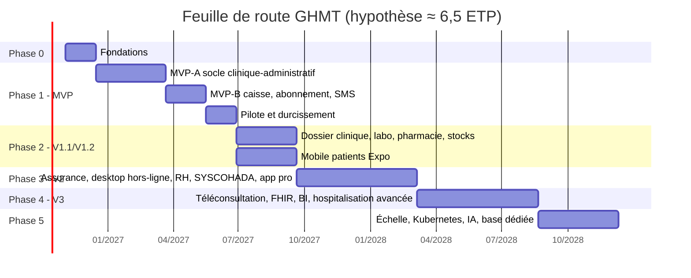
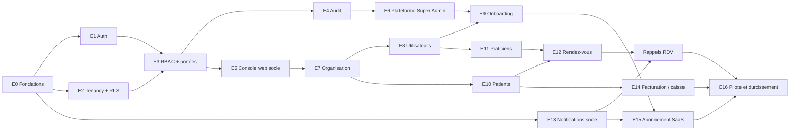

# 06 — Feuille de route, MVP et organisation du projet

> Conforme à `00-decisions.md`. Ce document organise la réalisation de GHMT en phases livrables indépendamment, détaille le MVP (périmètre, backlog), puis décrit l'organisation de l'équipe, la stratégie de tests, la Definition of Done et les risques.

---

## 1. Hypothèses de planification

### Hypothèse d'équipe (base de toutes les durées)

| Rôle | ETP | Responsabilités |
|---|---|---|
| Tech lead / architecte (fullstack TypeScript) | 1 | Architecture, revue de code, sécurité, RLS, décisions techniques (ADR) |
| Développeurs fullstack TypeScript | 3 | Dont 2 à dominante backend (NestJS/Prisma) et 1 à dominante frontend (Next.js) |
| QA / ingénieur automatisation | 1 (0,5 en phase 0) | Stratégie de tests, E2E Playwright, tests d'isolation, recette |
| Product owner (profil métier santé) | 0,5 → 1 | Backlog, priorisation, lien avec les établissements pilotes |
| UX/UI designer | 0,5 | Parcours, design system (shadcn/ui), tests utilisateurs sur terrain |
| DevOps / SRE | 0,5 | CI/CD, Docker Compose, sauvegardes, observabilité, sécurité infra |
| **Total** | **≈ 6,5 ETP** | |

Autres hypothèses :
- Sprints de **2 semaines** ; vélocité effective estimée à 70 % du temps (support, imprévus, réunions).
- 2 à 3 **établissements pilotes** recrutés avant la fin de la phase 0 dans un pays pilote (ex. Sénégal ou Côte d'Ivoire), dont au moins un cabinet et un centre de santé.
- Appui ponctuel externe : juriste protection des données (conformité CDP/ARTCI), conseil fiscal (TVA SaaS), auditeur sécurité (test d'intrusion avant mise en production).
- Les durées sont des **estimations à ±25 %** ; elles sont réévaluées à chaque fin de phase.

### Vue d'ensemble

| Phase | Version | Durée estimée | Fin indicative |
|---|---|---|---|
| Phase 0 — Fondations | — | 6 semaines | mi-décembre 2026 |
| Phase 1 — MVP | V1.0 | 28 semaines (14 sprints) dont 6 de pilote | fin juin 2027 |
| Phase 2 — Modules métier essentiels | V1.1 / V1.2 | 12 semaines (2 flux parallèles) | fin septembre 2027 |
| Phase 3 — Gestion avancée et hors-ligne | V2 | 24 semaines | mi-mars 2028 |
| Phase 4 — Interopérabilité et télésanté | V3 | 24 semaines | fin août 2028 |
| Phase 5 — Échelle et intelligence | V3.x / V4 | 16 semaines puis continu | fin 2028 |

---

## 2. Phases détaillées

### Phase 0 — Fondations (6 semaines, 3 sprints)

**Objectif** : disposer d'un squelette de production sûr sur lequel toute fonctionnalité peut être ajoutée sans dette structurelle (tenancy, sécurité, CI).

**Contenu** :
- Monorepo pnpm + Turborepo : `apps/api`, `apps/web`, `packages/shared`, `packages/config`, `infra/`.
- Outillage : TypeScript strict, ESLint, Prettier, Husky + lint-staged, commitlint (conventional commits), Renovate.
- CI (GitHub Actions ou GitLab CI) : lint, typecheck, tests unitaires, tests d'intégration Testcontainers, build, scan de dépendances et de secrets, génération OpenAPI, image Docker.
- `infra/docker-compose` : PostgreSQL 17, Redis 7, MinIO, Mailpit (SMTP de dev), Grafana/Prometheus/Loki (optionnel en local).
- API NestJS 12 : configuration validée par Zod au démarrage, Pino, OpenTelemetry, gestion d'erreurs RFC 9457 (problem+json), versionnement `/api/v1`, OpenAPI 3.1, health checks.
- Prisma + migrations ; **infrastructure RLS** : rôle applicatif `ghmt_app` sans BYPASSRLS, extension Prisma `$transaction` qui exécute `SET LOCAL app.tenant_id`, script de vérification « toute table avec `tenant_id` a RLS activée + forcée et une politique ».
- Next.js : squelette App Router, design system de base (shadcn/ui), i18n FR/EN, client API typé généré depuis OpenAPI ou depuis les schémas Zod partagés.
- ADR initiaux (stratégie d'identifiants ULID/UUIDv7, conventions API, gestion des secrets, stratégie de sauvegarde).
- Environnements : dev local, CI, préproduction (VPS/cloud dans une région à latence acceptable pour l'Afrique de l'Ouest), sauvegardes automatiques testées.

**Livrables** : dépôt opérationnel, pipeline CI vert, environnement de préproduction déployé, test d'isolation tenant « témoin » passant, documentation `CONTRIBUTING.md`.

**Critères de sortie** :
- [ ] `pnpm dev` démarre l'ensemble en < 5 min sur un poste neuf.
- [ ] Une requête sans contexte tenant sur une table métier renvoie 0 ligne (RLS), prouvée par test automatisé.
- [ ] Déploiement en préproduction automatisé depuis la branche principale.
- [ ] Restauration d'une sauvegarde PostgreSQL testée et chronométrée.

### Phase 1 — MVP (V1.0) (28 semaines)

**Objectif** : permettre à un cabinet ou un centre de santé de gérer au quotidien ses patients, rendez-vous et encaissements, avec rappels SMS, sous abonnement SaaS payable en Mobile Money.

Découpage en trois sous-jalons livrables indépendamment :

| Jalon | Durée | Contenu | Livrable |
|---|---|---|---|
| **MVP-A** — socle | 14 semaines (7 sprints) | Auth (login, refresh, 2FA TOTP), tenancy + RLS, RBAC avec portées, audit, onboarding, organisation (sites/services), utilisateurs, patients, praticiens, rendez-vous, console web minimale (plateforme + établissement) | Démo interne puis bêta fermée sans paiement |
| **MVP-B** — monétisation | 8 semaines (4 sprints) | Facturation patient simple et caisse, abonnement SaaS de base (plans, essai, entitlements, facture SaaS, paiement Mobile Money via 1 agrégateur, machine à états, relances), notifications socle (SMS rappels RDV, e-mail, in-app) | Version candidate V1.0 |
| **MVP-C** — pilote | 6 semaines (3 sprints) | Déploiement chez 2-3 pilotes, corrections, performance sur réseau 3G, test d'intrusion, documentation utilisateur, procédures support | **V1.0 en production** |

**Critères de sortie de la phase 1** :
- [ ] Au moins 2 établissements pilotes utilisent GHMT quotidiennement depuis ≥ 4 semaines.
- [ ] 0 vulnérabilité critique/haute ouverte (test d'intrusion externe).
- [ ] Suite d'isolation tenant verte sur 100 % des modèles tenant.
- [ ] Couverture de tests ≥ 80 % sur `apps/api` et `packages/shared`.
- [ ] p95 API < 400 ms (hors upload) en préproduction, page agenda utilisable en 3G (< 3 s au premier affichage après cache).
- [ ] Un paiement Mobile Money réel encaissé, rapproché et ayant activé un abonnement.
- [ ] Taux de délivrance des rappels SMS ≥ 90 % sur le pays pilote.
- [ ] RPO ≤ 24 h (PITR visé en phase 2), RTO ≤ 4 h démontrés.

### Phase 2 — Modules métier essentiels (V1.1 / V1.2) (12 semaines)

**Objectif** : couvrir les profils laboratoire et pharmacie, et la consultation médicale ; offrir l'application mobile patient.

| Flux | Contenu |
|---|---|
| Flux A (2 devs) | **Dossier patient clinique** (consultations, constantes, antécédents, allergies, prescriptions, documents) ; **laboratoire** (catalogue d'examens, demandes, prélèvements, saisie/validation des résultats, compte rendu PDF, notification « résultat disponible ») ; **pharmacie** (dispensation, vente comptoir, ordonnances) ; **stocks** (articles, lots, péremptions, mouvements, inventaires, alertes) ; add-ons correspondants dans les entitlements |
| Flux B (1 dev + designer) | **Application mobile patients Expo** : connexion OTP, mes RDV, prise/annulation de RDV en ligne, notifications push, documents disponibles, multi-établissements ; portail patient web équivalent léger |
| Transverse | Second agrégateur de paiement, PITR PostgreSQL, API publique lecture (Standard+), confirmation de RDV par réponse SMS |

**Critères de sortie** : un laboratoire et une pharmacie pilotes en production ; application publiée sur Google Play (Android prioritaire, APK < 30 Mo) ; 500 patients pilotes inscrits sur l'app.

### Phase 3 — Gestion avancée et hors-ligne (V2) (24 semaines)

**Objectif** : servir les cliniques et hôpitaux niveau 1-2 et les zones à connectivité instable.

**Contenu** : assurance / tiers payant (conventions, prises en charge, bordereaux, part patient/assureur) ; **Desktop Tauri** hors-ligne (cache SQLite, synchronisation bidirectionnelle avec résolution de conflits, licences signées) ; **RH & paie** (personnel, contrats, gardes/plannings, congés, paie de base selon pays) ; **comptabilité SYSCOHADA révisé** (plan de comptes, journaux, écritures automatiques depuis caisse/facturation, grand livre, balance, états financiers) ; **application professionnelle** (Expo : agenda praticien, notifications, validation de résultats) ; hospitalisation simple (admissions, lits, séjours) ; SSO Enterprise.

**Critères de sortie** : un établissement fonctionne une journée complète hors-ligne puis synchronise sans perte ; clôture comptable mensuelle validée par un expert-comptable ; une clinique pilote facture des assureurs via GHMT.

### Phase 4 — Interopérabilité et télésanté (V3) (24 semaines)

**Contenu** : **téléconsultation** (visio WebRTC adaptée aux faibles débits, repli audio, paiement préalable Mobile Money) ; **HL7 FHIR R4** (ressources Patient, Practitioner, Appointment, Encounter, Observation, DiagnosticReport ; API FHIR en lecture puis écriture ; connecteurs DHIS2 pour la remontée des indicateurs sanitaires nationaux) ; interfaçage automates de laboratoire (HL7 v2/ASTM) ; **BI** (entrepôt analytique séparé, tableaux de bord avancés, rapports réglementaires) ; hospitalisation avancée (bloc, soins infirmiers) ; marketplace d'intégrations.

### Phase 5 — Échelle et intelligence (V3.x / V4)

**Contenu** : migration Kubernetes, multi-région, **base dédiée** pour clients Enterprise, hébergement pays si exigé par la réglementation ; **IA** (aide à la saisie, détection des doublons patients, prévision des stocks et des no-shows, résumés de dossiers — avec supervision humaine, sans décision médicale automatisée, et analyse d'impact préalable) ; certifications (ISO 27001 visée) ; nouvelles langues (wolof, lingala, swahili… pour l'interface patient).

---

## 3. MVP détaillé

### 3.1 Périmètre

| Domaine | **Inclus dans le MVP (V1.0)** | **Exclu du MVP** (version cible) |
|---|---|---|
| Monorepo / plateforme technique | Monorepo, CI/CD, Docker Compose, observabilité de base, sauvegardes quotidiennes | Kubernetes (Phase 5), PITR (V1.1) |
| Authentification | Login e-mail/téléphone + mot de passe (Argon2id), JWT 15 min + refresh rotatif opaque avec détection de réutilisation, logout, sessions révocables, 2FA TOTP + codes de secours, réinitialisation de mot de passe, verrouillage progressif | SSO SAML/OIDC (V2), WebAuthn/passkeys (V2), OTP SMS comme 2FA (non prévu, sauf récupération) |
| Multi-tenant | Tenant = établissement, RLS sur toutes les tables métier, contexte tenant par transaction, break-glass Super Admin audité | Groupes multi-établissements avec consolidation (V1.2), base dédiée (Phase 5) |
| RBAC | Catalogue de permissions dans `packages/shared`, rôles système, rôles personnalisés (Standard+), affectations avec portée établissement/site/service | Portée groupe (V1.2), délégations temporaires (V2) |
| Audit | Journal immuable (chaînage par hash) des accès et modifications sensibles, consultation filtrée, export CSV | Export SIEM (V2) |
| Onboarding | Assistant 8 étapes, modèles cabinet / centre de santé / clinique (les modèles pharmacie et labo sont livrés avec leurs modules en V1.1) | Onboarding assisté par agent (V1.1) |
| Organisation | Sites, services (marqueur sensible), horaires d'ouverture | Bâtiments/lits (V2) |
| Utilisateurs | Invitation, activation, désactivation, profil, langue | Import CSV (V1.1) |
| Patients | Création, IPP, recherche tolérante (nom, téléphone, IPP), détection de doublons à la saisie, contacts, consentement aux rappels, archivage | Fusion de doublons (V1.1), dossier clinique (V1.1), portail patient (V1.1) |
| Praticiens | Fiche, spécialités, rattachement services/sites, modèles de disponibilités, absences | Gestion RH (V2) |
| Rendez-vous | Agenda jour/semaine par praticien et service, création/déplacement/annulation, statuts (planifié, arrivé, en cours, terminé, absent, annulé), file du jour, motifs, durée par type | Prise de RDV en ligne par le patient (V1.1), listes d'attente (V1.1), ressources/équipements (V1.2), RDV récurrents (V1.2) |
| Facturation / caisse | Catalogue d'actes et tarifs, facture patient, encaissement espèces / Mobile Money déclaratif / carte déclarative, paiements partiels, reçu PDF, sessions de caisse (ouverture, clôture, écart), avoir | Paiement Mobile Money patient intégré (V1.1), tiers payant (V2), comptabilité (V2) |
| Abonnement SaaS | Plans Basic/Standard/Professional + offre Cabinet, essai 30 j, entitlements et quotas (utilisateurs, sites, RDV, SMS, stockage), factures SaaS, paiement Mobile Money via 1 agrégateur (webhook + revérification), paiement manuel, machine à états complète, relances | Add-ons modules (V1.1), prorata automatique (V1.1 ; manuel au MVP), second agrégateur et rapprochement automatisé complet (V1.1 ; rapprochement semi-manuel au MVP), Enterprise sur devis géré hors outil |
| Notifications | NotificationService, outbox, files BullMQ, SMS (1 fournisseur + repli), e-mail SMTP, in-app WebSocket, modèles FR/EN, préférences et opt-out, plages silencieuses, dédup, rappels J-1/H-2, linter de confidentialité | Push mobile (V1.1 avec l'app), Web Push (V1.1), réponses SMS (V1.1) |
| Console web | Console plateforme (tenants, plans, abonnements, KPI de base, break-glass) ; console établissement (navigation selon permissions, tableaux de bord établissement/caisse/praticien simples) | BI (V3), personnalisation des tableaux de bord (V2) |
| Hors périmètre absolu du MVP | Laboratoire, pharmacie, stocks, assurance, RH, SYSCOHADA, mobile, desktop, téléconsultation, FHIR, IA | Voir section 5 |

### 3.2 Ordre de réalisation (dépendances)

Planning indicatif par sprint :

| Sprint | Epics principaux |
|---|---|
| S0-S2 (phase 0) | E0 |
| S3 | E1 (login, refresh, logout), E2 (contexte tenant, RLS) |
| S4 | E1 (2FA, reset, sessions), E3 (catalogue, rôles, guard) |
| S5 | E3 (portées, UI rôles), E4, E5 |
| S6 | E6, E7, E8 |
| S7 | E9, E10 |
| S8 | E10 (doublons, recherche), E11 |
| S9 | E12 (agenda, création, statuts) — **fin MVP-A** |
| S10 | E13 (socle), E12 (rappels), E14 (tarifs, factures) |
| S11 | E14 (caisse, reçus), E15 (plans, essai, entitlements) |
| S12 | E15 (facture SaaS, paiement Mobile Money, machine à états) |
| S13 | E15 (relances, quotas), stabilisation — **fin MVP-B** |
| S14-S16 | E16 pilote |

### 3.3 Backlog du MVP (epics → user stories)

Format : **ID — En tant que…, je veux… afin de…** — *Critères d'acceptation (CA)*. Les stories sont ordonnées par dépendance à l'intérieur de chaque epic.

#### E0 — Fondations techniques
- **US-001** — En tant que développeur, je veux un monorepo pnpm/Turborepo avec `apps/api`, `apps/web`, `packages/shared`, `packages/config` afin de partager types et configuration. — *CA : `pnpm build` et `pnpm test` passent depuis la racine ; cache Turborepo actif en CI.*
- **US-002** — En tant que développeur, je veux un environnement Docker Compose (PostgreSQL 17, Redis 7, MinIO, Mailpit) afin de développer localement. — *CA : démarrage en une commande ; données de seed de démonstration avec 2 tenants.*
- **US-003** — En tant que tech lead, je veux une CI (lint, typecheck, tests, Testcontainers, scan de secrets/dépendances, build image) afin de bloquer toute régression. — *CA : une PR ne peut être fusionnée sans CI verte et 1 revue.*
- **US-004** — En tant que développeur, je veux un squelette NestJS (config Zod, Pino, OpenTelemetry, erreurs problem+json, `/api/v1`, OpenAPI 3.1, `/health`) afin d'avoir des conventions uniformes. — *CA : spec OpenAPI générée en CI ; erreurs au format RFC 9457 ; logs JSON corrélés par `trace_id`.*
- **US-005** — En tant qu'opérateur, je veux une préproduction déployée automatiquement et des sauvegardes quotidiennes testées afin de valider en conditions réelles. — *CA : déploiement automatique sur la branche principale ; restauration documentée et chronométrée.*

#### E1 — Authentification
- **US-010** — En tant qu'utilisateur, je veux me connecter avec e-mail ou téléphone et mot de passe afin d'accéder à mon établissement. — *CA : Argon2id ; message d'erreur générique ; jeton d'accès 15 min ; refresh token opaque en cookie httpOnly/SameSite (web) ; verrouillage progressif après 5 échecs ; événement audité.*
- **US-011** — En tant qu'utilisateur, je veux que ma session se renouvelle sans ressaisie afin de travailler sans interruption. — *CA : rotation du refresh token à chaque usage ; réutilisation d'un ancien jeton → révocation de toute la famille + alerte `auth.new_login`.*
- **US-012** — En tant qu'utilisateur, je veux me déconnecter et voir/révoquer mes sessions actives afin de sécuriser mon compte. — *CA : liste des sessions (appareil, IP, date) ; révocation effective < 15 min (jeton d'accès) et immédiate pour le refresh.*
- **US-013** — En tant qu'utilisateur, je veux activer une 2FA TOTP avec codes de secours afin de protéger mon compte. — *CA : QR code + secret ; activation après vérification d'un code ; 10 codes de secours à usage unique, hachés ; secret TOTP chiffré au repos.*
- **US-014** — En tant qu'utilisateur 2FA, je veux saisir mon code TOTP à la connexion afin de finaliser l'authentification. — *CA : jeton intermédiaire à durée courte (5 min) ; tolérance ±1 pas de 30 s ; anti-rejeu du même code.*
- **US-015** — En tant qu'administrateur d'établissement, je veux rendre la 2FA obligatoire pour certains rôles afin de respecter notre politique de sécurité. — *CA : utilisateurs concernés forcés à l'enrôlement à la connexion suivante ; obligatoire par défaut pour le propriétaire et les administrateurs.*
- **US-016** — En tant qu'utilisateur, je veux réinitialiser mon mot de passe par e-mail ou SMS afin de récupérer mon accès. — *CA : jeton à usage unique 30 min ; réponse identique que le compte existe ou non ; toutes les sessions révoquées après réinitialisation.*

#### E2 — Tenancy et RLS
- **US-020** — En tant que plateforme, je veux que toute requête authentifiée s'exécute dans une transaction avec `SET LOCAL app.tenant_id` afin d'isoler les données. — *CA : extension Prisma/intercepteur ; impossible d'accéder à une table métier hors contexte ; rôle `ghmt_app` sans BYPASSRLS.*
- **US-021** — En tant que tech lead, je veux un contrôle automatique que chaque table portant `tenant_id` a RLS activée, forcée et une politique afin d'éviter tout oubli. — *CA : script en CI interrogeant `pg_class`/`pg_policies` ; échec si une table n'est pas conforme ou n'est pas dans une liste d'exceptions justifiées.*
- **US-022** — En tant qu'utilisateur appartenant à plusieurs établissements, je veux choisir l'établissement actif afin de travailler dans le bon contexte. — *CA : sélecteur après login ; le `tenant_id` est porté par le jeton et vérifié contre les appartenances ; changement d'établissement audité.*
- **US-023** — En tant que Super Administrateur, je veux demander un accès délégué (break-glass) limité dans le temps à un tenant afin d'assurer le support. — *CA : motif obligatoire ; durée max 4 h ; approbation par le propriétaire (ou procédure d'urgence à double validation plateforme) ; notification `platform.breakglass_opened` ; toutes les actions auditées et visibles par le tenant.*

#### E3 — RBAC avec portées
- **US-030** — En tant que développeur, je veux un catalogue de permissions typé dans `packages/shared` (`patient.read`, `appointment.write`, `cash.close`…) afin de l'utiliser côté API et web. — *CA : source unique ; génération de la documentation des permissions ; tests de cohérence.*
- **US-031** — En tant que plateforme, je veux des rôles système pré-définis (Propriétaire, Administrateur, Médecin, Infirmier, Secrétaire, Caissier, Comptable…) afin d'accélérer la mise en service. — *CA : rôles en lecture seule, versionnés ; utilisés par les modèles d'onboarding.*
- **US-032** — En tant qu'administrateur, je veux attribuer un rôle à un utilisateur avec une portée (établissement, site, service) afin de limiter ses accès à son périmètre. — *CA : un caissier du site A ne voit pas la caisse du site B ; tests d'autorisation par portée.*
- **US-033** — En tant que développeur, je veux un guard `@RequirePermission('x', { scope })` et un filtrage par portée dans les requêtes afin d'appliquer l'autorisation de façon uniforme. — *CA : refus par défaut ; 403 normalisé ; couverture de tests de chaque endpoint par une matrice rôle × action.*
- **US-034** — En tant qu'administrateur (Standard+), je veux créer des rôles personnalisés afin d'adapter les accès à mon organisation. — *CA : sélection dans le catalogue ; impossibilité d'octroyer une permission que l'on ne détient pas ; garde par entitlement `feature.custom_roles`.*

#### E4 — Audit
- **US-040** — En tant que responsable conformité, je veux que les connexions, les accès aux dossiers patients et toutes les modifications sensibles soient journalisés afin de pouvoir rendre compte. — *CA : qui, quoi, quand, tenant, portée, IP, avant/après (champs sensibles masqués) ; écriture asynchrone fiable (outbox) ; table en ajout seul (pas d'UPDATE/DELETE pour le rôle applicatif).*
- **US-041** — En tant que responsable conformité, je veux une preuve d'intégrité du journal afin de détecter toute altération. — *CA : chaînage par hash par tenant ; job de vérification quotidien ; alerte en cas de rupture.*
- **US-042** — En tant qu'administrateur, je veux consulter et exporter le journal filtré (utilisateur, patient, période, action) afin de mener une investigation. — *CA : pagination par curseur ; export CSV audité ; rétention selon le plan.*

#### E5 — Console web socle
- **US-050** — En tant qu'utilisateur, je veux une interface responsive en français (anglais disponible) dont la navigation n'affiche que ce que j'ai le droit de faire afin de travailler simplement. — *CA : menus calculés depuis permissions + entitlements ; i18n complète ; utilisable sur écran 1366×768 et tablette.*
- **US-051** — En tant qu'utilisateur sur connexion lente, je veux une application légère afin de rester productif. — *CA : budget JS initial < 250 Ko gzip ; cache TanStack Query ; états de chargement et de reprise ; test Lighthouse en profil « 3G lente » en CI.*
- **US-052** — En tant qu'utilisateur, je veux des messages d'erreur clairs et actionnables afin de comprendre quoi faire. — *CA : mapping des erreurs problem+json en messages localisés ; aucun détail technique exposé.*

#### E6 — Console plateforme (Super Admin)
- **US-060** — En tant que Super Administrateur, je veux lister et rechercher les établissements avec leur état d'abonnement afin de piloter la plateforme. — *CA : aucun accès aux données de santé ; filtres par pays, profil, état.*
- **US-061** — En tant que Super Administrateur, je veux gérer le catalogue de plans et de modèles d'établissement afin de faire évoluer l'offre sans déploiement. — *CA : plans versionnés ; validation Zod des entitlements et des modèles ; audit.*
- **US-062** — En tant que Super Administrateur, je veux un tableau de bord de KPI de base (établissements, actifs, utilisateurs, RDV, MRR, essais, impayés) afin de suivre l'activité. — *CA : agrégats via rôle `ghmt_stats` ; rafraîchissement quotidien ; export CSV.*

#### E7 — Organisation
- **US-070** — En tant qu'administrateur, je veux gérer les sites (adresse, téléphone, fuseau horaire, horaires) afin de refléter mon organisation. — *CA : quota `limit.sites` appliqué (limite dure) ; un site principal obligatoire.*
- **US-071** — En tant qu'administrateur, je veux gérer les services rattachés aux sites et marquer un service comme sensible afin d'organiser l'activité et protéger la confidentialité. — *CA : un service sensible n'apparaît dans aucun message sortant (test du linter) ; désactivation possible si aucun RDV futur.*

#### E8 — Utilisateurs
- **US-080** — En tant qu'administrateur, je veux inviter un utilisateur par e-mail ou SMS avec un rôle et une portée afin de l'intégrer. — *CA : lien d'invitation à usage unique 72 h ; quota utilisateurs (limite dure) ; renvoi possible.*
- **US-081** — En tant qu'invité, je veux activer mon compte (mot de passe, 2FA si exigée) afin de commencer à travailler. — *CA : politique de mot de passe ; rattachement au tenant ; audit.*
- **US-082** — En tant qu'administrateur, je veux désactiver un utilisateur afin de retirer immédiatement ses accès. — *CA : sessions révoquées ; historique conservé ; licence utilisateur libérée.*
- **US-083** — En tant qu'utilisateur, je veux gérer mon profil (langue, téléphone, préférences de notification) afin de personnaliser mon usage. — *CA : changement de téléphone/e-mail vérifié par code.*

#### E9 — Onboarding d'établissement
- **US-090** — En tant que futur client, je veux créer mon compte et mon établissement (étapes 1-2) afin de démarrer un essai. — *CA : OTP SMS + vérification e-mail ; anti-abus d'essai ; tenant créé en état `onboarding` ; abonnement `trial`.*
- **US-091** — En tant que propriétaire, je veux qu'un modèle pré-configuré soit appliqué selon mon type d'établissement afin de gagner du temps. — *CA : services, rôles, paramètres et tarifs d'exemple créés de façon idempotente ; modifiables ensuite.*
- **US-092** — En tant que propriétaire, je veux choisir modules et offre (étape 3) et configurer mon établissement (étape 4) afin d'adapter GHMT à mon contexte. — *CA : devise/fuseau/langue proposés selon le pays ; formats IPP et numérotation des factures validés.*
- **US-093** — En tant que propriétaire, je veux inviter mes collaborateurs, ajuster les rôles et les services (étapes 5-7) afin de préparer l'équipe. — *CA : étapes différables ; réutilise E3/E7/E8.*
- **US-094** — En tant que propriétaire, je veux une check-list de démarrage (étape 8) afin de savoir quand je suis prêt. — *CA : 2FA propriétaire obligatoire ; au moins 1 praticien ; données de démo supprimables en un clic ; événement `tenant.onboarded`.*
- **US-095** — En tant que propriétaire, je veux reprendre l'assistant là où je l'ai laissé afin de ne rien perdre. — *CA : progression persistée par étape ; reprise sur un autre appareil.*

#### E10 — Patients
- **US-100** — En tant que secrétaire, je veux enregistrer un patient (identité, sexe, date de naissance ou âge estimé, téléphone(s), adresse, personne à prévenir) afin de constituer son dossier administratif. — *CA : IPP unique par tenant selon le format configuré ; âge estimé accepté (dates de naissance souvent inconnues) ; téléphone normalisé E.164 ; création jamais bloquée par les quotas.*
- **US-101** — En tant que secrétaire, je veux être averti des doublons potentiels lors de la saisie afin d'éviter les dossiers en double. — *CA : recherche approchée (trigrammes `pg_trgm`, nom + date de naissance + téléphone) ; affichage des candidats ; possibilité de continuer en justifiant.*
- **US-102** — En tant qu'utilisateur autorisé, je veux rechercher un patient par nom, téléphone ou IPP en moins d'une seconde afin d'accueillir rapidement. — *CA : p95 < 300 ms sur 100 000 patients ; résultats filtrés par permission ; recherche auditée.*
- **US-103** — En tant que secrétaire, je veux enregistrer le consentement du patient aux rappels (SMS/e-mail) afin de respecter la réglementation. — *CA : horodatage, canal, source ; révocable ; utilisé par les préférences de notification.*
- **US-104** — En tant qu'utilisateur autorisé, je veux modifier et archiver un patient afin de tenir les données à jour. — *CA : historique des modifications audité ; archivage réversible ; pas de suppression physique depuis l'UI.*

#### E11 — Praticiens
- **US-110** — En tant qu'administrateur, je veux créer une fiche praticien liée à un utilisateur (spécialités, numéro d'ordre, services, sites) afin de l'intégrer à l'agenda. — *CA : un praticien peut exercer sur plusieurs sites/services ; spécialités issues d'un référentiel.*
- **US-111** — En tant que praticien ou secrétaire, je veux définir les disponibilités hebdomadaires et les absences afin de générer les créneaux. — *CA : modèles par jour, durée de créneau par type de RDV ; absences bloquant la prise de RDV ; conflits signalés.*

#### E12 — Rendez-vous
- **US-120** — En tant que secrétaire, je veux voir l'agenda par praticien, service ou site (jour/semaine) afin d'organiser l'activité. — *CA : affichage en < 2 s en 3G après cache ; fuseau du site ; filtrage par portée.*
- **US-121** — En tant que secrétaire, je veux créer un RDV pour un patient sur un créneau libre afin de planifier sa venue. — *CA : contrôle de chevauchement transactionnel (contrainte d'exclusion PostgreSQL sur la plage) ; quota RDV (limite souple) ; événement `appointment.created` ; confirmation envoyée selon préférences.*
- **US-122** — En tant que secrétaire, je veux déplacer ou annuler un RDV afin de gérer les imprévus. — *CA : motif d'annulation ; verrouillage optimiste (version) ; rappels replanifiés/supprimés ; notifications correspondantes.*
- **US-123** — En tant que secrétaire ou praticien, je veux changer le statut (arrivé, en cours, terminé, absent) afin de suivre la file du jour. — *CA : transitions valides uniquement ; horodatage ; vue « file d'attente du jour » par service.*
- **US-124** — En tant que secrétaire, je veux enregistrer un patient non programmé (sans RDV) dans la file du jour afin de gérer les consultations spontanées. — *CA : RDV « immédiat » créé sans contrôle de créneau ; non décompté de la limite souple au-delà de la tolérance.*

#### E13 — Notifications socle
- **US-130** — En tant que plateforme, je veux une outbox transactionnelle et un `NotificationService` avec files BullMQ par canal afin d'envoyer des notifications fiables. — *CA : aucune notification pour une transaction annulée ; dédup par clé d'idempotence ; journal de livraison.*
- **US-131** — En tant que plateforme, je veux des adaptateurs SMS (1 fournisseur principal + 1 repli), SMTP et in-app WebSocket afin de joindre les destinataires. — *CA : DLR SMS traités ; disjoncteur ; adaptateur factice hors production.*
- **US-132** — En tant qu'administrateur, je veux des modèles FR/EN avec variables et prévisualisation afin d'adapter les messages. — *CA : linter de confidentialité bloquant ; calcul des segments SMS ; translittération GSM-7 activable.*
- **US-133** — En tant que patient, je veux recevoir un rappel J-1 et H-2 de mon RDV afin de ne pas l'oublier. — *CA : jobs déterministes ; replanification/annulation ; vérification de fraîcheur ; balayeur de rattrapage ; plages silencieuses ; aucun contenu médical.*
- **US-134** — En tant que patient, je veux pouvoir refuser les rappels (STOP ou au guichet) afin de respecter mon choix. — *CA : envoi supprimé et journalisé `suppressed` ; consentement mis à jour et audité.*
- **US-135** — En tant qu'utilisateur, je veux une boîte de notifications in-app afin de suivre les alertes me concernant. — *CA : compteur de non-lus en temps réel ; marquage lu ; persistance 30 j.*

#### E14 — Facturation patient simple et caisse
- **US-140** — En tant qu'administrateur, je veux gérer un catalogue d'actes et de tarifs (par site si besoin) afin de facturer de façon homogène. — *CA : devise du tenant ; historique des prix ; activation/désactivation.*
- **US-141** — En tant que caissier, je veux ouvrir une session de caisse avec un fond initial afin de commencer les encaissements. — *CA : une session ouverte par caissier et par caisse ; obligatoire pour encaisser.*
- **US-142** — En tant que caissier, je veux créer une facture patient (actes, remises autorisées) depuis un RDV ou en direct afin de facturer la prestation. — *CA : numérotation sans trou par tenant ; remise soumise à permission ; facture validée immuable.*
- **US-143** — En tant que caissier, je veux encaisser en espèces, Mobile Money (référence de transaction saisie) ou carte, y compris partiellement, afin de refléter la réalité. — *CA : reste dû calculé ; référence Mobile Money unique par tenant ; reçu PDF imprimable (format ticket 80 mm et A4) et envoyable par e-mail/SMS (lien).*
- **US-144** — En tant que caissier, je veux clôturer ma session avec comptage par mode de paiement afin de justifier ma caisse. — *CA : écart calculé et motivé ; notification `cash.session_discrepancy` au-delà d'un seuil ; rapport Z PDF.*
- **US-145** — En tant que responsable, je veux émettre un avoir sur une facture afin de corriger une erreur. — *CA : permission dédiée ; lien vers la facture d'origine ; audit.*
- **US-146** — En tant que directeur, je veux un tableau de bord des recettes par jour, mode et caissier afin de contrôler l'activité. — *CA : filtres par site ; export CSV.*

#### E15 — Abonnement SaaS de base
- **US-150** — En tant que plateforme, je veux modéliser plans, abonnements et entitlements afin d'appliquer l'offre souscrite. — *CA : `EntitlementService` avec cache Redis ; guards `@RequiresFeature` et `@ConsumesQuota` ; tests par palier.*
- **US-151** — En tant que plateforme, je veux une machine à états d'abonnement (trial, active, past_due, grace, suspended, cancelled, expired) afin de gérer le cycle de vie. — *CA : transitions uniquement via la machine ; job horaire ; événements et audit ; mode continuité des soins en `suspended` vérifié par test E2E.*
- **US-152** — En tant que propriétaire, je veux voir mon plan, ma consommation de quotas et mes factures afin de maîtriser mes coûts. — *CA : page « Abonnement » réservée à `subscription.read` ; alertes 80/100 %.*
- **US-153** — En tant que plateforme, je veux générer les factures SaaS (numérotation légale, TVA par pays, PDF) afin de facturer les établissements. — *CA : émission à J-7 ; immuables ; avoirs ; envoi par e-mail + SMS avec lien de paiement.*
- **US-154** — En tant que propriétaire, je veux payer ma facture par Mobile Money afin de régulariser mon abonnement simplement. — *CA : 1 agrégateur (CinetPay ou PayDunya selon pays pilote) ; webhook signé + revérification serveur ; idempotence ; polling de secours ; activation immédiate après confirmation.*
- **US-155** — En tant que Finance plateforme, je veux enregistrer un paiement manuel (virement/espèces) avec justificatif et double validation afin de couvrir tous les moyens de paiement. — *CA : saisisseur ≠ validateur ; audit.*
- **US-156** — En tant que plateforme, je veux envoyer automatiquement les relances (J-7 à J+15) afin de réduire les impayés. — *CA : calendrier paramétrable ; arrêt immédiat dès paiement.*
- **US-157** — En tant que Finance plateforme, je veux un rapport quotidien de rapprochement semi-automatique afin de détecter les écarts. — *CA : import des transactions de l'agrégateur ; liste des écarts ; résolution tracée.*
- **US-158** — En tant que propriétaire, je veux changer de plan ou résilier afin d'adapter mon abonnement. — *CA : upgrade avec facture de prorata (calcul assisté) ; downgrade et résiliation en fin de période ; vérification de compatibilité des quotas.*

#### E16 — Pilote et durcissement
- **US-160** — En tant que PO, je veux migrer/importer les patients existants des pilotes (CSV/Excel) afin de faciliter l'adoption. — *CA : modèle d'import, rapport d'erreurs, détection de doublons, import réversible.*
- **US-161** — En tant qu'équipe, je veux un test d'intrusion externe et la correction des vulnérabilités afin de sécuriser la mise en production. — *CA : 0 critique/haute ouverte.*
- **US-162** — En tant qu'utilisateur pilote, je veux une documentation et des tutoriels vidéo courts en français afin de me former. — *CA : guides par rôle ; vidéos < 3 min ; centre d'aide accessible depuis l'application.*
- **US-163** — En tant que support, je veux des procédures d'exploitation (incident, restauration, break-glass, rotation des secrets) afin de répondre aux incidents. — *CA : exercice de restauration et exercice d'incident réalisés.*
- **US-164** — En tant qu'équipe, je veux des tests de charge (k6) sur les parcours agenda, recherche patient et caisse afin de garantir la performance. — *CA : 200 utilisateurs simultanés, p95 < 400 ms, 0 erreur 5xx.*

---

## 4. Fonctionnalités des versions suivantes

| Version | Fonctionnalités | Dépendances clés |
|---|---|---|
| **V1.1** (Phase 2) | Dossier patient clinique (consultations, constantes, antécédents, allergies, prescriptions, documents) ; **laboratoire** ; **pharmacie** ; **stocks** (lots, péremptions, alertes) ; modèles d'onboarding pharmacie/labo ; add-ons modules ; prise de RDV en ligne ; listes d'attente ; fusion de doublons patients ; paiement Mobile Money patient intégré en caisse ; second agrégateur ; rapprochement automatisé ; PITR ; push et Web Push ; réponses SMS de confirmation ; import CSV utilisateurs | MVP |
| **V1.2** (Phase 2) | **Application mobile patients Expo** (RDV, rappels push, documents, multi-établissements) ; groupes multi-établissements et portée groupe ; ressources/équipements dans l'agenda ; RDV récurrents ; API publique lecture/écriture et webhooks sortants | V1.1 (documents, notifications push) |
| **V2** (Phase 3) | **Assurance / tiers payant** ; **Desktop Tauri hors-ligne** + licences signées ; **RH & paie** ; **comptabilité SYSCOHADA révisé** ; **application professionnelle** (praticiens) ; hospitalisation simple (admissions, lits) ; SSO SAML/OIDC ; passkeys ; export SIEM ; tableaux de bord personnalisables | Facturation patient, stocks, caisse |
| **V3** (Phase 4) | **Téléconsultation** (WebRTC faible débit) ; **interopérabilité HL7 FHIR R4** ; connecteur **DHIS2** ; interfaçage automates labo (HL7 v2/ASTM) ; **BI** (entrepôt analytique) ; bloc opératoire et soins infirmiers ; marketplace d'intégrations | V2 (dossier complet, hospitalisation) |
| **V3.x / V4** (Phase 5) | **IA** supervisée (aide à la saisie, doublons, prévisions stocks et no-show, résumés) ; base dédiée Enterprise ; multi-région / hébergement pays ; Kubernetes ; ISO 27001 ; interfaces patient en langues nationales | Volume de données, maturité de la plateforme |

---

## 5. Organisation de l'équipe et rituels

### Organisation

- **Équipe produit unique** pluridisciplinaire jusqu'à la V1.2 ; division en deux squads (« Clinique & patients » / « Gestion & plateforme ») à partir de la phase 3 si l'équipe dépasse 8 personnes.
- **Propriété de code** : par module NestJS (un référent par module) mais revue croisée obligatoire ; le tech lead est référent de `tenancy`, `auth`, `rbac`, `audit`.
- **Comité métier** mensuel avec les établissements pilotes (médecin, secrétaire, caissier, directeur).
- **Référent sécurité et protection des données** (tech lead au départ + juriste externe) : registre des traitements, analyses d'impact (AIPD) pour les modules cliniques, registre des sous-traitants.

### Rituels (sprints de 2 semaines)

| Rituel | Fréquence | Durée | Participants | Sortie |
|---|---|---|---|---|
| Planification de sprint | Début de sprint | 2 h | Équipe | Objectif de sprint, stories engagées |
| Daily | Quotidien | 15 min | Équipe | Blocages levés |
| Affinage du backlog | Hebdomadaire | 1 h | PO, tech lead, 1 dev, QA, UX | Stories prêtes (DoR) avec CA |
| Revue de sprint / démo | Fin de sprint | 1 h | Équipe + pilotes (en visio) | Feedback, backlog ajusté |
| Rétrospective | Fin de sprint | 1 h | Équipe | 1 à 3 actions d'amélioration |
| Revue d'architecture (ADR) | Toutes les 2 semaines | 1 h | Tech lead + devs | ADR validés |
| Revue sécurité | Mensuelle | 1 h | Tech lead, DevOps | Vulnérabilités, accès, secrets |
| Visite terrain | Trimestrielle (+ pendant pilote) | 1-2 j | PO, UX, 1 dev | Observations d'usage réelles (réseau, matériel) |

### Definition of Ready (DoR)

Une story est prête si : valeur et rôle explicites ; critères d'acceptation testables ; maquettes si UI ; permissions et entitlements concernés identifiés ; impact données personnelles évalué ; dépendances levées ; estimée.

---

## 6. Stratégie de tests

### Pyramide et outils

| Niveau | Outil | Portée | Exécution |
|---|---|---|---|
| Unitaires | Vitest (API, web, shared) | Services de domaine, machines à états (RDV, abonnement), calculs (prorata, quotas, segments SMS, fuseaux), schémas Zod, guards | À chaque commit (CI) |
| Composants web | Vitest + Testing Library | Formulaires, navigation selon permissions | CI |
| Intégration | Vitest + **Testcontainers PostgreSQL 17** (+ Redis, MinIO) | Repositories Prisma, migrations, **politiques RLS avec le vrai rôle `ghmt_app`**, outbox, files BullMQ, webhooks de paiement sur charges utiles enregistrées | CI (parallélisée) |
| Contrat API | Validation des réponses contre la spec OpenAPI | Tous les endpoints `/api/v1` | CI |
| **Isolation tenant** | Suite dédiée (Vitest + Testcontainers) | Voir ci-dessous | CI, bloquant |
| Autorisation | Matrice rôle × portée × endpoint générée depuis le catalogue de permissions | Tous les endpoints | CI, bloquant |
| E2E | **Playwright** | Parcours critiques (ci-dessous) sur environnement Docker Compose complet ; profil réseau lent | CI sur la branche principale + nightly |
| Performance | k6 | Agenda, recherche patient, caisse, webhooks | Hebdomadaire + avant release |
| Sécurité | Scan de dépendances, de secrets, SAST (CodeQL/Semgrep), DAST (OWASP ZAP baseline), test d'intrusion externe | — | CI / nightly / avant V1.0 puis annuel |
| Accessibilité | axe-core via Playwright | Pages principales | Nightly |

### Tests d'isolation tenant (obligatoires)

1. **Couverture structurelle** : le script de CI vérifie que chaque modèle Prisma possédant `tenantId` correspond à une table avec RLS `ENABLE` + `FORCE` et des politiques `SELECT/INSERT/UPDATE/DELETE` fondées sur `current_setting('app.tenant_id')`.
2. **Tests générés par modèle** : pour chaque modèle tenant, avec deux tenants A et B jeux de données :
   - en contexte A, lecture des lignes de B → 0 ligne ;
   - en contexte A, `UPDATE`/`DELETE` ciblant une ligne de B → 0 ligne affectée ;
   - en contexte A, `INSERT` avec `tenant_id = B` → rejet (politique `WITH CHECK`) ;
   - sans contexte → 0 ligne et insertion rejetée.
3. **Tests API** : requêtes authentifiées en tant qu'utilisateur de A sur des identifiants de ressources de B → 404 (pas de fuite d'existence).
4. **Workers** : un job portant le tenant A ne peut lire que A ; un job sans `tenant_id` échoue.
5. **Cache** : les clés Redis sont préfixées par tenant ; test de non-collision.
6. **Fichiers** : URL signée d'un objet de B refusée à un utilisateur de A ; préfixe S3 par tenant.

### Parcours E2E critiques (Playwright)

1. Inscription → onboarding 8 étapes → établissement opérationnel.
2. Connexion avec 2FA TOTP ; révocation de session.
3. Invitation d'un utilisateur avec portée site → vérification de ses accès limités.
4. Création patient (avec alerte doublon) → RDV → rappel planifié visible → arrivée → facture → encaissement → reçu → clôture de caisse.
5. Déplacement puis annulation d'un RDV → rappels supprimés.
6. Essai → facture SaaS → paiement Mobile Money (bac à sable de l'agrégateur ou simulateur) → abonnement actif.
7. Impayé → `past_due` → `grace` → `suspended` (horloge simulée) → mode continuité des soins → paiement → réactivation.
8. Break-glass Super Admin → visible dans l'audit du tenant.

### Couverture

- Seuil **80 %** (lignes et branches) bloquant en CI sur `apps/api` et `packages/shared` ; 70 % sur `apps/web` (complété par les E2E).
- **100 %** des transitions des machines à états (RDV, abonnement, facture) et des règles de quotas.
- La couverture ne remplace pas la revue : les tests doivent vérifier des comportements (AAA, noms descriptifs), pas des détails d'implémentation.
- TDD (rouge → vert → refactorisation) attendu pour la logique de domaine et la sécurité.

---

## 7. Definition of Done

Une user story est terminée lorsque :

- [ ] Les critères d'acceptation sont satisfaits et démontrés au PO.
- [ ] Code revu et approuvé par au moins 1 pair (2 pour `auth`, `tenancy`, `rbac`, `audit`, `billing`, paiements).
- [ ] Tests unitaires et d'intégration écrits, CI verte, couverture ≥ 80 % sur le code modifié.
- [ ] Toute nouvelle table métier possède `tenant_id`, RLS et des tests d'isolation ; tout nouvel endpoint figure dans la matrice d'autorisation.
- [ ] Entrées validées par schémas Zod partagés ; erreurs au format problem+json ; aucune donnée sensible dans les logs.
- [ ] Actions sensibles auditées ; aucun secret en clair ; dépendances sans vulnérabilité haute/critique.
- [ ] Permissions et entitlements déclarés dans `packages/shared` ; UI masquant les actions non autorisées.
- [ ] Spec OpenAPI à jour ; migration Prisma réversible ou plan de retour documenté.
- [ ] Textes de l'interface traduits FR/EN ; testé sur profil réseau lent et écran 1366×768.
- [ ] Notifications associées conformes au linter de confidentialité.
- [ ] Documentation (ADR si décision, guide utilisateur si fonctionnalité visible) mise à jour.
- [ ] Déployé en préproduction et vérifié (smoke test).

Une **release** est terminée lorsque : E2E critiques verts, tests de charge conformes, notes de version publiées, sauvegarde vérifiée avant déploiement, plan de retour arrière testé, tableaux de bord et alertes à jour.

---

## 8. Risques projet et mitigations

| # | Risque | Probabilité | Impact | Mitigation |
|---|---|---|---|---|
| R1 | **Fuite de données entre tenants** (oubli de RLS, contexte mal positionné, requête brute) | Moyenne | Critique | RLS forcée + rôle sans BYPASSRLS ; script de conformité en CI ; tests d'isolation générés ; interdiction des requêtes brutes hors module revu ; revue à 2 personnes ; test d'intrusion |
| R2 | **Dérive du périmètre MVP** (demandes labo/pharmacie/dossier clinique des pilotes) | Élevée | Élevé | Périmètre inclus/exclu écrit et validé ; arbitrage PO ; backlog V1.1 visible par les pilotes ; jalons MVP-A/B/C livrables séparément |
| R3 | **Connectivité instable** chez les utilisateurs | Élevée | Élevé | Budgets de performance, payloads légers, cache client, tests sur profil 3G, file de reprise pour les actions ; Desktop hors-ligne en V2 ; visites terrain |
| R4 | **Intégrations Mobile Money** (webhooks perdus, délais de reversement, bacs à sable incomplets, contrats) | Élevée | Élevé | Abstraction `PaymentProvider` ; revérification serveur + polling ; rapprochement quotidien ; démarrer la contractualisation dès la phase 0 ; paiement manuel en secours |
| R5 | **Délivrabilité et coût des SMS** (Sender ID, filtrage opérateurs, prix) | Moyenne | Élevé | 2 fournisseurs par pays ; suivi DLR ; enregistrement anticipé des Sender ID ; quotas et packs ; push privilégié dès l'app mobile |
| R6 | **Conformité protection des données** (lois nationales hétérogènes, données sensibles, éventuelles exigences de localisation ou d'autorisation préalable) | Moyenne | Critique | Juriste dès la phase 0 ; registre des traitements, AIPD, DPA client ; formalités auprès des autorités (CDP, ARTCI…) ; option d'hébergement pays prévue ; minimisation (B13) |
| R7 | **Adoption faible** (habitudes papier, rotation du personnel, formation) | Moyenne | Élevé | UX simple co-conçue avec les pilotes ; onboarding < 30 min ; tutoriels vidéo FR ; support WhatsApp ; ambassadeurs internes ; import des données existantes |
| R8 | **Équipe réduite / départ d'une personne clé** | Moyenne | Élevé | Revues croisées, ADR, documentation, binômage sur les modules critiques ; pas de silo de connaissance sur `tenancy`/`auth` |
| R9 | **Sous-estimation de la complexité métier** (facturation, assurances, SYSCOHADA) | Moyenne | Moyen | Experts métier au comité mensuel ; phase dédiée pour l'assurance et la comptabilité ; validation par un expert-comptable |
| R10 | **Performance de PostgreSQL partagée** à mesure de la croissance (voisins bruyants) | Faible (MVP) → Moyenne | Moyen | Index incluant `tenant_id`, pagination par curseur, limites de débit par tenant, réplicas en lecture, option base dédiée Enterprise |
| R11 | **Perte de données / incident d'infrastructure** | Faible | Critique | Sauvegardes quotidiennes chiffrées hors site, PITR dès V1.1, exercices de restauration trimestriels, RPO/RTO suivis |
| R12 | **Sécurité des comptes** (mots de passe partagés entre collègues, postes partagés) | Élevée | Élevé | 2FA obligatoire pour les rôles sensibles, sessions courtes sur postes partagés, verrouillage automatique de l'écran, audit des accès aux dossiers, sensibilisation |
| R13 | **Viabilité économique** (prix inadaptés, impayés, churn) | Moyenne | Élevé | Tests de prix avec les pilotes, offre annuelle, essai encadré, relances automatisées, suivi MRR/churn dès le MVP |
| R14 | **Dépendance à des fournisseurs tiers** (agrégateurs, SMS, cloud) | Moyenne | Moyen | Abstractions d'adaptateurs, fournisseurs de repli, infrastructure conteneurisée portable |
| R15 | **Responsabilité médicale** liée aux futures fonctions IA ou d'aide à la décision | Faible (avant V3) | Élevé | Aucune décision automatisée ; validation humaine ; analyse réglementaire préalable ; journalisation des suggestions |

---

## Annexe — Lot 2 issu des revues du 2026-10-04 (à planifier avant toute production réelle)

Le lot 1 (corrigé immédiatement) est décrit dans `08-correctifs-revues.md`. Les points suivants exigent des évolutions plus lourdes et sont **prérequis à une mise en production dans un établissement réel** :

| Domaine | Évolution | Origine |
|---|---|---|
| Identitovigilance | Fusion / dé-fusion transactionnelle des dossiers, exclusion des dossiers fusionnés, FK `merged_into_patient_id`, rôle « Identitovigilance / DIM » (`patients:merge:validate`, suppression avec double validation), clé de contrôle de l'IPP, liste VIP, gestion des homonymes | Revue santé §1 |
| Droits du patient | Consentement (finalités, versions, retrait, mineurs, représentant légal), export du dossier, registre des demandes, rapport « qui a consulté mon dossier » (`audit:access_report`) | Revue santé §6 |
| Accès d'urgence et ABAC | Bris de glace (1 patient, lecture seule, 2 h, revue sous 72 h) livré avec la règle ABAC « lien de soins » | Revue santé §20, docs/04 §3.5 |
| Données sensibles | Motif de RDV codifié + texte libre chiffré, `bloodGroup` chiffré, AAD `tenant:table:colonne:id`, clés HKDF par tenant/champ, DEK enveloppées par KMS/Vault, `keyVersion` et rotation | Revues santé §13, sécurité L6 |
| Audit | Ancrage quotidien signé vers stockage WORM, vérificateur planifié, outbox + worker d'audit (fin de la sérialisation par tenant), partitionnement mensuel, contexte (rôle, site, finalité), alertes de consultation massive | Revues santé §16, sécurité L9 |
| Authentification | Mot de passe oublié par email, throttler sur Redis (multi-instance), délai progressif plutôt que verrou dur, MFA imposée hors réseau pour les rôles cliniques, notification au Directeur des affectations cliniques/financières, hiérarchie entre administrateurs, purge planifiée des jetons expirés, `lastSeenAt` | Revue sécurité M1, L2, H2 |
| Front | CSP stricte à nonces | Revue sécurité M5 |
| Exploitation | Fuseau par site (groupes multi-pays), rétention et anonymisation par pays, slugs réservés et vérification d'email à l'inscription, images Docker épinglées par digest | Revues santé §23, sécurité L7, M4 |
| Gouvernance | AIPD, déclarations aux autorités (CDP, ARTCI, APDP…), localisation de l'hébergement, notice patient, charte de confidentialité du personnel, test d'intrusion | Revue santé §6 |

### Compléments issus des re-revues (2026-10-04)
| Domaine | Évolution | Origine |
|---|---|---|
| Audit et données sensibles | Motifs de forçage de doublon et de suppression de dossier en **liste codifiée**, complément libre facultatif chiffré ou masqué pour les lecteurs non cliniques du journal (Admin, Directeur) | Re-revue santé N8 |
| Déploiement | Côté BFF, variable `TRUSTED_PROXY_HOPS` (lecture de l'entrée `length - hops` de `X-Forwarded-For`, plus de repli `X-Real-IP` hors topologie documentée) ; BFF exposé uniquement derrière le proxy | Re-revue sécurité N2 |
| Front | CSP stricte à nonces + `frame-ancestors` | Re-revue sécurité M5 |
| Identitovigilance | Politique produit sur l'oracle d'existence d'un doublon hors périmètre (409 sans détail, forçable et audité au MVP) ; rapprochement confié au rôle Identitovigilance | Re-revues sécurité N6 / santé N2 |
| Pays | Validation métier de la règle du zéro de tête pour le Gabon (GA) dans la normalisation téléphonique | Re-revue santé N7 |

### Compléments issus des revues de la phase facturation / SaaS (2026-10-05)
| Domaine | Évolution | Origine |
|---|---|---|
| Facturation patient | Avoirs et remboursements (dont trop-perçu `overpaid`) avec permission dédiée et validation par un tiers ; remises et exonérations / indigence motivées et validées ; tiers payant et garant distinct du patient ; responsable payeur des mineurs et personnes à charge | Revue santé |
| Conformité fiscale | Mentions légales (NIF, RCCM, adresse, régime de TVA des actes médicaux, montant en lettres) ; factures normalisées par pays (e-MECeF Bénin, FNE Côte d'Ivoire…) ; conservation OHADA de 10 ans des pièces comptables et de l'audit de caisse, exclue de la purge post-`expired` (archivage WORM) | Revue santé |
| Caisse | Rapport Z PDF, reçu thermique 80 mm, comptage par mode de paiement | Revue santé (US-143/144) |
| Plateforme | Console plateforme sur sous-domaine distinct + CSP stricte (isolation vis-à-vis d'une XSS de l'espace établissement) ; rôle PostgreSQL d'amorçage dédié au script d'administration | Revue sécurité L2/L3 |
| Droits du plan | Application des fonctionnalités `customRoles`, `export`, `api` et des limites `activePatients`, `smsMonthly`, `storageGb` | Revue sécurité L4 |
| Plateforme (agrégats) | Afficher « < 5 » pour les comptes très faibles du tableau de bord | Revue santé |

### Compléments issus de la phase notifications et console d'administration (2026-10-05)
Hors périmètre de la phase (docs/10 §1.3), renvoyé à la roadmap.

| Domaine | Évolution | Origine |
|---|---|---|
| Canaux de notification | Push mobile, Web Push et WebSocket in-app (au MVP : sondage REST du compteur toutes les 60 s) ; disjoncteur et fournisseur SMS de repli ; statut `unknown` faute d'accusé de réception (DLR) sous 24 h ; packs SMS, post-payé, Sender ID personnalisé ; liens courts et jetons patients (aucun lien dans les messages patients) ; jours fériés, digests anti-rafale, métriques Prometheus et alertes | docs/10 §1.3 |
| Console web des notifications | Écrans des modèles, des paramètres (plages silencieuses, translittération) et du journal d'envoi (l'API est livrée par l'équipe N) | docs/10 §1.3 |
| Consentement | Saisie du consentement aux rappels côté fiche patient dans toutes les interfaces au-delà du bloc livré par W (l'API est livrée par N) | docs/10 §1.3 |
| Données de profil | Téléphone des utilisateurs (SMS au personnel, relances SaaS par SMS) ; langue du patient (tous les patients reçoivent du `fr`) | docs/10 §1.3 |
| Organisation et agenda | Disponibilités et absences des praticiens (US-111) ; horaires, adresse et téléphone des sites ; indicateur « service sensible » (US-071) ; liste des sessions d'un utilisateur | docs/10 §1.3 et §6 |
| Audit | Vérificateur planifié quotidien et ancrage WORM ; rétention par plan ; vue « qui a consulté ce patient » | docs/10 §1.3 |
| Notifications des autres modules | Laboratoire, stock, caisse, `auth.*` | docs/10 §1.3 |
| Droits du plan | Gating du plan sur la surcharge de modèles de notification (Professional et plus) | docs/10 §1.3 |
